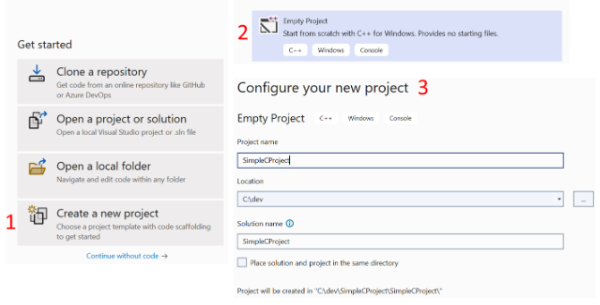
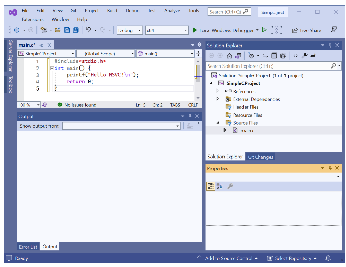
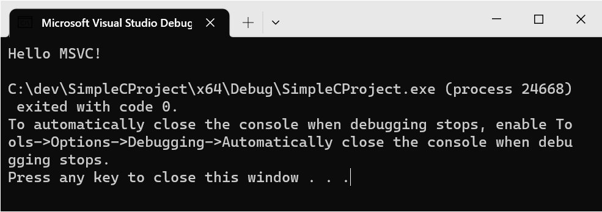
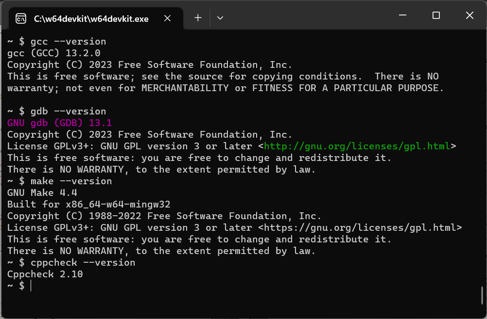
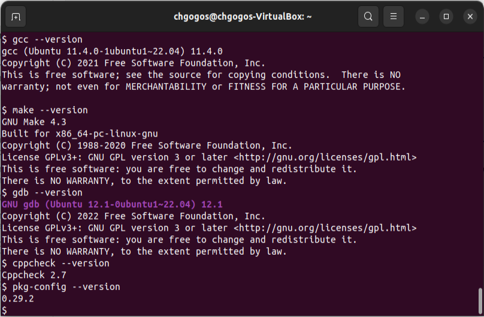
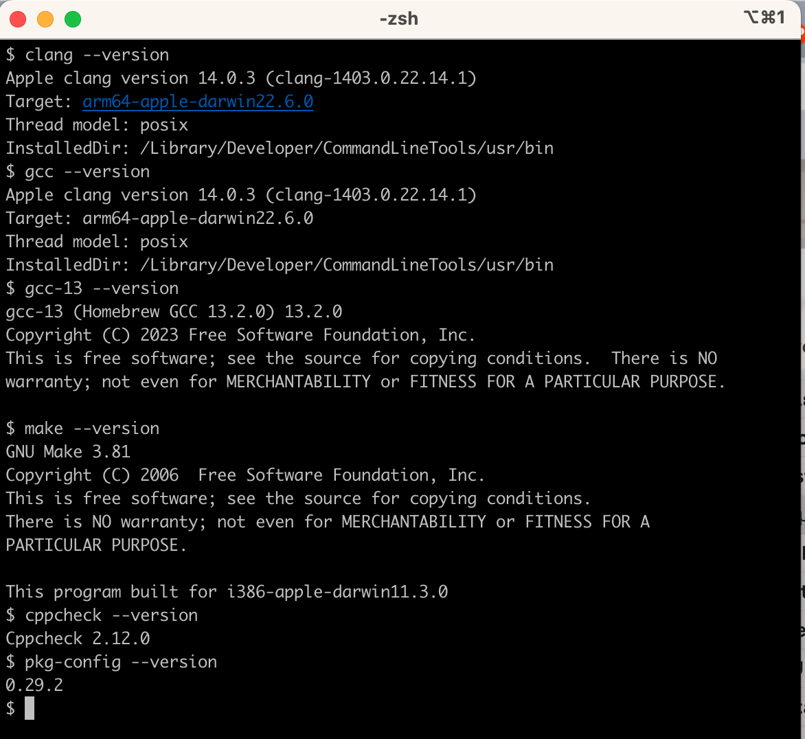

# Α. Διαμόρφωση περιβάλλοντος ανάπτυξης κώδικα σε C

Για να γράψει, να μεταγλωττίσει και να εκτελέσει κανείς προγράμματα σε C θα πρέπει να έχει πρόσβαση σε κάποιο υπολογιστικό σύστημα εφοδιασμένο με το κατάλληλο λογισμικό. Στη συνέχεια θα παρουσιαστούν ορισμένες διαμορφώσεις υπολογιστικών συστημάτων (Windows, Linux, MacOS) για τον σκοπό αυτό. Στις περισσότερες περιπτώσεις θα προταθεί ως επεξεργαστής κειμένου το Microsoft Visual Studio Code (VS-Code) που είναι ιδιαίτερα δημοφιλές τον τελευταίο καιρό ως περιβάλλον ανάπτυξης προγραμμάτων για πολλές και διαφορετικές γλώσσες προγραμματισμού. Ωστόσο, στη θέση του μπορεί να χρησιμοποιηθεί κάποιος άλλος επεξεργαστής κειμένου (π.χ. notepad++, TextMate, emacs, vim, κ.λπ.).

## A.1 Δημιουργία περιβάλλοντος ανάπτυξης προγραμμάτων C στα Windows

Υπάρχουν πολλοί τρόποι με τους οποίους μπορεί να δημιουργηθεί ένα περιβάλλον ανάπτυξης κώδικα σε C σταWindows. Στη συνέχεια θα παρουσιαστούν οι ακόλουθες διαμορφώσεις:

1. Υποσύστημα Linux μέσα από τα Windows (WSL) & μεταγλωττιστής GCC & επεξεργαστής κειμένου VSCode.

2. Σύστημα διαχείρισης πακέτων για τα Windows chocolatey & μεταγλωττιστής MinGW & make & επεξεργαστής κειμένου VSCode.

3. Microsoft Visual Studio Community Edition.

4. Χρήση της έτοιμης λύσης του w64devkit.

5. Χρήση της έτοιμης λύσης του installc.org.

### A.1.1 WSL & GCC & VSCode

Τα βήματα δημιουργίας ενός περιβάλλοντος ανάπτυξης προγραμμάτων σε C που επιτρέπει τη συγγραφή προγραμμάτων στα Windows και τη μεταγλώττιση και εκτέλεση σε Linux παρουσιάζονται στη συνέχεια. 

<i>1. Εγκατάσταση WSL</i> Αρχικά, θα χρειαστεί να ενεργοποιηθεί το WSL (Windows Subsystem for Linux), που απαιτεί κατ’ ελάχιστον την έκδοση Windows 10 (Build 19041). Οδηγίες για να συμβεί αυτό μπορούν να βρεθούν στην επίσημη σελίδα της Microsoft στο <a href="https://learn.microsoft.com/en-us/windows/wsl/install" target="_blank">https://learn.microsoft.com/en-us/windows/wsl/install</a>.  

<i>2. Εγκατάσταση διανομής Linux στο WSL</i> Το WSL υποστηρίζει πολλές διανομές Linux (π.χ. Ubuntu, openSUSE Leap, Kali Linux κ.ά.) και η εγκατάστασή τους γίνεται από το Microsoft Store. Από το Microsoft Store, αλλά και με άλλους τρόπους, μπορεί να γίνει και η εγκατάσταση του Windows Terminal (<a href="https://github.com/microsoft/terminal" target="_blank">https://github.com/microsoft/terminal</a>), που επιτρέπει εύκολη χρήση πολλαπλών παραθύρων εντολών.  

<i>3. Εγκατάσταση GCC στη διανομή Linux.</i> Η εκκίνηση της διανομής Linux που εγκαταστάθηκε στο προηγούμενο βήμα εμφανίζει ένα παράθυρο γραμμής εντολών. Αν για παράδειγμα η διανομή Linux που έχει εγκατασταθεί είναι η Ubuntu, τότε η εγκατάσταση του GCC, γίνεται με την πληκτρολόγηση των ακόλουθων εντολών στη γραμμή εντολών:

```
$ sudo apt update
$ sudo apt install build‐essential
```

<i>4. Εγκατάσταση VSCode και επεκτάσεων</i> Η εγκατάσταση του VSCode γίνεται στα Windows και όχι μέσα από το WSL. Επιπλέον, πρέπει να εγκατασταθούν οι επεκτάσεις (extensions) WSL(1) και C/C++(2).
{ .annotate }

1. Η επέκταση WSL για το VSCode έχει αναγνωριστικό το uid:ms-vscode-remote.remote-wsl.
2. Η επέκταση C/C++ για το VSCode έχει αναγνωριστικό το uid:ms-vscode.cpptools.

<i>Παράδειγμα μεταγλώττισης και εκτέλεσης απλού προγράμματος</i> Με την παραπάνω διαμόρφωση του συστήματος είναι εύκολη η συγγραφή προγραμμάτων C στο VSCode στα Windows, η αποθήκευσή τους σε φακέλους των Windows και η εκτέλεση εντολών μεταγλώττισης και εκτέλεσης από τη γραμμή εντολών της διανομής Linux. Έτσι αν υπάρχει ένας φάκελος με διαδρομή <span class="p-style">c:\cprojects\prj1</span> τότε η πρόσβαση σε αυτό τον φάκελο μέσα από το WSL γίνεται με την ακόλουθη εντολή:

```
$ cd /mnt/c/cprojects/prj1
```

H ενεργοποίηση του Visual Studio Code μέσα από το WSL έτσι ώστε ο γονικός φάκελος να είναι ο <span class="p-style">prj1</span> γίνεται, εφόσον έχει προηγηθεί η προηγούμενη εντολή, πληκτρολογώντας την εντολή:

```
$ code .
```

To VSCode μπορεί να χρησιμοποιηθεί για να δημιουργηθούν νέα αρχεία ή να ενημερωθούν ήδη υπάρχοντα. Αν λοιπόν δημιουργηθεί ένα νέο αρχείο, έστω με όνομα <span class="p-style">check_wsl.c</span> (κώδικας Α.1), τότε η μεταγλώττιση και εκτέλεσή του γίνεται με τις ακόλουθες εντολές από τη γραμμή εντολών.


```{.c title="Κώδικας Α.1: check_wsl.c - ανίχνευση ορθής εγκατάστασης WSL-Linux-GCC." linenums="1"}
--8<-- "src/check_wsl.c"
```

Ένα παράδειγμα μεταγλώττισης και εκτέλεσης του παραπάνω κώδικα δίνει τα ακόλουθα αποτελέσματα:

```
$ gcc check_wsl.c ‐o check_wsl
$ ./check_wsl
Linux system detected
GCC 11.3.0 detected
```

### A.1.2 Chocolatey & MinGW & make & VSCode

Από την πλευρά του προγραμματιστή είναι βολικό να υπάρχει κάποιο λογισμικό διαχείρισης πακέτων λογισμικού όπως είναι για παράδειγμα το apt (Advanced Package Tool) στα Debian Linux συστήματα, καθώς καθιστά εύκολη την εγκατάσταση, ενημέρωση και απεγκατάσταση λογισμικών. Στα Windows παραδοσιακά οι εφαρμογές εγκαθίστανται εκτελώντας ένα αρχείο εγκατάστασης και μέσω του πίνακα ελέγχου δίνεται η δυνατότητα απεγκατάστασης εφαρμογών. Ωστόσο, υπάρχει το λογισμικό ανοικτού κώδικα Chocolatey (<a href="https://chocolatey.org/" target="_blank">https://chocolatey.org/</a>) που προσφέρει και στα Windows τη δυνατότητα παρόμοιας εμπειρίας χρήσης με το apt. Με αυτό θα εγκαταστήσουμε τον μεταγλωττιστή GCC και το εργαλείο make. Τα βήματα εγκατάστασης είναι τα ακόλουθα:  

<i>1. Εγκατάσταση Chocolatey</i> Οι οδηγίες εγκατάστασης του Chocolatey βρίσκονται στη σελίδα <a href="https://chocolatey.org/install" target="_blank">https://chocolatey.org/install</a>. Η εγκατάσταση γίνεται αντιγράφοντας ορισμένες εντολές από την ιστοσελίδα και εκτελώντας τις σε ένα παράθυρο γραμμών εντολών του PowerShell που θα έχει εκκινηθεί με δικαιώματα διαχειριστή (Administrative Privileges). Συνίσταται η επιλογή Individual για την  εγκατάσταση. Μετά την εγκατάσταση μπορεί να γίνει έλεγχος για το αν έχει ολοκληρωθεί σωστά δίνοντας στη γραμμή εντολών την εντολή choco.

```
> choco
Chocolatey v2.0.0
Please run 'choco ‐?' or 'choco <command > ‐?' for help menu.
```

<i>2. Εγκατάσταση MinGW</i> Το MinGW είναι μια μεταφορά (port) του GCC στα Windows. Εγκαθίσταται μέσω του chocolatey με την εντολή <span class="p-style">choco install mingw</span>. Ο έλεγχος της ορθής εγκατάστασης γίνεται με την εντολή <span class="p-style">gcc ‐‐version</span>.

```
> choco install mingw
Chocolatey v2.0.0
Installing the following packages:
mingw
...
> gcc ‐‐version
gcc.exe (x86_64‐posix‐seh‐rev2, Built by MinGW‐W64 project) 12.2.0
Copyright (C) 2022 Free Software Foundation , Inc.
This is free software; see the source for copying conditions. There is NO
warranty; not even for MERCHANTABILITY or FITNESS FOR A PARTICULAR PURPOSE
```

<i>3. Εγκατάσταση του make</i> Ομοίως γίνεται και η εγκατάσταση του make. Αρκεί να δοθεί σε ένα παράθυρο γραμμής εντολών PowerShell με δικαιώματα διαχειριστή η εντολή choco install make.

```
> choco install make
...
> make‐‐version
GNU Make 4.4.1
Built for Windows32
Copyright (C) 1988‐2023 Free Software Foundation , Inc.
License GPLv3+: GNU GPL version 3 or later <https://gnu.org/licenses/gpl.html>
This is free software: you are free to change and redistribute it.
There is NO WARRANTY , to the extent permitted by law.
```

<i>4. Εγκατάσταση του VSCode</i> Η εγκατάσταση του VSCode μπορεί να γίνει με τον κλασικό τρόπο (δηλαδή μεταφόρτωση του αρχείου εγκατάστασης από τη σελίδα του VSCode και εκτέλεση του αρχείου εγκατάστασης) ή με το chocolatey με την εντολή <span class="p-style">choco install vscode</span>.

```
> choco install vscode
...
> code ‐‐version
1.79.2
```

Για προγραμματισμό στη C με το VSCode θα πρέπει να εγκατασταθεί μέσα από το VSCode η επέκταση C/C++.

### A.1.3 Visual Studio Community Edition

Το Visual Studio είναι το IDE (Integrated Development Environment) της Microsoft για την ανάπτυξη εφαρμογών σε C#, VB.NET, F# και άλλες γλώσσες προγραμματισμού. Εκτελείται μόνο σε Windows συστήματα και είναι διαφορετικό και «βαρύτερο» από το VSCode. Ωστόσο, μπορεί να χρησιμοποιηθεί και για ανάπτυξη προγραμμάτων σε C καθώς διαθέτει τον μεταγλωττιστή MSVC.  
Η έκδοση Visual Studio Community (<a href="https://visualstudio.microsoft.com/vs/community/" target="_blank">https://visualstudio.microsoft.com/vs/community/</a>) διατίθεται δωρεάν από τη Microsoft. Η διαδικασία εγκατάστασής του είναι απλή και για να χρησιμοποιη-
θεί για την συγγραφή και εκτέλεση προγραμμάτων σε C θα πρέπει να συμπεριληφθεί η επιλογή “Desktop development with C++”.  
Στο Visual Studio προκειμένου να γραφεί και να εκτελεστεί ένα πρόγραμμα θα πρέπει ο κώδικάς του να ενταχθεί σε ένα project. Τα βήματα που μπορούν να ακολουθηθούν για τη δημιουργία ενός απλού project που να εμφανίζει ένα μήνυμα κατά την εκτέλεσή του είναι τα ακόλουθα: Αρχικά θα πρέπει να δημιουργηθεί ένα κενό project (Empty Project). Μετά θα πρέπει να καθοριστούν οι θέσεις που θα βρίσκονται τα αρχεία του project. Οι οθόνες που χρησιμοποιούνται για να γίνουν τα βήματα αυτά παρουσιάζονται στο Σχήμα Α.1.

{ width="800" }
<div style="text-align: center;"><b> Σχήμα A.1: </b><i>Δημιουργία ενός κενού project στο Visual Studio.</i></div>

Στη συνέχεια θα πρέπει να προστεθεί στο project το αρχείο πηγαίου κώδικα (π.χ. έστω με όνομα <span class="p-style">main.cpp</span>). Αυτό γίνεται με την επιλογή μενού Project->Add new Item. Εδώ θα πρέπει να εισαχθεί το όνομα του αρχείου πηγαίου κώδικα και θα πρέπει να γίνει αλλαγή στην επέκταση του αρχείου από <span class="p-style">.cpp</span> σε <span class="p-style">.c</span>, έτσι ώστε να «αντιληφθεί» το IDE ότι πρόκειται για κώδικα C. Στη συνέχεια συμπληρώνεται ο κώδικας C που φαίνεται στο Σχήμα Α.2

{ width="800" }
<div style="text-align: center;"><b> Σχήμα A.2: </b><i>Το περιβάλλον συγγραφής και εκτέλεσης κώδικα του Visual Studio.</i></div>

Η εκτέλεση του προγράμματος γίνεται από την επιλογή μενού Debug->Start Debugging. Τα αποτελέσματα εμφανίζονται σε παράθυρο γραμμής εντολών (Σχήμα Α.3) που εμφανίζεται κατά την εκτέλεση.  

{ width="800" }
<div style="text-align: center;"><b> Σχήμα A.3: </b><i>Το αποτέλεσμα εκτέλεσης, ο χρήστης μπορεί να πατήσει ένα οποιοδήποτε πλήκτρο για το κλείσιμο του παραθύρου.</i></div>


### A.1.4 w64devkit

Το w64devkit είναι ένας απλός τρόπος εγκατάστασης όλων των εργαλείων που απαιτούνται για τη μεταγλώττιση, εκτέλεση και αποσφαλμάτωση κώδικα C σε περιβάλλον Windows. Αρχικά, πρέπει να μεταφορτωθεί το συμπιεσμένο αρχείο της μορφής w64devkit-x.y.z.zip (όπου x.y.z είναι η έκδοση του λογισμικού) από τα releases(1) του GitHub αποθετηρίου skeeto/w64devkit. Το συμπιεσμένο αρχείο μπορεί να αποσυμπιεστεί σε οποιαδήποτε θέση αυτό είναι βολικό (π.χ. C:\w64devkit).
{ .annotate }

1. <a href="https://github.com/skeeto/w64devkit/releases" target="_blank">https://github.com/skeeto/w64devkit/releases</a>

Εκτελώντας το w64devkit.exe από τον w64devkit κατάλογο ξεκινά ένα παράθυρο γραμμής εντολών (Bourne shell) παρόμοιο με αυτό του Σχήματος Α.4. Στο παράθυρο αυτό μπορούν να δοθούν εντολές πλοήγησης σε φακέλους (π.χ. cd, ls, pwd, mkdir, rmdir) αλλά και να κληθεί ο μεταγλωττιστής της C πληκτρολογώντας gcc ή cc. Επίσης, υπάρχουν ήδη εγκατεστημένα προγράμματα όπως τα gdb (debugger), make, cppcheck(εργαλείο στατικής ανάλυσης κώδικα), nasm (συμβολομεταφραστής x86), vim (επεξεργαστής κειμένου), gvim (παραθυρική έκδοση του επεξεργαστή κειμένου vim) και άλλα προγράμματα σε πρόσφατες ενημερωμένες εκδόσεις τους.

{ width="800" }
<div style="text-align: center;"><b> Σχήμα A.4: </b><i>Το παράθυρο γραμμής εντολών του w64devkit.</i></div>

Η συγγραφή του προγράμματος μπορεί να γίνει με το vim ή το gvim, αλλά μπορεί να χρησιμοποιηθεί και το VSCode, εφόσον πρώτα εγκατασταθεί, καλώντας το από τον τρέχοντα φάκελο με την εντολή:

```
$ code .
```

Το σύστημα αρχείων που «βλέπει» τον w64devkit είναι το ίδιο με το σύστημα αρχείων των Windows και συνεπώς μπορούν να χρησιμοποιηθούν όλα τα εργαλεία των Windows (π.χ. File Explorer), ενώ ο γονικός φάκελος κατά την έναρξη του w64devkit είναι ο C:\Users\&lt;username&gt; όπου &lt;username&gt; το όνομα του χρήστη.  
Για παράδειγμα, μπορεί να χρησιμοποιηθεί το makefile του κώδικα Α.2 και ο κώδικας Α.3 προκειμένου να επιτευχθεί μεταγλώττιση και εκτέλεση από τη γραμμή εντολών του w64devkit όπως στη συνέχεια:

```
$ make
gcc ‐Wall ‐Wextra ‐Og ‐g3 ‐o hello.exe hello.c
$ hello.exe
Hello World!
```

Ακολουθεί το makefile:


```{.mk title="Κώδικας Α.2: appendix1/Makefile, ένα απλό makefile για την επίδειξη λειτουργίας του w64devkit" linenums="1"}
--8<-- "src/appendix1/Makefile"
```

και ο κώδικας που μεταγλωττίζεται:

```{.c title="Κώδικας Α.3: appendix1/hello.c - ένα απλό πρόγραμμα για το παράδειγμα μεταγλώττισης με το make." linenums="1"}
--8<-- "src/appendix1/hello.c"
```

Περισσότερες πληροφορίες για το w64devkit μπορούν να εντοπιστούν στο αποθετήριο του στο GitHub (1) και στο [^1].
{ .annotate }

1. <a href="https://github.com/skeeto/w64devkit" target="_blank">https://github.com/skeeto/w64devkit</a>


### A.1.5 installc.org

Ένας ακόμα τρόπος δημιουργίας ενός περιβάλλοντος ανάπτυξης προγραμμάτων σε C είναι η χρήση του installc (<a href="https://installc.org/" target="_blank">https://installc.org/</a>). Παρουσιάζει ομοιότητες με το w64devkit και δίνει τη δυνατότητα χρήσης πρόσφατων εκδόσεων του GCC στα Windows, καθώς και αυτοματοποιημένης εγκατάστασης συνοδευτικών λογισμικών (make, GDB κ.λπ.).

## A.2 Δημιουργία περιβάλλοντος ανάπτυξης προγραμμάτων C σε Linux

Η δημιουργία περιβάλλοντος ανάπτυξης προγραμμάτων C σε Linux είναι μια αρκετά απλή υπόθεση. Στο Ubuntu 22.04LTS για παράδειγμα αρκεί να πληκτρολογηθούν οι εντολές:

```
$ sudo apt update
$ sudo apt install build‐essential
$ sudo apt install make
$ sudo apt install gdb
$ sudo apt install cppcheck
$ sudo apt install pkg‐config
```

Ο έλεγχος ορθής εγκατάστασης των παραπάνω λογισμικών θα δώσει το αποτέλεσμα που φαίνεται στο Σχήμα Α.5.

{ width="800" }
<div style="text-align: center;"><b> Σχήμα A.5: </b><i>Γραμμή εντολών Ubuntu 22.04LTS, έλεγχος ορθής εγκατάστασης προγραμμάτων.</i></div>

Η συγγραφή προγραμμάτων μπορεί να γίνει με κάποιον από τους επεξεργαστές κειμένου που διαθέτει το σύστημα (π.χ. nano, vi, vim, gvim, emacs, gedit) ή και με το VSCode εφόσον πρώτα εγκατασταθεί.

## A.3 Δημιουργία περιβάλλοντος ανάπτυξης προγραμμάτων C σε MacOS

Εξίσου απλή με την περίπτωση του Linux είναι και η δημιουργία ενός περιβάλλοντος ανάπτυξης προγραμμάτων C στο MacOS. Ο μεταγλωττιστής για τη C και C++ που χρησιμοποιεί το MacOS είναι ο clang, ενώ μπορεί να εγκατασταθεί και ο gcc. Η εγκατάσταση του clang γίνεται από τη γραμμή εντολών με την εντολή:

```
$ xcode‐select –‐install
```

Στο MacOS προκαθορισμένος debugger είναι ο LLDB(1), το make είναι προεγκατεστημένο και μετά την εγκατάσταση του clang, η εντολή gcc είναι ψευδώνυμο για το clang.
{ .annotate }

1. <a href="https://lldb.llvm.org/" target="_blank">https://lldb.llvm.org/</a>  

Η εγκατάσταση των υπόλοιπων λογισμικών γίνεται εύκολα εφόσον προηγηθεί η εγκατάσταση του homebrew(1), που αποτελεί έναν διαχειριστή εγκαταστάσεων λογισμικού για το λειτουργικό σύστημα της Apple. Εφόσον το homebrew εγκατασταθεί, οι ακόλουθες εντολές εγκαθιστούν τα λογισμικά που απαιτούνται.
{ .annotate }

1. <a href="https://brew.sh/" target="_blank">https://brew.sh/</a>

```
$ brew update
$ brew install gcc
$ brew install cppcheck
$ brew install pkg‐config
```

Μια ενδεικτική εικόνα των μηνυμάτων που εμφανίζονται στον έλεγχο ορθής εγκατάστασης των παραπάνω λογισμικών φαίνεται στο Σχήμα Α.6.

{ width="800" }
<div style="text-align: center;"><b> Σχήμα A.6: </b><i>Γραμμή εντολών (τερματικό zsh) για το MacOS, έλεγχος ορθής εγκατάστασης προγραμμάτων.</i></div>

Η συγγραφή προγραμμάτων C μπορεί να γίνει σε οποιονδήποτε επεξεργαστή κειμένου (π.χ. TextEdit, TextMate) αλλά και για το MacOS μια πολύ καλή επιλογή αποτελεί το VSCode που μπορεί να εγκατασταθεί ως εξής:

```
$ brew install ‐‐cask visual‐studio‐code
```

[^1]: Wellons Chris. <i>A guide to Windows application development using w64devkit.</i> <a href="https://nullprogram.com/blog/2021/03/11/" target="_blank">https://nullprogram.com/blog/2021/03/11/</a>. Accessed: 2023-06-01. 2021.