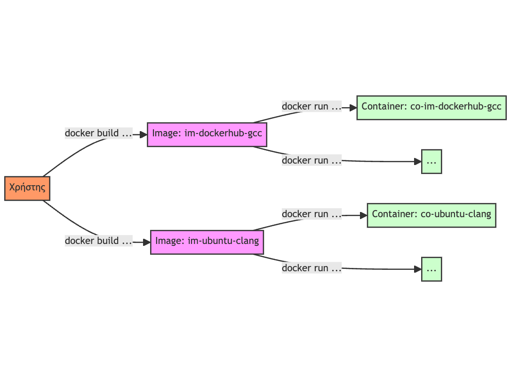
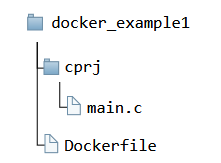
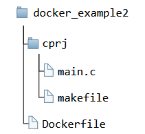

# Β. Μεταγλώττιση και εκτέλεση κώδικα C χρησιμοποιώντας το Docker

## Β.1 Docker  

Το Docker (<a href="https://www.docker.com/" target="_blank">https://www.docker.com/</a>) είναι μια πλατφόρμα ανοικτού κώδικα που επιτρέπει την αυτόματη διάθεση (deployment) και διαχείριση εφαρμογών χρησιμοποιώντας containers. Τα containers αποτελούν υπόβαθρα εκτέλεσης εφαρμογών με υψηλό βαθμό τυποποίησης. Με το Docker μπορούν να δημιουργηθούν containers που περιέχουν μια ή περισσότερες εφαρμογές και όλα τα απαιτούμενα λογισμικά, βιβλιοθήκες και αρχεία ρυθμίσεων που διασφαλίζουν την ορθή λειτουργία τους. Τα containers είναι φορητά και μπορούν να εκτελεστούν σε οποιοδήποτε σύστημα είναι εγκατεστημένο το Docker, ανεξάρτητα από αρχιτεκτονική υλικού και λειτουργικό σύστημα. Το Docker παρέχει συνεπή περιβάλλοντα εκτέλεσης εφαρμογών που διασφαλίζουν ότι θα συμπεριφέρονται, κάθε φορά, με τον ίδιο τρόπο κατά την ανάπτυξη μιας εφαρμογής, κατά τον έλεγχό της και κατά την εκτέλεσή της σε περιβάλλον παραγωγής (production). 
Ένας συνηθισμένος τρόπος αλληλεπίδρασης με το Docker είναι ο εξής: αρχικά δημιουργείται μια εικόνα (image) που περιγράφει ένα σύστημα (λειτουργικό σύστημα, λογισμικά που πρέπει να είναι εγκατεστημένα κ.λπ.) και μετά από το image μπορούν να δημιουργηθούν ένα ή περισσότερα containers που είναι σε θέση να εκτελούνται, να τίθενται σε παύση, να σταματούν ή να διαγράφονται. Στο Σχήμα Β.1 φαίνεται, για παράδειγμα, η δημιουργία ενός image με όνομα <span class="p-style">im‐dockerhub‐gcc</span> και στη συνέχεια η δημιουργία από το συγκεκριμένο image ενός ή περισσότερων containers, με ένα από αυτά να έχει το όνομα <span class="p-style">co‐dockerhub‐gcc</span>. Τα images περιγράφονται σε αρχεία κειμένου, τα λεγόμενα Dockerfiles. Στη συνέχεια θα παρουσιαστούν δύο παραδείγματα χρήσης του Docker για μεταγλώττιση και εκτέλεση προγραμμάτων που είναι γραμμένα με τη C.

{ width="800" }
<div style="text-align: center;"><b> Σχήμα B.1: </b><i>Δημιουργία images και containers στο Docker.</i></div>

### B.1.1 Ένα παράδειγμα μεταγλώττισης και εκτέλεσης κώδικα C με το Docker

Το Docker μπορεί να χρησιμοποιηθεί ως περιβάλλον ανάπτυξης κώδικα σε C. Για να συμβεί αυτό αρχικά θα χρειαστεί να εγκατασταθεί το Docker (<a href="https://docs.docker.com/get-docker/" target="_blank">https://docs.docker.com/get-docker/</a>). Στη συνέχεια θα παρουσιαστεί ένα παράδειγμα προγράμματος C που θα μεταγλωττιστεί και θα εκτελεστεί σε ένα Docker container. Έστω η ιεραρχία καταλόγων και αρχείων που παρουσιάζεται στο Σχήμα Β.2, η οποία μπορεί να βρίσκεται μέσα σε έναν γονικό κατάλογο της επιλογής μας.

<figure markdown="span">

</figure>

<div style="text-align: center;"><b> Σχήμα B.2: </b><i>Ιεραρχία καταλόγων και θέσεις αρχείων για το πρώτο παράδειγμα με το Docker.</i></div>

Το αρχείο <span class="p-style">main.c</span> (κώδικας Β.1) περιέχει τον κώδικα που θα μεταγλωττιστεί και θα εκτελεστεί. Το πρόγραμμα κατά την εκτέλεσή του ζητά από τον χρήστη να εισάγει το όνομά του και εμφανίζει έναν χαιρετισμό και πληροφορίες έκδοσης του μεταγλωττιστή που χρησιμοποιείται.

```{.c title="Κώδικας Β.1: docker_example1/cprj/main.c - C κώδικας που θα εκτελεστεί μέσα σε ένα Docker container." linenums="1"}
--8<-- "src/appendix2/docker_example1/cprj/main.c"
```

Τα βήματα για τη μεταγλώττιση και εκτέλεση του C κώδικα στο Docker είναι τα ακόλουθα:

<i>1. Συγγραφή του αρχείου Dockerfile</i> Το <span class="p-style">Dockerfile</span> είναι ένα αρχείο κειμένου που περιέχει οδηγίες δημιουργίας του Docker image. Οι βασικές οδηγίες αφορούν το base image που θα χρησιμοποιηθεί, οδηγίες εγκατάστασης εργαλείων και άλλων προαπαιτούμενων της εφαρμογής (π.χ. βιβλιοθηκών) και οδηγίες αντιγραφής αρχείων από τον τοπικό υπολογιστή στο image. Για το συγκεκριμένο παράδειγμα το <span class="p-style">Dockerfile</span> (κώδικας Β.2) είναι το ακόλουθο:

```{.docker title="Κώδικας Β.2: docker_example1/Dockerfile - το αρχείο Dockerfile του παραδείγματος." linenums="1"}
--8<-- "src/appendix2/docker_example1/Dockerfile"
```

Στη γραμμή 1 ορίζεται το base image που εδώ είναι το <span class="p-style">gcc:13.2.0</span>, δηλαδή το image που έχει αναπτυχθεί από το DockerHub για το gcc στην έκδοση 13.2.0. Εναλλακτικά, θα μπορούσε να χρησιμοποιηθεί το <span class="p-style">gcc:latest</span> που είναι το πλέον πρόσφατο image για το gcc (<a href="https://hub.docker.com/_/gcc" target="_blank">https://hub.docker.com/_/gcc</a>) ή ακόμα και κάποια ελαφριά (lightweight) διανομή Linux όπως η Alpine ή η Ubuntu και να γινόταν εγκατάσταση του GCC με εντολές τύπου <span class="p-style">RUN</span> στο <span class="p-style">Dockerfile</span>.  
Στη γραμμή 3 υπάρχει η εντολή αντιγραφής όλων των αρχείων που βρίσκονται στον τρέχοντα κατάλογο του τοπικού υπολογιστή στον κατάλογο <span class="p-style">cprj</span> που θα δημιουργείται στα containers που θα προκύπτουν από το image.  
Στη γραμμή 5 καθορίζεται ότι ο τρέχων κατάλογος στα containers που θα προκύπτουν από το image θα είναι o <span class="p-style">cprj</span>.  
Στη γραμμή 7 ορίζεται η εντολή μεταγλώττισης που θα δοθεί στο περιβάλλον του container. Η εντολή αυτή μεταγλωττίζει το αρχείο <span class="p-style">main.c</span> και παράγει το εκτελέσιμο με όνομα <span class="p-style">main</span>.  
Στη γραμμή 9 ορίζεται η εντολή που θα εκτελεστεί στο container που θα προκύψει από το image, κατά την εκκίνησή του.

<i>2. Δημιουργία του Docker image</i> Από τη γραμμή εντολών, θέτοντας ως τρέχοντα κατάλογο τον κατάλογο <span class="p-style">docker_example1</span>, δίνεται η ακόλουθη εντολή που δημιουργεί το image:

```
$ docker image build ‐t im‐dockerhub ‐gcc .
```

Η δημιουργία του image μπορεί να είναι σχετικά χρονοβόρα, αλλά πρόκειται για χρόνο που θα απαιτηθεί μόνο μια φορά. Στο συγκεκριμένο παράδειγμα, το όνομα του image είναι <span class="p-style">im‐dockerhub‐gcc</span> (καθορίζεται με τον διακόπτη <span class="p-style">‐t</span> που σημαίνει tag, δηλαδή ετικέτα) και ο τρέχων κατάλογος που συμβολίζεται με την τελεία είναι ο κατάλογος που θα αποτελέσει το build context (π.χ. εκεί βρίσκεται το <span class="p-style">Dockerfile</span>).  

<i>3. Εκκίνηση ενός Docker container</i> Από τη στιγμή που έχει δημιουργηθεί το image, μπορεί να δημιουργηθεί από αυτό ένα container. Μπορούν να οριστούν επιλογές έτσι ώστε να προσαρτώνται (να γίνονται mount) κατάλογοι του τοπικού υπολογιστή στο container ή να γίνονται forward συγκεκριμένες θύρες (ports), αν το πρόγραμμα απαιτεί πρόσβαση στο δίκτυο. Για το παράδειγμα, η εκκίνηση του container γίνεται με την ακόλουθη εντολή και εμφανίζει τα αποτελέσματα που φαίνονται στη συνέχεια:

```
$ docker container run ‐‐rm ‐it ‐‐name co‐dockerhub ‐gcc im‐dockerhub ‐gcc
Enter your name: Schmilblick
Hello Schmilblick! Here are some info for your system
Macro __STDC__: 1
Macro __STDC_VERSION__: 201710
Macro __GNUC__: 13
Macro __GNUC_MINOR__: 2
Macro __GNUC_PATCHLEVEL__: 0
```

Ο διακόπτης <span class="p-style">‐‐rm</span> σημαίνει ότι το container θα διαγραφεί κατά την έξοδο, και ο διακόπτης <span class="p-style">‐it</span> σημαίνει interactive terminal, δηλαδή ότι ο χρήστης θα έχει τη δυνατότητα να αλληλεπιδράσει με την εφαρμογή από το τερματικό (π.χ. να εισάγει τιμές).

### B.1.2 Παράδειγμα με εγκατάσταση βιβλιοθήκης της C και προσάρτηση καταλόγου

Στη συνέχεια θα παρουσιαστεί ένα δεύτερο παράδειγμα με το Docker για ανάπτυξη κώδικα σε C που αυτήν τη φορά θα εγκαθιστά τη βιβλιοθήκη GMP για πράξεις με μεγάλους αριθμούς. Επιπλέον, θα προσδένει έναν κατάλογο του τοπικού υπολογιστή ως κατάλογο του container, έτσι ώστε αλλαγές που θα γίνονται στο αρχείο C του τοπικού υπολογιστή να αντικατοπτρίζονται απευθείας στο αρχείο C στο container. Τέλος, κατά την εκκίνηση του container θα ξεκινά το Bash (ένα δημοφιλές περιβάλλον γραμμής εντολών για Linux συστήματα), έτσι ώστε να είναι δυνατή η μεταγλώττιση εκ νέου όταν θα προκύπτουν αλλαγές στον κώδικα C.  
Η ιεραρχία καταλόγων και οι θέσεις των αρχείων που χρησιμοποιούνται στο παράδειγμα παρουσιάζονται στο Σχήμα Β.3

<figure markdown="span">

</figure>
<div style="text-align: center;"><b> Σχήμα B.3: </b><i>Ιεραρχία καταλόγων και θέσεις αρχείων για το δεύτερο παράδειγμα με το Docker.</i></div>

Το αρχείο <span class="p-style">main.c</span> (κώδικας Β.3) χρησιμοποιεί τη βιβλιοθήκη GMP, που επιτρέπει πράξεις αριθμών με μεγάλο πλήθος ψηφίων. Ο κώδικας προσθέτει δύο ακέραιους αριθμούς με 30 ψηφία ο καθένας και εμφανίζει το αποτέλεσμα.  


```{.c title="Κώδικας Β.3: docker_example2/cprj/main.c - C κώδικας που χρησιμοποιεί τη βιβλιοθήκη GMP και θα εκτελεστεί μέσα σε ένα Docker container." linenums="1"}
--8<-- "src/appendix2/docker_example2/cprj/main.c"
```

Το <span class="p-style">Dockerfile</span> του παραδείγματος παρουσιάζεται στον κώδικα Β.4.

```{.mk title="Κώδικας Β.4: docker_example2/Dockerfile - το αρχείο Dockerfile για το δεύτερο παράδειγμα." linenums="1"}
--8<-- "src/appendix2/docker_example2/cprj/makefile"
```

Στο <span class="p-style">Dockerfile</span> στη γραμμή 1 προσδιορίζεται ότι η διανομή που εγκαθίσταται είναι η τελευταία διαθέσιμη διανομή Ubuntu.  
Στις γραμμές 7-10 εγκαθίστανται το λογισμικό make, ο μεταγλωττιστής clang και η βιβλιοθήκη GMP.  
Τέλος, στη γραμμή 12 μεταγλωττίζεται ο κώδικας C και με τον διακόπτη <span class="p-style">‐l</span> καθορίζεται ότι θα χρησιμοποιηθεί κατά τη σύνδεση η βιβλιοθήκη GMP.  

<i>Δημιουργία του Docker image</i> Η δημιουργία του image γίνεται με την ακόλουθη εντολή που θα πρέπει να δοθεί με τρέχοντα κατάλογο τον <span class="p-style">docker_example2</span>.

```
$ docker image build ‐t im‐ubuntu‐clang .
```

<i>Εκκίνηση ενός Docker container</i> Η εντολή δημιουργίας του container που ακολουθεί στη συνέχεια χρησιμοποιεί τον διακόπτη <span class="p-style">‐v</span> για να ορίσει ότι ο κατάλογος <span class="p-style">cprj</span> του container θα προσδεθεί στον κατάλογο <span class="p-style">cprj</span> του τοπικού υπολογιστή. Το τμήμα της τιμής που ακολουθεί τον διακόπτη <span class="p-style">‐v</span> πριν την <span class="p-style">:</span> είναι η διαδρομή προς τον κατάλογο στον τοπικό υπολογιστή, ενώ το τμήμα που ακολουθεί την <span class="p-style">:</span> είναι η διαδρομή του καταλόγου στο σύστημα αρχείων του container. Προσοχή πρέπει να δοθεί στο ότι ο τρέχων κατάλογος στον τοπικό υπολογιστή συμβολίζεται με <span class="p-style">%cd%</span> αν η εντολή δίνεται από παράθυρο γραμμής εντολής των Windows, ενώ αν χρησιμοποιείται το powershell, τότε συμβολίζεται με το <span class="p-style">${PWD}</span>. Στο Linux ο τρέχων κατάλογος συμβολίζεται με το <span class="p-style">${pwd}</span>, ενώ στο MacOS ο τρέχων κατάλογος συμβολίζεται με το <span class="p-style">${PWD}</span> και μπορεί να χρειάζεται να προηγηθεί μια διαδικασία ρύθμισης των διαμοιραζόμενων καταλόγων μέσα από τις προτιμήσεις (preferences) της εφαρμογής Docker (Preferences... -> Resources -> File Sharing). Παρατηρήστε ότι το τελευταίο όρισμα της εντολής είναι το <span class="p-style">bash</span> που σημαίνει ότι δίνεται η δυνατότητα για εκτέλεση εντολών (π.χ. εντολών μεταγλώττισης) από το τερματικό. Ακολουθεί, για ένα σύστημα Windows (host), ένα παράδειγμα εκκίνησης του container και εισόδου των εντολών μεταγλώττισης και εκτέλεσης μέσα από το περιβάλλον του container.

```
$ docker container run ‐‐rm ‐it ‐v %cd%/cprj:/cprj ‐‐name co‐ubuntu‐clang im‐ubuntu‐clang bash
root@0923dac10c96:/cprj# ls
main main.c makefile
root@0923dac10c96:/cprj# ./main
Result: 1111111110111111111011111111100
root@0923dac10c96:/cprj# rm main
root@0923dac10c96:/cprj# ls
main.c makefile
root@0923dac10c96:/cprj# clang ‐o main main.c ‐lgmp ‐Wall ‐Werror
root@0923dac10c96:/cprj# ./main
Result: 1111111110111111111011111111100
root@0923dac10c96:/cprj# exit
exit
```

Η έξοδος και η διαγραφή του container γίνεται με την εντολή <span class="p-style">exit</span>. Αν δεν είχε χρησιμοποιηθεί ο διακόπτης <span class="p-style">‐‐rm</span> κατά την εκκίνηση του container, τότε το τερματικό μπορεί να αποσυνδεθεί προσωρινά από το container και στη συνέχεια να χρησιμοποιηθεί η εντολή <span class="p-style">docker exec</span> για επανασύνδεση. Ένα παράδειγμα εκτέλεσης των εντολών αυτών φαίνεται στη συνέχεια.

```
$ docker container run ‐it ‐v %cd%/cprj:/cprj ‐‐name co‐ubuntu‐clang im‐ubuntu‐clang bash
root@01262dc80657:/cprj# ls
main main.c makefile
root@01262dc80657:/cprj# rm main && clang ‐o main main.c ‐lgmp
root@01262dc80657:/cprj# ./main
Result: 1111111110111111111011111111100
```

Η αποσύνδεση του τερματικού από το container γίνεται πατώντας <span class="p-style">Ctrl+P</span> και <span class="p-style">Ctrl+Q</span>. Η εντολή που εμφανίζει τα ενεργά containers είναι η εντολή <span class="p-style">docker ps</span>. Ένα παράδειγμα εκτέλεσής της δίνεται στη συνέχεια:

```
$ docker ps ‐‐all
CONTAINER ID    IMAGE               COMMAND     CREATED         STATUS          PORTS   NAMES
01262dc80657    im‐ubuntu‐clang     "bash"      44 seconds ago  Up 44 seconds           co‐ubuntu‐clang
```

Αυτήν τη φορά θα κάνουμε χρήση του makefile (κώδικας: Β.5), που υπάρχει στο παράδειγμα στον ίδιο κατάλογο με τον πηγαίο κώδικα.

```{.docker title="Κώδικας Β.5: docker_example2/cprj/makefile - To αρχείο makefile για το δεύτερο παράδειγμα με το Docker." linenums="1"}
--8<-- "src/appendix2/docker_example2/Dockerfile"
```

Η εντολή docker exec επανασυνδέει το τερματικό με το container που εκτελείται. Ένα παράδειγμα εκτέλεσής της δίνεται στη συνέχεια:

```
$ docker exec ‐‐rm ‐it co‐ubuntu‐clang bash
root@01262dc80657:/cprj# make clean
rm ‐f *.o main
root@01262dc80657:/cprj# make run
clang ‐c main.c ‐Wall ‐Werror
clang main.o ‐o main ‐lgmp
./main
Result: 1111111110111111111011111111100
root@01262dc80657:/cprj# exit
exit
$ docker ps ‐‐all
CONTAINER ID    IMAGE   COMMAND     CREATED     STATUS  PORTS   NAMES
```

Το Docker δίνει πολλές επιπλέον δυνατότητες και δεν είναι τυχαίο ότι χρησιμοποιείται σε ευρεία κλίμακα. Περισσότερες πληροφορίες για το Docker μπορούν να εντοπιστούν στα [^1], [^2], αλλά και σε πολλές άλλες πηγές στο διαδίκτυο.  


[^1]: Prakhar Srivastav. <i>Docker for beginners.</i> <a href="https://docker-curriculum.com/" target="_blank">https://docker-curriculum.com/</a>. Accessed: 2023-06-01.  

[^2]: <i>Docker docs - educational resources.</i> <a href="https://docs.docker.com/get-started/resources/" target="_blank">https://docs.docker.com/get-started/resources/</a>. Accessed: 2023-06-01.