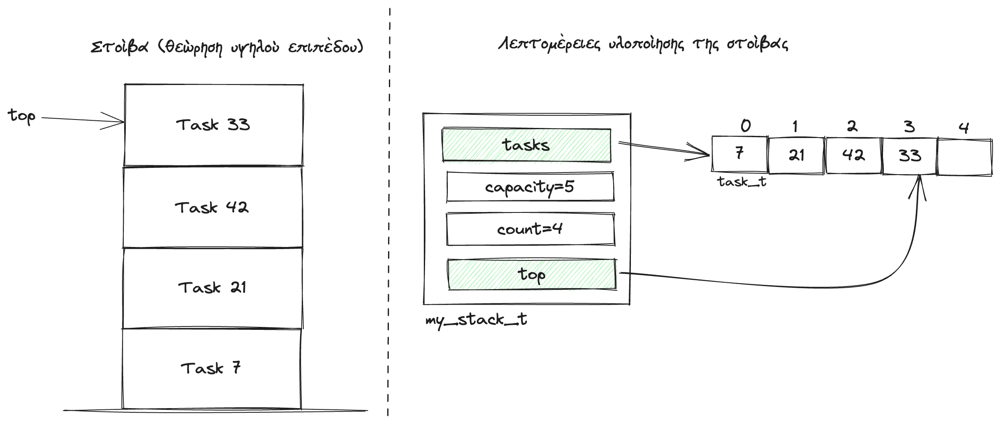
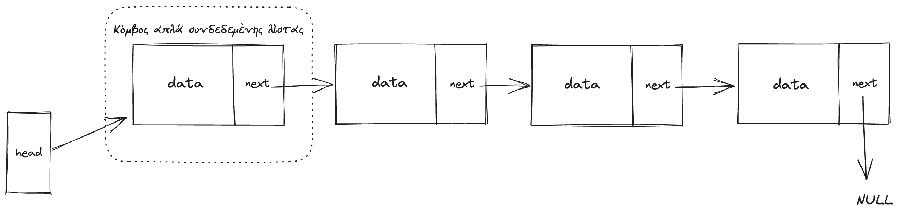
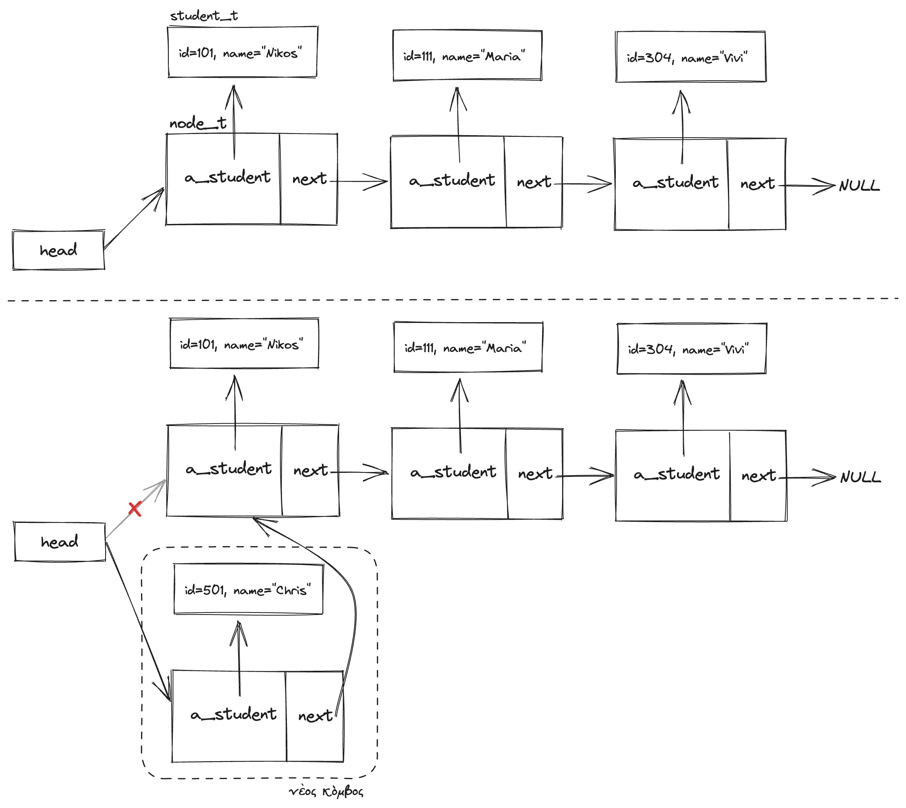
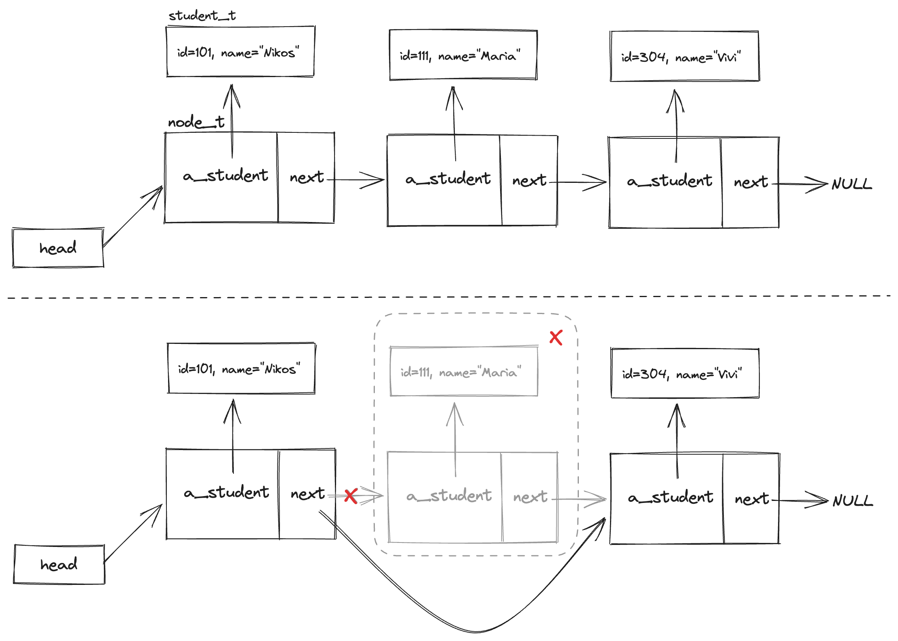
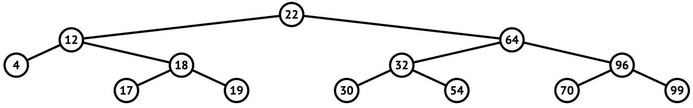
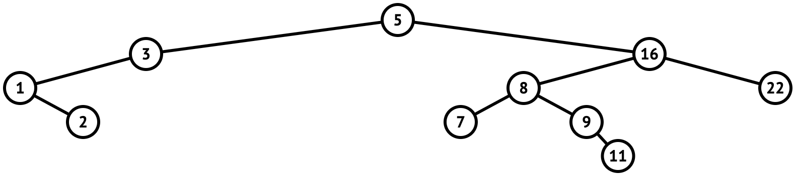

# 10 Υλοποίηση δομών δεδομένων και αλγορίθμων στη C

<i>Σύνοψη</i> Αφηρημένοι τύποι δεδομένων, στοίβα, ουρά, λίστες, δένδρα, γραφήματα, σύνολα, πίνακες αντιστοιχίσεων, υλοποίηση στοίβας, υλοποίηση απλά συνδεδεμένης λίστας, υλοποίηση δυαδικού δένδρου αναζήτησης.  

<i>Προαπαιτούμενη γνώση</i> Τύποι δεδομένων, είσοδος/έξοδος, δομές επιλογής και επανάληψης, συναρτήσεις, πίνακες, δομές, δείκτες, αλφαριθμητικά.

## 10.1 Εισαγωγή

Οι δομές δεδομένων είναι διευθετήσεις αποθηκευμένων δεδομένων που διευκολύνουν τον χειρισμό τους. Τυπικές δομές δεδομένων είναι οι πίνακες, οι λίστες, οι στοίβες, οι ουρές, οι σωροί, οι πίνακες κατακερματισμού, τα γραφήματα και τα δένδρα. Για τις δομές αυτές υπάρχουν διάφορες παραλλαγές τους με ιδιαίτερα χαρακτηριστικά που διευκολύνουν την αποδοτική επίλυση συγκεκριμένων προβλημάτων. Παραδείγματα είναι οι
διπλά συνδεδεμένες λίστες, τα ισοζυγισμένα δυαδικά δένδρα, τα κατευθυνόμενα γραφήματα με βάρη καθώς και άλλες δομές. Από την άλλη μεριά, ένας αλγόριθμος είναι μια σειρά λειτουργιών προς εκτέλεση που στοχεύει στην επίλυση ενός προβλήματος. Οι αλγόριθμοι πραγματοποιούν υπολογισμούς, επεξεργασία δεδομένων και εργασίες αυτοματοποίησης. Υπάρχουν αλγόριθμοι που είναι «διάσημοι» λόγω του ότι προσφέρουν κομψές λύσεις σε προβλήματα με υψηλή πρακτική και θεωρητική αξία. Μερικοί τέτοιοι αλγόριθμοι είναι η γρήγορη ταξινόμηση (quicksort), ο αλγόριθμος δυαδικής αναζήτησης για τον εντοπισμό μιας τιμής σε μια ταξινομημένη ακολουθία, ο αλγόριθμος εύρεσης των συντομότερων διαδρομών σε ένα γράφημα του Dijkstra, οι αλγόριθμοι κρυπτογραφικού κατακερματισμού (cryptographic hashes, π.χ. SHA256) και o αλγόριθμος PageRank για την αξιολόγηση της «σπουδαιότητας» κάθε ιστοσελίδας σε ένα δίκτυο ιστοσελίδων.  
Η ποιότητα των λύσεων που παράγονται σε υπολογιστικά προβλήματα εξαρτάται από τους αλγορίθμους και τις δομές δεδομένων που χρησιμοποιούνται. Η γνώση του κατάλληλου αλγορίθμου και των κατάλληλων δομών δεδομένων μπορεί να κάνει τη διαφορά ανάμεσα σε ένα λειτουργικό πρόγραμμα και σε ένα πρόγραμμα που είτε σπαταλά πόρους είτε δεν είναι σε θέση να εφαρμοστεί στην πράξη. Από την άλλη μεριά, η γνώση δομών δεδομένων και αλγορίθμων επιτρέπει τη χρήση κοινής ορολογίας που διευκολύνει την επικοινωνία ανάμεσα στα μέλη της ομάδας ανάπτυξης υπολογιστικών λύσεων.  
Η C σε αντίθεση με άλλες γλώσσες προγραμματισμού όπως η C++ με τη βιβλιοθήκη STL, η Java με τα Collections, η Python με τις ενσωματωμένες δομές δεδομένων λίστας, πλειάδας, λεξικού και συνόλου, δεν διαθέτει στις βιβλιοθήκες της έτοιμες υλοποιήσεις δομών δεδομένων. Ο προγραμματιστής καλείται να υλοποιήσει ο ίδιος τις δομές δεδομένων που θα χρειαστεί ή να χρησιμοποιήσει κάποια εξωτερική βιβλιοθήκη όπως
είναι η glib(1), η klib(2), η STC(3), η M*LIB(4), η CTL(5), η uthash(6) και άλλες, καθώς και υλοποιήσεις όπως η “Abstract Data Types in C”(7). Ειδικά για τη glib χρήσιμες πληροφορίες που περιγράφουν τη χρήση της μπορούν να εντοπιστούν στο [^1]. Βιβλία αναφοράς για την υλοποίηση δομών δεδομένων και αλγορίθμων στη C είναι τα [^2], [^3].
{ .annotate }

1. <a href="https://docs.gtk.org/glib/" target="_blank">https://docs.gtk.org/glib/</a>
2. <a href="https://github.com/attractivechaos/klib" target="_blank">https://github.com/attractivechaos/klib</a>
3. <a href="https://github.com/stclib/STC" target="_blank">https://github.com/stclib/STC</a>
4. <a href="https://github.com/P-p-H-d/mlib" target="_blank">https://github.com/P-p-H-d/mlib</a>
5. <a href="https://github.com/glouw/ctl/" target="_blank">https://github.com/glouw/ctl/</a>
6. <a href="https://troydhanson.github.io/uthash/" target="_blank">https://troydhanson.github.io/uthash/</a>
7. <a href="https://github.com/pavlosdais/Abstract-Data-Types" target="_blank">https://github.com/pavlosdais/Abstract-Data-Types</a>

## 10.2 Αφηρημένοι Τύποι Δεδομένων

Οι Αφηρημένοι Τύποι Δεδομένων (ADT=Abstract Data Types) [^4] είναι μια βασική έννοια της πληροφορικής. Παρέχουν μια υψηλού επιπέδου περιγραφή των δεδομένων και των λειτουργιών που μπορούν να εφαρμοστούν στα δεδομένα χωρίς να περιγράφουν πώς πραγματοποιούνται αυτές οι λειτουργίες. Τα ADTs είναι ανεξάρτητα υλοποίησης που σημαίνει ότι μπορεί να υλοποιηθεί το ίδιο ADT χρησιμοποιώντας διαφορετικές δομές δεδομένων και αλγορίθμους. Για παράδειγμα ο αφηρημένος τύπος δεδομένων «λίστα» μπορεί να υλοποιηθεί είτε με έναν πίνακα είτε με μια συνδεδεμένη λίστα και οι χρήστες του ADT δεν χρειάζεται να γνωρίζουν ποια ακριβώς υλοποίηση έχει χρησιμοποιηθεί. Συνηθισμένοι ADTs είναι οι λίστες, οι στοίβες, οι ουρές, τα δένδρα, τα γραφήματα, τα σύνολα και οι πίνακες αντιστοιχίσεων. Για καθένα από τους ADT που αναφέρθηκαν ακολουθεί μια σύντομη περιγραφή του καθώς και των τυπικών λειτουργιών που μπορεί να υποστηρίζουν.  
  
<i>Λίστες</i> Η λίστα (list) αναπαριστά μια διατεταγμένη συλλογή αντικειμένων. Τυπικές λειτουργίες μιας λίστας είναι η εισαγωγή ενός στοιχείου στη λίστα (στην αρχή, στο τέλος ή σε συγκεκριμένη θέση), η διαγραφή ενός στοιχείου από τη λίστα, η αναζήτηση ενός στοιχείου στη λίστα, η ταξινόμηση της λίστας κ.λπ.  
  
<i>Στοίβες</i> Η στοίβα (stack) μπορεί να θεωρηθεί ως μια «κατακόρυφη δομή» που επιτρέπει μόνο εισαγωγή στοιχείων στην κορυφή της και διαγραφή στοιχείων από την κορυφή της. Αυτό σημαίνει ότι το τελευταίο στοιχείο που θα εισαχθεί σε μια στοίβα θα είναι και το πρώτο που θα εξαχθεί. Αυτή η ιδιότητα της στοίβας ονομάζεται LIFO (Last In First Out), δηλαδή τελευταίο μέσα πρώτο έξω. Τυπικές λειτουργίες μιας στοίβας είναι η ώθηση ενός στοιχείου στην κορυφή της στοίβας, η απώθηση ενός στοιχείου από την κορυφή της στοίβας, η εκκαθάριση της στοίβας, η ανάκτηση του κορυφαίου στοιχείου της στοίβας (χωρίς την απώθησή του από τη στοίβα) και η επιστροφή του πλήθους των στοιχείων της.  
  
<i>Ουρές</i> Η ουρά (queue) διατηρεί δεδομένα που εισάγονται στο πίσω άκρο της και εξάγονται από το εμπρός άκρο της. Κατ’ αντιστοιχία με τη στοίβα η ιδιότητα που χαρακτηρίζει την ουρά είναι η FIFO (First In First Out), δηλαδή πρώτο μέσα πρώτο έξω. Τυπικές λειτουργίες μιας ουράς είναι η εισαγωγή ενός στοιχείου στο πίσω άκρο της, η εξαγωγή ενός στοιχείου από το εμπρός άκρο της, η εκκαθάριση της ουράς και η επιστροφή του πλήθους των στοιχείων της.  
  
<i>Δένδρα</i> Τα δένδρα (trees) αποτυπώνουν μια ιεραρχία κατά την έννοια ότι αποτελούνται από κόμβους με κάθε κόμβο να έχει κόμβους παιδιά και έναν κόμβο γονέα. Συνήθως ισχύουν προϋποθέσεις για τη δομή ενός δένδρου καθώς και για τις ιδιότητες των κόμβων του, που προσδίδουν στο δένδρο τη χρησιμότητά του. Τυπικές λειτουργίες ενός δένδρου είναι η εισαγωγή ενός νέου κόμβου, η διαγραφή ενός κόμβου, η διάσχιση του δένδρου, ο εντοπισμός ενός στοιχείου στο δένδρο και ο εντοπισμός των επόμενων ή των προηγούμενων κόμβων, δεδομένου ενός κόμβου.

<i>Γραφήματα ή γράφοι</i> Τα γραφήματα (graphs) αναπαριστούν δίκτυα ή σχέσεις μεταξύ αντικειμένων. Είναι ευέλικτα και μπορούν να χρησιμοποιηθούν στην κατασκευή μοντέλων για διάφορα προβλήματα που συχνά ανακύπτουν στον πραγματικό κόσμο. Τυπικές λειτουργίες ενός γραφήματος είναι η προσθήκη ενός νέου κόμβου, η διαγραφή κόμβου, η εύρεση κόμβου, η διάσχιση του γραφήματος (π.χ., κατά βάθος και μέχρι η διάσχιση να περάσει από όλους τους κόμβους που μπορεί να συναντήσει) και ο εντοπισμός της συντομότερης διαδρομής ανάμεσα σε δύο κόμβους του γραφήματος ενώ υπάρχουν και πολλές άλλες λειτουργίες ανάλογα με το είδος του προβλήματος που επιλύεται.  
  
<i>Σύνολα</i> Τα σύνολα (sets) περιέχουν στοιχεία απαγορεύοντας την ύπαρξη διπλοτύπων. Έτσι ένα σύνολο μπορεί να είναι άδειο ή να περιέχει στοιχεία χωρίς όμως να υπάρχουν αντίγραφα του ίδιου στοιχείου. Τυπικές λειτουργίες ενός συνόλου είναι ο έλεγχος σχετικά με το εάν ένα στοιχείο υπάρχει στο σύνολο, η εισαγωγή ενός νέου στοιχείου, η διαγραφή στοιχείου καθώς και λειτουργίες που αφορούν δύο σύνολα όπως η τομή, η ένωση και η διαφορά συνόλων.  
  
<i>Πίνακες αντιστοιχίσεων ή λεξικά</i> Οι πίνακες αντιστοιχίσεων (associative arrays ή maps ή hashmaps ή dictionaries) αποθηκεύουν ζεύγη της μορφής (κλειδί, τιμή)(1). Κάθε κλειδί μπορεί να εμφανίζεται μόνο μια φορά και κάθε κλειδί μπορεί να αντιστοιχεί σε μια μόνο τιμή. Οι πίνακες αντιστοιχίσεων χρησιμοποιούνται πολύ συχνά στον προγραμματισμό εφαρμογών. Τυπικές λειτουργίες σε έναν πίνακα αντιστοιχίσεων είναι η προσθήκη ενός νέου ζεύγους (κλειδί, τιμή), η αναζήτηση της τιμής για ένα κλειδί και η διαγραφή ενός ζεύγους (κλειδί, τιμή) με βάση την τιμή του κλειδιού.
{ .annotate } 

1. (key, value)


Μερικές φορές οι όροι «αφηρημένος τύπος δεδομένων» και «δομή δεδομένων» μπορούν να χρησιμοποιούνται χωρίς να γίνεται διάκριση μεταξύ τους (π.χ. «ο αφηρημένος τύπος δεδομένων στοίβα» και «η δομή δεδομένων στοίβα»). Ωστόσο, ενώ ο αφηρημένος τύπος δεδομένων είναι ένα σύνολο προδιαγραφών
που ορίζει δεδομένα και λειτουργίες χωρίς να προσδιορίζει γλώσσα προγραμματισμού ή υλοποίηση, η δομή δεδομένων εστιάζει ακριβώς σε μια συγκεκριμένη υλοποίηση προσδιορίζοντας τον τρόπο που τα δεδομένα θα αποθηκεύονται στη μνήμη καθώς και την υλοποίηση των λειτουργιών σε κάποια γλώσσα προγραμματισμού εφαρμόζοντας κατάλληλους αλγορίθμους.  
Στη συνέχεια θα παρουσιαστούν υλοποιήσεις στη C για 3 αφηρημένους τύπους δεδομένων. Αρχικά θα παρουσιαστεί μια υλοποίηση στοίβας χρησιμοποιώντας έναν πίνακα συνεχόμενων θέσεων μνήμης. Στη συνέχεια θα παρουσιαστεί μια υλοποίηση απλά συνδεδεμένης λίστας. Τέλος, θα παρουσιαστεί μια υλοποίηση ενός δυαδικού δένδρου αναζήτησης όπου κάθε κόμβος του δένδρου διαθέτει δύο δείκτες προς κόμβους παιδιά.  
Να σημειωθεί ότι οι υλοποιήσεις που παραθέτονται δεν είναι οι πλέον αποδοτικές ούτε βέβαια οι μοναδικές που μπορούν να υπάρξουν. Η έμφαση έχει δοθεί στην παρουσίαση της χρησιμότητας χαρακτηριστικών εννοιών της C, όπως οι δείκτες και η δυναμική δέσμευση και αποδέσμευση μνήμης.


## 10.3 Υλοποίηση στοίβας

Στην υλοποίηση της στοίβας που ακολουθεί (κώδικας 10.1), η στοίβα μπορεί να δεχθεί ένα συγκεκριμένο πλήθος στοιχείων που ορίζεται κατά τη δημιουργία της. Τα στοιχεία που περιέχει είναι υποθετικές εργασίες <span class="p-style">(task_t)</span> με ένα αναγνωριστικό <span class="p-style">(id)</span> για κάθε εργασία. Η δομή της στοίβας <span class="p-style">(my_stack_t)</span> περιλαμβάνει έναν πίνακα από στοιχεία <span class="p-style">task_t</span> και έναν δείκτη προς <span class="p-style">task_t</span> με όνομα <span class="p-style">top</span> που δείχνει στο τελευταίο στοιχείο που προστέθηκε στη στοίβα. Επιπλέον, διαθέτει δύο ακέραιες μεταβλητές <span class="p-style">count</span> και <span class="p-style">capacity</span> που διατηρούν τιμές για το πλήθος των στοιχείων που έχουν εισαχθεί στη στοίβα και τη μέγιστη χωρητικότητα της στοίβας αντίστοιχα. Το Σχήμα 10.1 δείχνει αριστερά την εικόνα που μπορεί να έχει στο μυαλό του κάποιος που θα χρησιμοποιήσει τη στοίβα ως δομή, ενώ δεξιά παρουσιάζει λεπτομέρειες που αφορούν τη συγκεκριμένη υλοποίηση, όπου ο δείκτης top δείχνει το στοιχείο της στοίβας που βρίσκεται στην κορυφή της.



<div style="text-align: center;"><b>Σχήμα 10.1:</b><i> Στοίβα.</i></div>

Οι συναρτήσεις που περιέχει η υλοποίηση είναι η <span class="p-style">create_stack()</span>, η <span class="p-style">push()</span>, η <span class="p-style">pop()</span>, η <span class="p-style">print()</span> και η <span class="p-style">destroy()</span> με τα πρωτότυπά τους να εμφανίζονται στις γραμμές 15 έως και 19.


```{.c title="Κώδικας 10.1: ch10_p1.c - υλοποίηση στοίβας με περιεχόμενα εργασίες (tasks), όπου η χωρητικότητα της στοίβας ορίζεται κατά την εκτέλεση." linenums="1"}
--8<-- "src/ch10_p1.c"
```

Η συνάρτηση <span class="p-style">create_stack()</span> δεσμεύει μνήμη τόσο για τη στοίβα όσο και για τις συνεχόμενες θέσεις μνήμης όπου θα αποθηκευτούν τα δεδομένα των εργασιών (tasks). Επιπλέον θέτει το πλήθος στοιχείων της στοίβας στην αρχική τιμή 0, τη χωρητικότητα στην τιμή που έχει δεχθεί ως όρισμα και ορίζει τον δείκτη <span class="p-style">top</span> στην τιμή <span class="p-style">NULL</span>.  
Η συνάρτηση <span class="p-style">push()</span> ελέγχει αρχικά αν η στοίβα είναι πλήρης και αν αυτό διαπιστωθεί δεν επιτρέπει την ώθηση στη στοίβα της νέας εργασίας. Αν η στοίβα είναι κενή τότε ορίζεται ότι ο δείκτης <span class="p-style">top</span> θα δείχνει στην πρώτη θέση της δεσμευμένης μνήμης για τα δεδομένα εργασιών, αλλιώς ο δείκτης <span class="p-style">top</span> αυξάνεται κατά ένα έτσι ώστε να δείχνει στην επόμενη θέση. Τέλος, αποθηκεύεται ο κωδικός της νέας εργασίας στη θέση που δείχνει ο δείκτης <span class="p-style">top</span> και αυξάνεται ο μετρητής στοιχείων της στοίβας <span class="p-style">(count)</span> κατά ένα.   
Η συνάρτηση <span class="p-style">pop()</span> εξετάζει αρχικά αν η στοίβα είναι άδεια, οπότε και δεν επιτρέπει την απώθηση από τη στοίβα. Στη συνέχεια ελέγχει αν η στοίβα έχει μόνο ένα στοιχείο, οπότε η απώθηση θα πρέπει να ορίσει τον δείκτη <span class="p-style">top</span> στην τιμή <span class="p-style">NULL</span>, αλλιώς να τον μειώσει κατά ένα. Τέλος, ο μετρητής στοιχείων της στοίβας <span class="p-style">(count)</span> μειώνεται κατά ένα και η συνάρτηση  επιστρέφει έναν δείκτη προς την εργασία που απωθήθηκε. Η συνάρτηση <span class="p-style">print()</span> εμφανίζει τις εργασίες που περιέχει η στοίβα χρησιμοποιώντας έναν δείκτη (<span class="p-style">b_it</span> για backwards iterator) που αρχικά δείχνει στο στοιχείο της στοίβας που δείχνει ο δείκτης <span class="p-style">top</span> (δηλαδή στην κορυφή της στοίβας) και μειώνοντας επαναληπτικά κατά ένα τον δείκτη τόσες φορές όσα τα στοιχεία της στοίβας, επιτυγχάνεται η διάσχιση της στοίβας από την κορυφή προς τα κάτω.  
Η συνάρτηση <span class="p-style">destroy()</span> απελευθερώνει αρχικά τον συνεχόμενο χώρο που έχει δεσμευθεί για τα περιεχόμενα των εργασιών και στη συνέχεια απελευθερώνει τη δομή της στοίβας.  
Ακολουθεί η έξοδος που παράγεται κατά την εκτέλεση του προγράμματος.

```
Task 7 pushed, stack size/capacity=1/5
Task 21 pushed, stack size/capacity=2/5
Task 42 pushed, stack size/capacity=3/5
Task 33 pushed, stack size/capacity=4/5
‐‐‐‐‐‐
33 <‐‐top
42
21
7
‐‐‐‐‐‐
Task 33 popped, stack size/capacity=3/5
Task 42 popped, stack size/capacity=2/5
Task 21 popped, stack size/capacity=1/5
Task 7 popped, stack size/capacity=0/5
Pop failed: the stack is empty!
```

Μια παρόμοια υλοποίηση που όμως αφορά ουρά καθώς και υλοποιήσεις άλλων δομών δεδομένων μπορούν να εντοπιστούν στο <a href="http://thradams.com/generator/queue.html" target="_blank">http://thradams.com/generator/queue.html</a>.

## 10.4 Υλοποίηση απλά συνδεδεμένης λίστας

Μια συνδεδεμένη λίστα είναι μια δομή δεδομένων που αποτελείται από μια ακολουθία στοιχείων που ονομάζονται κόμβοι (nodes). Στην απλούστερη περίπτωση κάθε κόμβος περιέχει δύο συστατικά στοιχεία: τα δεδομένα του κόμβου και έναν δείκτη προς τον επόμενο κόμβο στην ακολουθία, όπως φαίνεται στο Σχήμα 10.2. Οι συνδεδεμένες λίστες επιτρέπουν τη δυναμική δέσμευση μνήμης και την αποδοτική εισαγωγή και διαγραφή στοιχείων, γεγονός που τις καθιστά χρήσιμες σε διάφορες εφαρμογές κατά τον προγραμματισμό με τη C. Υπάρχουν τρεις βασικοί τύποι συνδεδεμένων λιστών, οι απλά συνδεδεμένες λίστες, οι διπλά συνδεδεμένες λίστες και οι κυκλικά συνδεδεμένες λίστες. Οι απλά συνδεδεμένες λίστες, για τις οποίες θα παρουσιαστεί ένα παράδειγμα στη συνέχεια, αποτελούνται από κόμβους που ο καθένας δείχνει στον επόμενό του στη λίστα. Οι διπλά συνδεδεμένες λίστες αποτελούνται από κόμβους, που ο καθένας διαθέτει δύο δείκτες, έναν που δείχνει στον προηγούμενό του στη λίστα και έναν που δείχνει στον επόμενό του στη λίστα. Οι κυκλικά συνδεδεμένες λίστες είναι απλά συνδεδεμένες λίστες, που ο τελευταίος κόμβος της λίστας δείχνει στον πρώτο.



<div style="text-align: center;"><b>Σχήμα 10.2:</b><i> Μια απλά συνδεδεμένη λίστα με 4 κόμβους.</i></div>

Στη συνέχεια θα παρουσιαστεί κώδικας που υλοποιεί μια απλά συνδεδεμένη λίστα που κάθε κόμβος της περιέχει στοιχεία ενός φοιτητή (π.χ. κωδικό και όνομα φοιτητή). Η χρήση της απλά συνδεδεμένης λίστας γίνεται από ένα μενού με τις ακόλουθες επιλογές:

```
1. Display all students
2. Insert a student at the begin of the list
3. Insert a student at the end of the list
4. Delete student by id
5. Delete all students
```

Η επιλογή 1 διανύει την απλά συνδεδεμένη λίστα και εμφανίζει όλους τους κόμβους της. Η επιλογή 2 εισάγει στην αρχή της λίστας έναν νέο κόμβο. Για τον κόμβο αυτό δεσμεύεται δυναμικά μνήμη και η εισαγωγή του στην αρχή της λίστας γίνεται γρήγορα με απλή διευθέτηση των δεικτών όπου o νέος κόμβος δείχνει εκεί που δείχνει ο δείκτης <span class="p-style">head</span> (δείκτης στον πρώτο κόμβο της λίστας) και στη συνέχεια ο δείκτης <span class="p-style">head</span> δείχνει στον νέο κόμβο (βλ. Σχήμα 10.3).



<div style="text-align: center;"><b>Σχήμα 10.3:</b><i> Σχηματική αναπαράσταση της απλά συνδεδεμένης λίστας του κώδικα 10.2 για την πράξη της εισαγωγής στην αρχή της λίστας.</i></div>

Η επιλογή 3 εισάγει στο τέλος της λίστας έναν νέο κόμβο. Για να εισαχθεί ο νέος κόμβος σε αυτήν την περίπτωση θα πρέπει πρώτα να διανυθεί η λίστα μέχρι το τέλος της. Η επιλογή 4 εντοπίζει έναν κόμβο με βάση έναν κωδικό φοιτητή και τον διαγράφει από τη λίστα, αποδεσμεύοντας τη μνήμη που καταλάμβανε ο κόμβος που διαγράφεται (βλ. Σχήμα 10.4).



<div style="text-align: center;"><b>Σχήμα 10.3:</b><i> Σχηματική αναπαράσταση της απλά συνδεδεμένης λίστας του κώδικα 10.2 για την πράξη της διαγραφής ενδιάμεσου κόμβου της λίστας.</i></div>

Η επιλογή 5 διαγράφει όλη τη λίστα αποδεσμεύοντας τη μνήμη που έχει δεσμευθεί για τη λίστα.  
Ο κώδικας 10.2 ορίζει τη δομή ενός κόμβου (<span class="p-style">node_t</span>) που περιέχει έναν δείκτη προς μια δομή <span class="p-style">student_t</span> και έναν δείκτη προς την ίδια δομή. Πρόκειται δηλαδή για μια αναδρομική δομή (recursive data structure). Τα πρωτότυπα των συναρτήσεων βρίσκονται στις γραμμές κώδικα 15 έως και 20. Η <span class="p-style">read_student()</span> ζητά από τον χρήστη την εισαγωγή τιμών για έναν φοιτητή (κωδικό και όνομα) και οι υπόλοιπες συναρτήσεις ορίζουν τις λειτουργίες της απλά συνδεδεμένης λίστας.

```{.c title="Κώδικας 10.2: ch10_p2.c - υλοποίηση μιας απλά συνδεδεμένης λίστας." linenums="1"}
--8<-- "src/ch10_p1.c"
```

Η συνάρτηση <span class="p-style">insert_student_at_begin()</span> δέχεται ως όρισμα έναν διπλό δείκτη προς <span class="p-style">node_t</span>, όπως συμβαίνει και με τις επόμενες 3 συναρτήσεις. Αυτό απαιτείται διότι ενδέχεται να αλλάξει η τιμή του δείκτη <span class="p-style">head</span> στη <span class="p-style">main()</span> μέσα από κάποια από αυτές τις συναρτήσεις, οπότε θα πρέπει η συνάρτηση να μπορεί να αλλάξει τη θέση που θα δείχνει ο δείκτης <span class="p-style">head</span>. Η συνάρτηση δημιουργεί δυναμικά έναν νέο κόμβο και τον ορίζει ως κεφαλή της λίστας, ενώ σε περίπτωση που η λίστα δεν είναι άδεια ορίζει τον δείκτη <span class="p-style">next</span> του νέου κόμβου να δείχνει προς την παλιά κεφαλή της λίστας.  
Η συνάρτηση <span class="p-style">insert_student_at_end()</span> διασχίζει τη συνδεδεμένη λίστα μέχρι να βρεθεί στον τελευταίο κόμβο της. Δημιουργεί έναν νέο κόμβο και αλλάζει τον δείκτη <span class="p-style">next</span> του τελευταίου κόμβου έτσι ώστε να δείχνει στον νέο κόμβο. Η διάσχιση της λίστας ξεκινά με έναν δείκτη (<span class="p-style">curr</span>) να δείχνει στην κεφαλή της λίστας και προχωρά στους επόμενους κόμβους αναθέτοντας σε κάθε βήμα ως τιμή του <span class="p-style">curr</span> την τιμή που δείχνει ο δείκτης <span class="p-style">next</span> του κόμβου που δείχνει ο <span class="p-style">curr</span>. Η διάσχιση ολοκληρώνεται όταν ο δείκτης <span class="p-style">curr</span> γίνει <span class="p-style">NULL</span>.  
Η συνάρτηση <span class="p-style">delete_student_by_id()</span> εξετάζει διάφορες ειδικές περιπτώσεις όπως φαίνεται και από τα σχόλια στον κώδικά της. Ενδιαφέρον παρουσιάζει η περίπτωση που η λίστα έχει δύο τουλάχιστον κόμβους, οπότε και χρησιμοποιούνται δύο δείκτες (<span class="p-style">curr</span> και <span class="p-style">curr_prev</span>), με τον πρώτο να δείχνει σε έναν κόμβο και τον δεύτερο να δείχνει στον αμέσως προηγούμενο κόμβο. Όταν ο δείκτης <span class="p-style">curr</span> δείξει στον κόμβο που πρόκειται να διαγραφεί, τότε ορίζεται εκ νέου το πεδίο <span class="p-style">next</span> του κόμβου που δείχνει o <span class="p-style">curr_prev</span> έτσι ώστε να δείχνει στο επόμενο στοιχείο του κόμβου που δείχνει ο <span class="p-style">curr</span> και στη συνέχεια ο κόμβος που δείχνει ο <span class="p-style">curr</span> να αποδεσμεύεται από τη μνήμη.  
Η συνάρτηση <span class="p-style">delete_all_students()</span> πραγματοποιεί διάσχιση της συνδεδεμένης λίστας αποδεσμεύοντας τόσο τη δομή <span class="p-style">student_t</span> όπου δείχνει το πεδίο <span class="p-style">a_student</span> του τρέχοντα κόμβου, όσο και τον ίδιο τον κόμβο της στοίβας (<span class="p-style">node_t</span>).  
Η συνάρτηση <span class="p-style">print_all_students()</span> εμφανίζει τα περιεχόμενα της συνδεδεμένης λίστας πραγματοποιώντας μια απλή διάσχιση της λίστας και εμφανίζοντας σε κάθε βήμα τα περιεχόμενα του τρέχοντος κόμβου.  
  

Ακολουθεί ένα παράδειγμα εκτέλεσης του κώδικα που πραγματοποιεί 3 εισαγωγές κόμβων στο τέλος της συνδεδεμένης λίστας και μετά εισαγωγή ενός κόμβου στην αρχή της. Στην εκτύπωση, το μενού επιλογών μετά την πρώτη εμφάνισή του έχει αντικατασταθεί με τρεις τελείες για οικονομία χώρου.

```
1. Display all students
2. Insert a student at the begin of the list
3. Insert a student at the end of the list
4. Delete student by id
5. Delete all students
6. Exit
Enter your choice: 3
‐‐‐‐‐‐‐‐‐‐‐‐‐‐‐‐‐‐‐‐‐‐‐‐‐‐‐‐‐‐‐‐‐‐‐‐‐‐‐‐‐‐‐‐
Enter id and name of student: 101 Nikos
‐‐‐‐‐‐‐‐‐‐‐‐‐‐‐‐‐‐‐‐‐‐‐‐‐‐‐‐‐‐‐‐‐‐‐‐‐‐‐‐‐‐‐‐
...
Enter your choice: 3
‐‐‐‐‐‐‐‐‐‐‐‐‐‐‐‐‐‐‐‐‐‐‐‐‐‐‐‐‐‐‐‐‐‐‐‐‐‐‐‐‐‐‐‐
Enter id and name of student: 111 Maria
‐‐‐‐‐‐‐‐‐‐‐‐‐‐‐‐‐‐‐‐‐‐‐‐‐‐‐‐‐‐‐‐‐‐‐‐‐‐‐‐‐‐‐‐
...
Enter your choice: 3
‐‐‐‐‐‐‐‐‐‐‐‐‐‐‐‐‐‐‐‐‐‐‐‐‐‐‐‐‐‐‐‐‐‐‐‐‐‐‐‐‐‐‐‐
Enter id and name of student: 304 Vivi
‐‐‐‐‐‐‐‐‐‐‐‐‐‐‐‐‐‐‐‐‐‐‐‐‐‐‐‐‐‐‐‐‐‐‐‐‐‐‐‐‐‐‐‐
...
Enter your choice: 1
‐‐‐‐‐‐‐‐‐‐‐‐‐‐‐‐‐‐‐‐‐‐‐‐‐‐‐‐‐‐‐‐‐‐‐‐‐‐‐‐‐‐‐‐
ID=101, NAME=Nikos
ID=111, NAME=Maria
ID=304, NAME=Vivi
‐‐‐‐‐‐‐‐‐‐‐‐‐‐‐‐‐‐‐‐‐‐‐‐‐‐‐‐‐‐‐‐‐‐‐‐‐‐‐‐‐‐‐‐
...
Enter your choice: 2
‐‐‐‐‐‐‐‐‐‐‐‐‐‐‐‐‐‐‐‐‐‐‐‐‐‐‐‐‐‐‐‐‐‐‐‐‐‐‐‐‐‐‐‐
Enter id and name of student: 501 Christos
‐‐‐‐‐‐‐‐‐‐‐‐‐‐‐‐‐‐‐‐‐‐‐‐‐‐‐‐‐‐‐‐‐‐‐‐‐‐‐‐‐‐‐‐
...
Enter your choice: 1
‐‐‐‐‐‐‐‐‐‐‐‐‐‐‐‐‐‐‐‐‐‐‐‐‐‐‐‐‐‐‐‐‐‐‐‐‐‐‐‐‐‐‐‐
ID=501, NAME=Christos
ID=101, NAME=Nikos
ID=111, NAME=Maria
ID=304, NAME=Vivi
```

## 10.5 Υλοποίηση δυαδικού δένδρου αναζήτησης

Ένα δυαδικό δένδρο (binary tree) είναι μια ιεραρχική δομή δεδομένων που αποτελείται από κόμβους που συνδέονται μεταξύ τους με ακμές όπου κάθε κόμβος έχει το το πολύ δύο παιδιά (το αριστερό παιδί και το δεξί παιδί). Το καθένα από τα παιδιά μπορεί το ίδιο να είναι ένα δυαδικό δένδρο, ορίζοντας με αυτόν τον τρόπο μια αναδρομική δομή. Ο αρχικός κόμβος ονομάζεται ρίζα (root) του δένδρου και λειτουργεί ως αφετηρία για τη διάσχισή του. Οι κόμβοι που δεν έχουν παιδιά είναι τα λεγόμενα φύλλα (leaves) του δένδρου.  
Τα δυαδικά δένδρα αναζήτησης (BST=Binary Search Trees) είναι μια παραλλαγή των δυαδικών δένδρων όπου κάθε κόμβος διατηρεί μια τιμή κλειδί και πιθανώς κάποια άλλα δεδομένα. Όλοι οι κόμβοι στο αριστερό υποδένδρο ενός κόμβου έχουν τιμές κλειδιών μικρότερες από το κλειδί του κόμβου και όλοι οι κόμβοι στο δεξί υποδένδρο του έχουν τιμές κλειδιών μεγαλύτερες από το κλειδί του κόμβου. Η ιδιότητα αυτή επιτρέπει στις βασικές λειτουργίες αναζήτηση, εισαγωγή και διαγραφή κόμβου να είναι αποδοτικές. Ένα παράδειγμα δυαδικού δένδρου αναζήτησης φαίνεται στο σχήμα 10.5.




<div style="text-align: center;"><b>Σχήμα 10.5:</b><i> Παράδειγμα δυαδικού δένδρου αναζήτησης.</i></div>

Στη συνέχεια, στον κώδικα 10.2, παρουσιάζεται μια απλή υλοποίηση ενός δυαδικού δένδρου αναζήτησης.  
Ο κόμβος του δένδρου (<span class="p-style">node_t</span>) είναι μια δομή που περιέχει μια ακέραια τιμή (<span class="p-style">data</span>) και δύο δείκτες <span class="p-style">left</span> και <span class="p-style">right</span> προς στοιχεία της ίδια δομής. Στις γραμμές 10 έως και 13 εμφανίζονται τα πρωτότυπα των συναρτήσεων <span class="p-style">insert_node()</span>, <span class="p-style">inorder()</span>, <span class="p-style">preorder()</span> και <span class="p-style">postorder()</span>. Και οι 4 συναρτήσεις είναι αναδρομικές.

```{.c title="Κώδικας 10.3: ch10_p3.c - δυαδικό δένδρο αναζήτησης." linenums="1"}
--8<-- "src/ch10_p3.c"
```

Η συνάρτηση <span class="p-style">insert_node()</span> είναι αναδρομική και η κλήση της γίνεται με όρισμα που περνά στην παράμετρο <span class="p-style">tree_ptr</span>, έναν δείκτη προς τη ρίζα. Η συνάρτηση καλεί τον εαυτό της μέχρι να βρεθεί σε κάποιο <span class="p-style">NULL</span> φύλλο του δένδρου, «στρίβοντας» σε κάθε κόμβο του δένδρου είτε αριστερά είτε δεξιά ανάλογα με την τιμή του κόμβου και το όρισμα <span class="p-style">value</span>. Όταν εντοπιστεί ένα <span class="p-style">NULL</span> φύλλο του δένδρου η συνάρτηση δεσμεύει μνήμη για έναν νέο κόμβο με τιμή value και αριστερό παιδί και δεξί παιδί δείκτες προς τη δομή <span class="p-style">node_t</span> με τιμές <span class="p-style">NULL</span>. Παρατηρήστε ότι η <span class="p-style">insert_node()</span> χρησιμοποιεί ως παράμετρο <span class="p-style">tree_ptr</span> έναν διπλό δείκτη προς <span class="p-style">node_t</span> διότι θα πρέπει να μπορεί να αλλάξει την τιμή του ορίσματος που περνά στο <span class="p-style">tree_ptr</span>.  
Η συνάρτηση <span class="p-style">inorder()</span> διασχίζει το δένδρο πραγματοποιώντας πρώτα επίσκεψη στο αριστερό υποδένδρο, μετά στον τρέχοντα κόμβο και μετά στο δεξί υποδένδρο (LVR = Left Value Right). Η συνάρτηση πραγματοποιεί τη λεγόμενη ενδό-διατεταγμένη διάσχιση του δυαδικού δένδρου αναζήτησης που εμφανίζει τις τιμές των κόμβων του σε αύξουσα σειρά.  
Η συνάρτηση <span class="p-style">preorder()</span> διασχίζει το δένδρο πραγματοποιώντας πρώτα επίσκεψη στον τρέχοντα κόμβο, μετά στο αριστερό υποδένδρο, και μετά στο δεξί υποδένδρο (VLR = Value Left Right). Ο τρόπος αυτός διάσχισης του δένδρου ονομάζεται προ-διατεταγμένη διάσχιση και μπορεί να χρησιμοποιηθεί για την αντιγραφή ενός δυαδικού δένδρου.  
Η συνάρτηση <span class="p-style">postorder()</span> διασχίζει το δένδρο πραγματοποιώντας πρώτα επίσκεψη στον τρέχοντα κόμβο, μετά στο αριστερό υποδένδρο, και μετά στο δεξί υποδένδρο (LRV = Left Right Value). Η διάσχιση του δένδρου με αυτόν τον τρόπο ονομάζεται μετά-διατεταγμένη διάσχιση και μια χρήση της είναι στη διαγραφή του δυαδικού δένδρου χωρίς να προκαλούνται διαρροές μνήμης.

Η εκτέλεση του κώδικα δημιουργεί το δυαδικό δένδρο του Σχήματος 10.6.



<div style="text-align: center;"><b>Σχήμα 10.6:</b><i>Το δυαδικό δένδρο αναζήτησης που δημιουργεί η εισαγωγή στη σειρά των τιμών 5, 16, 8, 3, 7, 9, 11, 1, 2, 22.</i></div>

Η έξοδος που παράγεται κατά την εκτέλεση του κώδικα είναι η ακόλουθη:

```
Inorder traversal
 1  2   3   5   7   8   9   11  16  22
Preorder traversal
 5  3   1   2   16  8   7   9   11  22
Postorder traversal
 2  1   3   7   11  9   8   22  16  5
```
## 10.6 Ασκήσεις

***Άσκηση 1*** Τροποποιήστε την υλοποίηση της στοίβας της παραγράφου 10.3 έτσι ώστε η χωρητικότητα της στοίβας να διπλασιάζεται αυτόματα όταν γεμίζει.

***Άσκηση 2*** Γράψτε μια υλοποίηση ουράς που να περιέχει στοιχεία πελατών μιας υποθετικής τράπεζας. Για κάθε πελάτη να διατηρείται ένα αναγνωριστικό που τον ταυτοποιεί (<span class="p-style">id</span>) και το όνομά του (<span class="p-style">name</span>). Η ουρά να υποστηρίζει τις εξής λειτουργίες: αρχικοποίηση ουράς <span class="p-style">init()</span>, εισαγωγή στο πίσω άκρο της ουράς <span class="p-style">enqueue()</span>, εξαγωγή από το εμπρός άκρο της ουράς <span class="p-style">dequeue()</span>, εμφάνιση περιεχομένων ουράς <span class="p-style">print()</span>, επιστροφή πλήθους στοιχείων ουράς <span class="p-style">size()</span>. Δοκιμάστε την ουρά πραγματοποιώντας εισαγωγές και εξαγωγές πελατών.

***Άσκηση 3*** Συμπληρώστε στην υλοποίηση της απλά συνδεδεμένης λίστας της παραγράφου 10.4 τις λειτουργίες εύρεσης κόμβου της λίστας με βάση τη θέση του <span class="p-style">search_by_index()</span> και της εύρεσης κόμβου με βάση το αναγνωριστικό φοιτητή <span class="p-style">search_by_id()</span>.

***Άσκηση 4*** Συμπληρώστε την υλοποίηση του δυαδικού δένδρου αναζήτησης της παραγράφου 10.5 έτσι ώστε να πραγματοποιεί επιπλέον τις εξής λειτουργίες: 

1. εύρεση κόμβου στο δένδρο <span class="p-style">search()</span> 
2. διαγραφή κόμβου από το δένδρο <span class="p-style">remove()</span>.

[^1]: Tom Copeland. <i>Manage C data using the GLib collections.</i> <a href="https://developer.ibm.com/tutorials/l-glib/" target="_blank">https://developer.ibm.com/tutorials/l-glib/</a>. Accessed: 2023-06-01. 2005.

[^2]: Robert Sedgewick. <i>Algorithms in C, Part1-Part5 (3rd edition).</i> Addison-Wesley Professional, 2001.

[^3]: Kyle Loudon. <i>Mastering Algorithms with C: Useful Techniques from Sorting to Encryption.</i> O’Reilly Media, 1999.

[^4]: Nell Dale και Henry M Walker. <i>Abstract data types: specifications, implementations, and applications.</i> Jones & Bartlett Learning, 1996.