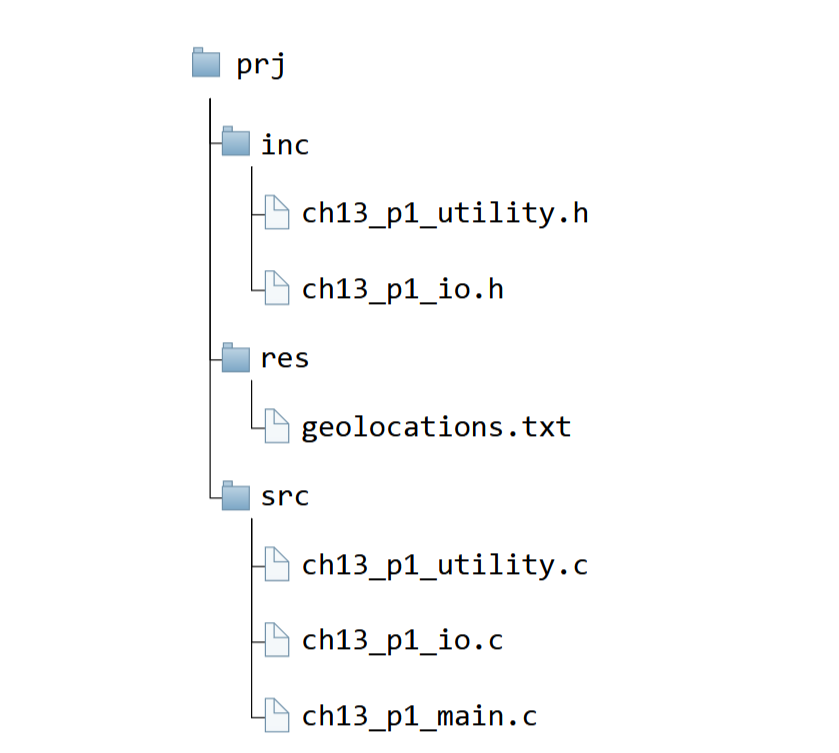

# 13. Διαμέριση κώδικα

<i>Σύνοψη</i> Διαμέριση κώδικα C σε αρχεία επικεφαλίδων και αρχεία πηγαίου κώδικα, διαχωρισμός διεπαφής και υλοποίησης, δημιουργία στατικών και δυναμικών βιβλιοθηκών στη C, οργάνωση μεταγλώττισης με το λογισμικό make και makefiles, το make και άλλα build συστήματα.  

<i>Προαπαιτούμενη γνώση</i> Τύποι δεδομένων, είσοδος/έξοδος, δομές επιλογής και επανάληψης, συναρτήσεις, πίνακες, δομές, δείκτες, αλφαριθμητικά, εντολές προεπεξεργαστή.

## 13.1 Εισαγωγή

Η διαμέριση κώδικα είναι ένας τρόπος να διασπαστεί ένα πρόγραμμα σε μικρότερα τμήματα. Αποτελεί βασική τεχνική διαχείρισης της πολυπλοκότητας μεγάλων εφαρμογών λογισμικού καθώς βελτιώνει την οργάνωση του κώδικα, την αναγνωσιμότητα και την ευκολία διαχείρισης της εφαρμογής στο σύνολό της.  
Στον προγραμματισμό με την C, η διαμέριση τυπικά αφορά τον διαχωρισμό κώδικα σε αρχεία επικεφαλίδων και αρχεία πηγαίου κώδικα. Τα αρχεία επικεφαλίδων περιέχουν δηλώσεις τύπων δεδομένων, συναρτήσεων, μεταβλητών κ.λπ., ενώ τα αρχεία πηγαίου κώδικα περιέχουν τους ορισμούς των δηλώσεων, δηλαδή τις λεπτομέρειες υλοποίησης.  
Τα πλεονεκτήματα που προκύπτουν από τη διαμέριση κώδικα είναι πολλά. Πρώτον, επιτρέπουν την επαναχρησιμοποίηση κώδικα καθώς οι συναρτήσεις και οι τύποι δεδομένων μπορούν να δηλώνονται σε αρχεία <span class="p-style">.h</span>, να ορίζονται σε αρχεία <span class="p-style">.c</span> και τα αρχεία <span class="p-style">.h</span> να γίνονται <span class="p-style">include</span> εφόσον απαιτείται σε άλλα αρχεία πηγαίου κώδικα. Με αυτόν τον τρόπο αποτρέπεται η ύπαρξη πολλαπλών αντιγράφων του ίδιου κώδικα και τα προβλήματα που εισάγει όπως ασυνέπεια αντιγράφων, δυσκολία στη διόρθωση κ.λπ. Δεύτερο πλεονέκτημα είναι ότι η διαμέριση κώδικα βελτιώνει τους χρόνους μεταγλώττισης καθώς τα επιμέρους τμήματα κώδικα που με ταγλωττίζονται δεν χρειάζεται να μεταγλωττιστούν ξανά, αν δεν προκύπτει αλλαγή στον κώδικά τους. Τρίτο πλεονέκτημα της διαμέρισης κώδικα είναι ότι βελτιώνει την οργάνωση του κώδικα σε τμήματα (modularity), επιτρέποντας την ανάθεση της ανάπτυξης επιμέρους τμημάτων σε διαφορετικούς προγραμματιστές και την πλοήγηση σε μεγάλα αποθετήρια κώδικα (codebases).

## 13.2 Αρχεία επικαφαλίδων και αρχεία πηγαίου κώδικα στη C

Ένα τυπικό αρχείο επικεφαλίδας περιέχει φρουρούς <span class="p-style">include</span>, δηλώσεις συναρτήσεων, ορισμούς μακροεντολών, τύπων και σταθερών. Αν και μπορεί να γίνει θα πρέπει να αποφεύγεται ο ορισμός συναρτήσεων και μεταβλητών σε αρχεία επικεφαλίδων, που θα πρέπει να γίνονται σε αρχεία πηγαίου κώδικα. Τα αρχεία πηγαίου κώδικα μεταγλωττίζονται σε αρχεία αντικείμενα (object files), που συνδέονται με άλλα αρχεία αντικείμενα έτσι ώστε να δημιουργήσουν το τελικό εκτελέσιμο πρόγραμμα.

### 13.2.1 Διαχωρισμός διεπαφής και υλοποίησης

Ο διαχωρισμός διεπαφής και υλοποίησης είναι μια σημαντική έννοια της διαμέρισης κώδικα. Μια διεπαφή (interface) είναι ένα αρχείο επικεφαλίδας που περιέχει δηλώσεις, ενώ η υλοποίηση περιέχεται στο αντίστοιχο αρχείο πηγαίου κώδικα. Πλεονεκτήματα που προκύπτουν από τον διαχωρισμό διεπαφής και υλοποίησης παρατίθενται στη συνέχεια:

* Eνίσχυση του τμηματικού σχεδιασμού, που επιτρέπει σε κάθε τμήμα κώδικα να αναπτύσσεται, να ελέγχεται και να συντηρείται ανεξάρτητα από τα άλλα.
* Μειώνει τη σύζευξη (coupling) ανάμεσα στα επιμέρους τμήματα του κώδικα, με συνέπεια αλλαγές σε ένα τμήμα να επηρεάζουν λιγότερο τα άλλα τμήματα κώδικα.
* Βελτίωση της αναγνωσιμότητας του κώδικα, καθώς η διεπαφή μπορεί να θεωρηθεί ως μια υψηλού επιπέδου περιγραφή της λειτουργικότητας, ενώ οι χαμηλού επιπέδου λεπτομέρειες υλοποίησης βρίσκονται «κρυμμένες» μέσα στα αρχεία πηγαίου κώδικα.
* Διευκόλυνση της επαναχρησιμοποίησης κώδικα, καθώς άλλα τμήματα κώδικα μπορούν να χρησιμοποιούν τη διεπαφή χωρίς να χρειάζεται να γνωρίζουν τις λεπτομέρειες υλοποίησης. 

Τα βήματα που ακολουθούνται για τον διαχωρισμό διεπαφής και υλοποίησης και τη δημιουργία ενός τμήματος κώδικα είναι τα ακόλουθα:

1. Ορισμός της διεπαφής: Δήλωση τύπων δεδομένων και συναρτήσεων στο αρχείο επικεφαλίδας.
2. Υλοποίηση της διεπαφής: Συγγραφή του κώδικα υλοποίησης των συναρτήσεων που δηλώθηκαν στο αρχείο επικεφαλίδας στο αντίστοιχο αρχείο πηγαίου κώδικα.
3. Έλεγχος του τμήματος κώδικα: Έλεγχος ότι το τμήμα κώδικα (επικεφαλίδα και πηγαίος κώδικας) λειτουργεί όπως πρέπει.
4. Χρήση του τμήματος κώδικα: Συμπερίληψη του αρχείου επικεφαλίδας σε οποιοδήποτε άλλο τμήμα κώδικα χρειάζεται τη λειτουργικότητα που έχει υλοποιηθεί.

### 13.2.2 Παράδειγμα διαχωρισμού διεπαφής και υλοποίησης

Στη συνέχεια θα παρουσιαστεί ένα παράδειγμα που υπολογίζει και εμφανίζει τη χιλιομετρική απόσταση μεταξύ πόλεων, πραγματοποιώντας διαχωρισμό διεπαφής και υλοποίησης. Στο παράδειγμα αυτό υπολογίζονται οι χιλιομετρικές αποστάσεις μεταξύ πόλεων που το γεωγραφικό πλάτος και το γεωγραφικό μήκος τους δίνεται στο αρχείο <span class="p-style">geolocations.txt</span>. Ειδικότερα, το αρχείο <span class="p-style">geolocations.txt</span> περιέχει 1 γραμμή ανά πόλη με τις πληροφορίες: όνομα πόλης και χώρα, γεωγραφικό πλάτος, γεωγραφικό μήκος και ήπειρος σε σειρά να χωρίζονται μεταξύ τους με ελληνικά ερωτηματικά. Κατά την εκτέλεση του τελικού προγράμματος η διαδρομή του αρχείου <span class="p-style">geolocations.txt</span> θα περνά ως όρισμα γραμμής εντολών προκειμένου τα δεδομένα του να χρησιμοποιηθούν για τον υπολογισμό των αποστάσεων.

```{.txt title="Το αρχείο geolocations.txt"}
--8<-- "src/geolocations.txt"
```

Ο κώδικας έχει διαμεριστεί στα ακόλουθα πέντε αρχεία:

* <span class="p-style">ch13_p1_utility.h</span>: Ορίζει τη σταθερά <span class="p-style">PI</span> στην τιμή 3.141592. Περιέχει τη δήλωση της απαρίθμησης <span class="p-style">Continent</span>, της δομής <span class="p-style">geo_city</span> και των συναρτήσεων, <span class="p-style">distance()</span>, <span class="p-style">deg2rad()</span> και <span class="p-style">rad2deg()</span>. H συνάρτηση <span class="p-style">distance()</span> υπολογίζει τη χιλιομετρική απόσταση μεταξύ δύο τοποθεσιών δεδομένου του γεωγραφικού μήκους και πλάτους τους. Οι συναρτήσεις <span class="p-style">deg2rad()</span> και <span class="p-style">rad2deg()</span> έχουν βοηθητικό ρόλο καθώς μετατρέπουν γωνίες από μοίρες σε ακτίνια και από ακτίνια σε μοίρες αντίστοιχα.
* <span class="p-style">ch13_p1_utility.c</span>: Περιέχει τις υλοποιήσεις (ορισμούς) των συναρτήσεων που δηλώνονται στο <span class="p-style">ch13_p1_utility.h</span>. Η συνάρτηση <span class="p-style">distance()</span> υλοποιείται χρησιμοποιώντας τον τύπο του
    Haversine (1) που υπολογίζει την απόσταση ανάμεσα σε δύο σημεία στην επιφάνεια μιας σφαίρας.
    { .annotate }

    1. <a href="https://www.themathdoctors.org/distances-on-earth-2-the-haversine-formula/" target="_blank">https://www.themathdoctors.org/distances-on-earth-2-the-haversine-formula/</a>  
  

* <span class="p-style">ch13_p1_io.h</span>: Περιέχει τη δήλωση της συνάρτησης <span class="p-style">read_cities()</span> που διαβάζει δεδομένα πόλεων από ένα αρχείο κειμένου και επιστρέφει έναν πίνακα με στοιχεία τύπου <span class="p-style">geo_city</span> καθώς και το πλήθος των πόλεων που διάβασε. Επίσης, ορίζει τη σταθερά <span class="p-style">MAX_CITIES</span> που περιέχει τον μέγιστο αριθμό πόλεων που η συνάρτηση είναι σε θέση να διαβάσει.
* <span class="p-style">ch13_p1_io.c</span>: Περιέχει την υλοποίηση της συνάρτησης <span class="p-style">read_cities()</span>.
* <span class="p-style">ch13_p1_main.c</span>: Είναι το αρχείο οδηγός, που περιέχει τη συνάρτηση <span class="p-style">main()</span> και αποτελεί την αφετηρία εκτέλεσης του προγράμματος. Στο αρχείο αυτό δεσμεύεται η απαιτούμενη μνήμη για τα στοιχεία των πόλεων, συμπληρώνεται με τιμές που διαβάζονται από το αρχείο δεδομένων και υπολογίζονται οι αποστάσεις των πόλεων ανά δύο με τη συνάρτηση <span class="p-style">distance()</span> και εμφανίζονται.

Οι κώδικες των αρχείων επικεφαλίδας (κώδικας 13.1 και κώδικας 13.2) παρουσιάζονται στη συνέχεια.

```{.c title="Κώδικας 13.1: ch13_p1_utility.h - αρχείο επικεφαλίδας που ορίζει μία σταθερά (με #define) και δηλώνει μια απαρίθμηση, μια δομή και τρεις συναρτήσεις." linenums="1"}
--8<-- "src/ch13_p1_utility.h"
```

```{.c title="Κώδικας 13.2: ch13_p1_io.h - αρχείο επικεφαλίδας που ορίζει μια σταθερά (με #define) και δηλώνει μια συνάρτηση." linenums="1"}
--8<-- "src/ch13_p1_io.h"
```

Ακολουθούν τα αρχεία πηγαίου κώδικα 13.3 και 13.4, τα οποία υλοποιούν τις δηλώσεις συναρτήσεων που περιέχονται στα αντίστοιχα αρχεία επικεφαλίδων.

```{.c title="Κώδικας 13.3: ch13_p1_utility.c - αρχείο πηγαίου κώδικα που περιέχει ορισμούς των τριών συναρτήσεων που δηλώθηκαν στο ch13_p1_utility.h." linenums="1"}
--8<-- "src/ch13_p1_utility.c"
```

```{.c title="Κώδικας 13.4: ch13_p1_io.c - αρχείο πηγαίου κώδικα που περιέχει ορισμούς της συνάρτησης που δηλώθηκαν στο ch13_p1_io.h." linenums="1"}
--8<-- "src/ch13_p1_io.c"
```

Το κύριο πρόγραμμα είναι το <span class="p-style">ch13_p1_main.c</span> (κώδικας 13.5) και αποτελεί τον «οδηγό εκτέλεσης» του προγράμματος.

```{.c title="Κώδικας 13.5: ch13_p1_main.c - αρχείο πηγαίου κώδικα που περιέχει τη συνάρτηση main() και αποτελεί το σημείο έναρξης εκτέλεσης του προγράμματος." linenums="1"}
--8<-- "src/ch13_p1_main.c"
```

<i>Μεταγλώττιση από τη γραμμή εντολών</i> Αν και τα πέντε αρχεία κώδικα βρίσκονται στον ίδιο κατάλογο, η ακόλουθη εντολή μεταγλώττισης και σύνδεσης θα παράξει το αρχείο εκτελέσιμου κώδικα ch13_p1_main.

```
$ gcc ch13_p1_utility.c ch13_p1_io.c ch13_p1_main.c ‐o ch13_p1_main
```

Η εκτέλεση του προγράμματος, εφόσον το αρχείο <span class="p-style">geolocations.txt</span> βρίσκεται στον ίδιο κατάλογο με το εκτελέσιμο θα εμφανίσει τα ακόλουθα:

```
$ ./ch13_p1_main geolocations.txt
Athens, Greece to Paris, France distance 2095.7km
...
McMurdo Station to Auckland , New Zealand distance 4574.3km
```

Τα παραπάνω αρχεία θα μπορούσαν να βρίσκονται για καλύτερη οργάνωση σε υποκαταλόγους όπως φαίνεται στο Σχήμα 13.1 στη συνέχεια:  
Τότε, η εντολή μεταγλώττισης θα έπρεπε να τροποποιηθεί όπως στη συνέχεια. Προκειμένου να εντοπιστούν τα αρχεία επικεφαλίδων στη νέα τους θέση χρησιμοποιείται κατά τη μεταγλώττιση ο διακόπτης <span class="p-style">‐Ι</span> ακολουθούμενος από το όνομα του υποκαταλόγου, <span class="p-style">‐Iinc</span>.

```
$ gcc src/ch13_p1_utility.c src/ch13_p1_io.c src/ch13_p1_main.c ‐Iinc ‐o ch13_p1_main
```

Η εντολή εκτέλεσης του προγράμματος θα έπρεπε επίσης να τροποποιηθεί έτσι ώστε να δείχνει τη σωστή διαδρομή προς το αρχείο δεδομένων <span class="p-style">geolocations.txt</span>.

```
$ ./ch13_p1_main res/geolocations.txt
Athens, Greece to Paris, France distance 2095.7km
...
McMurdo Station to Auckland , New Zealand distance 4574.3km
```



<div style="text-align: center;"><b>Σχήμα 13.1:</b><i>Ιεραρχία καταλόγων για αποθήκευση πηγαίου κώδικα και αρχείων επικεφαλίδων για το παράδειγμα ch13_p1.</i></div>

## 13.3 Δημιουργία βιβλιοθηκών

Μια βιβλιοθήκη είναι μια συλλογή από προ-μεταγλωττισμένες συναρτήσεις και σύμβολα που μπορούν να χρησιμοποιηθούν από προγράμματα τόσο κατά τη μεταγλώττιση όσο και κατά την εκτέλεσή τους. Μια βιβλιοθήκη μπορεί να συνδέεται στατικά ή δυναμικά με ένα πρόγραμμα και μπορεί να περιέχει διάφορους πόρους που χρησιμοποιούνται από το πρόγραμμα. Οι δύο κατηγορίες βιβλιοθηκών είναι οι στατικές βιβλιοθήκες και
οι δυναμικές βιβλιοθήκες.  
Μια στατική βιβλιοθήκη είναι μια συλλογή από object files που συνδέονται απευθείας στο εκτελέσιμο ενός προγράμματος κατά τον χρόνο μεταγλώττισης. Ένα πλεονέκτημα των στατικών βιβλιοθηκών είναι ότι δεν απαιτούν διανομή επιπλέον αρχείων έτσι ώστε το πρόγραμμα να μπορεί να εκτελεστεί, αλλά οι συναρτήσεις και τα σύμβολα που ορίζονται στις στατικές βιβλιοθήκες ενσωματώνονται στο ίδιο το εκτελέσιμο του προγράμματος.  
Από την άλλη μεριά, μια δυναμική βιβλιοθήκη είναι μια κοινόχρηστη βιβλιοθήκη η οποία φορτώνεται από το πρόγραμμα κατά την εκτέλεσή του. Οι δυναμικές βιβλιοθήκες μεταγλωττίζονται ξεχωριστά από το πρόγραμμα και αποθηκεύονται ως αρχεία με επέκταση <span class="p-style">.so</span> σε Linux/Unix συστήματα ή ως αρχεία <span class="p-style">.dll</span> σε συστήματα Windows ή ως αρχεία <span class="p-style">.dylib</span> σε συστήματα MacOS. Κατά τον χρόνο εκτέλεσης το πρόγραμμα φορτώνει τη δυναμική βιβλιοθήκη και επιλύει με αυτόν τον τρόπο αναφορές σε συναρτήσεις και σύμβολα που ορίζονται στη δυναμική βιβλιοθήκη. Πλεονεκτήματα των δυναμικών βιβλιοθηκών είναι ότι πολλά επιμέρους προγράμματα μπορούν να μοιράζονται το ίδιο αντίγραφο μιας δυναμικής βιβλιοθήκης και ότι εν γένει είναι μικρότερες από τις αντίστοιχες στατικές βιβλιοθήκες.  
Οι βιβλιοθήκες στη C είναι ένας ισχυρός μηχανισμός οργάνωσης κώδικα σε επαναχρησιμοποιήσιμη μορφή έτσι ώστε να προωθείται η τμηματοποίηση του. Οι βιβλιοθήκες μπορούν να διατίθενται και ως ξεχωριστά πακέτα, και με αυτόν τον τρόπο να διευκολύνεται ο διαμοιρασμός τους και η ενσωμάτωσή τους σε εφαρμογές.


### 13.3.1 Παράδειγμα στατικής βιβλιοθήκης 

Στο παράδειγμα που ακολουθεί θα δημιουργηθεί μια στατική βιβλιοθήκη με όνομα <span class="p-style">libutility.a</span> για τα περιεχόμενα του αρχείου πηγαίου κώδικα <span class="p-style">ch13_p1_utility.c</span> της παραγράφου 13.2.2. Στη συνέχεια η βιβλιοθήκη αυτή θα συνδεθεί με τον υπόλοιπο κώδικα του παραδείγματος. Παρατηρήστε ότι η επέκταση του ονόματος της βιβλιοθήκης είναι <span class="p-style">.a</span> για Linux/UNIX και MacOS, ενώ είναι <span class="p-style">.lib</span> για Windows. Τα βήματα που ακολουθούνται είναι: 

* Μεταγλώττιση του <span class="p-style">ch13_p1_utility.c</span> σε object αρχείο χρησιμοποιώντας την εντολή <span class="p-style">gcc</span> και τον διακόπτη <span class="p-style">‐c</span>.
```
$ gcc ‐c ch13_p1_utility.c ‐o ch13_p1_utility.o
```
* Δημιουργία του αρχείου της στατικής βιβλιοθήκης από το object αρχείο με τη χρήση της εντολής <span class="p-style">ar</span>.
    Το όνομα της εντολής προκύπτει από τα δύο πρώτα γράμματα της λέξης archive (αρχειοθέτηση).
    ```
    $ ar rcs libutility.a ch13_p1_utility.o
    ```
    Οι διακόπτες <span class="p-style">r</span>, <span class="p-style">c</span> και <span class="p-style">s</span> κατά την κλήση της εντολής <span class="p-style">ar</span> σημαίνουν για το μεν <span class="p-style">r</span> ότι πρόκειται να αντικατασταθούν ή να προστεθούν αρχεία στο αρχείο που δημιουργείται, για το <span class="p-style">c</span> ότι δεν θα εμφανίζονται κατά την εκτέλεση του <span class="p-style">ar</span> διαγνωστικά μηνύματα και για το <span class="p-style">s</span> ότι θα γίνει ενημέρωση της δομής του πίνακα συμβόλων που έχει ως στόχο τη «διευκόλυνση» του συνδέτη στο να εντοπίζει σύμβολα που χρησιμοποιούνται στο πρόγραμμα.
* Μεταγλώττιση του προγράμματος συνδέοντας το αρχείο της στατικής βιβλιοθήκης. Ο διακόπτης <span class="p-style">‐L</span> ακολουθείται από τη διαδρομή υποκαταλόγων στην οποία βρίσκεται η στατική βιβλιοθήκη και ο διακόπτης <span class="p-style">‐l</span> ακολουθείται από το όνομα της στατικής βιβλιοθήκης χωρίς το πρόθεμα <span class="p-style">lib</span> του ονόματος, δηλαδή αν η βιβλιοθήκη ονομάζεται <span class="p-style">libutility.a</span> και βρίσκεται στον τρέχοντα κατάλογο, τότε η εντολή μεταγλώττισης συμπληρώνεται με <span class="p-style">‐L</span>. και <span class="p-style">‐lutility</span> όπως και στη συνέχεια:
``` 
$ gcc ch13_p1_io.c ch13_p1_main.c ‐L. ‐lutility ‐o ch13_p1_main_s
```

Το εκτελέσιμο αρχείο δεν απαιτεί την ύπαρξη στον ίδιο φάκελο ή σε φάκελο που να είναι στο PATH (1), της στατικής βιβλιοθήκης για την εκτέλεσή του. Συνεπώς, αν μεταφερθεί σε έναν νέο κατάλογο μαζί με το αρχείο δεδομένων, το πρόγραμμα θα εκτελεστεί χωρίς πρόβλημα με την ακόλουθη εντολή:
{ .annotate }

1. Το PATH είναι μια μεταβλητή περιβάλλοντος που καθορίζει τους καταλόγους στους οποίους το σύστημα αναζητά εκτελέσιμα αρχεία.  


```
$ ./ch13_p1_main_s geolocations.txt
```

### 13.3.2 Παράδειγμα δυναμικής βιβλιοθήκης

Το παράδειγμα της προηγούμενης παραγράφου υλοποιείται ξανά, με τη δημιουργία και χρήση δυναμικής βιβλιοθήκης αυτήν τη φορά. Με τις εντολές που ακολουθούν θα δημιουργηθεί αρχικά η δυναμική βιβλιοθήκη <span class="p-style">libutility.so</span> σε Linux/UNIX (<span class="p-style">libutility.dll</span> σε Windows, <span class="p-style">libutility.dylib</span> σε macOS) για το <span class="p-style">ch13_p1_utility.c</span> και θα ακολουθήσει σύνδεσή της με τον υπόλοιπο κώδικα του παραδείγματος, με τη σημαντική διαφορά ότι πλέον ο object κώδικας της βιβλιοθήκης θα φορτώνεται κατά τον χρόνο εκτέλεσης.  
Τα βήματα είναι τα ακόλουθα:

* Μεταγλώττιση του <span class="p-style">ch13_p1_utility.c</span> σε διαμοιραζόμενο object αρχείο καλώντας τον μεταγλωττιστή <span class="p-style">gcc</span> με τον διακόπτη <span class="p-style">‐shared</span>.
    ```
    $ gcc ‐shared ‐o libutility.so ch13_p1_utility.o
    ```
    Η εντολή αυτή δημιουργεί το αρχείο <span class="p-style">libutility.so</span> που περιέχει τα σύμβολα και τις υλοποιήσεις των συναρτήσεων που έχουν δηλωθεί στο αρχείο <span class="p-style">ch13_p1_utility.h</span>.

* Μεταγλώττιση του προγράμματος συνδέοντας το αρχείο της δυναμικής βιβλιοθήκης. Για τους διακόπτες <span class="p-style">‐L</span> και <span class="p-style">‐l</span> ισχύει ό,τι και στην περίπτωση της στατικής βιβλιοθήκης. Αξίζει να σημειωθεί ότι δεν συμπληρώνεται στην εντολή μεταγλώττισης στο όνομα της δυναμικής βιβλιοθήκης η επέκτασή του (<span class="p-style">.so</span> ή <span class="p-style">.dll</span> ή <span class="p-style">.dylib</span> ανάλογα με το λειτουργικό σύστημα).

    ```
    $ gcc ch13_p1_io.c ch13_p1_main.c ‐L. ‐lutility ‐o ch13_p1_main_d
    ```

Αν το εκτελέσιμο αρχείο του προγράμματος μεταφερθεί σε έναν νέο κατάλογο και επιχειρηθεί από εκεί η εκτέλεσή του, τότε θα εμφανιστεί μήνυμα σφάλματος που θα αναφέρει ότι το αρχείο δυναμικής βιβλιοθήκης <span class="p-style">libutility.so</span> δεν βρέθηκε.

```
$ ./ch13_p1_main_d geolocations.txt
```

Αν στον ίδιο φάκελο μεταφερθεί και το αρχείο της δυναμικής βιβλιοθήκης τότε η εκτέλεση του προγράμματος θα γίνει κανονικά.

## 13.4 Οργάνωση μεταγλώττισης με το make

Το <span class="p-style">make</span> [^1] είναι ένα build automation tool, δηλαδή ένα εργαλείο αυτοματοποίησης δημιουργίας εκτελέσιμων προγραμμάτων και βιβλιοθηκών από αρχεία πηγαίου κώδικα. Το <span class="p-style">make</span> διαβάζει το makefile, ένα ειδικά διαμορφωμένο αρχείο που περιέχει κανόνες καθορισμού του τρόπου που θα γίνεται η μεταγλώττιση και σύνδεση του προγράμματος. Εντοπίζει τμήματα του προγράμματος που πρέπει να μεταγλωττιστούν ξανά, και εξετάζοντας τη χρονική στιγμή τελευταίας τροποποίησής τους, παραλείπει τμήματα που η εκ νέου μεταγλώττιση δεν απαιτείται. Με αυτόν τον τρόπο μειώνει τον χρόνο και εξοικονομεί υπολογιστικούς πόρους που θα απαιτούνταν για την από την αρχή δημιουργία του εκτελέσιμου προγράμματος, κάτι που είναι ιδιαίτερα χρήσιμο ειδικά σε προγράμματα με πολλά επιμέρους αρχεία πηγαίου κώδικα που διατηρούν πολύπλοκες εξαρτήσεις μεταξύ τους. Ένα επιπλέον πλεονέκτημα του <span class="p-style">make</span>, είναι ότι απαλλάσσει τον προγραμματιστή από την ανάγκη επαναλαμβανόμενης πληκτρολόγησης μακροσκελών εντολών μεταγλώττισης και σύνδεσης, ενώ ταυτόχρονα καταγράφει και τεκμηριώνει τα βήματα που απαιτεί η διαδικασία παραγωγής του τελικού εκτελέσιμου.   
Θα πρέπει να σημειωθεί ότι το <span class="p-style">make</span> δεν χρησιμοποιείται μόνο για μεταγλώττιση κώδικα και δημιουργία εκτελέσιμων ή βιβλιοθηκών στη γλώσσα C ή σε άλλες μεταγλωττιζόμενες γλώσσες όπως η C++ και η Fortran. Πρόκειται για ένα εργαλείο που βρίσκει χρήση σε πολλά σενάρια αυτοματοποίησης διαδικασιών όπως στην οργάνωση των εργασιών που απαιτούνται για τη δημιουργία ιστοτόπων (π.χ. αντιγραφή αρχείων σε καταλόγους, ελαχιστοποίηση μεγέθους αρχείων Javascript και CSS, βελτιστοποίηση εικόνων κ.ά.), στην οργάνωση σειράς εργασιών (pipelines) στην επιστήμη δεδομένων, στη δημιουργία τεκμηρίωσης σε μορφή HTML, PDF ή EPUB από αρχεία markdown κ.ά. Καλές πηγές εκμάθησης των δυνατοτήτων του <span class="p-style">make</span> είναι το <a href="https://makefiletutorial.com/" target="_blank">https://makefiletutorial.com/</a> και το <a href="https://makefile.site/" target="_blank">https://makefile.site/</a>, ενώ υπάρχουν βιβλία όπως το “Managing Projects with GNU Make: The Power of GNU Make for Building Anything” του Robert Mecklenburg [^2] που εξετάζουν τις δυνατότητες του <span class="p-style">make</span> σε βάθος.

### 13.4.1 Παραδείγματα με makefiles

Τα makefiles αποτελούνται από κανόνες. Ένας κανόνας έχει 3 μέρη, τον στόχο (target), τη λίστα των προαπαιτούμενων (prerequisites), και εντολές (commands) όπως στη συνέχεια.

```
στόχος: προαπαιτούμενα
εντολές
```

Ο στόχος διαχωρίζεται από τα προαπαιτούμενα με άνω-κάτω τελεία ενώ καθεμία από τις εντολές που ακολουθούν γράφεται σε νέα γραμμή ξεκινώντας ένα tab δεξιότερα από την αρχή της γραμμής. Όταν το <span class="p-style">make</span> κληθεί να αποτιμήσει έναν κανόνα, ξεκινά εξετάζοντας τα προαπαιτούμενα και αποτιμά πρώτα κάθε προαπαιτούμενο που έχει τον δικό του κανόνα. Οι κανόνες τοποθετούνται στο makefile από το γενικότερο προς τον ειδικότερο και συνήθως ο πρώτος κανόνας έχει στόχο με όνομα <span class="p-style">all</span>. Είναι σύνηθες κάθε στόχος να αναπαριστά ένα αρχείο, ενώ οι στόχοι που δεν αναπαριστούν αρχεία είναι οι λεγόμενοι ψεύτικοι (phony) στόχοι.  
Οι βασικές δυνατότητες του <span class="p-style">make</span> θα παρουσιαστούν σταδιακά στη συνέχεια, σε ένα παράδειγμα με τρία αρχεία, το <span class="p-style">ch13_p2_main.c</span> (κώδικας 13.6), το <span class="p-style">ch13_p2_geom.h</span> (κώδικας 13.7) και το <span class="p-style">ch13_p2_geom.c</span> (κώδικας 13.8), που αναπαριστούν το πρόγραμμα οδηγό, ένα αρχείο επικεφαλίδας και ένα αρχείο με την υλοποίηση του κώδικα της συνάρτησης που δηλώνεται στο αρχείο επικεφαλίδας, αντίστοιχα.

```{.c title="Κώδικας 13.6: ch13_p2_main.c - πρόγραμμα οδηγός." linenums="1"}
--8<-- "src/ch13_p2_main.c"
```

```{.c title="Κώδικας 13.7: ch13_p2_geom.h - αρχείο επικεφαλίδας." linenums="1"}
--8<-- "src/ch13_p2_geom.h"
```

```{.c title="Κώδικας 13.8: ch13_p2_geom.c - αρχείο πηγαίου κώδικα." linenums="1"}
--8<-- "src/ch13_p2_geom.c"
```

Η μεταγλώττιση του κώδικα γίνεται με την ακόλουθη εντολή. Παρατηρήστε τον διακόπτη <span class="p-style">‐Ι</span> ακολουθούμενο από την τελεία που προσθέτει τον τρέχοντα κατάλογο στους καταλόγους όπου αναζητούνται τα αρχεία επικεφαλίδων. Εναλλακτικά, θα μπορούσε να μην είχε χρησιμοποιηθεί ο διακόπτης <span class="p-style">‐Ι</span> και το <span class="p-style">ch13_p2_geom.h</span> να γινόταν <span class="p-style">include</span> με διπλά εισαγωγικά στα αρχεία πηγαίου κώδικα.

```
$ gcc ch13_p2_geom.c ch13_p2_main.c ‐o ch13_p2_main ‐I. ‐lm
$ ./ch13_p2_main
The distance between (3.0, 4.0) and (6.0, 8.0) is 5.0
```

Στην εντολή μεταγλώττισης συμπεριλήφθηκε και ο διακόπτης ‐lm προκειμένου να συνδεθεί το πρόγραμμα που μεταγλωττίζεται με την πρότυπη βιβλιοθήκη μαθηματικών της γλώσσας.

<i>Πρώτο makefile</i> Ένα πρώτο απλό makefile περιέχει αυτούσια την εντολή μεταγλώττισης που αναφέρθηκε παραπάνω, όπως φαίνεται στον κώδικα 13.9.

```{.mk title="Κώδικας 13.9: ch13_p2_makefile1.mk - 1η έκδοση του makefile με έναν στόχο και απλή παράθεση της εντολής μεταγλώττισης που θα δινόταν από τη γραμμή εντολών για τη μεταγλώττιση των αρχείων του πηγαίου κώδικα."}
--8<-- "src/ch13_p2_makefile1.mk"
```

Αν στο αρχείο makefile έχει δοθεί το όνομα <span class="p-style">Makefile</span> ή <span class="p-style">makefile</span>, τότε απλά η παράθεση της εντολής <span class="p-style">make</span> θα χρησιμοποιήσει ως είσοδο αυτό το αρχείο. Αν το αρχείο έχει διαφορετικό όνομα τότε θα πρέπει να χρησιμοποιηθεί ο διακόπτης <span class="p-style">‐f</span> για να προσδιοριστεί το όνομα του αρχείου makefile όπως στη συνέχεια:

```
$ make ‐f ch13_p2_makefile1.mk
gcc ch13_p2_main.c ch13_p2_geom.c ‐o ch13_p2_main ‐I. ‐lm
```

Το πλεονέκτημα της χρήσης του <span class="p-style">make</span> εδώ είναι ότι δεν χρειάζεται να πληκτρολογείται η εντολή μεταγλώττισης κάθε φορά που πρέπει να μεταγλωττιστεί εκ νέου ο κώδικας. Επιπλέον, το περιεχόμενο του makefile λειτουργεί ως υπενθύμιση για το ποια είναι η εντολή μεταγλώττισης.  

<i>Δεύτερο makefile</i> Η μεταγλώττιση των αρχείων πηγαίου κώδικα έγινε με μια εντολή στο προηγούμενο παράδειγμα, αλλά μπορεί να σπάσει στις ακόλουθες επιμέρους εντολές με τις δύο πρώτες να μεταγλωττίζουν τον κώδικα των <span class="p-style">.c</span> αρχείων σε δύο αρχεία αντικείμενου κώδικα και με την τρίτη εντολή να συνδέει τα αρχεία αντικείμενου κώδικα στο αρχείο εκτελέσιμου κώδικα. Αυτό δίνει το πλεονέκτημα της μεταγλώττισης μόνο του ενός αρχείου πηγαίου κώδικα αν αλλάξει μόνο αυτό και τη σύνδεση των αρχείων αντικείμενων για τη δημιουργία του νέου τελικού εκτελέσιμου προγράμματος.

```
$ gcc ‐c ch13_p2_geom.c ‐o ch13_p2_geom.o ‐I.
$ gcc ‐c ch13_p2_main.c ‐o ch13_p2_main.o ‐I.
$ gcc ch13_p2_geom.o ch13_p2_main.o ‐o ch13_p2_main ‐lm
```

Η διαδικασία ξεχωριστής μεταγλώττισης κάθε αρχείου πηγαίου κώδικα μπορεί να γίνει με το ακόλουθο makefile (κώδικας 13.10):

```{.mk title="Κώδικας 13.10: ch13_p2_makefile2.mk - 2η έκδοση του makefile που εκτελεί ξεχωριστή μεταγλώττιση των αρχείων πηγαίου κώδικα."}
--8<-- "src/ch13_p2_makefile2.mk"
```

Τώρα, στο makefile υπάρχουν ξεχωριστοί στόχοι στη γραμμή 9 και 12 για την παραγωγή των αντικειμένων προγραμμάτων για το <span class="p-style">ch13_p2_geom.c</span> και το <span class="p-style">ch13_p2_main.c</span>, αντίστοιχα. Επιπλέον, σε αυτήν τη δεύτερη εκδοχή του αρχείου makefile, ορίζονται οι μεταβλητές <span class="p-style">CC</span>, <span class="p-style">CFLAGS</span>, <span class="p-style">LDLIBS</span> και <span class="p-style">TARGET</span>. Η μεταβλητή <span class="p-style">CC</span> περιέχει το όνομα του μεταγλωττιστή που σε αυτήν την περίπτωση είναι ο <span class="p-style">gcc</span>, αλλά θα μπορούσε να είναι και οποιοσδήποτε άλλος εγκατεστημένος στο σύστημα μεταγλωττιστής της C, όπως ο <span class="p-style">clang</span>. Η μεταβλητή <span class="p-style">CFLAGS</span> περιέχει διακόπτες που θα χρησιμοποιηθούν κατά τη μεταγλώττιση (εδώ είναι το <span class="p-style">‐Ι</span>.). Η μεταβλητή <span class="p-style">LDLIBS</span> περιέχει τις βιβλιοθήκες που χρησιμοποιούνται κατά τη σύνδεση (εδώ είναι η βιβλιοθήκη για μαθηματικές συναρτήσεις <span class="p-style">libm</span>, οπότε η σύνδεση γίνεται με το <span class="p-style">‐lm</span>). Τέλος, η μεταβλητή <span class="p-style">TARGET</span> περιέχει το όνομα του εκτελέσιμου που θα παραχθεί. Οι αναφορές στις μεταβλητές στις εντολές των κανόνων του makefile γίνονται με το όνομα της κάθε μεταβλητής μέσα σε παρενθέσεις, με το <span class="p-style">&#36;</span> να προηγείται, (π.χ. <span class="p-style">$(CC)</span> για τη μεταβλητή <span class="p-style">CC</span>). Επιπλέον, έχουν προστεθεί και δύο στόχοι, που συχνά συναντώνται σε makefiles, ο στόχος <span class="p-style">all</span> και ο στόχος <span class="p-style">clean</span>. Ο στόχος <span class="p-style">all</span> ως πρώτος στόχος από την κορυφή του αρχείου είναι ο στόχος που θα εκτελεστεί όταν θα κληθεί η <span class="p-style">make</span>. Θα εξεταστούν τα προαπαιτούμενα αρχεία και αν δεν είναι ενημερωμένα, θα προηγηθεί ο κανόνας που τα έχει ως στόχο έτσι ώστε να εκτελεστεί πρώτα αυτός και να ενημερωθούν. Έτσι η εκτέλεση του <span class="p-style">make</span> με το νέο makefile θα δώσει τα ακόλουθα αποτελέσματα:

```
$ make ‐f ch13_p2_makefile2.mk
$ gcc ‐c ch13_p2_geom.c ‐o ch13_p2_geom.o ‐I.
$ gcc ‐c ch13_p2_main.c ‐o ch13_p2_main.o ‐I.
$ gcc ch13_p2_geom.o ch13_p2_main.o ‐o ch13_p2_main ‐lm
```

Αν στη συνέχεια γίνει μια αλλαγή στον πηγαίο κώδικα του <span class="p-style">ch13_p2_main.c</span> και επαναληφθεί η εκτέλεση του <span class="p-style">make</span>, τότε θα παραλειφθούν μεταγλωττίσεις που είναι περιττό να ξαναγίνουν. Το ίδιο θα συμβεί και αν διαγραφεί το αρχείο <span class="p-style">ch13_p2_main.o</span>.

```
$ make ‐f ch13_p2_makefile2.mk
$ gcc ‐c ch13_p2_geom.c ‐o ch13_p2_geom.o ‐I.
$ gcc ch13_p2_geom.o ch13_p2_main.o ‐o ch13_p2_main ‐lm
```

Ο στόχος <span class="p-style">clean</span>, όπως και κάθε άλλος στόχος, μπορεί να εκτελεστεί παραθέτοντας το όνομά του στο τέλος της εντολής make, όπως στη συνέχεια:

```
$ make ‐f ch13_p2_makefile2.mk clean
rm ‐rf ch13_p2_main *.o
```

Ο στόχος αυτός διαγράφει όλα τα αρχεία με επέκταση <span class="p-style">.o</span> καθώς και το τελικό εκτελέσιμο.

<i>Τρίτο makefile</i> Η τρίτη εκδοχή του αρχείου makefile (κώδικας 13.11) χρησιμοποιεί επιπλέον δυνατότητες του <span class="p-style">make</span>. Έχει την ίδια λειτουργικότητα με την προηγούμενη εκδοχή, αλλά ορίζει μια επιπλέον μεταβλητή, χρησιμοποιεί ειδικά σύμβολα συντομεύσεων όπως το <span class="p-style">&#36;@</span> και το <span class="p-style">&#36;^</span>, και σηματοδοτεί ότι οι στόχοι <span class="p-style">all</span> και <span class="p-style">clean</span> είναι PHONY, δηλαδή στόχοι που δεν αντιστοιχούν σε αρχεία, κάτι το οποίο δεν συμβαίνει με τους υπόλοιπους στόχους. Η νέα μεταβλητή <span class="p-style">INCLUDE</span> περιέχει τη διαδρομή στην οποία θα αναζητηθούν τα αρχεία επικεφαλίδων, ενώ η μεταβλητή <span class="p-style">CFLAGS</span> έχει πλέον διακόπτες που ορίζουν ότι θα εντοπίζονται από τον μεταγλωττιστή warnings (<span class="p-style">‐Wall ‐Wextra</span>), θα ενσωματωθούν στον εκτελέσιμο κώδικα πληροφορίες αποσφαλμάτωσης (<span class="p-style">‐g3</span>), θα επιχειρηθεί βελτιστοποίηση κώδικα (<span class="p-style">‐Ο</span>) και θα ακολουθηθεί το standard <span class="p-style">C99</span> της γλώσσας. Για τον κανόνα μέσα στον οποίο συναντάται, το σύμβολο <span class="p-style">&#36;@</span> είναι το όνομα του στόχου, ενώ το <span class="p-style">&#36;^</span> είναι η πλήρης λίστα με τα προαπαιτούμενα του κανόνα. Για παράδειγμα στο συγκεκριμένο <span class="p-style">makefile</span>, στον κανόνα που βρίσκεται στις γραμμές 13 και 14, <span class="p-style">&#36;@</span> είναι το <span class="p-style">ch13_p2_geom.o</span> και <span class="p-style">&#36;^</span> είναι τα <span class="p-style">ch13_p2_geom.c</span> και <span class="p-style">ch13_p2_geom.h</span>.


```{.mk title="Κώδικας 13.11: ch13_p2_makefile3.mk - 3η έκδοση του makefile με χρήση συμβόλων συντομεύσεων και επιπλέον μεταβλητών."}
--8<-- "src/ch13_p2_makefile3.mk"
```

Η εκτέλεση του <span class="p-style">make</span> με το νέο makefile θα δώσει τα ακόλουθα αποτελέσματα:

```
$ make ‐f ch13_p2_makefile3.mk
$ gcc ‐c ch13_p2_geom.c ‐o ch13_p2_geom.o ‐Wall ‐Wextra ‐g3 ‐O ‐std=c99 ‐I.
$ gcc ‐c ch13_p2_main.c ‐o ch13_p2_main.o ‐Wall ‐Wextra ‐g3 ‐O ‐std=c99 ‐I.
$ gcc ch13_p2_geom.o ch13_p2_main.o ‐o ch13_p2_main ‐lm
```

### 13.4.2 Πέρα από το make

Υπάρχουν πολλά άλλα build συστήματα που μπορούν να χρησιμοποιηθούν στη θέση του <span class="p-style">make</span>. Μερικά από αυτά είναι το Meson (<a href="https://mesonbuild.com/" target="_blank">https://mesonbuild.com/</a>), το Bazel (<a href="https://bazel.build/" target="_blank">https://bazel.build/</a>), το Ninja (<a href="https://ninja-build.org/" target="_blank">https://ninja-build.org/</a>), το CMake (<a href="https://cmake.org/" target="_blank">https://cmake.org/</a>) και το Conan (<a href="https://conan.io/" target="_blank">https://conan.io/</a>). Ανάμεσά τους ξεχωριστή θέση έχει το CMake που λειτουργεί ως γεννήτρια για build συστήματα και επιτρέπει τη δημιουργία makefiles, Ninja projects, projects για διάφορα IDEs όπως το Visual Studio της Microsoft, το XCode της Apple, το Clion της JetBrains και άλλα διευκολύνοντας με αυτόν τον τρόπο τη μεταφορά κώδικα μεταξύ διαφορετικών συστημάτων. Για παράδειγμα μπορεί να γραφεί ένα CMake script που να δημιουργεί ένα makefile για συστήματα Linux, ενώ στα Windows να δημιουργεί ένα Visual Studio Project. To CMake είναι αρκετά δημοφιλές και είναι ενσωματωμένο στα IDEs που αναφέρθηκαν. Η εκμάθησή του απαιτεί χρόνο και προσπάθεια, αλλά η γνώση προγραμματισμού του CMake αποτελεί μια σημαντική δεξιότητα για τη C++ και τη C.  
Για την εγκατάσταση και χρήση εξωτερικών βιβλιοθηκών της γλώσσας C (π.χ. sqlite3, zlib κ.ά.) μπορεί να χρησιμοποιηθεί το cross-platform λογισμικό διαχείρισης πακέτων (package manager) vcpkg (<a href="https://vcpkg.io/en/" target="_blank">https://vcpkg.io/en/</a>) της Microsoft που συνεργάζεται πολύ καλά με το CMake. Αν η εγκατάσταση βιβλιοθηκών γίνει με το vcpkg, οι θέσεις των αρχείων επικεφαλίδας και αρχείων δυαδικού κώδικα βιβλιοθηκών εντοπίζονται με ευκολία, οπότε μπορούν να οριστούν κατάλληλες τιμές για τους διακόπτες μεταγλώττισης και σύνδεσης (<span class="p-style">‐I, ‐L</span>).  
Ένα ακόμα εργαλείο εντοπισμού των θέσεων των αρχείων επικεφαλίδας και των αρχείων δυαδικού κώδικα βιβλιοθηκών είναι το pkg-config (<a href="https://www.freedesktop.org/wiki/Software/pkg-config/" target="_blank">https://www.freedesktop.org/wiki/Software/pkg-config/</a>
) που προέρχεται από τον κόσμο του Linux και των Unix-like συστημάτων. Το pkg-config δεν εγκαθιστά βιβλιοθήκες, αλλά επιστρέφει τις τιμές των διακοπτών που πρέπει να χρησιμοποιηθούν για τη μεταγλώττιση
και σύνδεση εγκατεστημένων βιβλιοθηκών.

## 13.5 Ασκήσεις

***Άσκηση 1***  
Γράψτε ένα πρόγραμμα που να εντοπίζει για κάθε διάστημα ενός συνόλου διαστημάτων, το πλήθος των άλλων διαστημάτων που επικαλύπτονται με αυτό. Θεωρήστε ότι κάθε διάστημα ορίζεται με δύο ακέραιες τιμές x και y και αντιστοιχεί στο [x,y). Ο κώδικας να διαμεριστεί σε επιμέρους αρχεία ως εξής:  

* <span class="p-style">interval.c</span>: Περιέχει συνάρτηση για τον έλεγχο του εάν δύο διαστήματα επικαλύπτονται ή όχι.
* <span class="p-style">logic.c</span>: Υλοποιεί τη λογική ελέγχου που επιστρέφει το πλήθος επικαλυπτόμενων διαστημάτων ενός διαστήματος με ένα σύνολο διαστημάτων.
* <span class="p-style">main.c</span>: Ζητά τη λήψη διαστημάτων από τον χρήστη και την εμφάνιση του πλήθους των επικαλυπτόμενων διαστημάτων για κάθε διάστημα.

Τα αρχεία επικεφαλίδων <span class="p-style">interval.h</span> και <span class="p-style">logic.h</span> να δηλώνουν τις συναρτήσεις των αντίστοιχων <span class="p-style">.c</span> αρχείων. Η δήλωση της δομής <span class="p-style">interval</span> να γίνεται στο <span class="p-style">interval.h</span>. Δώστε τις εντολές μεταγλώττισης και σύνδεσης που απαιτούνται για την παραγωγή του τελικού εκτελέσιμου.  

??? tip "Λύση άσκησης 1" 

    === "interval.c"
        ```{.c linenums="1"}
        --8<-- "src/ch13_e1/interval.c"
        ```  
    === "interval.h"
        ```{.c linenums="1"}
        --8<-- "src/ch13_e1/interval.h"
        ```
    === "logic.c"
        ```{.c linenums="1"}
        --8<-- "src/ch13_e1/logic.c"
        ```
    === "logic.h"
        ```{.c linenums="1"}
        --8<-- "src/ch13_e1/logic.h"
        ```
    === "main.c"
        ```{.c linenums="1"}
        --8<-- "src/ch13_e1/main.c"
        ```
***Άσκηση 2***  
Γράψτε ένα makefile για ένα πρόγραμμα που αποτελείται από τα ακόλουθα αρχεία που καλείστε να υλοποιήσετε:

* <span class="p-style">math_functions.c</span>: Περιλαμβάνει δύο συναρτήσεις <span class="p-style">add()</span> και <span class="p-style">multiply()</span>.
* <span class="p-style">utils.c</span>: Περιέχει βοηθητικές συναρτήσεις για εμφάνιση μηνυμάτων.
* <span class="p-style">main.c</span>: Καλεί συναρτήσεις για βασικές αριθμητικές πράξεις και εμφάνιση μηνυμάτων.

Τα αρχεία επικεφαλίδων <span class="p-style">math_functions.h</span> και <span class="p-style">utils.h</span> να δηλώνουν τις συναρτήσεις των <span class="p-style">.c</span> αρχείων. Το makefile να περιλαμβάνει έναν κανόνα <span class="p-style">all</span> που να δημιουργεί ένα εκτελέσιμο με όνομα <span class="p-style">calculator</span>. Επίσης, να έχει έναν κανόνα <span class="p-style">clean</span> για να καθαρίζει τα αρχεία αντικείμενο και το εκτελέσιμο. Χρησιμοποιήστε μεταβλητές για τον μεταγλωττιστή (π.χ. <span class="p-style">CC</span>) και τους διακόπτες μεταγλώττισης (π.χ. <span class="p-style">CFLAGS</span>).  

??? tip "Λύση άσκησης 2"
    === "math_functions.c"
        ```{.c linenums="1"}
        --8<-- "src/ch13_e2/math_functions.c"
        ```  
    === "math_functions.h"
        ```{.c linenums="1"}
        --8<-- "src/ch13_e2/math_functions.h"
        ```
    === "utils.c"
        ```{.c linenums="1"}
        --8<-- "src/ch13_e2/utils.c"
        ```
    === "utils.h"
        ```{.c linenums="1"}
        --8<-- "src/ch13_e2/utils.h"
        ```
    === "main.c"
        ```{.c linenums="1"}
        --8<-- "src/ch13_e2/main.c"
        ```
    === "makefile"
        ```{.c linenums="1"}
        --8<-- "src/ch13_e2/makefile"
        ```
***Άσκηση 3***  
Γράψτε ένα makefile που να υποστηρίζει τη μεταγλώττιση δύο εκδόσεων ενός προγράμματος: της έκδοσης dev για ανάπτυξη (development) και της έκδοσης prod για παραγωγή (production). Το πρόγραμμα να χρησιμοποιεί τα ακόλουθα αρχεία κώδικα που καλείστε να υλοποιήσετε:

* <span class="p-style">feature.c</span>: Περιλαμβάνει λειτουργικότητα που είναι υπό ανάπτυξη και διαφέρει ανάλογα με την έκδοση.
* <span class="p-style">utils.c</span>: Παρέχει βοηθητικές συναρτήσεις που είναι κοινές και στις δύο εκδόσεις.
* <span class="p-style">main.c</span>: Περιέχει την κύρια ροή εκτέλεσης του προγράμματος και τυχόν διαχείριση επιλογών για debugging.

Τα αρχεία επικεφαλίδων <span class="p-style">feature.h</span> και <span class="p-style">utils.h</span> να δηλώνουν τις συναρτήσεις των αντίστοιχων <span class="p-style">.c</span> αρχείων. Ο στόχος <span class="p-style">dev</span> να χρησιμοποιεί τους διακόπτες <span class="p-style">‐g ‐DDEBUG</span> για να ενεργοποιεί την αποσφαλμάτωση. Ο στόχος <span class="p-style">prod</span> να χρησιμοποιεί τους διακόπτες <span class="p-style">‐O3  
‐DNDEBUG</span> για να παράγει βελτιστοποιημένο κώδικα. Να υπάρχει ένας στόχος <span class="p-style">clean</span> για την αφαίρεση όλων των αρχείων που παράγονται κατά τη μεταγλώττιση.  

??? tip "Λύση άσκησης 3"
    === "feature.c"
        ```{.c linenums="1"}
        --8<-- "src/ch13_e3/feature.c"
        ```  
    === "feature.h"
        ```{.c linenums="1"}
        --8<-- "src/ch13_e3/feature.h"
        ```
    === "utils.c"
        ```{.c linenums="1"}
        --8<-- "src/ch13_e3/utils.c"
        ```
    === "utils.h"
        ```{.c linenums="1"}
        --8<-- "src/ch13_e3/utils.h"
        ```
    === "main.c"
        ```{.c linenums="1"}
        --8<-- "src/ch13_e3/main.c"
        ```
    === "makefile"
        ```{.c linenums="1"}
        --8<-- "src/ch13_e3/makefile"
        ```

***Άσκηση 4***  
Γράψτε ένα makefile για τον κώδικα της παραγράφου 13.2.2 στα πρότυπα του τρίτου παραδείγματος makefile που δόθηκε στην παράγραφο 13.4.1. Προσθέστε στόχους για τη δημιουργία τόσο της δυναμικής βιβλιοθήκης όσο και του τελικού εκτελέσιμου.  

??? tip "Λύση άσκησης 4"
    ```{.c linenums="1"}
    --8<-- ""
    ``` 

[^1]: <i>GNU Make.</i> <a href="https://www.gnu.org/software/make/" target="_blank">https://www.gnu.org/software/make/</a>. Accessed: 2023-05-05.  

[^2]: Robert Mecklenburg. <i>Managing Projects with GNU Make: The Power of GNU Make for Building Anything, 3rd edition.</i> O’Reilly Media, 2004.