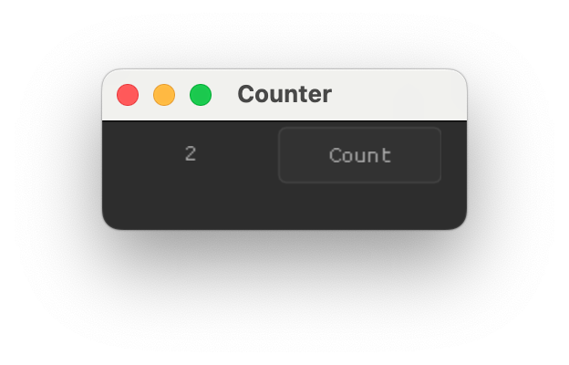
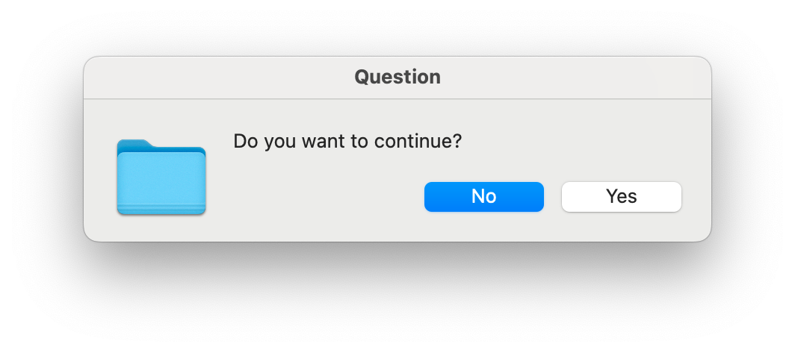
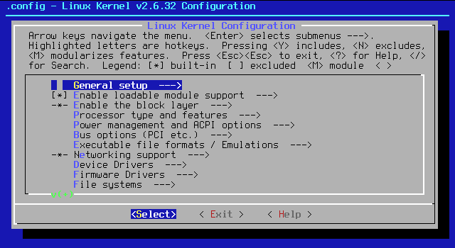
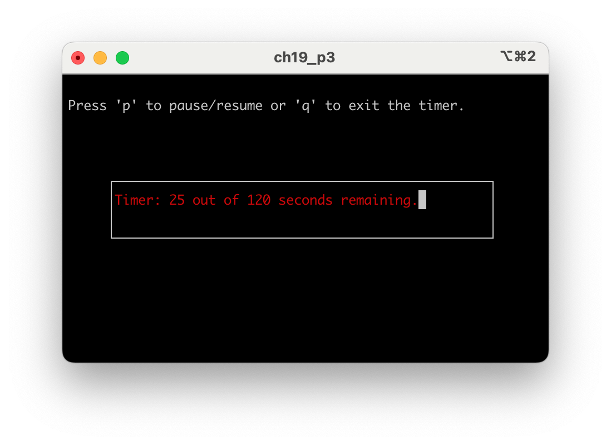

# 19. Γραφικό περιβάλλον διεπαφής

<i>Σύνοψη</i> Διεπαφές γραμμής εντολής (CLIs), γραφικά περιβάλλοντα διεπαφής (GUIs), πλεονεκτήματα και μειονεκτήματα των GUIs, βιβλιοθήκες για κατασκευή GUIs στη C, παράδειγμα εφαρμογής GUI με τη βιβλιοθήκη Nuklear σε Windows, Linux, MacOS, απλές αλληλεπιδράσεις προγράμματος με τον χρήστη με τη βιβλιοθήκη “tinyfiledialogs”, εναλλακτικές προσεγγίσεις για τη δημιουργία γραφικού περιβάλλοντος αλληλεπίδρασης με τον χρήστη.  

<i>Προαπαιτούμενη γνώση</i> Τύποι δεδομένων, είσοδος/έξοδος, δομές επιλογής και επανάληψης, συναρτήσεις, πίνακες, δείκτες, αλφαριθμητικά, διαμερισμός κώδικα, ορίσματα γραμμής εντολών


## 19.1 Εισαγωγή

Τα παραδείγματα κώδικα που έχουν παρουσιαστεί στα προηγούμενα κεφάλαια είναι όλα εφαρμογές κονσόλας (console applications). Ο χρήστης καλείται να εισάγει τιμές εισόδου σε ένα τερματικό και τα αποτελέσματα εκτέλεσης του προγράμματος εμφανίζονται επίσης στο ίδιο τερματικό. Αν και βολικός, αυτός ο τρόπος αλληλεπίδρασης του χρήστη με το πρόγραμμα που εκτελείται έχει περιορισμούς καθώς δεν συμβαδίζει με τα σύγχρονα γραφικά περιβάλλοντα διεπαφής (GUIs, Graphical User Interfaces) που χρησιμοποιούν παράθυρα, λίστες επιλογής τιμών, πεδία εισαγωγής τιμών, πλήκτρα και άλλα στοιχεία ελέγχου που ο χρήστης μπορεί εύκολα να χειριστεί με το ποντίκι και το πληκτρολόγιο του υπολογιστή του. Στο [^1] παρουσιάζεται η ιστορία της ανάπτυξης των διεπαφών υπολογιστικών συσκευών για τους χρήστες από το 1968 μέχρι το 2005, ενώ η περαιτέρω εξέλιξή τους σε συσκευές όπως τα κινητά τηλέφωνα, οι ταμπλέτες, οι φορέσιμες συσκευές και οι έξυπνες συσκευές (τηλεοράσεις, μετρητές κ.λπ.) γίνεται αντιληπτή βιωματικά στην καθημερινότητα των
περισσότερων ανθρώπων. Στην εικόνα 19.1 φαίνεται η μορφή που έχει μια εφαρμογή κονσόλας ή αλλιώς εφαρμογή διεπαφής γραμμής εντολών (εφαρμογή CLI=Command Line Interface) και στην εικόνα 19.2 φαίνεται ένα παράδειγμα εφαρμογής GUI.

<div class="flex">
  <div>
    
    <b> Σχήμα 19.1: </b><i>Παράδειγμα CLI. Πηγή:<a href="https://commons.wikimedia.org/wiki/File:Linux_command-line._Bash._GNOME_Terminal._screenshot.png" target="_blank">https://commons.wikimedia.org/wiki/File:Linux_command-line._Bash._GNOME_Terminal._screenshot.png</a></i>
  </div>
  <div>
    
    <b> Σχήμα 19.2: </b><i>Παράδειγμα GUI. Πηγή:<a href="https://commons.wikimedia.org/wiki/File:UAVCAN_GUI_tool_screenshot.png" target="_blank">https://commons.wikimedia.org/wiki/File:UAVCAN_GUI_tool_screenshot.png</a></i>
  </div>
</div>

Σημαντικά πλεονεκτήματα των GUIs έναντι των CLIs είναι η φιλικότητα προς τον χρήστη και η παρουσίαση πλουσιότερου περιεχομένου (π.χ. εικόνες, διαγράμματα, γραφικά με δυνατότητα αλληλεπίδρασης με τον χρήστη). Εφαρμογές όπως επεξεργαστές κειμένου, λογιστικά φύλλα, λογισμικά παρουσιάσεων, παιχνίδια, λογισμικά επεξεργασίας εικόνας, λογισμικά προσομοιώσεων που ο χρήστης αλληλεπιδρά μαζί τους (π.χ. προσομοιωτής πτήσης) καθώς και άλλες εφαρμογές είναι συνυφασμένες με γραφικά περιβάλλοντα. Ωστόσο, τα GUIs έχουν και μειονεκτήματα, καθώς οι εφαρμογές που χρησιμοποιούν GUIs απαιτούν περισσότερους πόρους υπολογιστή (π.χ. κύκλους ΚΜΕ, μνήμη) για την εκτέλεσή τους έναντι των CLI εφαρμογών, ενώ μπορεί να καθυστερούν τον χειρισμό τους από έμπειρους χρήστες. Επιπλέον, είναι λιγότερο κατάλληλα για αυτοματοποίηση εργασιών και μπορεί η εκμάθηση των προχωρημένων χαρακτηριστικών εφαρμογών GUIs να είναι δύσκολη, γεγονός που δεν διευκολύνεται από συχνές ενημερώσεις που ενδεχομένως αλλάζουν δραστικά τη μορφή της διεπαφής.  
Η ανάπτυξη εφαρμογών GUIs μπορεί να είναι μια απαιτητική εργασία, ειδικά αν πρόκειται για σύνθετες εφαρμογές. Η ύπαρξη εξειδικευμένων βιβλιοθηκών διευκολύνει τη διαδικασία και η χρήση τους είναι ο ενδεδειγμένος τρόπος για την κατασκευή GUIs. Ωστόσο, προκύπτουν θέματα επιλογής των πλέον κατάλληλων βιβλιοθηκών ανάλογα με το είδος της εφαρμογής (π.χ. εμπορική εφαρμογή, επιστημονική εφαρμογή, παιχνίδι και άλλα), θέματα φορητότητας (portability) της εφαρμογής από το ένα σύστημα σε άλλο (π.χ. από Windows σε Linux), θέματα εμφάνισης σύμφωνα με τη μορφή (look and feel) κάθε συστήματος και άλλα. Ορισμένες γλώσσες προγραμματισμού όπως η Python και η Java καθιστούν την κατασκευή GUIs ευκολότερη λόγω της ενσωματωμένης υποστήριξης που διαθέτουν για τέτοιου είδους εφαρμογές. Στη C δεν υπάρχει ενσωματωμένη στη γλώσσα υποστήριξη για κατασκευή εφαρμογών GUIs, αλλά όπως συμβαίνει και για πολλές άλλες ανάγκες (π.χ. επεξεργασία εικόνας, επεξεργασία ήχου, επεξεργασία βίντεο, συμπίεση, επικοινωνίες, βάσεις δεδομένων) η υποστήριξη παρέχεται μέσω εξωτερικών βιβλιοθηκών.   
Οι βιβλιοθήκες που μπορούν να χρησιμοποιηθούν για ανάπτυξη GUI εφαρμογών στη C είναι πολλές. Ένα χαρακτηριστικό που τις διαφοροποιεί αναφέρθηκε ήδη και είναι η υποστήριξη ή μη, εγγενούς (native) look and feel. Native look and feel σημαίνει ότι ακολουθείται ο τρόπος σχεδιασμού παραθύρων και στοιχείων ελέγχου (πλήκτρων, λιστών, πεδίων εισαγωγής τιμών κ.λπ.) που χρησιμοποιεί το σύστημα. Ορισμένες από τις δημοφιλέστερες βιβλιοθήκες της C για GUIs παραθέτονται στην ακόλουθη λίστα:

 * Nuklear (<a href="https://github.com/Immediate-Mode-UI/Nuklear" target="_blank">https://github.com/Immediate-Mode-UI/Nuklear</a>). Εύχρηστη, μικρή βιβλιοθήκη που θα περιγραφεί στη συνέχεια και θα δοθεί παράδειγμα χρήσης της στην παράγραφο 19.2.  
 
 * UP (<a href="http://webserver2.tecgraf.puc-rio.br/iup/" target="_blank">http://webserver2.tecgraf.puc-rio.br/iup/</a>). Επιτρέπει το ίδιο πρόγραμμα να μεταγλωττίζεται και να εκτελείται σε διάφορα συστήματα χωρίς αλλαγές, διαθέτει σχετικά απλό API και προσφέρει native look and feel.

 * GTK+ (<a href="https://www.gtk.org/" target="_blank">https://www.gtk.org/</a>). Η πληρέστερη από τις βιβλιοθήκες GUI που αναφέρονται εδώ, αλλά και η περισσότερο σύνθετη. Προσφέρει native look and feel. Η βιβλιοθήκη GTK+ (GIMP Toolkit) παρέχει μεγάλο αριθμό εργαλείων, στοιχείων ελέγχου, και συναρτήσεων για τη σχεδίαση GUIs. Είναι ευέλικτη και επεκτάσιμη και υποστηρίζει την ανάπτυξη εφαρμογών και σε άλλες γλώσσες προγραμματισμού πέρα από τη C (π.χ. JavaScript, Perl, Python, Rust, Vala).

 * cimgui (<a href="https://github.com/cimgui/cimgui" target="_blank">https://github.com/cimgui/cimgui</a>). Βιβλιοθήκη wrapper για τη βιβλιοθήκη Dear imGui (<a href="https://github.com/ocornut/imgui" target="_blank">https://github.com/ocornut/imgui</a>) που έχει υλοποιηθεί σε C++. Δεν προσφέρει native look and feel.

 * raygui (<a href="https://github.com/raysan5/raygui" target="_blank">https://github.com/raysan5/raygui</a>). Βιβλιοθήκη που έχει αναπτυχθεί ως βοηθητική για τη βιβλιοθήκη δημιουργίας παιχνιδιών raylib. Δεν προσφέρει native look and feel.

 * tinyfiledialogs (<a href="https://github.com/native-toolkit/libtinyfiledialogs" target="_blank">https://github.com/native-toolkit/libtinyfiledialogs</a>). Μικρή βιβλιοθήκη που παρέχει τη δυνατότητα χρήσης πλαισίων διαλόγου (modal windows) για επικοινωνία με τον χρήστη σε προγράμματα C. Θα δοθεί παράδειγμα χρήσης της στην παράγραφο 19.3.


Στο παρόν κεφάλαιο θα χρησιμοποιηθεί η βιβλιοθήκη Nuklear καθώς είναι σχετικά απλή στη χρήση, ενώ όλη η υλοποίησή της βρίσκεται σε ένα «μονολιθικό» αρχείο επικεφαλίδας, το <span class="p-style">nuklear.h</span> που περιέχει μάλιστα ως σχόλια ενσωματωμένες χρήσιμες αναλυτικές οδηγίες χρήσης της. Η Nuklear μπορεί να χρησιμοποιήσει τις cross-platform βιβλιοθήκες απόδοσης γραφικών (rendering) OpenGL2/3, SDL και Allegro, ενώ στα Windows για rendering μπορεί να χρησιμοποιήσει την D3D ή την GDI και στο Linux την Χ11. Το look and feel των εφαρμογών που δημιουργούνται με την Nuklear δεν είναι native. Παραδείγματα εμφάνισης οθονών που έχουν δημιουργηθεί με τη Nuklear φαίνονται στην εικόνα 19.3.


<div style="text-align: center;"><b>Σχήμα 19.3:</b><i> Παραδείγματα οθονών που έχουν δημιουργηθεί με τη βιβλιοθήκη Nuklear. Πηγή: <a href="https://github.com/Immediate-Mode-UI/Nuklear" target="_blank">https://github.com/Immediate-Mode-UI/Nuklear</a></i></div>

## 19.2 Κατασκευή GUIs με τη βιβλιοθήκη Nuklear

Στα παραδείγματα που θα ακολουθήσουν θα χρησιμοποιηθεί η βιβλιοθήκη rendering OpenGL3 και οι βιβλιοθήκες GLFW και GLEW. Η OpenGL παρέχει ένα τυποποιημένο API γραφικών που επιτρέπει στους προγραμματιστές να σχεδιάζουν διδιάστατα και τριδιάστατα γραφικά. H GLFW επιτρέπει τη δημιουργία παραθύρων, τον χειρισμό εισόδου από τον χρήστη και τη ρύθμιση των λεγόμενων OpenGL contexts. Η GLEW επιτρέπει τον χειρισμό διαφόρων επεκτάσεων της OpenGL για πρόσβαση σε προχωρημένα χαρακτηριστικά της. Παρατηρήστε ότι αν χρησιμοποιηθεί κάποια άλλη βιβλιοθήκη rendering όπως η D3D11 ή η SDL, τότε ο κώδικας αλλά και οι απαιτούμενες εγκαταστάσεις επιπλέον λογισμικών αλλάζουν.

### 19.2.1 Εγκατάσταση της Nuklear σε Windows

Ο κώδικας της Nuklear μεταφορτώνεται από το github αποθετήριο <a href="https://github.com/Immediate-Mode-UI/Nuklear" target="_blank">https://github.com/Immediate-Mode-UI/Nuklear</a> σε κάποια θέση του συστήματος, π.χ. <span class="p-style">C:\Nuklear</span>. Στη συνέχεια μεταφορτώνεται η βιβλιοθήκη GLFW ως προ-μεταγλωττισμένη (pre-compiled binary) από τη σελίδα <a href="https://www.glfw.org/download.html" target="_blank">https://www.glfw.org/download.html</a> επιλέγοντας “64-bit Windows binaries”. Το αρχείο που μεταφορτώνεται έχει όνομα της μορφής <span class="p-style">glfw‐3.3.8.bin.WIN64.zip</span> (η έκδοση μπορεί να διαφέρει από τη 3.3.8) και αποσυμπιέζεται σε κάποια θέση του συστήματος, π.χ. <span class="p-style">C:\glfw‐3.3.8.bin.WIN64</span>. Τα αρχεία που πρόκειται να χρησιμοποιηθούν βρίσκονται στον κατάλογο <span class="p-style">C:\Nuklear\lib‐mingw‐w64</span>. Στη συνέχεια, μεταφορτώνεται η βιβλιοθήκη GLEW από το <a href="https://glew.sourceforge.net/" target="_blank">https://glew.sourceforge.net/</a> επιλέγοντας “Binaries Windows 32-bit and 64-bit”. Το αρχείο που μεταφορτώνεται έχει όνομα της μορφής <span class="p-style">glew‐2.1.0‐win32.zip</span> (η έκδοση μπορεί να διαφέρει από τη 2.1.0) και αποσυμπιέζεται σε κάποια θέση, π.χ. <span class="p-style">C:\glew‐2.1.0.ß</span>

### 19.2.2 Εγκατάσταση της Nuklear σε Windows

Ο κώδικας της Nuklear μεταφορτώνεται από το github αποθετήριο <a href="https://github.com/Immediate-Mode-UI/Nuklear" target="_blank">https://github.com/Immediate-Mode-UI/Nuklear</a> σε κάποια θέση του συστήματος, π.χ. <span class="p-style">~/Nuklear</span>. H εγκατάσταση των βιβλιοθηκών GLFW, GLEW καθώς και του βοηθητικού εργαλείου pkg-config που εντοπίζει διαδρομές του συστήματος όπου βρίσκονται αρχεία επικεφαλίδων και αρχεία βιβλιοθηκών για λογισμικά που είναι εγκατεστημένα στο σύστημα γίνεται με τις ακόλουθες εντολές (π.χ. για Ubuntu 22.04 LTS):

```
$ sudo apt update
$ sudo apt install pkg‐config
$ sudo apt install libglfw3 ‐dev
$ sudo apt install libglew ‐dev
```

### 19.2.3 Εγκατάσταση της Nuklear σε MacOS

Παρόμοια με την εγκατάσταση για Linux είναι και η εγκατάσταση των απαιτούμενων λογισμικών σε MacOS. Αρχικά, μεταφορτώνεται ο κώδικας της Nuklear από το github αποθετήριο <a href="https://github.com/Immediate-Mode-UI/Nuklear" target="_blank">https://github.com/Immediate-Mode-UI/Nuklear</a> σε κάποια θέση του συστήματος, π.χ. <span class="p-style">~/Nuklear</span>. Στη συνέχεια χρησιμοποιείται το brew που είναι ένα πρόγραμμα διαχείρισης εφαρμογών για το MacOS (<a href="https://brew.sh/index_el" target="_blank">https://brew.sh/index_el</a>). H εγκατάσταση των βιβλιοθηκών GLFW, GLEW και του pkg-config γίνεται με τις ακόλουθες εντολές:

```
$ brew update
$ brew install pkg‐config
$ brew install glfw
$ brew install glew
```

### 19.2.4 Παράδειγμα GUI εφαρμογής - ένας απλός μετρητής

Στο παράδειγμα που ακολουθεί θα υλοποιηθεί μια απλή GUI εφαρμογή, με ένα πεδίο κειμένου και ένα πλήκτρο. Αρχικά, το πεδίο κειμένου θα περιέχει την τιμή 0 και κάθε φορά που θα πιέζεται το πλήκτρο, η τιμή στο πεδίο κειμένου θα αυξάνεται κατά 1. Η εφαρμογή θα μπορεί να μεταγλωττιστεί και να εκτελεστεί και στα τρία πλέον διαδεδομένα λειτουργικά συστήματα (Windows, Linux, MacOS), θα είναι δηλαδή cross-platform. Τα αρχεία της εφαρμογής θα βρίσκονται σε έναν κατάλογο και φαίνονται στο Σχήμα 19.4.


<div style="text-align: center;"><b>Σχήμα 19.4:</b><i> Αρχεία απλού GUI μετρητή, που χρησιμοποιούνται για μεταγλώττιση και εκτέλεση σε Windows, Linux και MacOS, με τη βιβλιοθήκη Nuklear.</i></div>

Παρατηρήστε ότι για καθένα από τα λειτουργικά συστήματα Windows, Linux (Ubuntu 22.04 LTS) και MacOS υπάρχει ένα makefile που μπορεί να χρησιμοποιηθεί για τη μεταγλώττιση του κώδικα. Τα αρχεία <span class="p-style">nuklear.h</span> και <span class="p-style">nuklear_glfw_dl3.h</span> περιλαμβάνονται στον κώδικα της βιβλιοθήκης Nuklear, που έχει μεταφορτωθεί από το GitHub, στον κατάλογο ρίζας και στον υποκατάλογο <span class="p-style">demo\glfw_opengl3</span>, αντίστοιχα. Στη λίστα των αρχείων συμπεριλαμβάνεται και το αρχείο <span class="p-style">glew32.dll</span> που απαιτείται για εκτέλεση της εφαρμογής στα Windows και που μπορεί να αντιγραφεί από τον υποκατάλογο εγκατάστασης της GLEW, π.χ. <span class="p-style">C:\glew‐2.1.0\lib\Release\x64</span>. Στη συνέχεια παρατίθεται ο κώδικας 19.1 του αρχείου <span class="p-style">main.cmain.c</span>:

```{.c title="Κώδικας 19.1: ch19_p1/main.c - υλοποίηση GUI μετρητή με τη βιβλιοθήκη Nuklear." linenums="1"}
--8<-- "src/ch19_p1/main.c"
```

Ο κώδικας έχει διαμεριστεί σε 3 συναρτήσεις που καλούνται από τη <span class="p-style">main()</span>, την <span class="p-style">init()</span>, τη <span class="p-style">main_loop()</span> και την <span class="p-style">cleanup()</span>. Η <span class="p-style">init()</span> αρχικοποιεί τη GLFW και τη GLEW και δημιουργεί το αντικείμενο context. Η σχεδίαση του GUI γίνεται στη <span class="p-style">main_loop()</span> στις γραμμές 63 έως και 72 και περιλαμβάνει τη δημιουργία μιας γραμμής υποδοχής στοιχείων ελέγχου με ύψος 30 pixels και θέσεις για 2 στοιχεία ελέγχου. Τα στοιχεία ελέγχου που προστίθενται είναι μια ετικέτα (<span class="p-style">nk_label</span>) και ένα πλήκτρο (<span class="p-style">nk_button_label</span>). Στις γραμμές 67 έως και 70 υπάρχει ο έλεγχος και οι εντολές που εκτελούνται για κάθε φορά που πατιέται το πλήκτρο. Τέλος η <span class="p-style">cleanup()</span> απελευθερώνει όλους τους πόρους που έχουν δεσμευθεί.

<i><span class="p-style">Μεταγλώττιση και εκτέλεση σε Windows</span></i> Η μεταγλώττιση και εκτέλεση της εφαρμογής στα Windows με
τον μεταγλωττιστή MinGW γίνεται με τις ακόλουθες εντολές:

```
> gcc main.c ‐std=c99 ‐pedantic ‐IC:\glew ‐2.1.0\include
    ↪ ‐IC:\glfw ‐3.3.8.bin.WIN64\include ‐LC:\glfw ‐3.3.8.bin.WIN64\lib‐mingw‐w64
    ↪ ‐LC:\glew ‐2.1.0\lib\Release\x64 ‐lglfw3 ‐lopengl32 ‐lgdi32 ‐lm ‐lGLU32 ‐lGLEW32
    ↪ ‐o counter.exe
> counter.exe
```

Εναλλακτικά, εφόσον έχει εγκατασταθεί το εργαλείο <span class="p-style">make</span>, η μεταγλώττιση και εκτέλεση μπορεί να γίνει χρησιμοποιώντας το αρχείο <span class="p-style">Makefile_win.mk</span> (κώδικας 19.2), όπως στη συνέχεια:

```
> make ‐f Makefile_windows.mk
> counter.exe
```

```{.mk title="Κώδικας 19.2: ch19_p1/Makefile_win.mk, makefile για Windows." linenums="1"}
--8<-- "src/ch19_p1/Makefile_win.mk"
```

<i><span class="p-style">Μεταγλώττιση και εκτέλεση σε Linux</span></i>  Η μεταγλώττιση και εκτέλεση της εφαρμογής στο Linux γίνεται με
τις ακόλουθες εντολές:

```
$ make ‐f Makefile_linux.mk
$ ./counter

```
Τα περιεχόμενα του αρχείου Makefile_linux.mk είναι τα ακόλουθα:
```

```{.mk title="Κώδικας 19.3: ch19_p1/Makefile_linux.mk - makefile για Linux." linenums="1"}
--8<-- "src/ch19_p1/Makefile_linux.mk"
```

<i><span class="p-style">Μεταγλώττιση και εκτέλεση σε MacOS</span></i>  Η μεταγλώττιση και εκτέλεση της εφαρμογής στο MacOS γίνεται
με τις ακόλουθες εντολές:

```
$ make ‐f Makefile_osx.mk
$ ./counter
```

Τα περιεχόμενα του αρχείου Makefile_osx.mk είναι τα ακόλουθα 19.4:

```{.mk title="Κώδικας 19.4: ch19_p1/Makefile_osx.mk - makefile για MacOS." linenums="1"}
--8<-- "src/ch19_p1/Makefile_osx.mk"
```

Tο αποτέλεσμα της εκτέλεσης φαίνεται στο Σχήμα 19.5. Κάθε φορά που πιέζεται το πλήκτρο <span class="p-style">Count</span> στην οθόνη της εφαρμογής η τιμή που αναγράφεται στην ετικέτα αυξάνεται κατά ένα. Αν και το παράδειγμα έχει εκτελεστεί σε MacOS, η εμφάνιση στο εσωτερικό των παραθύρων θα είναι η ίδια και σε Linux και σε Windows, καθώς, όπως ήδη αναφέρθηκε, η Nuklear δεν υποστηρίζει native look and feel.

<div class="flex">
  <div>
    
  </div>
  <div>
    
  </div>
  <div>
    
  </div>
</div>

<div style="text-align: center;"><b> Σχήμα 19.5: </b><i>GUI για την εφαρμογή Counter.</i></div>

## 19.3 Η βιβλιοθήκη tinyfiledialogs

Μια απλή λύση στην περίπτωση που η αλληλεπίδραση με τον χρήστη αφορά πλαίσια διαλόγου (π.χ. εμφάνισης μηνυμάτων, λήψης απαντήσεων από τον χρήστη, επιλογής διαδρομής και αρχείου στο σύστημα αρχείων) είναι η βιβλιοθήκη tinyfiledialogs. Στο παράδειγμα που ακολουθεί παρουσιάζονται μερικές από τις βασικές δυνατότητες της βιβλιοθήκης καθώς ζητείται από τον χρήστη να απαντήσει σε ένα ερώτημα και η απάντησή του καταγράφεται σε ένα αρχείο κειμένου. Στην πορεία χρησιμοποιούνται πλαίσια διαλόγου εμφάνισης μηνυμάτων  (<span class="p-style">tinyfd_messageBox</span>), ένα πλαίσιο διαλόγου εισόδου τιμής από τον χρήστη (<span class="p-style">tinyfd_inputBox</span>), μια ειδοποίηση (<span class="p-style">tinyfd_notifyPopup</span>) και ένα πλαίσιο επιλογής θέσης αποθήκευσης αρχείου στο σύστημα αρχείων. Τα αρχεία που θα χρειαστούν για το παράδειγμα φαίνονται στο Σχήμα 19.6.


<div style="text-align: center;"><b> Σχήμα 19.6: </b><i>Αρχεία που χρησιμοποιούνται στο παράδειγμα με τη βιβλιοθήκη tinyfiledialogs.</i></div>

Τα αρχεία <span class="p-style">tinyfiledialogs.c</span> και <span class="p-style">tinyfiledialogs.h</span> μπορούν να μεταφορτωθούν από το <a href="https://github.com/native-toolkit/libtinyfiledialogs" target="_blank">https://github.com/native-toolkit/libtinyfiledialogs</a>. Στη συνέχεια παρατίθεται στον κώδικα 19.5 ο κώδικας του αρχείου <span class="p-style">main.c</span>.


```{.c title="Κώδικας 19.5: ch19_p2/main.c - υλοποίηση διαλόγου με τον χρήστη μετρητή με τη βιβλιοθήκη tinyfiledialogs." linenums="1"}
--8<-- "src/ch19_p2/main.c"
```

Η μεταγλώττιση και εκτέλεση σε Windows με τον μεταγλωττιστή MinGW γίνεται με τις ακόλουθες εντολές (1).
{ .annotate }

1. Αν η μεταγλώττιση επιστρέψει σφάλμα ότι δεν αναγνωρίζει το wchar_t, τότε θα πρέπει να συμπεριληφθεί το αρχείο επικεφαλίδας stddef.h στην αρχή του tinyfiledialogs.h


```
> gcc ‐o main.exe main.c tinyfiledialogs.c ‐LC:/mingw/lib ‐lcomdlg32 ‐lole32
> main.exe
```

Η μεταγλώττιση και εκτέλεση σε Linux και σε MacOS γίνεται με τις ακόλουθες εντολές:

```
$ gcc ‐o main main.c tinyfiledialogs.c
$ ./main
```

Ένα παράδειγμα εκτέλεσης του κώδικα (σε MacOS) φαίνεται στις εικόνες 19.7, 19.8 και 19.9. Η απάντηση του χρήστη στην ερώτηση “What is the best age to start learning C?”, που εισάγει σε ένα πλαίσιο διαλόγου εισαγωγής κειμένου, αποθηκεύεται σε ένα αρχείο, με το όνομα και τη διαδρομή του στο σύστημα αρχείων να προσδιορίζονται από τον χρήστη.

<div class="flex">
  <div>
    
    <b> Σχήμα 19.7: </b><i>Πλαίσιο διαλόγου εμφάνισης μηνύματος με δυνατότητα απάντησης (Yes/No) από τον χρήστη.</i>
  </div>
  <div>
    
    <b> Σχήμα 19.8: </b><i>Πλαίσιο διαλόγου εισαγωγής απάντησης από τον χρήστη.</i>
  </div>
  <div>
    
    <b> Σχήμα 19.9: </b><i>Πλαίσιο επιλογής διαδρομής και εισαγωγής ονόματος αρχείου για αποθήκευσή του στο σύστημα αρχείων.</i>
  </div>
</div>

## 19.4 Εναλλακτικές προσεγγίσεις στη δημιουργία περιβαλλόντων αλληλεπίδρασης με το χρήστη

Μια εναλλακτική προσέγγιση στην ανάπτυξη περιβάλλοντος αλληλεπίδρασης με τον χρήστη αποτελεί η βιβλιοθήκη ncurses (<a href="https://invisible-island.net/ncurses/ncurses.html" target="_blank">https://invisible-island.net/ncurses/ncurses.html</a>). Παρόμοια με τις εφαρμογές CLI, δεν χρησιμοποιεί γραφικά στοιχεία ελέγχου και εκτελείται σε περιβάλλον τερματικού. Ωστόσο, προσφέρει τη δυνατότητα κατασκευής εφαρμογών με παράθυρα, μενού και πλήκτρα όπως στην εικόνα 19.10.


<div style="text-align: center;"><b> Σχήμα 19.10: </b><i>Παράδειγμα οθόνης εφαρμογής που έχει κατασκευαστεί με τη βιβλιοθήκη ncurses. Πηγή: By Attys - Own work, CC BY-SA 3.0, <a href="https://commons.wikimedia.org/w/index.php?curid=15696679" target="_blank">https://commons.wikimedia.org/w/index.php?curid=15696679</a></i></div>

Ένα απλό παράδειγμα χρήσης της ncurses παρουσιάζεται στη συνέχεια. Ο κώδικας 19.6 εμφανίζει στο κέντρο της οθόνης, μέσα σε πλαίσιο, ένα χρονόμετρο που μετρά αντίστροφα μέχρι να εξαντληθεί ο χρόνος (σε λεπτά) που έχει περάσει ως όρισμα γραμμής εντολών κατά την εκτέλεση. Καθώς το χρονόμετρο μετρά αντίστροφα, όταν ο μετρητής δείχνει 30 ή λιγότερα δευτερόλεπτα, το χρώμα του αλλάζει σε κόκκινο.

```{.c title="Κώδικας 19.6: ch19_p3.c - υλοποίηση χρονομετρητή με τη βιβλιοθήκη ncurses." linenums="1"}
--8<-- "src/ch19_p3.c"
```

Η μεταγλώττιση και εκτέλεση του προγράμματος γίνεται ως εξής:

```
$ gcc ‐o ch19_p3 ch19_p3.c ‐lncurses
$ ./ch19_p3 2
```

Ο χρήστης μπορεί να ορίσει το χρονικό διάστημα μέτρησης σε λεπτά (στο παραπάνω παράδειγμα εκτέλεσης η τιμή αυτή είναι 2 που αντιστοιχεί σε 120 δευτερόλεπτα). Κατά την εκτέλεση του προγράμματος, πατώντας το πλήκτρο <span class="p-style">p</span> ο μετρητής τίθεται σε παύση ή ξεκινά αν είναι ήδη σε παύση, ενώ με το πλήκτρο <span class="p-style">q</span> το πρόγραμμα τερματίζει την εκτέλεσή του πρόωρα. Ένα παράδειγμα εκτέλεσης φαίνεται στα Σχήματα 19.11 και 19.12.


<div class="flex">
  <div>
    
    <b> Σχήμα 19.11: </b><i>Αντίστροφη μέτρηση χρόνου.</i>
  </div>
  <div>
    
    <b> Σχήμα 19.12: </b><i>Αλλαγή χρώματος σε κόκκινο στα τελευταία 30 δευτερόλεπτα.</i>
  </div>
</div>

Μια άλλη εναλλακτική προσέγγιση δημιουργίας γραφικού περιβάλλοντος αλληλεπίδρασης με τον χρήστη είναι να χρησιμοποιηθεί η Python ως γλώσσα με την οποία θα κατασκευαστεί το GUI (το frontend) και η «λογική» της εφαρμογής (το backend) να υλοποιηθεί σε C. Η Python διαθέτει πολλά GUI frameworks (π.χ. Tkinter, wxPython, PyQt5, Kivy, PySide2) που επιτρέπουν την εύκολη δημιουργία GUIs. Στο Κεφάλαιο 20 περιγράφονται τρόποι κλήσης κώδικα C από την Python.


## 19.5 Ασκήσεις

***Άσκηση 1***  
Η μικρή εφαρμογή GUI μετρητή που υλοποιήθηκε στην παράγραφο 19.2.4, αποτελεί την πρώτη και απλούστερη από τις 7 εργασίες κατασκευής παραθυρικών εφαρμογών που περιγράφονται στην ιστοσελίδα 7GUIs [^2]. Υλοποιήστε τη δεύτερη από τις εργασίες (Temperature Converter) με τη C και τη βιβλιοθήκη Nuklear.

***Άσκηση 2***  
Κατασκευάστε μια εφαρμογή που το σύστημα να επιλέγει έναν τυχαίο ακέραιο αριθμό στο διάστημα [1,100] και ο χρήστης να προσπαθεί να τον μαντέψει. Να ζητείται επαναληπτικά από τον χρήστη μέσω ενός παραθύρου διαλόγου εισαγωγής τιμής να μαντέψει την τιμή. Αν πετύχει την τιμή, να εμφανίζεται παράθυρο μηνύματος με το μήνυμα «συγχαρητήρια» και το πλήθος των προσπαθειών που χρειάστηκε. Αν δεν πετύχει την τιμή, να εμφανίζει μήνυμα που να τον πληροφορεί για το εάν η τιμή που εισήγαγε είναι μικρότερη ή μεγαλύτερη από τη ζητούμενη τιμή. Για τα παράθυρα διαλόγου με τον χρήστη, να χρησιμοποιηθεί η βιβλιοθήκη tinyfiledialogs.

***Άσκηση 3***  
Xρησιμοποιώντας τη βιβλιοθήκη ncurses γράψτε ένα πρόγραμμα που να εμφανίζει ένα μενού επιλογών όπως στο Σχήμα 19.13.

<div style="text-align: center;"><b> Σχήμα 19.13: </b><i>Επιθυμητή έξοδος του προγράμματος που θα προκύψει ως λύση της Άσκησης 3.</i></div>

Ο χρήστης να μπορεί να κινείται στο μενού με τα πλήκτρα πάνω και κάτω και πατώντας το πλήκτρο enter να εμφανίζει μήνυμα σχετικά με την επιλογή που έκανε ή αν η επιλογή είναι το Exit το πρόγραμμα να τερματίζει. Μάθετε περισσότερα για το ncurses στο [^3].

***Άσκηση 4***  
Υλοποιήστε μια GUI εφαρμογή που να επιτρέπει τη δημιουργία, διαγραφή και προβολή εργασιών. Για κάθε εργασία να καταγράφεται ο τίτλος της και η ημερομηνία στην οποία θα πρέπει να έχει ολοκληρωθεί. Η προβολή των εργασιών να τις εμφανίζει σε μια λίστα, σε φθίνουσα ημερολογιακή σειρά. Χρησιμοποιήστε τη βιβλιοθήκη Nuklear.


[^1]: Jeremy Reimer. “A History of the GUI”. Στο: <i>Ars Technica 5 </i>(2005), σσ. 1–17.  

[^2]: <i>7GUIs: A GUI Programming Benchmark.</i> <a href="https://eugenkiss.github.io/7guis/" target="_blank">https://eugenkiss.github.io/7guis/</a>. Accessed: 2023-06-01.  

[^3]: E. S. Raymond, Z. M. Ben-Halim και Dickey T.<i> Writing Programs with NCURSES.</i> <a href="https://invisible-island.net/ncurses/ncurses-intro.html" target="_blank">https://invisible-island.net/ncurses/ncurses-intro.html</a>. Accessed: 2023-06-01.