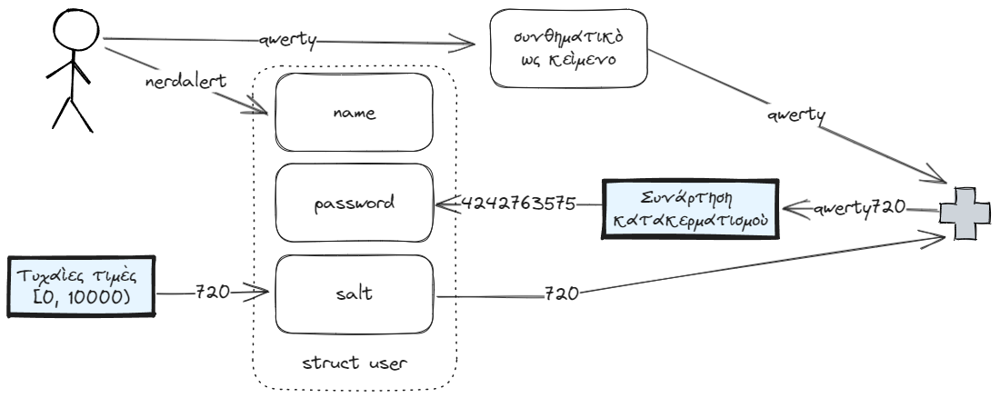
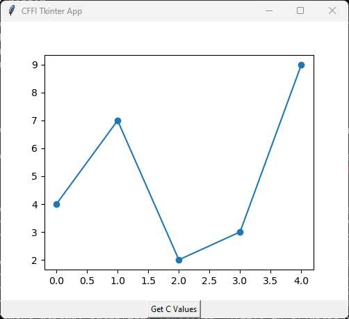

# 20. Αλληλεπίδραση της C με την Python

<i>Σύνοψη</i> Κλήση κώδικα C από κώδικα Python, η βιβλιοθήκη ctypes, η βιβλιοθήκη CFFI, CFFI/ABI, CFFI/API, γραφικό περιβάλλον διεπαφής με Python που συμπληρώνεται με αποτελέσματα που παράγονται από κώδικα C, κλήση κώδικα Python από κώδικα C.  

<i>Προαπαιτούμενη γνώση</i> Τύποι δεδομένων, είσοδος/έξοδος, δομές επιλογής και επανάληψης, συναρτήσεις, πίνακες, δείκτες, αλφαριθμητικά, διαμερισμός κώδικα, βασικές γνώσεις προγραμματισμού σε Python.

## 20.1 Εισαγωγή 

Μερικές φορές είναι επιθυμητό να κληθεί κώδικας που έχει γραφεί στη γλώσσα C μέσα από προγράμματα Python. Αυτό μπορεί να συμβεί διότι επιθυμούμε να χρησιμοποιήσουμε βιβλιοθήκες της C για τις οποίες δεν υπάρχουν διεπαφές χρήσης τους μέσω της Python ή μπορεί να πρόκειται για κώδικα σε C που έχουμε αναπτύξει οι ίδιοι. Τρεις διαφορετικοί τρόποι για να επιτευχθεί αυτό είναι: α) με την ενσωματωμένη στην Python βιβλιοθήκη ctypes [^1], β) με τη βιβλιοθήκη CFFI [^2] και γ) με χρήση των native C/C++ extensions [^3]. Ο τρίτος τρόπος είναι χαμηλότερου επιπέδου, δίνει πολλές δυνατότητες αλλά είναι σχετικά πολύπλοκος, οπότε συνήθως προτιμούνται οι δύο πρώτοι.  
Κίνητρο επέκτασης της Python με C κώδικα μπορεί να αποτελέσει η επιθυμία επιτάχυνσης της «αργής» εκτέλεσης της Python. Η ενσωμάτωση κώδικα C σε προγράμματα Python μπορεί να οδηγήσει σε σημαντικές επιταχύνσεις αλλά και να δώσει τη δυνατότητα αποφυγής του περιορισμού της Python (CPython(1)) που είναι γνωστός ως GIL (Global Interpreter Lock) και επιτρέπει μόνο σε ένα νήμα να εκτελείται σε κάθε χρονική στιγμή. Ωστόσο, ο ενδεδειγμένος τρόπος επιτάχυνσης της Python είναι μέσω βιβλιοθηκών της ίδιας της γλώσσας όπως η numpy, η numba, η multiprocessing και πολλές άλλες. Ένας άλλος τρόπος επιτάχυνσης του κώδικα Python είναι η συγγραφή προγραμμάτων σε Cython (<a href="https://cython.org/" target="_blank">https://cython.org/</a>) που αποτελεί μια γλώσσα υπερσύνολο της Python. Ο Cython κώδικας μεταγλωττίζεται σε C και εκτελείται με υψηλή ταχύτητα.
{ .annotate }

1. CPython είναι ο προκαθορισμένος byte-code διερμηνευτής της Python, που έχει γραφεί σε C.

Σπανιότερα, μπορεί να προκύψει ανάγκη ενσωμάτωσης κώδικα Python σε κώδικα C. Και αυτό μπορεί να γίνει σχετικά εύκολα, καθώς η Python παρέχει το αρχείο επικεφαλίδας <span class="p-style">Python.h</span>, που περιλαμβάνει όλες τις απαιτούμενες δηλώσεις για την ενσωμάτωση του διερμηνευτή της σε προγράμματα C.  
Αξίζει επίσης να αναφερθεί το λογισμικό SWIG (Simplified Wrapper and Interface Generator, <a href="https://www.swig.org/" target="_blank">https://www.swig.org/</a>) που αποτελεί έναν ακόμη τρόπο διασύνδεσης προγραμμάτων που είναι γραμμένα σε C (ή σε C++) με την Python καθώς και με πολλές άλλες γλώσσες υψηλού επιπέδου (π.χ. Javascript, Perl, PHP, Tcl, Ruby, Java, C#, Go).

## 20.2 Κλήση κώδικα C μέσα από κώδικα Python

Η Python είναι μια ιδιαίτερα δημοφιλής και ισχυρή γλώσσα προγραμματισμού. Κατά την ανάπτυξη μιας εφαρμογής σε Python μπορεί να παρουσιαστεί το σενάριο όπου μια επιθυμητή λειτουργία έχει ήδη υλοποιηθεί με αξιόπιστο C κώδικα. Για να αποφευχθεί η συγγραφή εκ νέου του κώδικα στην Python, μπορεί να χρησιμοποιηθεί απευθείας ο διαθέσιμος κώδικας C.

<i>Παράδειγμα κώδικα σε C</i> Ως παράδειγμα κώδικα C που θα κληθεί από την Python θα χρησιμοποιηθεί κώδικας που ορίζει και χρησιμοποιεί μια δομή και κάποιες συναρτήσεις. Η δομή αφορά υποθετικούς χρήστες και έχει ως πεδία το <span class="p-style">name</span> (όνομα χρήστη), το <span class="p-style">password</span> (συνθηματικό) και το <span class="p-style">salt</span> (αλάτι, που μεταφορικά σημαίνει κάτι πρόσθετο στα δεδομένα) που ο ρόλος του θα διευκρινιστεί στη συνέχεια. Ο χρήστης θα εισάγει όνομα και συνθηματικό ως λεκτικά και το συνθηματικό θα αποθηκεύεται ως η κατακερματισμένη τιμή της συνένωσης του συνθηματικού και του <span class="p-style">salt</span>, που εδώ είναι μια τυχαία ακέραια τιμή από το 0 μέχρι το 10000. Η τιμή του <span class="p-style">salt</span> επίσης αποθηκεύεται στη δομή και είναι ένας τρόπος έτσι ώστε η τιμή κατακερματισμού που αποθηκεύεται για το συνθηματικό να μην προκύπτει απευθείας από την εφαρμογή της συνάρτησης κατακερματισμού στο συνθηματικό που δίνεται ως λεκτικό. Αυτό συμβαίνει διότι η τιμή κατακερματισμού δημιουργείται για το συνθηματικό με προσαρτημένο στο τέλος του το <span class="p-style">salt</span>. Ένα παράδειγμα εισαγωγής των δεδομένων στη δομή <span class="p-style">user</span> φαίνεται στο Σχήμα 20.1. Η συνάρτηση <span class="p-style">jhash()</span> αποτελεί υλοποίηση της συνάρτησης κατακερματισμού του Jenkins [^4] και δέχεται ως ορίσματα ένα λεκτικό και το μήκος του και επιστρέφει μια ακέραια τιμή 32 bits(1). Επιπλέον, υπάρχει η συνάρτηση <span class="p-style">jhash_w()</span>, που αποτελεί έναν συντομότερο τρόπο κλήσης της <span class="p-style">jhash()</span>, που δέχεται ως όρισμα μόνο το λεκτικό για το οποίο ζητείται η τιμή κατακερματισμού του. Συναρτήσεις αυτής της μορφής καλούνται συναρτήσεις wrappers (περιτυλίγματα).
{ .annotate }

1. Τυπικά θα χρησιμοποιούνταν μια κρυπτογραφική συνάρτηση κατακερματισμού, αλλά για λόγους απλότητας χρησιμοποιείται η <span class="p-style">jhash()</span>.



<div style="text-align: center;"><b> Σχήμα 20.1: </b><i>Παράδειγμα αποθήκευσης τιμών στη δομή user.</i></div>


Ο κώδικας C περιλαμβάνεται σε ένα αρχείο επικεφαλίδας (κώδικας 20.1), ένα αρχείο με τους ορισμούς των συναρτήσεων (κώδικας 20.2) και ένα αρχείο οδηγό (κώδικας 20.3) από το οποίο ξεκινά η εκτέλεση. Ο κώδικας των τριών αρχείων παρουσιάζεται στη συνέχεια:

```{.c title="Κώδικας 20.1: ch20_blackbox.h - δήλωση της δομής user και των συναρτήσεων jhash() και jhash_w()." linenums="1"}
--8<-- "src/ch20_blackbox.h"
```

```{.c title="Κώδικας 20.2: ch20_blackbox.c - ορισμός συναρτήσεων jhash() και jhash_w()." linenums="1"}
--8<-- "src/ch20_blackbox.c"
```

```{.c title="Κώδικας 20.3: ch20_main.c - πρόγραμμα οδηγός." linenums="1"}
--8<-- "src/ch20_main.c"
```

Το πρόγραμμα οδηγός ch20_main.c δημιουργεί τρεις υποθετικούς χρήστες χρησιμοποιώντας τυχαίες τιμές για τα salts, ζητά να εισαχθεί όνομα χρήστη και συνθηματικού και εμφανίζει μήνυμα σχετικά με το εάν ο συνδυασμός ονόματος χρήστη και συνθηματικού είναι σωστός ή όχι.

Ακολουθεί η μεταγλώττιση και η εκτέλεση του κώδικα:

```
$ gcc ch20_blackbox.c ch20_main.c ‐o ch20_main
$ ./ch20_main
user = daredevil , password = 3851113929 salt = 6234
user = happyhippo , password = 1996416210 salt = 2698
user = nerdalert , password = 4242763575 salt = 720
Enter user name: daredevil
Enter the password of user daredevil: 12345
LOGIN SUCCESS
```

Στη συνέχεια θα υλοποιηθεί στην Python κώδικας που θα χρησιμοποιεί τη δομή <span class="p-style">user</span> και τις συναρτήσεις <span class="p-style">jhash()</span> και <span class="p-style">jhash_w()</span> του κώδικα της C και θα έχει την ίδια λειτουργικότητα με το πρόγραμμα σε C. Το ίδιο παράδειγμα θα υλοποιηθεί με τη βιβλιοθήκη ctypes και σε δύο ακόμα εκδόσεις (ABI και API) με τη βιβλιοθήκη CFFI.  
Τόσο για το ctypes όσο και για την έκδοση CFFI/ΑΒΙ θα χρειαστεί να δημιουργηθεί η βιβλιοθήκη C που θα περιέχει τις υλοποιήσεις των συναρτήσεων και τη δήλωση της δομής. Αυτό γίνεται με την ακόλουθη εντολή που δημιουργεί τη βιβλιοθήκη <span class="p-style">blackbox</span> στο αρχείο <span class="p-style">libblackbox.so</span> για Linux:

```
$ gcc ‐shared ‐o libblackbox.so ch20_blackbox.c ‐fPIC
```

Από τη στιγμή που έχει δημιουργηθεί η βιβλιοθήκη blackbox, o κώδικας μπορεί να μεταγλωττιστεί και να εκτελεστεί ως εξής:

```
$ gcc ch20_main.c ‐Wl,‐rpath='${ORIGIN}' ‐L. ‐lblackbox ‐o ch20_main
$ ./ch20_main
user = daredevil , password = 3851113929 salt = 6234
user = happyhippo , password = 1996416210 salt = 2698
user = nerdalert , password = 4242763575 salt = 720
Enter user name: daredevil
Enter the password of user daredevil: 54321
LOGIN FAIL
```

Η εντολή μεταγλώττισης και σύνδεσης δεν μεταγλωττίζει πλέον τον πηγαίο κώδικα <span class="p-style">ch20_blackbox.c</span>, που ορίζει τις συναρτήσεις <span class="p-style">jhash()</span> και <span class="p-style">jhash_w()</span>, αλλά συνδέει το εκτελέσιμο του τελικού προγράμματος με τον εκτελέσιμο κώδικα που βρίσκεται στη δυναμική βιβλιοθήκη <span class="p-style">libblackbox.so</span> που έχει δημιουργηθεί. Ο διακόπτης <span class="p-style">‐Wl</span> δίνει την οδηγία να περάσουν οι επιλογές που ακολουθούν στον συνδέτη. Η επιλογή <span class="p-style">‐rpath='${ORIGIN}'</span> ορίζει ως βασική διαδρομή στην οποία θα αναζητηθούν βιβλιοθήκες κατά την εκτέλεση, τον κατάλογο από όπου γίνεται η εκτέλεση του προγράμματος. Ο διακόπτης <span class="p-style">‐L</span>. δίνει την οδηγία να αναζητηθούν βιβλιοθήκες στον τρέχοντα κατάλογο. Ο διακόπτης <span class="p-style">‐lblackbox</span> καθορίζει ότι η σύνδεση θα γίνει με μια βιβλιοθήκη με όνομα <span class="p-style">libblackbox</span> (το <span class="p-style">lib</span> στην αρχή του ονόματος εννοείται, οπότε το όνομα είναι μόνο <span class="p-style">blackbox</span>). Αυτό σημαίνει ότι η βιβλιοθήκη θα πρέπει να βρίσκεται σε ένα αρχείο με όνομα <span class="p-style">libblackbox.so</span> για δυναμική βιβλιοθήκη ή με όνομα <span class="p-style">libblackbox.a</span> για στατική βιβλιοθήκη (στο συγκεκριμένο παράδειγμα η βιβλιοθήκη είναι δυναμική).  
Για τους κώδικες Python που θα ακολουθήσουν τα στοιχεία υποθετικών χρηστών έχουν τοποθετηθεί στο αρχείο <span class="p-style">ch20_main_data.py</span> (κώδικας 20.4), έτσι ώστε να μπορεί να γίνει εύκολα import όπου χρειάζεται.

```{.py title="Κώδικας 20.4: ch20_main_data.py - κώδικας Python που ορίζει δεδομένα υποθετικών χρηστών." linenums="1"}
--8<-- "src/ch20_main_data.py"
```

### 20.2.1 Η βιβλιοθήκη ctypes

Η ctypes είναι μια εύχρηστη βιβλιοθήκη που επιτρέπει σε προγράμματα Python να προσπελαύνουν δομές και να καλούν συναρτήσεις που έχουν οριστεί σε δυναμικές βιβλιοθήκες της γλώσσας C. Η χρήση της ctypes σε έναν κώδικα Python συνήθως ξεκινά με φόρτωση μιας δυναμικής βιβλιοθήκης και τη δήλωση του τύπου ορισμάτων και του τύπου επιστροφής για τις συναρτήσεις της βιβλιοθήκης που πρόκειται να χρησιμοποιηθούν. Οι συναρτήσεις της βιβλιοθήκης καλούνται με κατάλληλα ορίσματα στον κώδικα Python και επιστρέφουν αποτελέσματα που είναι διαθέσιμα για τη συνέχεια εκτέλεσης του προγράμματος. Επίσης, μπορούν να κατασκευαστούν κλάσεις της Python που προσομοιώνουν τις δομές του κώδικα C. Στον κώδικα 20.5 παρουσιάζεται ένα σχετικό παράδειγμα.

```{.py title="Κώδικας 20.5: ch20_main_ctypes.py - κώδικας που χρησιμοποιεί τη βιβλιοθήκη ctypes" linenums="1"}
--8<-- "src/ch20_main_ctypes.py"
```

Στις γραμμές 6-11 πραγματοποιείται η φόρτωση της C βιβλιοθήκης <span class="p-style">blackbox</span>, για παράδειγμα από το αρχείο <span class="p-style">libblackbox.so</span> σε σύστημα Linux. Το αρχείο της βιβλιοθήκης θα πρέπει να βρίσκεται στον ίδιο κατάλογο με τον κώδικα Python που εκτελείται ή σε κατάλογο που να είναι στο PATH του συστήματος. Στις γραμμές 17-20 ορίζονται οι τύποι δεδομένων ορισμάτων και τιμών επιστροφής για τις συναρτήσεις <span class="p-style">jhash()</span> και <span class="p-style">jhash_w()</span>. Για παράδειγμα, τα ορίσματα της συνάρτησης <span class="p-style">clib.jhash</span> είναι <span class="p-style">ctypes.c_char_p</span> (δείκτης σε χαρακτήρα) και <span class="p-style">ctypes.c_uint32</span> (μη προσημασμένος ακέραιος 32 bits) που αντιστοιχούν στους τύπους δεδομένων της συνάρτησης <span class="p-style">jhash()</span> στη C, <span class="p-style">char*</span> και <span class="p-style">uint32_t</span> αντίστοιχα.  
Στις γραμμές 24-29 ορίζεται η κλάση <span class="p-style">User</span> που αντιστοιχεί στη δομή <span class="p-style">user</span> του προγράμματος C, όπου για κάθε πεδίο της κλάσης ορίζεται ο κατάλληλος τύπος δεδομένων σε συμφωνία με τη δομή της C. Στη γραμμή 36 δημιουργείται σε κάθε επανάληψη ένα αντικείμενο της κλάσης <span class="p-style">User</span> που εισάγεται στη λίστα <span class="p-style">users</span>.  
Στη γραμμή 35 γίνεται η κλήση της συνάρτησης <span class="p-style">jhash()</span> και στη γραμμή 47 γίνεται η κλήση της συνάρτησης <span class="p-style">jhash_w()</span>. Προσοχή πρέπει να δοθεί στα ορίσματά τους, καθώς πρέπει να κωδικοποιηθούν κατάλληλα, έτσι ώστε να ταιριάζουν με τους τύπους δεδομένων που αναμένονται.

Τελικά, η εκτέλεση του <span class="p-style">ch20_main_ctypes.py</span> γίνεται όπως στη συνέχεια και δίνει την ακόλουθη έξοδο:

```
$ python ch20_main_ctypes.py
user=daredevil , password=3714596007, salt=736
user=happyhippo , password=175962796, salt=6730
user=nerdalert , password=3144561193, salt=8213
Enter user name: nerdalert
Enter the password of user nerdalert: qwerty
LOGIN SUCCESS
```

### 20.2.2 Η βιβλιοθήκη CFFI

Η βιβλιοθήκη CFFI (C Foreign Function Interface) είναι μια βιβλιοθήκη που παρέχει μια διεπαφή προς συναρτήσεις της C μέσα από την Python. Ο προγραμματιστής χρειάζεται να παραθέτει εντός του κώδικα Python δηλώσεις συναρτήσεων και δομών δεδομένων απευθείας σε κώδικα C. Η CFFI διαθέτει δύο καταστάσεις λειτουργίας, το ABI (Application Binary Interface) και το API (Application Programming Interface). Στο ABI η πρόσβαση στη βιβλιοθήκη που έχει δημιουργηθεί με τον κώδικα C γίνεται στο δυαδικό επίπεδο, ενώ στο API χρησιμοποιείται ο μεταγλωττιστής της C και πραγματοποιείται ένα ενδιάμεσο βήμα μεταγλώττισης. Το API θεωρείται γενικά προτιμότερο καθώς είναι ταχύτερο και πιο σταθερό.  
Αξίζει να αναφερθεί ότι ενώ η CFFI υποστηρίζει τη C, δεν υποστηρίζει τη C++. Για την C++ υπάρχουν άλλες λύσεις όπως η Python βιβλιοθήκη pybind11 (<a href="https://pybind11.readthedocs.io/en/stable/" target="_blank">https://pybind11.readthedocs.io/en/stable/</a>). Καθώς η CFFI είναι εξωτερική βιβλιοθήκη θα πρέπει πρώτα να εγκατασταθεί. Αυτό γίνεται εύκολα με το pip ως εξής:

```
$ pip install cffi
```

<i>Παράδειγμα χρήσης της CFFI στην κατάσταση λειτουργίας ABI</i>  Στη συνέχεια, στον κώδικα 20.6, υλοποιείται η ίδια λειτουργικότητα όπως και στο παράδειγμα με τη βιβλιοθήκη ctypes. Για το ABI θα χρησιμοποιηθεί η βιβλιοθήκη <span class="p-style">libblackbox.so</span> που δημιουργήθηκε παραπάνω, στο τμήμα 20.2.

```{.py title="Κώδικας 20.6: ch20_main_cffi_abi.py - κώδικας που χρησιμοποιεί τη βιβλιοθήκη CFFI στην κατάσταση ABI" linenums="1"}
--8<-- "src/ch20_main_cffi_abi.py"
```

Στις γραμμές 6-15 φορτώνεται το αρχείο βιβλιοθήκης, ανάλογα με το λειτουργικό σύστημα (π.χ. για ένα σύστημα Linux είναι το <span class="p-style">libblackbox.so</span>), που πρέπει να βρίσκεται στον ίδιο κατάλογο με τον κώδικα Python που εκτελείται.  
Στις γραμμές 17-18 υπάρχουν οι εντολές που γνωστοποιούν στο CFFI τις δηλώσεις των συναρτήσεων <span class="p-style">jhash()</span> και <span class="p-style">jhash_w()</span>.  
Στις γραμμές 19-28 υπάρχει η δήλωση της δομής <span class="p-style">user</span>. Όπως και στις δηλώσεις των συναρτήσεων, ο κώδικας που χρησιμοποιείται είναι αυτούσιος C κώδικας που μπορεί να αντιγραφεί κατευθείαν από το αρχείο επικεφαλίδας <span class="p-style">ch20_blackbox.h</span>.   
Στη γραμμή 32 χρησιμοποιείται μέσα στα εισαγωγικά ο συμβολισμός δείκτη προς τη δομή <span class="p-style">user</span> και στις επόμενες γραμμές η αναφορά <span class="p-style">v</span> συμπληρώνεται με τιμές χρησιμοποιώντας τον συμβολισμό τελείας (dot notation).  
Στη γραμμή 36 καθορίζεται ο τύπος δεδομένων και το περιεχόμενο που θα περάσει ως πρώτο όρισμα στη συνάρτηση <span class="p-style">jhash()</span>.
Στη γραμμή 37 καλείται η συνάρτηση <span class="p-style">jhash()</span> και επιστρέφει το αποτέλεσμά της στο πεδίο password της δομής <span class="p-style">user</span>. Στη γραμμή 51 καλείται η συνάρτηση <span class="p-style">jhash_w()</span> και η τιμή που επιστρέφει ελέγχεται για την επιβεβαίωση της ορθότητας του <span class="p-style">password</span> που έχει εισαχθεί.  
Η εκτέλεση του <span class="p-style">ch20_main_cffi_abi.py</span> θα δώσει την ακόλουθη έξοδο:

```
$ python ch20_main_cffi_abi.py
...
Enter user name: happyhippo
Enter the password of user happyhippo: password
LOGIN SUCCESS
```

<i>Παράδειγμα χρήσης της CFFI στην κατάσταση λειτουργίας API</i> Σε αυτό το παράδειγμα θα παρουσιαστεί κώδικας που επιτυγχάνει την ίδια λειτουργικότητα με τα δύο προηγούμενα παραδείγματα, όμως αυτήν τη φορά με το CFFI/API. Ο κώδικας Python χωρίζεται σε δύο αρχεία, με το πρώτο (κώδικας 20.7) να δημιουργεί τη βιβλιοθήκη μεταγλωττίζοντας τον C κώδικα και επιτρέποντας τον χειρισμό της ως module της Python. Ο δεύτερος κώδικας Python (κώδικας 20.8) είναι παρόμοιος με τον κώδικα στο παράδειγμα CFFI/ABI, αλλά πλέον είναι συντομότερος.


```{.py title="Κώδικας 20.7: ch20_main_cffi_api_builder.py - κώδικας δημιουργίας module με συναρτήσεις και δομές C κώδικα." linenums="1"}
--8<-- "src/ch20_main_cffi_api_builder.py"
```

Στις γραμμές 4-8 ορίζεται το όνομα του module που θα δημιουργηθεί (<span class="p-style">_jhash</span>), καθορίζεται ποια θα είναι τα αρχεία πηγαίου κώδικα που θα μεταγλωττιστούν και ποιες εντολές συμπερίληψης αρχείων επικεφαλίδων θα χρειαστεί να δοθούν.  
Στις γραμμές 9-20, σε αντιστοιχία με το CFFI/ABI υπάρχουν οι δηλώσεις των συναρτήσεων <span class="p-style">jhash()</span> και <span class="p-style">jhash_w()</span> και της δομής <span class="p-style">user</span>.
Στη γραμμή 21 υπάρχει η εντολή που εκκινεί τη μεταγλώττιση του C κώδικα, προκειμένου να δημιουργηθεί η βιβλιοθήκη και το module που θα χρησιμοποιηθεί στη συνέχεια.  
Η επιτυχής εκτέλεση του <span class="p-style">ch20_main_cffi_abi_builder.py</span> εμφανίζει τα ακόλουθα μηνύματα:

```
$ python ch20_main_cffi_api_builder.py
generating ./_jhash.c
the current directory is '/.../src'
```

Ο κώδικας 20.8 χρησιμοποιεί το module που δημιουργήθηκε έτσι ώστε να επιτευχθεί η ίδια λειτουργικότητα με τα προηγούμενα παραδείγματα.

```{.py title="Κώδικας 20.8: ch20_main_cffi_api.py - κώδικας που χρησιμοποιεί τη βιβλιοθήκη CFFI στην κατάσταση API." linenums="1"}
--8<-- "src/ch20_main_cffi_api.py"
```

Στη γραμμή 2 γίνονται import τα προκαθορισμένα αντικείμενα <span class="p-style">lib</span> και <span class="p-style">ffi</span> του νέου module <span class="p-style">_jhash</span>.
Στις γραμμές 11 και 25 καλούνται ως μέλη του <span class="p-style">lib</span> οι συναρτήσεις <span class="p-style">jhash()</span> και <span class="p-style">jhash_w()</span>.
Τελικά, η εκτέλεση του <span class="p-style">ch20_main_cffi_api.py</span> δίνει την ίδια έξοδο όπως και στα προηγούμενα παραδείγματα.

```
$ python ch20_main_cffi_api.py
...
Enter user name: happyhippo
Enter the password of user happyhippo: password
LOGIN SUCCESS
```

### 20.2.3 Δημιουργία GUIs με Python και "λογικής" με C

Όπως αναφέρθηκε στο Κεφάλαιο 19 η Python μπορεί να χρησιμοποιηθεί για να δημιουργηθεί ένα γραφικό περιβάλλον διεπαφής, ενώ ο κώδικας που παράγει τα αποτελέσματα μπορεί να είναι σε C. Ένα σχετικό παράδειγμα θα παρουσιαστεί στη συνέχεια όπου μια συνάρτηση που έχει γραφεί σε C εκτελεί μια υπολογιστικά χρονοβόρα (υποθετικά) διαδικασία και επιστρέφει έναν πίνακα αποτελεσμάτων. Για την εμφάνιση των αποτελεσμάτων χρησιμοποιείται η Python και με τη χρήση της βιβλιοθήκης Tkinter δημιουργείται ένα παράθυρο με ένα πλήκτρο και χώρο εμφάνισης ενός γραφήματος. Όταν ο χρήστης πατήσει το πλήκτρο, εκτελείται ο κώδικας C και τα αποτελέσματα που επιστρέφει χρησιμοποιούνται για να σχεδιαστεί ένα γράφημα με τη βιβλιοθήκη matplotlib. Στο παράδειγμα αυτό θα χρησιμοποιηθεί η διασύνδεση CFFI/ABI και οι εντολές μεταγλώττισης και εκτέλεσης που θα παρουσιαστούν θα αφορούν τα Windows, αλλά η διαδικασία είναι παρόμοια και σε Linux ή MacOS. Ο κώδικας 20.9 είναι ο κώδικας C του παραδείγματος, ενώ ο κώδικας 20.10 είναι κώδικας Python που καλεί τον κώδικα C και δημιουργεί το παράθυρο της εφαρμογής.

```{.c title="Κώδικας 20.9: ch20_gui_logic.c - κώδικας σε C που επιστρέφει έναν πίνακα 5 τιμών, προκειμένου να απεικονιστεί
στη συνέχεια διαγραμματικά." linenums="1"}
--8<-- "src/ch20_gui_logic.c"
```

Για να δημιουργηθεί η βιβλιοθήκη <span class="p-style">gui_logic</span> θα πρέπει να δοθεί η ακόλουθη εντολή μεταγλώττισης:

```
> gcc ‐shared ‐o gui_logic.dll ch20_gui_logic.c ‐fPIC
```

Το αρχείο <span class="p-style">gui_logic.dll</span> που δημιουργείται, χρησιμοποιείται στον κώδικα 20.10 που ακολουθεί:

```{.py title="Κώδικας 20.10: ch20_gui_cffi.py - κώδικας Python που καλεί κώδικα C, κάνοντας χρήση της βιβλιοθήκης CFFI/ABI." linenums="1"}
--8<-- "src/ch20_gui_cffi.py"
```

Θα πρέπει να έχει προηγηθεί η εγκατάσταση των βιβλιοθηκών της Python, cffi και matplotlib, που μπορεί να γίνει με τις ακόλουθες εντολές:

```
> pip install cffi
> pip install matplotlib
```

Η εκτέλεση του προγράμματος γίνεται με την ακόλουθη εντολή:

```
> python ch20_gui_cffi.py
```

και εμφανίζεται η οθόνη του Σχήματος 20.2 όταν ο χρήστης πατήσει το πλήκτρο “Get C Values”.

<!-- <figure markdown="span">
  { width="600" }
  <figcaption>GUI που έχει δημιουργηθεί με την Python και που λαμβάνει τιμές από εκτέλεση κώδικα C.</figcaption>
</figure> -->

{ width="800" }
<div style="text-align: center;"><b> Σχήμα 20.2: </b><i>GUI που έχει δημιουργηθεί με την Python και που λαμβάνει τιμές από εκτέλεση κώδικα C.</i></div>

## 20.3 Κλήση κώδικα Python από κώδικα C

Η Python επιτρέπει τη συγγραφή σύντομων προγραμμάτων για τη λύση προβλημάτων. Αυτός μπορεί να είναι ένας λόγος για να επιδιωχθεί η κλήση κώδικα Python από C. Για παράδειγμα η αντιστροφή ενός λεκτικού είναι πολύ απλή υπόθεση στην Python, όπως φαίνεται στον κώδικα 20.11 που ορίζει τη συνάρτηση <span class="p-style">reverse_string()</span>, που επιστρέφει αντεστραμμένο το όρισμα που δέχεται.

```{.py title="Κώδικας 20.11: ch20_script.py - κώδικας σε Python που θα κληθεί από τη C." linenums="1"}
--8<-- "src/ch20_script.py"
```

Έστω ότι επιθυμούμε να καλέσουμε Python εντολές μέσα από τη C. Αυτό μπορεί να γίνει, όπως συμβαίνει στον κώδικα 20.12 που ξεκινά κάνοντας include την επικεφαλίδα <span class="p-style">Python.h</span>, η οποία δίνει πρόσβαση σε όλες τις λειτουργίες του διερμηνευτή της Python.

```{.c title="Κώδικας 20.12: ch20_c_calls_python.c - κώδικας σε C που καλεί Python κώδικα." linenums="1"}
--8<-- "src/ch20_c_calls_python.c"
```

Στη γραμμή 5 αρχικοποιείται ο διερμηνευτής της Python και δεσμεύονται πόροι που θα αποδεσμευθούν στο τέλος του προγράμματος.  
Στις γραμμές 7-8 ορίζεται ότι η αναζήτηση του κώδικα Python που βρίσκεται σε ένα αρχείο <span class="p-style">.py</span> θα γίνεται στον ίδιο κατάλογο με το τρέχον αρχείο κώδικα.  
Στις γραμμές 11-14 φορτώνεται το module <span class="p-style">ch20_script.py</span> και η συνάρτησή του, <span class="p-style">reverse_string()</span>.  
Στις γραμμές 17-18 δημιουργείται το όρισμα που θα περάσει στη συνάρτηση.  
Στη γραμμή 19 καλείται η συνάρτηση με το όρισμα που προετοιμάστηκε και επιστρέφεται το αποτέλεσμα στη μεταβλητή <span class="p-style">result</span> ως ένας δείκτης προς <span class="p-style">PyObject</span>.  
Στη γραμμή 22 μετατρέπεται το αποτέλεσμα σε τιμή που μπορεί να εκτυπωθεί από τη συνάρτηση <span class="p-style">printf()</span>.  
Τέλος, στις γραμμές 26-31 απελευθερώνονται πόροι που έχουν δεσμευθεί νωρίτερα.  
Η μεταγλώττιση και σύνδεση του κώδικα C θα πρέπει να προσδιορίζει τη θέση όπου θα βρεθεί το αρχείο επικεφαλίδας <span class="p-style">Python.h</span> με τον διακόπτη <span class="p-style">‐I</span>, καθώς και τη βιβλιοθήκη που δίνει πρόσβαση στον διερμηνευτή της Python με τον διακόπτη <span class="p-style">‐l</span>.  

```
$ gcc ‐o ch20_c_calls_python ch20_c_calls_python.c ‐I/usr/include/python3.10
↪ ‐lpython3.10
```

Η εκτέλεση του προγράμματος δίνει ως αποτελέσματα το κείμενο <span class="p-style">!dlrow ,olleH</span>.
Περισσότερες πληροφορίες για την ενσωμάτωση κώδικα Python μέσα σε κώδικα C μπορούν να αναζητηθούν στο [^5].

## 20.4 Ασκήσεις

***Άσκηση 1***  
Χρησιμοποιήστε τη συνάρτηση <span class="p-style">rand()</span> της τυπικής βιβλιοθήκης της C για να δημιουργήσετε μια λίστα 10 τυχαίων τιμών στο διάστημα [0,1) που θα εκτυπωθεί από κώδικα Python με τη βιβλιοθήκη <span class="p-style">ctypes</span>.

***Άσκηση 2***  
Θεωρήστε ότι πετάτε βελάκια σε ένα τετράγωνο 2 x 2 εκατοστών που στο κέντρο του υπάρχει τοποθετημένος ένας κύκλος με διάμετρο 2 εκατοστά. Το εμβαδόν του τετραγώνου είναι 4 τετραγωνικά εκατοστά, ενώ ο κύκλος έχει εμβαδόν <span class="p-style">𝜋</span> τετραγωνικά εκατοστά. Η πιθανότητα να προσγειωθεί ένα βελάκι εντός του κύκλου είναι ο λόγος του εμβαδού του κύκλου προς το εμβαδόν του τετραγώνου. Αν πετάξετε έναν μεγάλο αριθμό από βελάκια και υπολογίσετε το πλήθος από τα βελάκια που πέφτουν μέσα στον κύκλο έναντι του συνολικού πλήθους ρίψεων, η τιμή αυτή θα πρέπει να είναι <span class="p-style">𝜋</span>/4. Χρησιμοποιήστε τον παραπάνω τρόπο για να υπολογίσετε μια προσέγγιση του <span class="p-style">𝜋</span> στην Python για ένα εκατομμύριο βελάκια. Υπολογίστε την επιτάχυνση του χρόνου εκτέλεσης αν χρησιμοποιηθεί λύση που καλεί κώδικα C με το CFFI/API για την πραγματοποίηση των υπολογισμών.

***Άσκηση 3***  
Γράψτε ένα πρόγραμμα σε Python που να εμφανίζει ένα GUI μέσω του οποίου θα ζητά από τον χρήστη να εισάγει έναν αριθμό. Το πρόγραμμα να εμφανίζει τις ρίζες του αριθμού από την τετραγωνική μέχρι και τη ρίζα δέκατης τάξης. Για τον υπολογισμό των ριζών να χρησιμοποιηθεί ο C κώδικας 20.13, που υπολογίζει τη ρίζα ενός αριθμού με βάση την τάξη που ζητείται(1). Χρησιμοποιήστε CFFI/API για τη διασύνδεση του Python και του C κώδικα.
{ .annotate }

1. Η μέθοδος που χρησιμοποιείται είναι η μέθοδος Newton-Raphson που περιγράφεται στο <a href="https://en.wikipedia.org/wiki/Nth_root#Computing_principal_roots" target="_blank">https://en.wikipedia.org/wiki/Nth_root#Computing_principal_roots</a>  

```{.c title="Κώδικας 20.13: ch20_e3.c - συνάρτηση υπολογισμού της n-οστής ρίζας ενός αριθμού με τη μέθοδο Newton-Raphson." linenums="1"}
--8<-- "src/ch20_e3.c"
```

***Άσκηση 4***  
Δίνεται ο κώδικας 20.14, σε Python, που ορίζει τη συνάρτηση <span class="p-style">fibonacci(n)</span>, η οποία επιστρέφει το n-οστό όρο της ακολουθίας Fibonacci. Καλέστε τη συνάρτηση μέσα από κώδικα C, προκειμένου να εμφανιστούν οι 10 πρώτοι όροι της ακολουθίας.

```{.py title="Κώδικας 20.14: ch20_e4.py - συνάρτηση σε Python που επιστρέφει μια λίστα με τους n πρώτους όρους της ακολουθίας Fibonacci." linenums="1"}
--8<-- "src/ch20_e4.py"
```


[^1]: <i>ctypes — A foreign function library for Python.</i> <a href="https://docs.python.org/3/library/ctypes.html" target="_blank">https://docs.python.org/3/library/ctypes.html</a>. Accessed: 2023-06-01.  

[^2]: <i>CFFI documentation.</i> <a href="https://cffi.readthedocs.io/en/latest/" target="_blank">https://cffi.readthedocs.io/en/latest/</a>. Accessed: 2023-06-01.  

[^3]: <i>Extending Python with C or C++.</i> <a href="https://docs.python.org/3/extending/extending.html" target="_blank">https://docs.python.org/3/extending/extending.html</a>. Accessed: 2023-06-01.  

[^4]: Bob Jenkins. <i>The Hash.</i> <a href="http://www.burtleburtle.net/bob/hash/doobs.html" target="_blank">http://www.burtleburtle.net/bob/hash/doobs.html</a>. Accessed:2023-06-01.  

[^5]: <i>Embedding Python in Another Application.</i> <a href="https://docs.python.org/3/extending/embedding.html" target="_blank">https://docs.python.org/3/extending/embedding.html</a>. Accessed: 2023-06-01.