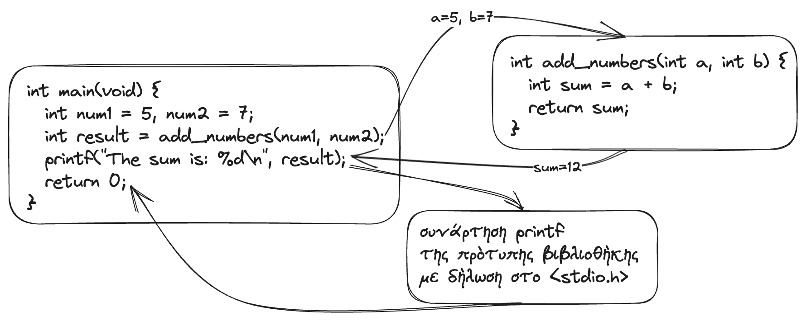
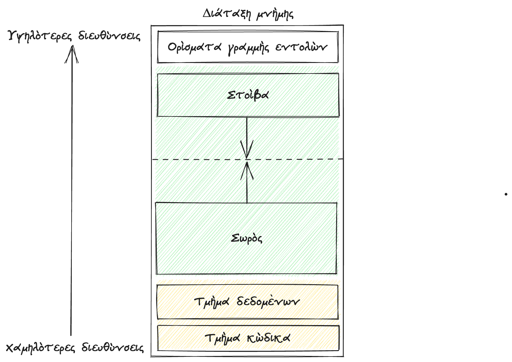
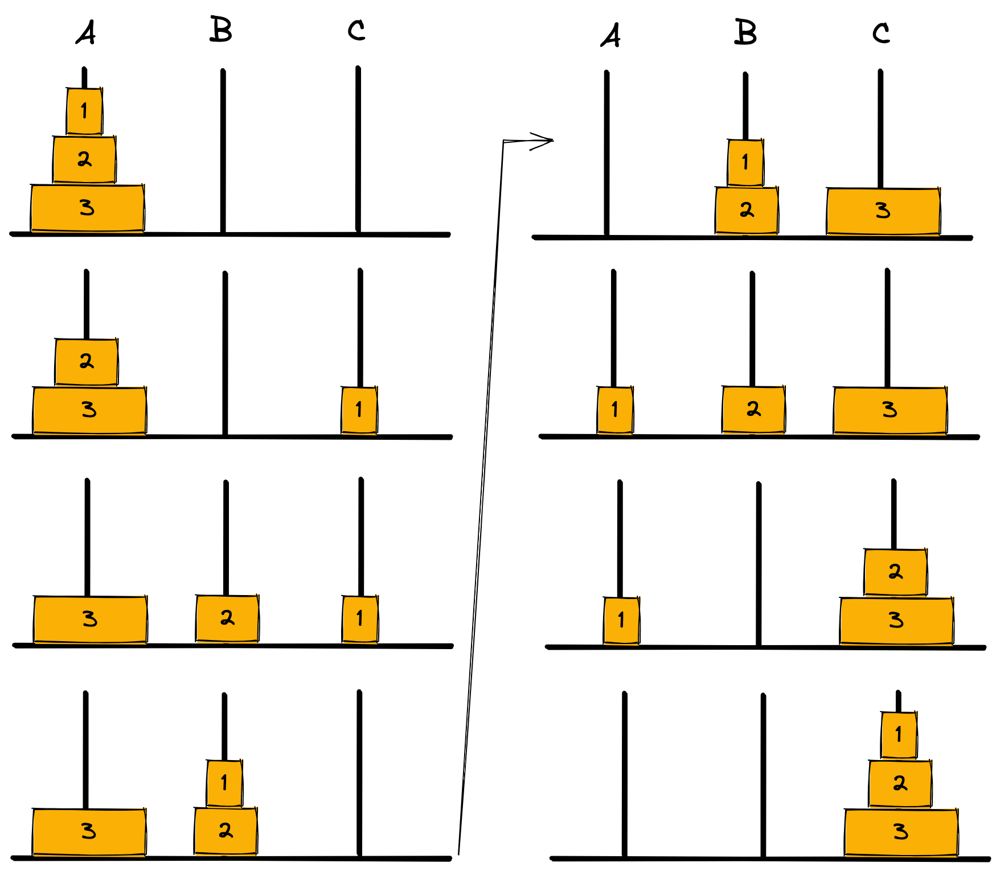

# 4. Συναρτήσεις

<i>Σύνοψη </i> Συναρτήσεις, δήλωση συνάρτησης, ορισμός συνάρτησης, κλήση συνάρτησης, κατηγορίες αποθήκευσης (<span class="p-style">auto, extern, static, register</span>), τοπικές μεταβλητές, καθολικές μεταβλητές, στοίβα κλήσεων, αναδρομικές συναρτήσεις, υπερχείλιση στοίβας, οι συναρτήσεις <span class="p-style">setjmp()</span> και <span class="p-style">longjmp()</span>, συναρτήσεις με μεταβλητό πλήθος ορισμάτων.

<i>Προαπαιτούμενη γνώση</i> Τύποι δεδομένων, είσοδος/έξοδος, δομές επιλογής και επανάληψης.

## 4.1 Εισαγωγή στις συναρτήσεις

Μια συνάρτηση είναι ένα αυτάρκες τμήμα κώδικα που επιτελεί μια συγκεκριμένη εργασία. Αποτελεί θεμελιώδες δομικό στοιχείο του τμηματικού ή αρθρωτού προγραμματισμού (modular programming) και βοηθά
στην οργάνωση κώδικα μέσω της διάσπασής του σε μικρότερες και ευκολότερα διαχειρίσιμες μονάδες. Οι συναρτήσεις επιτρέπουν επαναχρησιμοποίηση του κώδικα, βελτιώνουν την αναγνωσιμότητα και δίνουν τη
δυνατότητα καλύτερης οργάνωσης και ευκολότερης συντήρησης του κώδικα. Βασικές έννοιες σχετικές με τις συναρτήσεις είναι οι ακόλουθες.

- Δήλωση συνάρτησης: Καθορίζει το όνομα της συνάρτησης, τον τύπο επιστροφής (αν δεν υπάρχει χρησιμοποιείται ο προσδιοριστής void) και τους τύπους των παραμέτρων (αν υπάρχουν) που δέχεται η
συνάρτηση. Ο τύπος επιστροφής καθορίζει τον τύπο της τιμής που επιστρέφει η συνάρτηση, ενώ οι παράμετροι παρέχουν εισόδους που η συνάρτηση χρησιμοποιεί στην επεξεργασία που επιτελεί.
- Ορισμός συνάρτησης: Περιέχει την υλοποίηση της συνάρτησης, δηλαδή τον κώδικα που καθορίζει το τι θα κάνει η συνάρτηση όταν καλείται.
- Κλήση συνάρτησης: Αναφέρεται στα σημεία του κώδικα όπου η συνάρτηση καλείται, προκαλώντας τη μεταβίβαση του ελέγχου από το σημείο του κώδικα που γίνεται η κλήση της συνάρτησης στη συνάρτηση που καλείται.

Ακολουθεί ένα παράδειγμα (κώδικας 4.1) με μια απλή συνάρτηση με δύο παραμέτρους που υπολογίζει και επιστρέφει το άθροισμά τους. Μέσα στον κώδικα υπάρχουν σχόλια για τα σημεία στα οποία γίνεται η δήλωση της συνάρτησης, ο ορισμός της και η κλήση της.

```{.c title="Κώδικας 4.1: ch4_p1.c - παράδειγμα με δήλωση, ορισμό και κλήση μιας απλής συνάρτησης." linenums="1"} 
--8<-- "src/ch4_p1.c"
```

Το αποτέλεσμα της εκτέλεσης του προγράμματος θα είναι η εμφάνιση του μηνύματος  
<span class="p-style">The sum is: 12</span>.  
H κλήση της συνάρτησης <span class="p-style">add_numbers()</span> και της συνάρτησης <span class="p-style">printf()</span> από το κύριο πρόγραμμα φαίνεται στο σχήμα 4.1. Τα βέλη δείχνουν ότι κατά την κλήση της συνάρτησης ο έλεγχος μεταβιβάζεται στη συνάρτηση που καλείται, ενώ όταν ολοκληρωθεί η εκτέλεση της συνάρτησης, ο έλεγχος επιστρέφει στην αμέσως επόμενη εντολή μετά την κλήση της συνάρτησης.

{ align=center }

<div style="text-align: center;"><b>Σχήμα 4.1:</b><i> Κλήση συνάρτησης χρήστη και κλήση της συνάρτησης printf() της πρότυπης βιβλιοθήκης.</i></div>

Οι συναρτήσεις στη C κατηγοριοποιούνται στις ακόλουθες βασικές κατηγορίες.  

1. Συναρτήσεις της πρότυπης βιβλιοθήκης. Οι συναρτήσεις αυτές εξυπηρετούν διάφορους σκοπούς και παρέχουν λειτουργικότητα για εργασίες όπως είσοδο/έξοδο, μαθηματικούς υπολογισμούς, χειρισμό λεκτικών, διαχείριση μνήμης και άλλα. Έτσι, για παράδειγμα, συναρτήσεις της πρότυπης βιβλιοθήκης είναι η <span class="p-style">printf()</span>, η <span class="p-style">scanf()</span>, η <span class="p-style">sqrt()</span> και άλλες.
2. Συναρτήσεις εξωτερικών βιβλιοθηκών. Πρόκειται για συναρτήσεις που παρέχονται από εξωτερικές βιβλιοθήκες, που ο προγραμματιστής πρέπει να εγκαταστήσει πρώτα στο σύστημά του, προκειμένου να μπορεί να τις χρησιμοποιήσει. Οι εξωτερικές βιβλιοθήκες αναπτύσσονται από άλλους προγραμματιστές ή οργανισμούς και καλύπτουν συγκεκριμένες ανάγκες όπως εφαρμογές γραφικών, θέματα δικτύωσης, πρόσβαση σε βάσεις δεδομένων, κρυπτογράφηση και άλλα. Παραδείγματα τέτοιων βιβλιοθηκών είναι οι GTK+, libcurl, SQLITE και OpenSSL.
3. Συναρτήσεις ορισμένες από τον χρήστη. Πρόκειται για συναρτήσεις που γράφει ο προγραμματιστής έτσι ώστε να καλύψει συγκεκριμένες απαιτήσεις του προγράμματος. Οι συναρτήσεις αυτές ενθυλακώνουν ένα σύνολο λειτουργιών σε μια μονάδα που μπορεί να κληθεί από διάφορα σημεία του προγράμ-
ματος. Οι συναρτήσεις του χρήστη δηλώνονται, ορίζονται και καλούνται από τον προγραμματιστή με βάση τη λογική του προγράμματος έτσι ώστε να καλύπτονται οι ζητούμενες προδιαγραφές. 
4. Συναρτήσεις κλήσεων συστήματος (system call functions): Οι συναρτήσεις αυτές χρησιμοποιούνται για να ζητήσουν υπηρεσίες από το λειτουργικό σύστημα. Παραδείγματα τέτοιων συναρτήσεων είναι η <span class="p-style">fork()</span> για τη δημιουργία μιας νέας διεργασίας, η <span class="p-style">exec()</span> για την εκτέλεση ενός νέου προγράμματος, οι <span class="p-style">read()</span> και <span class="p-style">write()</span> για είσοδο/έξοδο αρχείων και συσκευών, η <span class="p-style">socket()</span> για δικτυακές λειτουργίες, και πολλές άλλες.


## 4.2 Ορισμοί και κλήσεις συναρτήσεων

Η γενική σύνταξη ορισμού συναρτήσεων είναι η ακόλουθη.
```
τύπος_επιστροφής όνομα_συνάρτησης(λίστα_παραμέτρων) {
σώμα_συνάρτησης
}
```

Ο τύπος_επιστροφής καθορίζει τον τύπο δεδομένων του αποτελέσματος που υπολογίζει και επιστρέφει η συνάρτηση. Αν η συνάρτηση δεν επιστρέφει κάποια τιμή τότε ο τύπος επιστροφής είναι <span class="p-style">void</span>. Το όνομα_συνάρτησης ακολουθεί τους κανόνες ονομάτων της C (ξεκινά με γράμμα αγγλικού αλφαβήτου ή κάτω παύλα, δεν έχει κενά, περιέχει μόνο γράμματα, ψηφία και την κάτω παύλα, δεν είναι δεσμευμένη λέξη). Η λίστα_παραμέτρων είναι μια λίστα μεταβλητών που χωρίζονται μεταξύ τους με κόμματα και λειτουργούν ως είσοδος τιμών για τη συνάρτηση. Συνεπώς, οι παράμετροι εξυπηρετούν το πέρασμα τιμών από τη συνάρτηση που καλεί προς τη συνάρτηση που καλείται. Για κάθε παράμετρο ορίζεται ο τύπος της και το όνομά της και αποτελεί τοπική μεταβλητή της συνάρτησης (δηλαδή υπάρχει μόνο κατά την κλήση της συνάρτησης και μετά «καταστρέφεται»). Αν δεν υπάρχουν παράμετροι αυτό υποδηλώνεται με τον τύπο void ή με κενό ανάμεσα στις παρενθέσεις μετά το όνομα της συνάρτησης. Το σώμα_συνάρτησης περικλείεται σε άγκιστρα και είναι οι εντολές που υλοποιούν τη λειτουργικότητα της συνάρτησης. Σε όποιο σημείο του σώματος της συνάρτησης υπάρχει η εντολή <span class="p-style">return</span> προκαλεί την έξοδο από τη συνάρτηση και την επιστροφή του ελέγχου στην αμέσως επόμενη εντολή μετά την κλήση της συνάρτησης. Μια συνάρτηση, αν είναι <span class="p-style">void</span>, δεν είναι απαραίτητο να έχει <span class="p-style">return</span>. Σε αυτήν την περίπτωση ο έλεγχος μεταβιβάζεται στην καλούσα συνάρτηση όταν εκτελεστεί και η τελευταία εντολή της συνάρτησης που εκτελείται.  
Η πρώτη γραμμή μιας συνάρτησης που περιλαμβάνει τον τύπο επιστροφής, το όνομα της συνάρτησης και τη λίστα παραμέτρων, συμπληρωμένη με ένα ερωτηματικό στο τέλος αποτελεί το λεγόμενο πρωτότυπο της συνάρτησης. Το πρωτότυπο δεν ορίζει τη λειτουργία μιας συνάρτησης και έχει σκοπό να ενημερώσει τον
μεταγλωττιστή για την ύπαρξη της συνάρτησης και τον τρόπο που θα πρέπει να καλείται. Η συγγραφή ενός πρωτοτύπου γίνεται με την ακόλουθη σύνταξη.

<span class="p-style">τύπος_επιστροφής όνομα_συνάρτησης(λίστα_παραμέτρων);</span>

Αν έχει οριστεί μια συνάρτηση ή αν υπάρχει το πρωτότυπό της, τότε στη συνέχεια του κώδικα η συνάρτηση μπορεί να κληθεί ως εξής:

<span class="p-style">όνομα_συνάρτησης(λίστα_ορισμάτων);</span>

Δηλαδή η κλήση μιας συνάρτησης γίνεται απλά με την παράθεση του ονόματός της ακολουθούμενη από τα λεγόμενα ορίσματα (arguments) της συνάρτησης χωρισμένα μεταξύ τους με κόμματα. Τα ορίσματα μπορούν να είναι απλές μεταβλητές ή σταθερές ή γενικότερα εκφράσεις. Η αντιστοίχιση των ορισμάτων με τις παραμέτρους της συνάρτησης γίνεται με βάση τη σειρά εμφάνισής τους στη λίστα. Για παράδειγμα, μια συνάρτηση που έχει οριστεί έχοντας 3 παραμέτρους με ονόματα <span class="p-style">x, y, z</span> και καλείται με ορίσματα <span class="p-style">a, b, c</span> σημαίνει ότι θα γίνει το πέρασμα του ορίσματος <span class="p-style">a</span> στην παράμετρο <span class="p-style">x</span>, του <span class="p-style">b</span> στη <span class="p-style">y</span> και του <span class="p-style">c</span> στη <span class="p-style">z</span>. Προφανώς πρέπει να υπάρχει συμφωνία (ή δυνατότητα αυτόματης μετατροπής) στον τύπο ορισμάτων και των αντίστοιχων παραμέτρων έτσι ώστε να μην προκληθεί συντακτικό σφάλμα.  
Στο ακόλουθο παράδειγμα (κώδικας 4.2) χρησιμοποιούνται δύο συναρτήσεις, η <span class="p-style">fun1()</span> και η <span class="p-style">fun2()</span>. Για τη <span class="p-style">fun1()</span> δίνεται αρχικά το πρωτότυπό της και ορίζεται στο τέλος του κώδικα (1), ενώ η <span class="p-style">fun2()</span> δηλώνεται και ορίζεται απευθείας. Επίσης, η fun1<span class="p-style">()</span> δέχεται μια ακέραια παράμετρο και επιστρέφει μια ακέραια τιμή, ενώ η <span class="p-style">fun2()</span> δέχεται δύο παραμέτρους και δεν επιστρέφει κάποια τιμή. Η κλήση και των δύο συναρτήσεων γίνεται από τη <span class="p-style">main()</span>.
{ .annotate }

1. Αυτός ο τρόπος αρχικής δήλωσης της συνάρτησης και εν συνεχεία ορισμού της ονομάζεται εμπρόσθια δήλωση (forward
declaration).  

```{.c title="Κώδικας 4.2: ch4_p2.c - παράδειγμα διαφορετικών τρόπων δήλωσης και ορισμού συναρτήσεων." linenums="1"}
--8<-- "src/ch4_p2.c"
```
Ακολουθεί το αποτέλεσμα εκτέλεσης του κώδικα.

```
fun1: a=5
fun2: a=5, b=2.73, temp=13.65
main: x=5, y=2.73, z=6
```
Αν η γραμμή 4 με το πρωτότυπο της συνάρτησης <span class="p-style">fun1()</span> τοποθετηθεί σε σχόλια, τότε το σφάλμα που θα εντοπίσει ο μεταγλωττιστής θα είναι:

```
ch4_p2.c:17:11: error: call to undeclared function 'fun1'; ISO C99 and later do not
    ↪ support implicit function declarations [‐Wimplicit ‐function ‐declaration]
  int z = fun1(x);
          ^
ch4_p2.c:17:11: note: did you mean 'fun2'?
ch4_p2.c:7:6: note: 'fun2' declared here
void fun2(int a, double b) {
     ^
1 error generated.
```

Το σφάλμα αναφέρει ότι ο μεταγλωττιστής δεν μπόρεσε να βρει πριν την κλήση της συνάρτησης <span class="p-style">fun1()</span>, τη δήλωσή της. Από την άλλη μεριά, αν αφαιρεθούν τα σχόλια από τη γραμμή 4 και τοποθετηθεί σε σχόλια ο ορισμός της συνάρτησης <span class="p-style">fun1()</span> στις γραμμές 24-27, τότε θα προκύψει το ακόλουθο σφάλμα κατά τη σύνδεση του προγράμματος.

```
Undefined symbols for architecture arm64:
  "_fun1", referenced from:
      _main in ch4_p2 ‐724b97.o
ld: symbol(s) not found for architecture arm64
clang: error: linker command failed with exit code 1 (use ‐v to see invocation)
```

Το μήνυμα πληροφορεί ότι ο συνδέτης (linker) δεν ήταν σε θέση να εντοπίσει μια μεταγλωττισμένη έκδοση της συνάρτησης <span class="p-style">fun1()</span> έτσι ώστε να δημιουργήσει το τελικό εκτελέσιμο.


## 4.3 Κατηγορίες αποθήκευσης

Η C διαθέτει τις δεσμευμένες λέξεις <span class="p-style">auto, extern, static</span> και <span class="p-style">register</span> που καθορίζουν την κατηγορία αποθήκευσης (storage class) των μεταβλητών. Η κατηγορία αποθήκευσης προσδιορίζει τη θέση αποθήκευσης, την εμβέλεια (scope), τη διάρκεια ζωής (life cycle) και την αρχική τιμή που λαμβάνουν οι μεταβλητές όπως φαίνεται στον Πίνακα 4.1.

<div style="text-align: center;"><b>Πίνακας 4.1:</b><i> Κατηγορίες αποθήκευσης (storage classes).</i></div>

| Κατηγορία αποθήκευσης | Αποθήκευση | Αρχική τιμή | Εμβέλεια | Διάρκεια ζωής |
|-----------------|--------------------|------------|----------------|----------------|
| <span class="p-style"> auto </span>        | Στοίβα                | Απροσδιόριστη | Εντός του μπλοκ | Τέλος του μπλοκ |
| <span class="p-style">extern </span>      | Τμήμα δεδομένων      | Μηδέν      | Καθολική (Πολλαπλά αρχεία) | Τέλος προγράμματος |
| <span class="p-style">static </span>     | Τμήμα δεδομένων      | Μηδέν      | Εντός του μπλοκ | Τέλος προγράμματος |
| <span class="p-style">register </span>   | Καταχωρητές ΚΜΕ      | Απροσδιόριστη | Εντός του μπλοκ | Τέλος του μπλοκ |

Η θέση αποθήκευσης αφορά τη θέση στη μνήμη ή τους καταχωρητές όπου πρόκειται να αποθηκευτούν τα δεδομένα. Το Σχήμα 4.2 δίνει μια απλοποιημένη εικόνα της διάταξης μνήμης. Το τμήμα δεδομένων (data segment) βρίσκεται σε χαμηλές διευθύνσεις της μνήμης και ό,τι αποθηκεύεται εκεί δεσμεύει μνήμη μέχρι το τέλος
του προγράμματος, πρόκειται δηλαδή για ένα τμήμα μνήμης στατικό. Η στοίβα από την άλλη μεριά αυξάνεται και μειώνεται κατά την εκτέλεση του προγράμματος, οπότε είναι ένα τμήμα μνήμης που είναι δυναμικό. Αν μια μεταβλητή δεσμεύσει θέσεις μνήμης στη στοίβα και δεν αρχικοποιηθεί, τότε θα περιέχει απροσδιόριστες
τιμές ή τιμές «σκουπίδια» όπως συχνά αναφέρονται (δηλαδή τιμές χωρίς νόημα), ενώ αν καταλάβει θέσεις μνήμης στο τμήμα δεδομένων και δεν αρχικοποιηθεί, θα λάβει αυτόματα την τιμή μηδέν. Η εμβέλεια έχει να κάνει με την ορατότητα των μεταβλητών στα διάφορα τμήματα του προγράμματος. Τοπική εμβέλεια (local scope) σημαίνει ότι μια μεταβλητή ορίζεται σε μια συνάρτηση ή σε ένα μπλοκ και μπορεί να χρησιμοποιηθεί μόνο εντός αυτού. Καθολική εμβέλεια (global scope) σημαίνει ότι η μεταβλητή ορίζεται έξω από συναρτήσεις και είναι ορατή σε όλες τις συναρτήσεις του προγράμματος. Τέλος η διάρκεια ζωής έχει να κάνει με το πότε η μεταβλητή ξεκινά να υφίσταται και πότε παύει να υπάρχει.


){ .center }

<div style="text-align: center;"><b>Σχήμα 4.2:</b><i> Διάταξη μνήμης (memory layout).</i></div>  


<div style="text-align: center;">Στη συνέχεια περιγράφονται οι κατηγορίες αποθήκευσης μαζί με παραδείγματα κώδικα για την καθεμία.</div>

<span class="p-style"><i>auto</i></span> Η δεσμευμένη λέξη <span class="p-style">auto</span> αποτελεί την προκαθορισμένη κατηγορία αποθήκευσης για μεταβλητές που δηλώνονται σε ένα μπλοκ ή σε μια συνάρτηση. Σημαίνει ότι η μεταβλητή έχει αυτόματη διάρκεια αποθήκευσης, δηλαδή ότι δημιουργείται όταν πραγματοποιείται εισαγωγή στο μπλοκ ή στη συνάρτηση και καταστρέφεται όταν γίνεται έξοδος από το μπλοκ ή τη συνάρτηση. Οι μεταβλητές <span class="p-style">auto</span> συνήθως χρησιμοποιούνται ως προσωρινές ή τοπικές μεταβλητές και κατά τη δήλωσή τους λαμβάνουν ως τιμές «σκουπίδια», οπότε πρέπει να αρχικοποιούνται σε τιμές που έχουν νόημα για το πρόγραμμα. Στο παράδειγμα που ακολουθεί στον κώδικα 4.3 ορίζονται 4 μεταβλητές με κατηγορία αποθήκευσης <span class="p-style">auto</span>. Η λέξη <span class="p-style">auto</span>, όπως συνηθίζεται, θα μπορούσε να παραλειφθεί από όλα τα σημεία όπου χρησιμοποιείται, καθώς πρόκειται για την προκαθορισμένη κατηγορία αποθήκευσης. Να σημειωθεί ότι η δήλωση <span class="p-style">auto</span> υπονοείται στις παραμέτρους συναρτήσεων και δεν αναγράφεται. Η μεταβλητή x που δηλώνεται και ορίζεται στη γραμμή 9, μπορεί να χρησιμοποιηθεί σε οποιοδήποτε σημείο της main(). Η μεταβλητή y δηλώνεται στη γραμμή 12 μέσα σε ένα μπλοκ κώδικα και δεν αρχικοποιείται, άρα περιέχει τιμή χωρίς νόημα, ενώ παύει να υπάρχει στη γραμμή 14 που κλείνει το μπλοκ. Τέλος, οι μεταβλητές a και b είναι τοπικές και έχουν διάρκεια ζωής το διάστημα που εκτελείται η συνάρτηση <span class="p-style">fun()</span>.

```{.c title="Κώδικας 4.3: ch4_p3.c - μεταβλητές auto." linenums="1"}
--8<-- "src/ch4_p3.c"
```

Ακολουθεί το αποτέλεσμα της εκτέλεσης.

```
fun: a=42 b=7
main: x=42 y=1
```
<span class="p-style"><i>extern</i></span> Η δεσμευμένη λέξη <span class="p-style">extern</span> χρησιμοποιείται συνήθως για να δηλωθεί μια μεταβλητή που ορίζεται σε ένα άλλο αρχείο. Όταν δηλωθεί μια μεταβλητή ως extern αυτό σημαίνει ότι ορίζεται κάπου εξωτερικά του σημείου δήλωσης και ο χώρος αποθήκευσής της υπάρχει κάπου αλλού, όχι με τις μεταβλητές που είναι ορισμένες στο τρέχον τμήμα κώδικα. Στο ακόλουθο παράδειγμα (κώδικες 4.4 και 4.5) ορίζεται στο αρχείο ch4_p4_help.c η μεταβλητή <span class="p-style">a</span> και η συνάρτηση <span class="p-style">foo()</span>. Το αρχείο ch4_p4_main.c χρησιμοποιεί τη μεταβλητή <span class="p-style">a</span> δηλώνοντάς την ως <span class="p-style">extern</span>. To ίδιο συμβαίνει και με τη συνάρτηση <span class="p-style">foo()</span> καθώς και οι συναρτήσεις μπορούν να δηλωθούν ως <span class="p-style">extern</span>.

```{.c title="Κώδικας 4.4: ch4_p4_help.c - μεταβλητές extern." linenums="1"}
--8<-- "src/ch4_p4_help.c"
```


```{.c title="Κώδικας 4.5: ch4_p4_main.c - μεταβλητές extern." linenums="1"}
--8<-- "src/ch4_p4_main.c"
```

Η μεταγλώττιση και σύνδεση του κώδικα πρέπει να συμπεριλάβει και τα δύο αρχεία το ch4_p4_help.c και το ch4_p4_main.c όπως στη συνέχεια.

```
$ gcc ‐o ch4_p4 ch4_p4_help.c ch4_p4_main.c ‐Wall ‐Werror ‐pedantic
```

Ακολουθεί το αποτέλεσμα της εκτέλεσης.

```
a=43
a=44
a=45
```

<span class="p-style"><i>static</i></span> Όταν μια μεταβλητή δηλωθεί ως <span class="p-style">static</span> μέσα σε μια συνάρτηση (ή σε ένα μπλοκ), τότε αρχικοποιείται μόνο μια φορά κατά την πρώτη κλήση της συνάρτησης και η τιμή της διατηρείται σε διαδοχικές κλήσεις της. Αν η μεταβλητή δεν αρχικοποιείται με μια εντολή ανάθεσης τιμής, τότε λαμβάνει την τιμή μηδέν. Η μεταβλητή παραμένει τοπική, δηλαδή μπορεί να χρησιμοποιηθεί μόνο μέσα στις εντολές του σώματος της συνάρτησης (ή του μπλοκ) όπου ορίστηκε. Στο ακόλουθο παράδειγμα (κώδικας 4.6) η συνάρτηση <span class="p-style">fun()</span> καλείται στη <span class="p-style">main()</span> 3 φορές. Στην πρώτη κλήση της η <span class="p-style">static</span> μεταβλητή <span class="p-style">a</span> λαμβάνει την τιμή 100 και οι μετέπειτα κλήσεις της <span class="p-style">fun()</span> χρησιμοποιούν την ίδια μεταβλητή χωρίς να έχει καταστραφεί ενδιάμεσα όπως θα συνέβαινε αν είχε δηλωθεί ως <span class="p-style">auto</span>
. Το ίδιο συμβαίνει και με τη static μεταβλητή <span class="p-style">a</span> στη <span class="p-style">main()</span> (έχει ίδιο όνομα με τη μεταβλητή <span class="p-style">a</span> της <span class="p-style">fun()</span> αλλά πρόκειται για διαφορετικές μεταβλητές). Καθώς δηλώνεται μέσα σε ένα μπλοκ της <span class="p-style">main()</span> και δεν αρχικοποιείται με εντολή ανάθεσης τιμής, η στατική μεταβλητή αρχικοποιείται στην τιμή 0.


```{.c title="Κώδικας 4.6: ch4_p5.c - μεταβλητές static." linenums="1"}
--8<-- "src/ch4_p5.c"
```

Το αποτέλεσμα της εκτέλεσης του κώδικα είναι το ακόλουθο.

```
fun: a=100
fun: a=101
fun: a=102
main: a=0
main: a=1
main: a=2
```

<span class="p-style"><i>register</i></span> Παρόμοια με την auto είναι και η <span class="p-style">register</span>. Η βασική διαφορά είναι ότι ο μεταγλωττιστής λαμβάνει την οδηγία (που μπορεί ωστόσο να αγνοήσει) να αποθηκεύσει μεταβλητές με προσδιοριστή <span class="p-style">register</span> σε καταχωρητές της Κεντρικής Μονάδας Επεξεργασίας (KME), εφόσον υπάρχουν διαθέσιμοι. Οι πράξεις με μεταβλητές σε καταχωρητές είναι πολύ ταχύτερες συγκριτικά με μεταβλητές που αποθηκεύονται στη μνήμη. Μια ακόμη διαφορά των <span class="p-style">register</span> μεταβλητών από τις άλλες κατηγορίες είναι ότι δεν μπορεί να ληφθεί η διεύθυνση μιας <span class="p-style">register</span> μεταβλητής όπως θα γινόταν για παράδειγμα με μια auto μεταβλητή με τον τελεστή <span class="p-style">&</span>. Θα πρέπει να σημειωθεί ότι η δεσμευμένη λέξη <span class="p-style">register</span> έχει αποσυρθεί (έχει γίνει deprecate) από τη γλώσσα C από το στάνταρντ C99 και μετά. Συνεπώς, οι μεταγλωττιστές αγνοούν τη χρήση από τον προγραμματιστή του <span class="p-style">register</span> και βελτιστοποιούν αυτόματα τη χρήση των καταχωρητών της KME.


### 4.3.1 Τοπικές και καθολικές μεταβλητές

Οι τοπικές μεταβλητές έχουν εμβέλεια το μπλοκ κώδικα μέσα στο οποίο ορίζονται, ενώ οι καθολικές μεταβλητές ορίζονται εκτός συναρτήσεων και έχουν εμβέλεια όλο το πρόγραμμα. To ακόλουθο παράδειγμα (κώδικας 4.7) χρησιμοποιεί μια καθολική μεταβλητή (ορατή παντού) με όνομα <span class="p-style">global_var</span> και δύο τοπικές μεταβλητές, με το ίδιο όνομα (<span class="p-style">local_var</span>), αλλά διαφορετικές μεταξύ τους καθώς η μια ορίζεται στη συνάρτηση <span class="p-style">fun()</span> και η άλλη στη συνάρτηση <span class="p-style">main()</span>.

```{.c title="Κώδικας 4.7: ch4_p6.c - παράδειγμα με τοπικές μεταβλητές και καθολική μεταβλητή." linenums="1"}
--8<-- "src/ch4_p6.c"
```

Ακολουθεί το αποτέλεσμα της εκτέλεσης του κώδικα.

```
main: local_var=7
main: global_var=10
fun: local_var=5
fun: global_var=10
main: local_var=7
main: global_var=12
```

Αν και οι καθολικές μεταβλητές μπορούν να χρησιμοποιηθούν για την ανταλλαγή τιμών ανάμεσα σε συναρτήσεις, αυτό δεν θεωρείται καλή πρακτική καθώς οδηγεί σε προγράμματα δύσκολα στην κατανόηση και διόρθωση.

##  4.4 Αναδρομικές συναρτήσεις

Οι αναδρομικές συναρτήσεις είναι συναρτήσεις που κατά την εκτέλεσή τους καλούν τους εαυτούς τους, είτε άμεσα είτε έμμεσα. Η αναδρομή (recursion) είναι ένας ισχυρός μηχανισμός για την επίλυση προβλημάτων που μπορούν να διαιρεθούν σε μικρότερα προβλήματα της ίδιας μορφής. Οι αναδρομικές συναρτήσεις έχουν δύο τμήματα, τη βασική περίπτωση (base case) και την αναδρομική περίπτωση (recursive case). Η βασική περίπτωση καθορίζει τη συνθήκη που τερματίζει τις αναδρομικές κλήσεις, ενώ η αναδρομική περίπτωση καθορίζει τη λογική που διασπά το πρόβλημα σε μικρότερα υποπροβλήματα. Το κλασικό παράδειγμα αναδρομής είναι ο υπολογισμός του παραγοντικού ενός μη αρνητικού ακεραίου αριθμού n που ορίζεται ως 1 αν το n είναι ένα ή μηδέν και ως 1 * 2 * 3 ... * n για n > 1. Το ίδιο μπορεί να περιγραφεί κομψά με τον ακόλουθο μαθηματικό ορισμό:

$$
\text{παραγοντικό}(n) =
\begin{cases} 
1, & \text{Αν } n = 0 \text{ ή } n = 1 \\
n \times \text{παραγοντικό}(n-1) & \text{αλλιώς}
\end{cases}
$$

Η αναδρομική υλοποίηση του κώδικα που ακολουθεί στον κώδικα 4.8 βρίσκεται σε ευθεία αντιστοίχιση με τον μαθηματικό ορισμό.

```{.c title="Κώδικας 4.8: ch4_p7.c - αναδρομική συνάρτηση υπολογισμού παραγοντικού." linenums="1"}
--8<-- "src/ch4_p7.c"
```

Όταν ο κώδικας εκτελεστεί θα προκληθεί η ακόλουθη σειρά κλήσεων της συνάρτησης <span class="p-style">factorial()</span>:

```
          factorial(5)
          |
          V
5 * factorial(4) = 5 * 24 = 120
          |
          V
4 * factorial(3) = 4 * 6 = 24
          |
          V
3 * factorial(2) = 3 * 2 = 6
          |
          V
2 * factorial(1) = 2 * 1 = 2
          |
          V
    factorial(1) = 1 (βασική περίπτωση)

```

Φθάνοντας στη βασική περίπτωση όταν το <span class="p-style">n</span> είναι 0 ή 1, η αναδρομή σταματά, και τα αποτελέσματα μεταδίδονται «προς τα πάνω», και εν τέλει επιστρέφεται το αποτέλεσμα στη συνάρτηση <span class="p-style">main()</span> προκειμένου να εμφανιστεί το μήνυμα <span class="p-style">Factorial of 5 is 120</span>.   
Στο προηγούμενο παράδειγμα κώδικα η υλοποίηση της συνάρτησης <span class="p-style">factorial()</span> μπορεί να γίνει εύκολα και με συνάρτηση που υλοποιεί επαναληπτικά τη λύση. Μια υλοποίηση της συνάρτησης είναι η ακόλουθη.

```
unsigned int factorial(unsigned int n) {
unsigned int result = 1;
while (n > 1) {
result *= n;
n‐‐;
}
return result;
}
```

Υπάρχουν όμως προβλήματα που η αναδρομική λύση είναι πραγματικά απλούστερη. Ένα τέτοιο παράδειγμα είναι το πρόβλημα των πύργων του Ανόι όπου η αναδρομική λύση είναι ιδιαίτερα περιεκτική. Στο πρόβλημα αυτό υπάρχουν 3 στύλοι (Α, Β και C) και ο πρώτος στύλος αρχικά περιέχει έναν αριθμό από δίσκους διαφορετικής διαμέτρου τοποθετημένους από τον μεγαλύτερο προς τον μικρότερο, από κάτω προς τα πάνω. Το ζητούμενο είναι να μεταφερθούν όλοι οι δίσκοι στον στύλο C μετακινώντας έναν δίσκο τη φορά και αποφεύγοντας την τοποθέτηση μεγαλύτερου δίσκου πάνω από μικρότερο. Το αναδρομικό πρόγραμμα που επιλύει το πρόβλημα παρουσιάζεται στη συνέχεια στον κώδικα 4.9. Μια καλή περιγραφή της διαίσθησης που απαιτεί η συγγραφή του αναδρομικού κώδικα για το πρόβλημα βρίσκεται στο [^1].


```{.c title="Κώδικας 4.9: ch4_p8.c - πύργοι του Ανόι." linenums="1"}
--8<-- "src/ch4_p8.c"
```

Ακολουθεί ένα παράδειγμα εκτέλεσης του προγράμματος και η σχηματική αναπαράσταση της πορείας της λύσης (Σχήμα 4.3).

<div class="grid" markdown>

```
Enter the number of disks: 3
Solution:
Move disk 1 from A to C
Move disk 2 from A to B
Move disk 1 from C to B
Move disk 3 from A to C
Move disk 1 from B to A
Move disk 2 from B to C
Move disk 1 from A to C
```

  

</div>


<div style="text-align: center;"><b>Σχήμα 4.3:</b><i> Βήματα επίλυσης του προβλήματος των πύργων του Ανόι με 3 δίσκους.</i></div>  

Μερικές ενδιαφέρουσες και απροσδόκητες ιδιότητες του προβλήματος των πύργων του Ανόι μπορούν να εντοπιστούν στο [^2].

## 4.5 Η στοίβα κλήσεων

Η στοίβα κλήσεων (call stack) είναι μια δομή που διατηρεί τις κλήσεις των συναρτήσεων και τα σχετικά δεδομένα τους κατά την εκτέλεση του προγράμματος. Πρόκειται για μια δομή στοίβας όπου κάθε κλήση συνάρτησης αναπαρίσταται από ένα πλαίσιο στοίβας (stack-frame). Η στοίβα κλήσεων έχει κρίσιμο ρόλο στη διαχείριση της ροής εκτέλεσης του προγράμματος, συμπεριλαμβανομένων των κλήσεων συναρτήσεων, των τοπικών μεταβλητών και των διευθύνσεων επιστροφής.  
Όταν καλείται μια συνάρτηση, δημιουργείται ένα νέο stack-frame και ωθείται στη στοίβα κλήσεων. Το stack-frame περιέχει πληροφορίες όπως η διεύθυνση επιστροφής της συνάρτησης, παραμέτρους, τοπικές μεταβλητές και άλλα. Η συνάρτηση ξεκινά να εκτελείται και μπορεί να κάνει νέες κλήσεις συναρτήσεων ωθώντας νέα stack-frames στη στοίβα. Καθώς κάθε συνάρτηση ολοκληρώνει την εκτέλεσή της, το stack-frame της απωθείται από τη στοίβα και ο έλεγχος μεταβιβάζεται στη συνάρτηση που την κάλεσε.
Στο ακόλουθο παράδειγμα (κώδικας 4.10) η <span class="p-style">main()</span> καλεί τη συνάρτηση <span class="p-style">foo()</span> που καλεί τη συνάρτηση <span class="p-style">bar()</span> που καλεί τη συνάρτηση <span class="p-style">baz()</span>. Εκείνη τη στιγμή στη στοίβα κλήσεων υπάρχουν τα stack-frames των 4 συναρτήσεων με τη σειρά <span class="p-style">main(), foo(), bar(), baz(),</span> από κάτω προς τα πάνω. Όταν ολοκληρωθεί η εκτέλεση της <span class="p-style">baz()</span> το stack-frame της απωθείται από τη στοίβα που πλέον περιέχει τα stack-frames <span class="p-style">main(), foo(), bar()</span>. Ομοίως, με την ολοκλήρωση της <span class="p-style">bar()</span> και της <span class="p-style">foo()</span> η στοίβα γίνεται <span class="p-style">main(), foo()</span> και <span class="p-style">main()</span> αντίστοιχα, ενώ όταν ολοκληρωθεί η εκτέλεση της <span class="p-style">main()</span>, η στοίβα αδειάζει και το πρόγραμμα τερματίζει την εκτέλεσή του.

```{.c title="Κώδικας 4.10: ch4_p9.c - στοίβα κλήσεων." linenums="1"}
--8<-- "src/ch4_p9.c"
```

Ακολουθεί το αποτέλεσμα εκτέλεσης.
```
main(0x16fba2f00) pushed in the call stack
  foo(0x16fba2ee0) pushed in the call stack
    bar(0x16fba2eb0) pushed in the call stack
      baz(0x16fba2e50) pushed in the call stack
      baz: e(0x16fba2e4c)=1 f(0x16fba2e48)=2
      baz popped from the call stack
    bar: b(0x16fba2eac)=1 c(0x16fba2ea8)=2, d(0x16fba2ea4)=3
    bar popped from the call stack
  foo: a(0x16fba2edc)=1
  foo popped from the call stack
main popped from the call stack

```

Η συνάρτηση <span class="p-style">__builtin_frame_address()</span> επιστρέφει τη διεύθυνση μνήμης του stack-frame στη στοίβα κλήσεων (υποστηρίζεται από το gcc και το clang). Παρατηρώντας κανείς τις διευθύνσεις διαπιστώνει ότι η στοίβα κλήσεων βρίσκεται σε υψηλές διευθύνσεις του χώρου μνήμης και ότι αναπτύσσεται προς χαμηλότερες
διευθύνσεις καθώς προστίθενται νέα stack-frames.


### 4.5.1 Υπερχείλιση στοίβας

Αν κατά την εκτέλεση ενός προγράμματος η στοίβα κλήσεων ξεπεράσει σε μέγεθος τον χώρο που διατίθεται για τη στοίβα από το σύστημα, τότε δημιουργείται πρόβλημα υπερχείλισης στοίβας (stack overflow problem) και το πρόγραμμα τερματίζει την εκτέλεσή του. Για να συμβεί αυτό είτε θα πρέπει να υπάρχει μια αλυσίδα από κλήσεις συναρτήσεων με τοπικές μεταβλητές μεγάλου μεγέθους ή μια αναδρομική συνάρτηση που καλεί τον εαυτό της πολλές φορές δημιουργώντας μια μακριά ακολουθία από stack-frames στη στοίβα κλήσεων. Στην πράξη, το πρόβλημα εμφανίζεται συχνά όταν μια αναδρομική συνάρτηση έχει γραφεί λανθασμένα και καλείται συνεχώς η αναδρομική περίπτωση, αντί να τερματίζει κάποια στιγμή με τη βασική περίπτωση. Ακολουθεί ένα παράδειγμα κώδικα (κώδικας 4.11) που η αναδρομική συνάρτηση recursive_function απλά καλεί τον εαυτό της χωρίς κανέναν έλεγχο για τερματισμό της αναδρομής.

```{.c title="Κώδικας 4.11: ch4_p10.c - αναδρομική κλήση συνάρτησης που προκαλεί υπερχείλιση στοίβας." linenums="1"}
--8<-- "src/ch4_p10.c"
```
Η εκτέλεση του προγράμματος θα προκαλέσει segmentation fault, καθώς μετά από έναν μεγάλο αριθμό αναδρομικών κλήσεων της recursive_function η διαθέσιμη μνήμη θα εξαντληθεί.
```
...
Call 261452, frame address = 0x16f124580
Call 261453, frame address = 0x16f124560
Call 261454, frame address = 0x16f124540
Call 261455, frame address = 0x16f124520
zsh: segmentation fault ch4_p10
```


## 4.6 Οι συναρτήσεις setjmp(), longjmp()

Οι συναρτήσεις <span class="p-style">setjmp()</span> και <span class="p-style">longjmp()</span> επιτρέπουν τη μετάβαση από μια συνάρτηση σε μια άλλη παρακάμπτοντας την προκαθορισμένη ροή εκτέλεσης. Λειτουργούν με παρόμοιο τρόπο με την εντολή goto χωρίς όμως τον περιορισμό της goto που επιτρέπει τη μεταβίβαση της ροής εκτέλεσης σε άλλο σημείο μόνο της ίδιας συνάρτησης όπου βρίσκεται και η ίδια. Οι <span class="p-style">setjmp()</span> και <span class="p-style">longjmp()</span> χρησιμοποιούνται για χειρισμό σφαλμάτων ειδικά όταν το σφάλμα συμβαίνει «βαθιά» σε συναρτήσεις που καλούν άλλες συναρτήσεις και είναι επιθυμητό ο χειρισμός του σφάλματος να γίνεται στο επίπεδο κλήσης της πρώτης συνάρτησης. Η <span class="p-style">setjmp()</span> καλείται πρώτη και αποθηκεύει ένα αντίγραφο της θέσης που βρίσκεται έτσι ώστε η εκτέλεση του κώδικα να μπορεί να επανέλθει εκεί. Στη συνέχεια, όταν κληθεί η <span class="p-style">longjmp()</span> η εκτέλεση επιστρέφει στο σημείο του κώδικα που έχει αποθηκευτεί και η κατάσταση του προγράμματος επανέρχεται στην κατάσταση που υπήρχε όταν είχε κληθεί η <span class="p-style">setjmp()</span>, σε μια διαδικασία που είναι γνωστή ως “unwinding the stack”. Οι δύο αυτές συναρτήσεις χρησιμοποιούν μια κοινή μεταβλητή τύπου <span class="p-style">jmp_buf</span> που διατηρεί τη θέση επιστροφής. Το αρχείο επικεφαλίδας <span class="p-style">setjmp.h</span> πρέπει να εισαχθεί προκειμένου να χρησιμοποιηθούν οι <span class="p-style">setjmp()</span> και <span class="p-style">longjmp()</span>. Στο παράδειγμα του κώδικα 4.12 η συνάρτηση <span class="p-style">main()</span> αρχικά δημιουργεί ένα σημείο επιστροφής με την κλήση της <span class="p-style">setjmp()</span> και στη συνέχεια καλεί τη συνάρτηση <span class="p-style">foo()</span> που με τη σειρά του καλεί τη συνάρτηση <span class="p-style">bar()</span>. Η συνάρτηση <span class="p-style">bar()</span> ζητά από τον χρήστη να εισαγάγει μια τιμή και αν η τιμή αυτή είναι -99, τότε η εκτέλεση συνεχίζεται στο σημείο επιστροφής αφαιρώντας παράλληλα από τη στοίβα κλήσεων τα stack-frames των <span class="p-style">bar()</span> και <span class="p-style">foo()</span>.

```{.c title="Κώδικας 4.12: ch4_p11.c - κλήσεις main() -> foo() -> bar(), αλλά επιστροφή απευθείας από τη bar() στη main()." linenums="1"}
--8<-- "src/ch4_p11.c"
```

Η εκτέλεση του κώδικα για διαδοχικές τιμές εισόδου από τον χρήστη, 42 και -99 δίνει τα ακόλουθα αποτελέσματα:

```
1: main
2: main
1: foo
1: bar
Input value ‐99 to go back to main() and end program: 42
2: bar
2: foo
3: main
2: main
1: foo
1: bar
Input value ‐99 to go back to main() and end program: ‐99
Returning directly to main()

```

Η τιμή 42 προκαλεί την αναμενόμενη σειρά εμφανίσεων μηνυμάτων, Ωστόσο, όταν ο χρήστης εισάγει την τιμή -99, αυτόματα προκαλείται επιστροφή στη γραμμή 25 και αφαίρεση των <span class="p-style">bar()</span> και <span class="p-style">foo()</span> από τη στοίβα κλήσεων. Αυτός είναι ο λόγος που δεν εμφανίζονται τα μηνύματα <span class="p-style">“2: bar”</span> και <span class="p-style">“2: foo”</span> πριν τον τερματισμό του προγράμματος.

## 4.7 Συναρτήσεις με μεταβλητό πλήθος ορισμάτων

H γλώσσα C επιτρέπει τη συγγραφή συναρτήσεων που δέχονται μεταβλητό πλήθος ορισμάτων. Αυτές οι συναρτήσεις ονομάζονται variadic και υποδηλώνονται κατά τον ορισμό τους με την τοποθέτηση τριών τελειών (γνωστών ως ellipsis) στο τέλος της λίστας των παραμέτρων τους. Πλεονέκτημα των variadic συναρτήσεων είναι η ευελιξία και το δημοφιλέστερο παράδειγμα τέτοιας συνάρτησης είναι η <span class="p-style">printf()</span>. Για να ορίσει ο προγραμματιστής τη δική του variadic συνάρτηση πρέπει αρχικά να συμπεριλάβει την επικεφαλίδα <span class="p-style">stdarg.h</span> που περιέχει ορισμούς μακροεντολών (βλέπε Κεφάλαιο 12), απαραίτητων για τον σκοπό αυτό.  
Μια variadic συνάρτηση έχει δύο ειδών ορισμάτων, τα υποχρεωτικά και τα προαιρετικά. Τα υποχρεωτικά ορίσματα πρέπει να είναι τουλάχιστον ένα και τα προαιρετικά ορίσματα ακολουθούν τα υποχρεωτικά. Μια συνηθισμένη πρακτική είναι να χρησιμοποιείται ένα από τα υποχρεωτικά ορίσματα (συχνά το μοναδικό) για να υποδηλώνει το πλήθος των προαιρετικών ορισμάτων που ακολουθούν. Στο σώμα της variadic συνάρτησης, μια μεταβλητή που δηλώνεται ως τύπου <span class="p-style">va_list</span> αναπαριστά τη λίστα των προαιρετικών ορισμάτων. Στη συνέχεια καλείται το <span class="p-style">va_start()</span> με δύο ορίσματα, πρώτο τη λίστα που έχει οριστεί με το <span class="p-style">va_list</span> και δεύτερο το τελευταίο στη σειρά από τα υποχρεωτικά ορίσματα. Μετά καλείται η <span class="p-style">va_arg()</span> που δέχεται ως ορίσματα τη λίστα των προαιρετικών ορισμάτων και τον τύπο δεδομένων που έχει το επόμενο προαιρετικό όρισμα. Διαδοχικές κλήσεις της <span class="p-style">va_arg()</span> επιτρέπουν το «πέρασμα» από όλες τις προαιρετικές παραμέτρους. Πριν το κλείσιμο της συνάρτησης πρέπει να κληθεί η <span class="p-style">va_end()</span> που εκτελεί εργασίες «τακτοποίησης» απαραίτητες για την ορθή λειτουργία της συνάρτησης.  
Στον κώδικα 4.13 παρουσιάζεται μια variadic συνάρτηση με όνομα average που δέχεται ως πρώτο όρισμα το πλήθος προαιρετικών ορισμάτων τύπου double για τις οποίες υπολογίζεται ο μέσος όρος.

```{.c title="Κώδικας 4.13: ch4_p12.c - συνάρτηση με μεταβλητό πλήθος ορισμάτων" linenums="1"}
--8<-- "src/ch4_p12.c"
```

Η εκτέλεση του προγράμματος θα δώσει τα ακόλουθα αποτελέσματα:

```
Average: 2.70
Average: 3.15
Average: 3.78
```

## 4.8 Επιπλέον θέματα σχετικά με συναρτήσεις

Στα επόμενα κεφάλαια καθώς θα παρουσιάζονται νέες έννοιες, εμβόλιμα θα αναλύονται επιπλέον θέματα που έχουν να κάνουν με τις συναρτήσεις. Έτσι, στο επόμενο κεφάλαιο, που αφορά τους πίνακες, θα παρουσιαστούν συναρτήσεις που δέχονται ως παραμέτρους πίνακες. Το ίδιο θα συμβεί με το κεφάλαιο 6 (Δομές και ενώσεις)
και με το κεφάλαιο 7 (Δείκτες) όπου θα αναλυθεί το σημαντικό θέμα της κλήσης κατ’ αξία και της κλήσης κατά αναφορά που έχει να κάνει με το πώς μεταβιβάζονται τα ορίσματα στις συναρτήσεις ανάλογα με το εάν είναι επιθυμητό αλλαγές που συμβαίνουν στις παραμέτρους να αντικατοπτρίζονται στα ορίσματα ή όχι.

## 4.9 Ασκήσεις

***Άσκηση 1***
Nα γράψετε μια συνάρτηση που πραγματοποιεί μετατροπές θερμοκρασίας από βαθμούς Κελσίου σε βαθμούς Φάρεναϊτ και αντίστροφα. Η συνάρτηση να δέχεται δύο παραμέτρους, τη θερμοκρασία και την κλίμακά της, C για Κελσίου ή F για Φάρεναϊτ και να επιστρέφει τη θερμοκρασία στην άλλη κλίμακα. Ο τύπος μετατροπής από βαθμούς Κελσίου σε βαθμούς Φαρενάιτ είναι 

$$
F = C \times \frac{9}{5} + 32
$$


??? note "Λύση άσκησης 1"
    ```{.c title="ch4_e1.c" linenums="1"}
    --8<-- "src/ch4_e1.c"
    ```

***Άσκηση 2***
Γράψτε μια συνάρτηση που να δέχεται ως είσοδο έναν θετικό ακέραιο αριθμό και αν είναι πρώτος να επιστρέφει 1, αλλιώς να επιστρέφει 0. Πρώτος είναι ένας θετικός ακέραιος αριθμός που διαιρείται ακριβώς μόνο με τον εαυτό του και τη μονάδα. Χρησιμοποιήστε τη συνάρτηση για να υπολογίσετε το πλήθος των πρώτων αριθμών από το 1000 μέχρι το 2000.

??? note "Λύση άσκησης 2"
    ```{.c title="ch4_e2.c" linenums="1"}
    --8<-- "src/ch4_e2.c"
    ```

***Άσκηση 3***
Γράψτε μια συνάρτηση που να δέχεται ως είσοδο έναν θετικό ακέραιο αριθμό και να επιστρέφει 1 αν ο αριθμός είναι παλινδρομικός ή 0, αν δεν είναι. Ένας αριθμός είναι παλινδρομικός αν διαβάζεται ο ίδιος από αριστερά προς τα δεξιά και από δεξιά προς τα αριστερά (π.χ. παλινδρομικός είναι ο αριθμός 12321).

??? note "Λύση άσκησης 3"
    ```{.c title="ch4_e3.c" linenums="1"}
    --8<-- "src/ch4_e3.c"
    ```

***Άσκηση 4***
Γράψτε μια αναδρομική συνάρτηση που δέχεται ως είσοδο έναν θετικό ακέραιο αριθμό και επιστρέφει το άθροισμα των ψηφίων του. Για παράδειγμα για είσοδο 12345, η έξοδος θα πρέπει να είναι 1 + 2 + 3 + 4 + 5 = 15.

??? note "Λύση άσκησης 4"
    ```{.c title="ch4_e4.c" linenums="1"}
    --8<-- "src/ch4_e4.c"
    ``` 


[^1]: Carl Burch. Writing a Towers of Hanoi program. <a href="http://www.cs.cmu.edu/~cburch/survey/recurse/hanoiimpl.html" target="_blank">http://www.cs.cmu.edu/~cburch/survey/recurse/hanoiimpl.html</a>. Accessed: 2023-06-01.
[^2]: Eric W Weisstein. “Tower of Hanoi”. Στο: <a href="https://mathworld.wolfram.com/TowerofHanoi.html" target="_blank">https://mathworld.wolfram.com/TowerofHanoi.html</a> (2003).