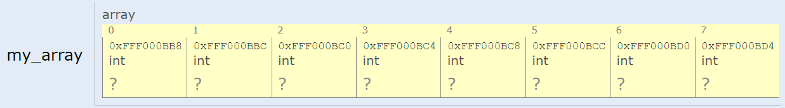
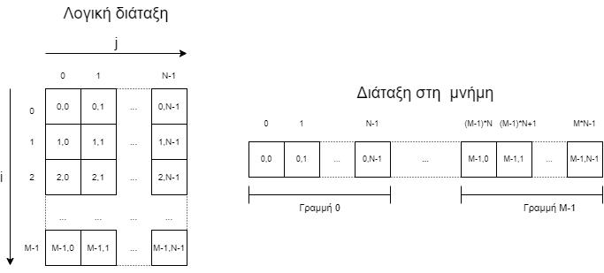
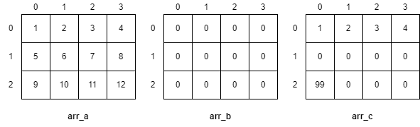
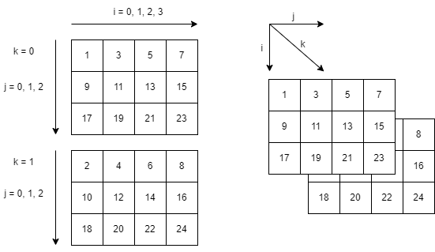
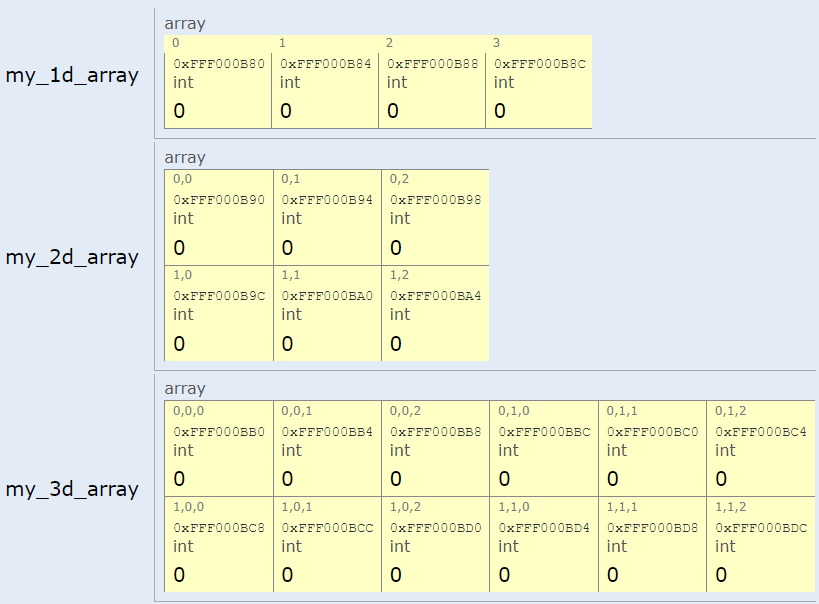

# 5. Πίνακες

<i>Σύνοψη</i> Πίνακες, πλεονεκτήματα πινάκων, δήλωση, αρχικοποίηση και διάσχιση μονοδιάστατων πινάκων, δισδιάστατοι πίνακες, διάταξη κατά γραμμές (row-major), πολυδιάστατοι πίνακες, συναρτήσεις με πίνακες ως παραμέτρους.

<i>Προαπαιτούμενη γνώση</i> Τύποι δεδομένων, είσοδος/έξοδος, δομές επιλογής και επανάληψης, συναρτήσεις.

## 5.1 Η έννοια των πινάκων στη C

Ένας πίνακας είναι μια δομή δεδομένων που επιτρέπει την αποθήκευση πολλών στοιχείων του ίδιου τύπου σε συνεχόμενες θέσεις μνήμης. Αποτελεί επίσης, έναν τρόπο αναπαράστασης μιας συλλογής στοιχείων με ένα
κοινό όνομα. Οι πίνακες χρησιμοποιούνται ευρέως στον προγραμματισμό καθώς είναι σε θέση να επεξεργαστούν μεγάλα σύνολα δεδομένων.  
Τα πλεονεκτήματα των πινάκων είναι πολλά. Το συντακτικό τους είναι απλό, εύκολο στην κατανόηση και χρήση. Η πρόσβαση στα στοιχεία τους γίνεται ταχύτατα και καθώς αποθηκεύονται σε συνεχόμενες θέσεις
μνήμης μειώνεται η επιβάρυνση διατήρησης της δομής στη μνήμη του υπολογιστή σε ό,τι αφορά το μέγεθος μνήμης που καταλαμβάνεται. Υποστηρίζουν τυχαία πρόσβαση (random access) που σημαίνει ότι η πρόσβαση
στα στοιχεία της δομής απαιτεί τον ίδιο χρόνο, ανεξάρτητα από τη θέση των στοιχείων στον πίνακα που επιλέγονται κάθε φορά. Επιπλέον, η διάσχιση των πινάκων είναι εύκολη και γίνεται χρησιμοποιώντας απλούς
βρόχους επανάληψης.  
Οι συνηθέστερα χρησιμοποιούμενοι πίνακες είναι οι μονοδιάστατοι, οι δισδιάστατοι και οι τρισδιάστατοι πίνακες. Ωστόσο, σε ειδικές περιπτώσεις βρίσκουν χρήση και πίνακες περισσότερων διαστάσεων.

## 5.2 Μονοδιάστατοι πίνακες

Η δήλωση μονοδιάστατων πινάκων στη C γίνεται με την ακόλουθη σύνταξη:

```
τύπος_δεδομένων όνομα_πίνακα[μέγεθος_πίνακα];
```

Ο τύπος_δεδομένων είναι κάποιος από τους τύπους δεδομένων της γλώσσας (π.χ. <span class="p-style">char, int, float</span>) ή κάποιος τύπος που ορίζεται από τον χρήστη (βλ. Κεφάλαιο 6). Το όνομα_πίνακα είναι ένα αναγνωριστικό του πίνακα για τη συνέχεια του προγράμματος και πρέπει να ακολουθεί τους κανόνες ονοματολογίας αναγνωριστικών της γλώσσας (να ξεκινά με κάτω παύλα ή γράμμα του αγγλικού αλφαβήτου, να μην έχει κενά, να περιλαμβάνει μόνο γράμματα του αγγλικού αλφαβήτου και ψηφία, να μην είναι δεσμευμένη λέξη). Το μέγεθος_πίνακα είναι μια θετική ακέραια τιμή και καθορίζει το πλήθος των στοιχείων του πίνακα. Με βάση τα παραπάνω, ένα παράδειγμα δήλωσης ενός πίνακα 8 ακεραίων τιμών με όνομα <span class="p-style">my_array</span>, είναι το ακόλουθο:
```
int my_array[8];
```  

Το Σχήμα 5.1 δείχνει μια πιθανή διάταξη των στοιχείων του πίνακα <span class="p-style">my_array</span> στη μνήμη, όπως απεικονίζεται με το C Tutor(1). Καθώς ο <span class="p-style">my_array</span> είναι πίνακας ακεραίων οι αποστάσεις διαδοχικών στοιχείων του είναι 4 bytes, όπως φαίνεται και από τις διευθύνσεις των στοιχείων στο σχήμα (π.χ. <span class="p-style">0xFFF0000BB8</span> και <span class="p-style">0xFFF0000BBC</span> απέχουν 4). Επίσης, ο πίνακας θεωρείται ότι έχει κατηγορία αποθήκευσης (storage class) auto, οπότε οι τιμές των στοιχείων του δεν είναι αρχικοποιημένες με τιμές με νόημα, και αυτό υποδηλώνεται στο σχήμα με περιεχόμενο <span class="p-style">?</span> για κάθε στοιχείο.
{ .annotate }

1. <a href="https://pythontutor.com/c.html" target="_blank">https://pythontutor.com/c.html</a>  


  

<div style="text-align: center;"><b>Σχήμα 5.1:</b><i> Διάταξη στοιχείων μονοδιάστατου πίνακα 8 ακεραίων στη μνήμη.</i></div>

Η δεικτοδότηση των πινάκων γίνεται ξεκινώντας από το 0 για το πρώτο στοιχείο του πίνακα. Το δεύτερο στοιχείο του πίνακα έχει τον δείκτη 1, το τρίτο στοιχείο του πίνακα έχει τον δείκτη 2 κ.ο.κ. Η πρόσβαση στα περιεχόμενα του πίνακα γίνεται με το όνομα του πίνακα ακολουθούμενο από αγκύλες <span class="p-style">[ ]</span> που περικλείουν έναν δείκτη που προσδιορίζει κάθε φορά μια θέση του πίνακα. Το σκεπτικό της σχεδιαστικής απόφασης χρήσης του 0 έναντι του 1 για την έναρξη της αρίθμησης των δεικτών περιγράφεται εύγλωττα στο [^1] και μπορεί να συνοψιστεί στο ότι ο δείκτης κάθε στοιχείου του πίνακα θα πρέπει να ισούται με το πλήθος της ακολουθίας στοιχείων του πίνακα που προηγούνται του συγκεκριμένου στοιχείου.  
Το εύρος των έγκυρων τιμών που μπορούν να χρησιμοποιηθούν για τους δείκτες καθώς η αρίθμηση των δεικτών ξεκινά από 0 είναι από 0 έως το μέγεθος του πίνακα μειωμένο κατά ένα. Ωστόσο, κανείς δεν εμποδίζει
τον προγραμματιστή να γράψει λανθασμένο κώδικα που χρησιμοποιεί μη έγκυρες τιμές δεικτών, δηλαδή είτε αρνητικές είτε ίσες ή μεγαλύτερες από το μέγεθος του πίνακα. Το πρόγραμμα σε αυτές τις περιπτώσεις θα
μεταγλωττιστεί κανονικά, αλλά η λειτουργία του δεν θα είναι η προσδοκώμενη.  
Η δήλωση ενός πίνακα και η ταυτόχρονη ανάθεση τιμών στα στοιχεία του μπορεί να γίνει όπως στη συνέχεια:

```
char a[4] = {'a', 'b', 'c', 'd'};
```

ή ισοδύναμα παραλείποντας το πλήθος των στοιχείων του πίνακα καθώς αυτό μπορεί να προσδιοριστεί από το πλήθος των στοιχείων που ακολουθούν.
```
char a[] = {'a', 'b', 'c', 'd'}; // πίνακας χαρακτήρων 4 θέσεων
```
Επίσης, η αρχικοποίηση ενός πίνακα μπορεί να γίνει με ξεχωριστές εντολές μετά τη δήλωση του πίνακα, όπως στη συνέχεια.

```
char a[4];
a[0] = 'a';
a[1] = 'b';
a[2] = 'c';
a[3] = 'd';
```

Ένας γρήγορος τρόπος αρχικοποίησης ενός πίνακα με μηδενικά είναι ορίζοντας το μέγεθος του πίνακα και τοποθετώντας ένα μηδενικό μέσα σε αγκύλες. Μπορούν επίσης να οριστούν μόνο οι πρώτες τιμές του πίνακα και οι υπόλοιπες τιμές θα λάβουν την τιμή μηδέν. Ακολουθούν παραδείγματα.

```
int a[5] = {0}; // {0, 0, 0, 0, 0}
int b[5] = {99, 77}; // {99, 77, 0, 0, 0}
```
Ο ευκολότερος τρόπος διάσχισης ενός μονοδιάστατου πίνακα είναι με μια εντολή επανάληψης <span class="p-style">for</span>, όπως στο ακόλουθο παράδειγμα (κώδικας 5.1) όπου υπολογίζεται το άθροισμα των στοιχείων ενός πίνακα πραγματικών αριθμών καθώς και η μικρότερη και η μεγαλύτερη τιμή του πίνακα.

```{.c title="Κώδικας 5.1: ch5_p1.c - υπολογισμός αθροίσματος, ελάχιστης και μέγιστης τιμής σε μονοδιάστατο πίνακα." linenums="1"}
--8<-- "src/ch5_p1.c"
```
Η έξοδος του προγράμματος είναι η ακόλουθη.

```
Sum=15.35
Minimum=0.33, maximum=3.14
```

Ένα ακόμα παράδειγμα με μονοδιάστατο πίνακα παρουσιάζεται στο ακόλουθο πρόγραμμα σειριακής αναζήτησης (linear search), στον κώδικα 5.2, όπου ο χρήστης εισάγει μια τιμή και ζητείται η εύρεση της πρώτης θέσης εμφάνισής της σε έναν πίνακα. Αν η τιμή δεν υπάρχει τότε εμφανίζεται σχετικό μήνυμα.


```{.c title="Κώδικας 5.2: ch5_p2.c - σειριακή αναζήτηση." linenums="1"}
--8<-- "src/ch5_p2.c"
```
Ακολουθούν τα αποτελέσματα εκτέλεσης για μια τιμή που εισάγει ο χρήστης και η οποία εντοπίζεται στον πίνακα.

```
Enter the key you want to search for: 16
Key 16 found at index 3
```

Όπως αναφέρθηκε παραπάνω, λόγω της τυχαίας πρόσβασης, ο χρόνος πρόσβασης στα στοιχεία ενός πίνακα είναι σταθερός, ανεξάρτητος από τη θέση του κάθε στοιχείου και το μέγεθος του πίνακα. Αυτό συμβαίνει διότι η πρόσβαση σε κάθε στοιχείο που βρίσκεται στη θέση <span class="p-style">i</span>, μετασχηματίζεται σε υπολογισμό της διεύθυνσης μνήμης όπου βρίσκεται, που είναι απλά το άθροισμα της διεύθυνσης έναρξης του πίνακα και του γινομένου του <span class="p-style">i</span> επί το μέγεθος του τύπου δεδομένων των στοιχείων του πίνακα. Ο υπολογισμός αυτός (δηλαδή ένας πολλαπλασιασμός και μια πρόσθεση) απαιτεί τον ίδιο υπολογιστικό φόρτο σε κάθε περίπτωση καθώς δεν εξαρτάται από τη θέση του στοιχείου.

### 5.2.1 Μονοδιάστατοι πίνακες ως παράμετροι συναρτήσεων

Οι συναρτήσεις με μονοδιάστατους πίνακες ως παραμέτρους επιτρέπουν την εκτέλεση λειτουργιών χρησιμοποιώντας τα στοιχεία πινάκων μέσα στον κώδικα των συναρτήσεων αυτών. Όταν ένας πίνακας περάσει ως παράμετρος σε μια συνάρτηση, στην πραγματικότητα περνά μια αναφορά του, που σημαίνει ότι η συνάρτηση λειτουργεί απευθείας στον αρχικό πίνακα στη μνήμη και όχι σε κάποιο αντίγραφό του. Συνεπώς, αλλαγές που γίνονται στα στοιχεία του πίνακα μέσα στη συνάρτηση αντικατοπτρίζονται και στον πίνακα στο σημείο κλήσης της συνάρτησης. Ως ένα απλό παράδειγμα παρουσιάζεται ο κώδικας 5.3 όπου η συνάρτηση <span class="p-style">fun()</span> δέχεται ως όρισμα έναν πίνακα με ακεραίους και τον τροποποιεί έτσι ώστε όλες οι αρνητικές τιμές του να γίνονται μηδέν.

```{.c title="Κώδικας 5.3: ch5_p3.c - τροποποίηση τιμών πίνακα που δέχεται η συνάρτηση ως όρισμα." linenums="1"}
--8<-- "src/ch5_p3.c"
```

Η έξοδος του προγράμματος είναι η ακόλουθη:

```
1 ‐2  3 ‐4  5 ‐6  7 ‐8  9
1  0  3  0  5  0  7  0  9
```
Ένα ακόμα παράδειγμα συναρτήσεων που η κλήση τους τροποποιεί τον πίνακα που δέχονται ως όρισμα είναι οι συναρτήσεις ταξινόμησης. Στον κώδικα 5.4 η κλήση της συνάρτησης <span class="p-style">insertion_sort()</span> ταξινομεί τον πίνακα ακεραίων που δέχεται ως όρισμα σύμφωνα με τον αλγόριθμο ταξινόμησης με εισαγωγή. Η ταξινόμηση με εισαγωγή είναι ένας απλός αλγόριθμος ταξινόμησης. Περισσότερες πληροφορίες για τον αλγόριθμο ταξινόμησης με εισαγωγή μπορούν να εντοπιστούν στο [^2].


```{.c title="Κώδικας 5.4: ch5_p4.c, ταξινόμηση με εισαγωγή" linenums="1"}
--8<-- "src/ch5_p4.c"
```
Η έξοδος του προγράμματος είναι η ακόλουθη.
```
Original Array=12 11 13 5 6
Sorted Array=5 6 11 12 13
```
Να σημειωθεί ότι ένας πίνακας δεν μπορεί να επιστραφεί ως αποτέλεσμα μιας συνάρτησης. Ο περιορισμός αυτός μπορεί να παρακαμφθεί με χρήση δεικτών (pointers) που περιγράφονται στο επόμενο κεφάλαιο.

## 5.3 Δισδιάστατοι πίνακες

Οι δισδιάστατοι πίνακες μπορεί να θεωρηθεί ότι έχουν λογική οργάνωση των δεδομένων σε γραμμές και στήλες. Η δήλωση ενός δισδιάστατου πίνακα γίνεται ως εξής:

```
τύπος_δεδομένων όνομα_πίνακα[πλήθος_γραμμών][πλήθος_στηλών];
```
Ένας δισδιάστατος πίνακας 𝑀 × 𝑁 (Μ γραμμών και N στηλών) μπορεί να αναπαρασταθεί όπως φαίνεται στην αριστερή πλευρά του Σχήματος 5.2 με τον δείκτη <span class="p-style">i</span> να αναφέρεται στις γραμμές και τον δείκτη <span class="p-style">j</span> να αναφέρεται στις στήλες. Στη δεξιά πλευρά του ίδιου σχήματος φαίνεται η διάταξη των στοιχείων του πίνακα στη μνήμη. Η διάταξη αποθήκευσης των δεδομένων είναι η λεγόμενη row-major διάταξη, όπου οι γραμμές του πίνακα αποθηκεύονται στη μνήμη η μια μετά την άλλη. Row-major διάταξη αποθήκευσης χρησιμοποιούν και άλλες διαδεδομένες γλώσσες προγραμματισμού όπως η C++, η Java και η Python (για λίστες που περιέχουν λίστες). Άλλες γλώσσες προγραμματισμού όπως η Fortran, η R, το MATLAB, η Julia και οι NumPy πίνακες της Python υποστηρίζουν column-major διάταξη αποθήκευσης, δηλαδή οι στήλες του πίνακα αποθηκεύονται σε διαδοχικές θέσεις μνήμης.



<div style="text-align: center;"><b>Σχήμα 5.2:</b><i> Λογική διάταξη δισδιάστατου πίνακα Μ × 𝑁 και διάταξη αποθήκευσής του στη μνήμη.</i></div> 

Για να δηλωθεί ένας πίνακας ακεραίων 3 × 4 χρησιμοποιείται η ακόλουθη εντολή:

```
int arr[3][4];
```
Όπως και στους μονοδιάστατους πίνακες, ένας δισδιάστατος πίνακας μπορεί να αρχικοποιηθεί κατά τη δήλωσή του. Θεωρώντας ότι ένας δισδιάστατος πίνακας είναι ένας μονοδιάστατος που κάθε στοιχείο του είναι ένας άλλος μονοδιάστατος πίνακας, ο ακόλουθος τρόπος αρχικοποίησης για παράδειγμα για έναν πίνακα 3×4, φαίνεται να είναι φυσικός και αναμενόμενος.

```
int arr[3][4] = {{1, 2, 3, 4}, {5, 6, 7, 8}, {9, 10, 11, 12}};
```
Ο μεταγλωττιστής είναι σε θέση από τα δεδομένα αρχικοποίησης ενός δισδιάστατου πίνακα να συμπεράνει ποια θα πρέπει να είναι η πρώτη διάσταση του πίνακα (αριθμός γραμμών), εφόσον δίνεται η δεύτερη διάστασή του (αριθμός στηλών). Η δήλωση και αρχικοποίηση ενός πίνακα μπορεί να γίνει με διάφορους τρόπους. Και στις 3 περιπτώσεις που ακολουθούν ο πίνακας που προκύπτει είναι <span class="p-style">3 × 4</span>.

```
int arr_a[][4] = {{1, 2, 3, 4}, {5, 6, 7, 8}, {9, 10, 11, 12}};
int arr_b[3][4] = {{0}};
int arr_c[][4] = {{1, 2, 3, 4},{0}, {99}};
```
Τα περιεχόμενα των πινάκων μετά την αρχικοποίηση φαίνονται στο Σχήμα 5.3.



<div style="text-align: center;"><b>Σχήμα 5.3:</b><i> Περιεχόμενα δισδιάστατων πινάκων μετά τη δήλωση και αρχικοποίησή τους.</i></div>

Η διάσχιση όλων των στοιχείων ενός δισδιάστατου πίνακα (π.χ. Μ γραμμών και Ν στηλών) γίνεται εύκολα με εμφωλευμένες for, με την εξωτερική for να αφορά τον δείκτη των γραμμών και την εσωτερική for να αφορά τον δείκτη των στηλών όπως στη συνέχεια:

```
for(i=0;i<M;i++){
    for(j=0;j<N;j++){
        ...a[i][j]...
    }
}
```

Στην περίπτωση αυτή τα στοιχεία του πίνακα διασχίζονται κατά γραμμές, ενώ αν είναι επιθυμητό η διάσχιση να γίνει κατά στήλες, μπορεί απλά να εναλλαχτεί η σειρά των δύο εντολών <span class="p-style">for</span>:

```
for(j=0;j<N;j++){
    for(i=0;i<M;i++){
        ...a[i][j]...
    }
}
```

Ωστόσο, η διάσχιση μεγάλων πινάκων στη δεύτερη περίπτωση είναι λιγότερο αποδοτική σε σχέση με την πρώτη. Αυτό συμβαίνει διότι η C ως row-major γλώσσα προγραμματισμού αποθηκεύει στοιχεία της ίδιας γραμμής σε συνεχόμενες θέσεις μνήμης. Όταν γίνεται πρόσβαση σε μια θέση μνήμης, τα περιεχόμενα της θέσης μνήμης και ενός πλήθους επόμενων θέσεων μνήμης μεταφέρονται στη λανθάνουσα μνήμη (cache), έτσι ώστε μελλοντικές προσβάσεις σε αυτές να είναι ταχύτερες, καθώς η λανθάνουσα μνήμη είναι πολύ ταχύτερη σε σχέση με την κύρια μνήμη. Αν ένας δισδιάστατος πίνακας έχει πολλά στοιχεία και διασχίζεται πρώτα κατά στήλες και μετά κατά γραμμές, αυξάνεται η πιθανότητα τα στοιχεία που συναντώνται να μην υπάρχουν ήδη στη λανθάνουσα μνήμη και να απαιτείται συχνότερα η χρονοβόρα πρόσβαση στην κύρια μνήμη.


### 5.3.1 Δισδιάστατοι πίνακες ως παράμετροι συναρτήσεων

Οι δισδιάστατοι πίνακες μπορούν να περάσουν ως παράμετροι συναρτήσεων όπως συμβαίνει στο ακόλουθο πρόγραμμα (κώδικας 5.5). Η συνάρτηση calculate_totals() δέχεται έναν δισδιάστατο πίνακα με 3 γραμμές και 4 στήλες ως παράμετρο εισόδου και επιστρέφει μέσω δύο άλλων μονοδιάστατων πινάκων που λειτουργούν ως παράμετροι εξόδου τα αθροίσματα ανά γραμμές και τα αθροίσματα ανά στήλες του δισδιάστατου πίνακα.


```{.c title="Κώδικας 5.5: ch5_p5.c - αθροίσματα ανά γραμμές και ανά στήλες σε δισδιάστατο πίνακα" linenums="1"}
--8<-- "src/ch5_p5.c"
```
Τα αποτελέσματα της εκτέλεσης είναι τα ακόλουθα:

```
Row Totals: 10 26 42
Column Totals: 15 18 21 24
```
## 5.4 Πολυδιάστατοι πίνακες

Πίνακες με περισσότερες από δύο διαστάσεις βρίσκουν εφαρμογή σε ειδικές εφαρμογές, όπως για παράδειγμα οι τρισδιάστατοι πίνακες στην επεξεργασία ιατρικής εικόνας, σε βιντεοπαιχνίδια, σε γραφικά υπολογιστών, σε συστήματα γεωγραφικών πληροφοριών (GIS) και άλλα. Η δήλωση ενός πολυδιάστατου πίνακα γίνεται ως εξής:

```
τύπος_δεδομένων όνομα_πίνακα[διάσταση1][διάσταση2]...[διάστασηΝ];
```

Η αναφορά σε ένα στοιχείο του πίνακα γίνεται με τη χρήση τόσων δεικτών όσες είναι οι διαστάσεις του πίνακα. Για παράδειγμα, αν ο πίνακας a είναι τρισδιάστατος με διαστάσεις 𝑀 × 𝑁 × 𝐾, τότε η διάσχιση όλων των στοιχείων του πίνακα γίνεται ως εξής:

```
for(i=0;i<M;i++){
    for(j=0;j<N;j++){
        for(k=0;k<K;k++){
            ...a[i][j][k]...
        }
    }
}
```

Στο ακόλουθο παράδειγμα (κώδικας 5.6) δηλώνεται και αρχικοποιείται ένας πίνακας ακεραίων <span class="p-style">3 × 4 × 2</span>. Μια οπτική αναπαράστασή του φαίνεται στο Σχήμα 5.4. Στη συνέχεια καλείται μια συνάρτηση που δέχεται ως παράμετρο τον πίνακα και επιστρέφει το άθροισμα όλων των στοιχείων του.



<div style="text-align: center;"><b>Σχήμα 5.4:</b><i> Παράδειγμα τρισδιάστατου πίνακα 3 × 4 × 2.</i></div>

```{.c title="Κώδικας 5.6: ch5_p6.c - άθροισμα όλων των στοιχείων ενός τρισδιάστατου πίνακα." linenums="1"}
--8<-- "src/ch5_p6.c"
```

Η έξοδος του προγράμματος είναι απλά η εκτύπωση του αθροίσματος 1 + 2 + 3 + ... + 24 που δίνει ως αποτέλεσμα την τιμή 300.  
Η χρήση συγκεκριμένων τιμών για το πλήθος γραμμών, πλήθος στηλών και βάθους για τον πίνακα στη συνάρτηση, ακυρώνει σε μεγάλο βαθμό τα πλεονεκτήματα της χρήσης συνάρτησης, γιατί η συνάρτηση μπορεί να χρησιμοποιηθεί μόνο για πίνακες με αυτές τις διαστάσεις. Μια χρησιμότερη λύση θα δεχόταν ως παραμέτρους τον πίνακα, και 3 επιπλέον παραμέτρους για το πλήθος γραμμών, πλήθος στηλών και βάθος του πίνακα. Για να γίνει αυτό θα πρέπει να χρησιμοποιηθούν δείκτες, όπως θα συμβεί σε παραδείγματα του Κεφαλαίου 8.  
Ολοκληρώνοντας το παρόν κεφάλαιο τονίζεται ότι σε κάθε περίπτωση πίνακα (μιας διάστασης, δύο διαστάσεων, περισσότερων διαστάσεων), οι θέσεις που καταλαμβάνονται στη μνήμη είναι συνεχόμενες, όπως φαίνεται στο Σχήμα 5.5 που δείχνει 3 πίνακες που αρχικοποιούνται με τις ακόλουθες εντολές:

```
int my_1d_array[4]={0};
int my_2d_array[2][3]={{0}};
int my_3d_array[2][2][3]={{{0}}};
```



<div style="text-align: center;"><b>Σχήμα 5.5:</b><i> Αποτελέσματα αρχικοποίησης πινάκων (μονοδιάστατου, δισδιάστατου και τρισδιάστατου πίνακα), οπτι-
κοποίηση με το C Tutor.</i></div>

## 5.5 Ασκήσεις

***Άσκηση 1*** Γράψτε ένα πρόγραμμα που δέχεται έναν πίνακα ακεραίων ως είσοδο και αντιστρέφει τη σειρά των στοιχείων του. Για παράδειγμα, αν ο πίνακας εισόδου είναι  
ο <span class="p-style">1, 2, 3, 4, 5</span> τότε να γίνεται <span class='p-style'>5, 4, 3, 2, 1</span>. Υλοποιήστε μια συνάρτηση <span class="p-style">reverse_array()</span> για την πραγματοποίηση της αντιστροφής. Εκτυπώστε τον αρχικό και τον ανεστραμμένο πίνακα.

??? note "Λύση άσκησης 1"
    ```{.c linenums="1"}
    --8<-- "src/ch5_e1.c"
    ```

***Άσκηση 2*** Γράψτε ένα πρόγραμμα που να υπολογίζει το εσωτερικό γινόμενο (inner product ή dot product) δύο πινάκων με πραγματικές τιμές. Το εσωτερικό γινόμενο δύο πινάκων ορίζεται για πίνακες με το ίδιο μέγεθος και είναι το άθροισμα των γινομένων στοιχείων των δύο πινάκων που βρίσκονται στην ίδια θέση. Υλοποιήστε μια συνάρτηση <span class='p-style'>inner_product()</span> για την πραγματοποίηση του υπολογισμού. Η συνάρτηση να δέχεται δύο πίνακες και να επιστρέφει το εσωτερικό τους γινόμενο.

??? note "Λύση άσκησης 2"
    ```{.c linenums="1"}
    --8<-- "src/ch5_e2.c"
    ```

***Άσκηση 3*** Γράψτε ένα πρόγραμμα που να δημιουργεί έναν πίνακα ακεραίων 5 × 5 που να είναι συμπληρωμένος κατά γραμμές από τους πρώτους 25 αριθμούς Fibonacci. Οι αριθμοί Fibonacci είναι μια ακολουθία αριθμών που ξεκινά με το 1 ως τα δύο πρώτα στοιχεία της ακολουθίας και κάθε επόμενος αριθμός είναι το άθροισμα των δύο προηγούμενων. Συνεπώς η ακολουθία Fibonacci αποτελείται από τους όρους  
1, 1, 2, 3, 5, 8, 13, 21, 34, 55, 89, 144, 233, 377, ....

??? note "Λύση άσκησης 3"
    ```{.c linenums="1"}
    --8<-- "src/ch5_e3.c"
    ```

***Άσκηση 4*** Γράψτε ένα πρόγραμμα που ο χρήστης να γεμίζει έναν πίνακα ακεραίων 5 × 3. Στη συνέχεια το πρόγραμμα να υπολογίζει και να εμφανίζει τη μέγιστη τιμή ανά στήλη.

??? note "Λύση άσκησης 4"
    ```{.c linenums="1"}
    --8<-- "src/ch5_e4.c"
    ```

[^1]: Edsger W Dijkstra. <i>Why numbering should start at zero (EWD 831)</i>. 1982.

[^2]: <i>Rosetta Code, sorting algorithms, insertion sort.</i> <a href="https://rosettacode.org/wiki/Sorting_algorithms/Insertion_sort" target="_blank">https://rosettacode.org/wiki/Sorting_algorithms/Insertion_sort</a>. Accessed: 2023-06-01.