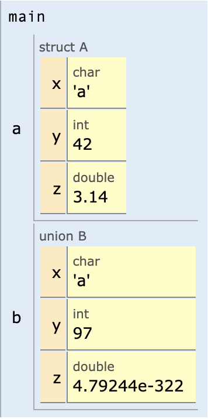
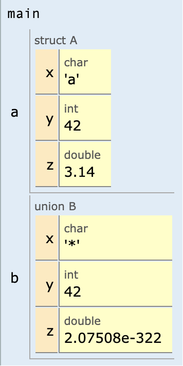
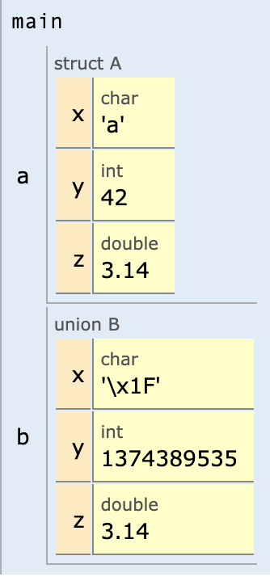

# 6. Δομές και ενώσεις

<i>Σύνοψη</i> Δομές, δηλώσεις δομών, η δεσμευμένη λέξη <span class="p-style">typedef</span>, αρχικοποίηση δομής, δομές σε συναρτήσεις, σύγκριση δομών, δομές μέσα σε δομές, πίνακες με στοιχεία δομές, ενώσεις.  

<i>Προαπαιτούμενη γνώση</i>  Τύποι δεδομένων, είσοδος/έξοδος, δομές επιλογής και επανάληψης, συναρτήσεις, πίνακες.


## 6.1 Δήλωση δομών

Η δομή (structure) χρησιμοποιείται ως συλλογή μεταβλητών διαφορετικού τύπου προκειμένου να περιγράψει συνολικά μια οντότητα. Για παράδειγμα η οντότητα person (πρόσωπο) αποτελείται από τα πεδία:

1. Όνομα (αλφαριθμητικό)
2. Επώνυμο (αλφαριθμητικό)
3. Ηλικία (ακέραιος αριθμός)
4. Ύψος (δεκαδικός αριθμός)

Για τη δήλωση της δομής χρησιμοποιείται ο προσδιοριστής struct, όπως στη συνέχεια:

```{.c}
struct person {
    char name[100];
    char lastname[100];
    int age;
    double height;
};
```

Η δήλωση μιας δομής μοιάζει αρκετά με τη δήλωση συναρτήσεων, χωρίς όμως τον εκτελέσιμο κώδικα. Η δήλωση δομής δεν σημαίνει όμως και δήλωση μεταβλητής. Αυτό πρέπει να γίνει μέσα σε κάποια συνάρτηση, π.χ. στη <span class="p-style">main()</span>, όπως:

```{.c}
struct person a_person;
```
Αυτή η δήλωση δημιουργεί μια μεταβλητή τύπου <span class="p-style">person</span> με όνομα <span class="p-style">a_person</span>. Ένα παράδειγμα χρήσης δομής παρουσιάζεται στον κώδικα 6.1. Για την αναφορά στα πεδία της δομής χρησιμοποιείται ο τελεστής τελείας (dot operator) που είναι γνωστός και ως τελεστής συμμετοχής. Κάθε πεδίο της μεταβλητής <span class="p-style">a_person</span> μπορεί να χρησιμοποιηθεί και σαν διαφορετική μεταβλητή, δηλαδή για παράδειγμα η μεταβλητή <span class="p-style">a_person.age</span> αντιμετωπίζεται σαν μια ξεχωριστή ακέραια μεταβλητή που στην περίπτωση του συγκεκριμένου προβλήματος αναπαριστά ηλικίες.

```{.c title="Κώδικας 6.1: ch6_p1.c - εισαγωγή και εμφάνιση στοιχείων προσώπου." linenums="1"}
--8<-- "src/ch6_p1.c"
```

Ένα παράδειγμα εκτέλεσης του κώδικα για τιμές που εισάγει ο χρήστης παρουσιάζεται στη συνέχεια:

```
Input data for a person
First name: John
Last name: Doe
Age: 30
Height: 1.8
Person's data
John Doe
30 1.800000
Adult
```
Μια δομή μπορεί να περιλαμβάνει στα πεδία της πίνακες. Για παράδειγμα στον κώδικα 6.2 παρουσιάζεται η δήλωση της δομής φοιτητή που στα πεδία της περιλαμβάνει έναν πίνακα βαθμών εξαμήνου. Η συνάρτηση <span class="p-style">average()</span> θα υπολογίσει τον μέσο όρο της βαθμολογίας του συγκεκριμένου φοιτητή. Ο πίνακας <span class="p-style">giannis.lessons</span> περνά ως όρισμα σε συνάρτηση που δέχεται πίνακα δεκαδικών τιμών, αν και είναι πεδίο δομής.

```{.c title="Κώδικας 6.2: ch6_p2.c - εμφάνιση μέσου όρου βαθμών φοιτητή." linenums="1"}
--8<-- "src/ch6_p2.c"
```

Η έξοδος του προγράμματος θα είναι η ακόλουθη:

```
Average grade for [1000, Pappas, Giannis]: 7.33
```

## 6.2 Χρήση του typedef

Η δεσμευμένη λέξη typedef χρησιμοποιείται για να ορίσει νέους τύπους δεδομένων ως ψευδώνυμα άλλων τύπων, προκειμένου να χρησιμοποιηθούν ονόματα που απομνημονεύονται ευκολότερα. Για παράδειγμα η δήλωση:

```{.c}
typedef double big_number;
```

ορίζει πως το όνομα <span class="p-style">big_number</span> μπορεί να χρησιμοποιηθεί ως ψευδώνυμο του ενσωματωμένου τύπου δεδομένων <span class="p-style">double</span>. Συνεπώς η δήλωση:

```{.c}
double x;
```
και η δήλωση

```
big_number x;
```
είναι ακριβώς οι ίδιες.

Η δεσμευμένη λέξη <span class="p-style">typedef</span> μπορεί να χρησιμοποιηθεί για να αντικαταστήσει πίνακες με τύπους δεδομένων που ορίζονται από τον χρήστη, όπως στον κώδικα 6.3, όπου δηλώνεται ένας νέος τύπος για αλφαριθμητικά ως ψευδώνυμο σε πίνακα χαρακτήρων. Ο νέος τύπος δεδομένων ονομάστηκε <span class="p-style">string</span> και η χρήση του δεν περιλαμβάνει τον προσδιορισμό του πλήθους χαρακτήρων καθώς αυτό ορίζεται στη δήλωση του τύπου.


```{.c title="Κώδικας 6.3: ch6_p3.c - δήλωση τύπου αλφαριθμητικού." linenums="1"}
--8<-- "src/ch6_p3.c"
```
Η επαναλαμβανόμενη πληκτρολόγηση της δεσμευμένης λέξης struct μπορεί να αποφευχθεί. Η δήλωση:

```{.c}
struct person a_person;
```

μπορεί να αντικατασταθεί με τη συντομότερη:
```
person a_person;
```
Συνεπώς, η δήλωση της δομής μπορεί να γίνει με τη βοήθεια της δεσμευμένης λέξης <span class="p-style">typedef</span> που παρουσιάστηκε νωρίτερα. Ένα ενδεικτικό παράδειγμα χρήσης παρουσιάζεται στον κώδικα 6.4.

```{.c title="Κώδικας 6.4: ch6_p4.c - ο τύπος δομής person με χρήση typedef." linenums="1"}
--8<-- "src/ch6_p4.c"
```

Το προηγούμενο παράδειγμα μπορεί να συνδυαστεί με τον τύπο <span class="p-style">string</span> και να προκύψει ο ισοδύναμος κώδικας 6.5.

```{.c title="Κώδικας 6.5: ch6_p5.c - ο τύπος δομής person με χρήση typedef και χρήση του βοηθητικού τύπου string." linenums="1"}
--8<-- "src/ch6_p5.c"
```

## 6.3 Αρχικοποίηση δομής

Μια μεταβλητή δομής μπορεί να αρχικοποιηθεί με αναθέσεις και είσοδο τιμών από τον χρήστη αλλά μπορεί να αρχικοποιηθεί ταυτόχρονα με τη δήλωση, όπως και οι πίνακες. Ένα απλό παράδειγμα αρχικοποίησης της δομής person που αναφέρθηκε παραπάνω παρουσιάζεται στον κώδικα 6.6. Η αρχικοποίηση γίνεται απευθείας κατά τη δήλωση της μεταβλητής.

```{.c title="Κώδικας 6.6: ch6_p6.c - αρχικοποίηση δομής κατά τη δήλωση." linenums="1"}
--8<-- "src/ch6_p6.c"
```
Ωστόσο, η αρχικοποίηση της δομής μπορεί να γίνει και όταν δηλώνεται ο τύπος της δομής, όπως παρουσιάζεται στον κώδικα 6.7. Σε αυτήν την περίπτωση όμως, η μεταβλητή <span class="p-style">a_person</span> θα είναι καθολική και κατά συνέπεια θα είναι ορατή σε όλες τις συναρτήσεις που υπάρχουν στο συγκεκριμένο πρόγραμμα.

```{.c title="Κώδικας 6.7: ch6_p7.c - αρχικοποίηση δομής κατά τη δήλωση του τύπου της δομής (ch6_p7.c)." linenums="1"}
--8<-- "src/ch6_p7.c"
```

## 6.4 Συναρτήσεις και δομές

Οι δομές μπορούν να χρησιμοποιηθούν ως παράμετροι συναρτήσεων αλλά και ως τιμές επιστροφής. Στο παράδειγμα του κώδικα 6.8 παρουσιάζεται μια εφαρμογή που δέχεται από τον χρήστη την ώρα, την αποθηκεύει σε μορφή δομής και την εμφανίζει σε 12ωρη ή σε 24ωρη μορφή. Η δομή <span class="p-style">time</span> χρησιμοποιείται για την αναπαράσταση της χρονικής στιγμής με τη χρήση των πεδίων: ώρα, λεπτά, δευτερόλεπτα. Η συνάρτηση <span class="p-style">read_time()</span> διαβάζει από τον χρήστη την τοπική μεταβλητή δομής <span class="p-style">t</span> και την επιστρέφει με <span class="p-style">return</span>. Από την άλλη μεριά, η συνάρτηση<span class="p-style"> print_time()</span> δέχεται δύο ορίσματα:

* Μια μεταβλητή τύπου <span class="p-style">time</span> με όνομα <span class="p-style">t</span>. Αυτή η μεταβλητή αναπαριστά τη χρονική στιγμή που θα εμφανιστεί στην οθόνη.

* Μια ακέραια μεταβλητή με όνομα <span class="p-style">flag24</span>. Αν αυτή η τιμή είναι 1 (αληθής), τότε η χρονική στιγμή θα εμφανιστεί στην οθόνη με 24ωρη μορφή αλλιώς με 12ωρη μορφή.

```{.c title="Κώδικας 6.8: ch6_p8.c - ανάγνωση και εμφάνιση ώρας." linenums="1"}
--8<-- "src/ch6_p8.c"
```

Μια πιθανή είσοδος και έξοδος του προγράμματος είναι η ακόλουθη:

```
Input hours, minutes , seconds: 14 30 20
2:30:20
14:30:20
```
Παρόμοια μπορεί να κατασκευαστεί μια συνάρτηση, η οποία μπορεί να δεχτεί ως όρισμα ή και να επιστρέφει μια δομή. Για παράδειγμα, έστω ότι είναι επιθυμητή η κατασκευή μιας συνάρτησης η οποία να λαμβάνει ως όρισμα μια χρονική στιγμή τύπου <span class="p-style">time</span> και να επιστρέφει τη χρονική στιγμή αλλά κατά ένα δευτερόλεπτο πιο μπροστά. Για παράδειγμα αν η χρονική στιγμή είναι 14:25:26, θα πρέπει να επιστρέφει τη χρονική στιγμή 14:25:27. Μια ενδεικτική υλοποίηση και χρήση της παραπάνω συνάρτησης παρουσιάζεται στον κώδικα 6.9. Η συνάρτηση <span class="p-style">advance_time()</span> δέχεται ως όρισμα τη χρονική στιγμή <span class="p-style">a_time</span> και επιστρέφει την τοπική μεταβλητή <span class="p-style">temp</span>, στην οποία αφού πρώτα αντιγράψει την <span class="p-style">a_time</span> στη συνέχεια μετατοπίζει τη χρονική στιγμή κατά 1 δευτερόλεπτο προς τα εμπρός. Ωστόσο, για να γίνει σωστά η χρονική μετατόπιση θα πρέπει να ελεγχθούν οι ακόλουθες ειδικές περιπτώσεις:

* Αν τα δευτερόλεπτα γίνουν 60, τότε πρέπει να αυξηθούν τα λεπτά κατά 1 και τα δευτερόλεπτα να γίνουν 0.
* Αν τα λεπτά γίνουν 60, τότε πρέπει να αυξηθούν οι ώρες κατά 1 και τα λεπτά να γίνουν 0.
* Αν οι ώρες γίνουν 24, τότε σημαίνει πως είμαστε στα μεσάνυχτα και επομένως οι ώρες πρέπει να γίνουν 0.

```{.c title="Κώδικας 6.9: ch6_p9.c - συνάρτηση που μετατοπίζει τη χρονική στιγμή κατά 1 δευτερόλεπτο εμπρός." linenums="1"}
--8<-- "src/ch6_p9.c"
```

Μια πιθανή είσοδος και έξοδος του προγράμματος είναι η ακόλουθη:
```
Input hours, minutes , seconds: 16 17 59
16:17:59
16:18:0
```

## 6.5 Σύγκριση δομών

Οι δομές είναι σύνθετοι τύποι δεδομένων και ως τέτοιοι δεν μπορούν να συγκριθούν άμεσα. Το παράδειγμα

```{.c}
student t1,t2;
if (t1 == t2) {...}
```
δεν είναι σωστό και θα πρέπει να γίνει σύγκριση των πεδίων των δύο δομών ένα προς ένα προκειμένου να γίνει έλεγχος.  
Στο παράδειγμα του κώδικα 6.10, δηλώνονται δύο μεταβλητές τύπου <span class="p-style">student</span> και συγκρίνονται ως προς τον μέσο όρο της βαθμολογίας με χρήση ξεχωριστής συνάρτησης. Η συνάρτηση <span class="p-style">is_better()</span> δέχεται ως ορίσματα τη μεταβλητή <span class="p-style">first</span> και τη μεταβλητή <span class="p-style">second</span>. Αν ο μέσος όρος του πρώτου φοιτητή είναι μεγαλύτερος από τον μέσο όρο του δεύτερου, η συνάρτηση επιστρέφει 1, αν ισχύει το αντίστροφο επιστρέφει -1, και αν οι μέσοι όροι είναι ίσοι, επιστρέφει 0. Στη συνάρτηση <span class="p-style">main()</span> του ίδιου προγράμματος παρουσιάζεται μια ενδεικτική χρήση της συνάρτησης.

```{.c title="Κώδικας 6.10: ch6_p10.c - σύγκριση φοιτητών ως προς τον μέσο όρο τους." linenums="1"}
--8<-- "src/ch6_p10.c"
```
Η έξοδος του προγράμματος είναι η ακόλουθη:
```
Student Giannis Pappas (1000) has better average grade than student Nikos Ioannou
    ↪ (1001)
```
Στο ίδιο πνεύμα με το προηγούμενο παράδειγμα είναι και ο κώδικας 6.11, όπου γίνεται σύγκριση χρονικών στιγμών με τη συνάρτηση <span class="p-style">compare_time()</span>. Η συνάρτηση επιστρέφει:

* 1, αν το πρώτο όρισμα αφορά χρονική στιγμή μεταγενέστερη του δεύτερου ορίσματος. Για παράδειγμα η χρονική στιγμή 12:59:21 είναι μεταγενέστερη της χρονικής στιγμής 12:36:39 και επομένως η συνάρτηση θα επιστρέψει 1 σε αυτήν την περίπτωση.
* 0, αν οι δύο χρονικές στιγμές είναι ίδιες.
* -1, αν η δεύτερη χρονική στιγμή είναι μεταγενέστερη της πρώτης.

Η συνάρτηση <span class="p-style">compare_time()</span> πρώτα μετατρέπει τις χρονικές στιγμές σε δευτερόλεπτα με τη χρήση της βοηθητικής συνάρτησης time2seconds() και στη συνέχεια συγκρίνει τα δευτερόλεπτα που προκύπτουν για κάθε χρονική στιγμή.

```{.c title="Κώδικας 6.11: ch6_p11.c - σύγκριση χρονικών στιγμών." linenums="1"}
--8<-- "src/ch6_p11.c"
```
Μια πιθανή είσοδος και έξοδος του προγράμματος είναι η ακόλουθη:
```
Input hours, minutes , seconds: 10 20 30
Input hours, minutes , seconds: 11 10 20
The second time that was given is greater
```
## 6.6 Δομές με δομές ως πεδία

Οι δομές μπορούν να χρησιμοποιούνται και ως πεδία άλλων δομών όταν αυτό απαιτείται. Για παράδειγμα η δομή <span class="p-style">person</span> μπορεί να περιλαμβάνει τη δομή <span class="p-style">date</span> ως πεδίο της, π.χ. με το πεδίο <span class="p-style">birthdate</span> (ημερομηνία γέννησης). Το θέμα αυτό παρουσιάζεται στον κώδικα 6.12 όπου η δομή <span class="p-style">date</span> χρησιμοποιείται για την αναπαράσταση ημερομηνιών. Τα πεδία της δομής είναι τα έτος, μήνας και ημέρα. Στη συνέχεια παρουσιάζεται η δήλωση της δομής <span class="p-style">person</span> για την αναπαράσταση προσώπων. Σε αυτήν τη δομή δηλώνεται, εκτός του ονόματος και του επωνύμου, και μια ακόμα μεταβλητή με όνομα <span class="p-style">birthdate</span> που είναι τύπου <span class="p-style">date</span>. Οι συναρτήσεις που περιέχει αυτό το πρόγραμμα έχουν την ακόλουθη σημασία:

* Η συνάρτηση <span class="p-style">read_date()</span> διαβάζει και επιστρέφει τα στοιχεία ημερομηνίας.
* Η συνάρτηση <span class="p-style">print_date()</span> εκτυπώνει στην οθόνη τα στοιχεία μιας ημερομηνίας τύπου date.
* Η συνάρτηση <span class="p-style">read_person()</span> διαβάζει και επιστρέφει τα στοιχεία μιας δομής τύπου person. Για να διαβάσει την ημερομηνία γέννησης χρησιμοποιεί τη συνάρτηση <span class="p-style">read_date()</span>.
* Η συνάρτηση <span class="p-style">print_person()</span> εκτυπώνει στην οθόνη τα στοιχεία μιας μεταβλητής τύπου person.
Για την εμφάνιση της ημερομηνίας γέννησης χρησιμοποιείται η συνάρτηση <span class="p-style">print_date()</span>.

```{.c title="Κώδικας 6.12: ch6_p12.c - παράδειγμα δομής (πρόσωπο) με ένθετη δομή." linenums="1"}
--8<-- "src/ch6_p12.c"
```
Μια πιθανή είσοδος και έξοδος του προγράμματος είναι η ακόλουθη:
```
Input first name and last name: John Doe
Input a birth date: 1 1 1970
Person's data:
John, Doe
1/1/1970
```
Στο παράδειγμα του κώδικα 6.13 η συνάρτηση <span class="p-style">make_younger()</span> αυξάνει κατά ένα έτος, το έτος γέννησης ενός προσώπου, με την ακόλουθη εντολή:

```
temp.birthdate.year++;
```
Σε αυτήν την ανάθεση γίνεται χρήση δύο τελεστών τελείας για να έχουμε πρόσβαση στο πεδίο του έτους. Η πρώτη τελεία πραγματοποιεί πρόσβαση στο πεδίο <span class="p-style">birthdate</span> της μεταβλητής <span class="p-style">temp</span> και η δεύτερη τελεία χρησιμοποιείται για πρόσβαση στο πεδίο <span class="p-style">year</span> της μεταβλητής <span class="p-style">temp.birthdate</span>.

```{.c title="Κώδικας 6.13: ch6_p13.c - αλλαγή έτους γέννησης προσώπου." linenums="1"}
--8<-- "src/ch6_p13.c"
```
Μια πιθανή είσοδος και έξοδος του προγράμματος είναι η ακόλουθη:
```
Input first name and last name: John Doe
Input a birth date: 1 1 1970
Person's data:
John, Doe
1/1/1971
```

## 6.7 Πίνακες δομών

Όπως ένας πίνακας μπορεί να περιέχει απλά στοιχεία έτσι μπορεί να περιέχει και δομές. Για παράδειγμα οι μαθητές μιας τάξης θα μπορούσαν να αποτελέσουν έναν πίνακα από δομές όπως και οι υπάλληλοι μιας επιχείρησης. Στον κώδικα 6.14 δημιουργείται ένας πίνακας από υπαλλήλους με πεδία: επώνυμο, αριθμός τμήματος και μισθός. Στη συνέχεια εμφανίζεται στην οθόνη το πλήθος των υπαλλήλων που λαμβάνουν λιγότερα από 1000 ευρώ τον μήνα.

```{.c title="Κώδικας 6.14: ch6_p14.c - πίνακας υπαλλήλων." linenums="1"}
--8<-- "src/ch6_p14.c"
```

Επιπλέον, στον κώδικα 6.15 παρουσιάζεται η συνάρτηση sort_employee() που ταξινομεί(1) σε φθίνουσα σειρά έναν πίνακα υπαλλήλων ως προς τον μισθό τους. Στη συνάρτηση main() του ίδιου προγράμματος παρουσιάζεται μια ενδεικτική χρήση της.
{ .annotate }

1. Η ταξινόμηση γίνεται με τον απλό αλγόριθμο bubble sort.

```{.c title="Κώδικας 6.15: ch6_p15.c - ταξινόμηση πίνακα υπαλλήλων." linenums="1"}
--8<-- "src/ch6_p15.c"
```

Η έξοδος του προγράμματος είναι η ακόλουθη:
```
Employee: 1 Lastname:   Ioannou Department:   100 Salary:  1900.00
Employee: 2 Lastname: Dimitriou Department:   100 Salary:  1320.55
Employee: 3 Lastname: Evangelou Department:   100 Salary:  1190.55
Employee: 4 Lastname:    Pappas Department:   200 Salary:   800.50
Employee: 5 Lastname:  Christou Department:   200 Salary:   761.53
```

## 6.8 Ενώσεις

Οι ενώσεις (unions) είναι παρόμοιες με τις δομές, αλλά με τη διαφορά πως σε κάθε χρονική στιγμή μόνο ένα μέλος της ένωσης μπορεί να έχει τιμή. Για παράδειγμα η δήλωση:

```{.c}
typedef union {
    int ival;
    float fval;
    double dval;
} itype;
```

δηλώνει μια ένωση με το όνομα <span class="p-style">itype</span>. Ένα παράδειγμα χρήσης της παρουσιάζεται στον κώδικα 6.16 όπου σε κάθε χρονική στιγμή μόνο μια από τις μεταβλητές είναι έγκυρη. Το συνολικό μέγεθος της μεταβλητής <span class="p-style">var</span> σε bytes είναι το μεγαλύτερο από τα στοιχεία της ένωσης. Σε αυτήν την περίπτωση, επειδή ο τύπος <span class="p-style">double</span> έχει το μεγαλύτερο μέγεθος (8 bytes), το μέγεθος της ένωσης θα είναι 8 bytes.


```{.c title="Κώδικας 6.16: ch6_p16.c - παράδειγμα χρήσης μεταβλητής ένωσης." linenums="1"}
--8<-- "src/ch6_p16.c"
```
Η έξοδος του προγράμματος είναι αυτή που εμφανίζεται παρακάτω.
```
Integer value :100
Float value: 22.559999
Double value: 1929.370000
Now integer value: ‐515396076
```
Δεν υπάρχει κάποια έκπληξη στις τρεις πρώτες τιμές που εκτυπώνονται, αλλά στην τέταρτη εκτύπωση δεν εμφανίζεται και πάλι η ακέραια τιμή 100 που είχε ανατεθεί στο πεδίο <span class="p-style">ival</span>. Αυτό συνέβη γιατί μεσολάβησε η χρήση των πεδίων <span class="p-style">fval</span> και <span class="p-style">dval</span> και έτσι πλέον η πρόσβαση στο πεδίο <span class="p-style">ival</span> επιστρέφει μη έγκυρα αποτελέσματα καθώς 4 από τα 8 bytes της τελευταίας τιμής που εισήχθηκε στην ένωση ερμηνεύονται ως ακέραια τιμή. Ωστόσο, με μια συνδυαστική χρήση δομών και ενώσεων αυτό το πρόβλημα μπορεί, αν όχι να επιλυθεί, τουλάχιστον να προβλεφθεί όπως φαίνεται στον κώδικα 6.17. Στο παράδειγμα αυτό η ένωση συμπεριλήφθηκε σε μια δομή με το όνομα <span class="p-style">number</span>. Ο τύπος του μέλους της ένωσης που είναι ενεργό καθορίζεται από το πεδίο <span class="p-style">flag</span> της δομής. Έτσι, ανάλογα με την τιμή αυτή, ο χρήστης μπορεί να ορίσει δυναμικά ποιο πεδίο της ένωσης θα είναι ενεργό σε κάθε στιγμή.

```{.c title="Κώδικας 6.17: ch6_p17.c - παράδειγμα βελτιωμένης χρήσης ένωσης." linenums="1"}
--8<-- "src/ch6_p17.c"
```

Μια πιθανή είσοδος και έξοδος του προγράμματος είναι η ακόλουθη:
```
Input an int: 42
Integer: 42
Input a double: 3.14
Double: 3.140000
```

## 6.9 Δομές και ενώσεις

Οι δομές και οι ενώσεις μοιάζουν μεταξύ τους, αλλά έχουν σημαντικές διαφορές που συνοψίζονται στον Πίνακα 6.1.

<div style="text-align: center;"><b>Πίνακας 6.1:</b><i> Σύγκριση δομών (structs) και ενώσεων (unions).</i></div>

| **Χαρακτηριστικό**       | **struct**                                                                |**union**                               |                           
|--------------------------|---------------------------------------------------------------------------|--------------------------------------------|
| **Διάταξη Μνήμης**       | Κάθε μεταβλητή σε μια δομή έχει τον δικό της χώρο στη μνήμη.            | Όλες οι μεταβλητές σε μια ένωση μοιράζονται τον ίδιο χώρο στη μνήμη.    |
| **Συνολικό Μέγεθος**     | Το μέγεθος μιας δομής είναι ίσο με το συνολικό μέγεθος όλων των μεταβλητών που περιέχει. | Το μέγεθος μιας ένωσης είναι ίσο με το μέγεθος της μεγαλύτερης μεταβλητής που περιέχει. |
| **Χρήση**               | Κατάλληλο για την αποθήκευση διαφορετικών πληροφοριών ταυτόχρονα.        | Κατάλληλο όταν θέλουμε να αποθηκεύσουμε μόνο μία από τις διαθέσιμες πληροφορίες κάθε φορά. |
| **Αρχικοποίηση τιμών**   | Τα επιμέρους μέλη της δομής μπορούν να αρχικοποιηθούν όλα μαζί.         | Μπορεί να αρχικοποιηθεί μόνο το πρώτο μέλος της ένωσης.                |
  


Στη συνέχεια για τον κώδικα 6.18 παρουσιάζεται η απεικόνιση της μνήμης(1) κατά την αρχικοποίηση μιας μεταβλητής δομής (γραμμή 14) και μιας μεταβλητής ένωσης (γραμμή 15) καθώς και οι τιμές που διατηρούν τα υπόλοιπα μέλη της μεταβλητής ένωσης, ενώ ανατίθενται νέες τιμές σε καθένα από τα μέλη της (Σχήματα 6.1, 6.2, 6.3).
{ .annotate }

2. <a href="https://pythontutor.com/c.html" target="_blank">https://pythontutor.com/c.html</a>


```{.c title="Κώδικας 6.18: ch6_p18.c - μια δομή και μια ένωση." linenums="1"}
--8<-- "src/ch6_p18.c"
```
<div class="flex">
  <div>
    
    <b> Σχήμα 6.1: </b><i>Περιεχόμενα μνήμης μετά την εκτέλεση της γραμμής 15.</i>
  </div>
  <div>
    
    <b> Σχήμα 6.2: </b><i>Περιεχόμενα μνήμης μετά την εκτέλεση της γραμμής 16.</i>
  </div>
  <div>
    
    <b> Σχήμα 6.3: </b><i>Περιεχόμενα μνήμης μετά την εκτέλεση της γραμμής 17.</i>
  </div>
</div>

Τέλος, αξίζει να αναφερθεί ότι οι δομές χρησιμοποιούνται συχνότερα από ότι οι ενώσεις, ενώ ένα διαδικτυακό άρθρο που παρουσιάζει με πληρότητα τη χρήση των δομών στη C είναι το [^1].


## 6.10 Ασκήσεις

***Άσκηση 1***  
Να γραφεί πρόγραμμα που να χρησιμοποιεί εγγραφές ενός τύπου δεδομένων που αναπαριστά κύκλους θεωρώντας ότι κάθε κύκλος ορίζεται από το κέντρο του (δύο τιμές για τις συντεταγμένες <span class="p-style">x</span> και <span class="p-style">y</span>) και την ακτίνα του (<span class="p-style">radius</span>). Το πρόγραμμα να διαθέτει συνάρτηση ανάγνωσης των στοιχείων ενός κύκλου και συναρτήσεις εκτύπωσης του εμβαδού και της περιμέτρου του κύκλου.

??? tip "Λύση άσκησης 1"
    ```{.c linenums="1"}
    --8<-- "src/ch6_e1.c"
    ```

***Άσκηση 2***  
Nα γραφεί πρόγραμμα για τον χειρισμό τηλεφωνικών επαφών. Κάθε επαφή είναι δομή με πεδία: όνομα, επώνυμο, τηλεφωνικός αριθμός. Στη <span class="p-style">main()</span> να δηλωθεί ένας πίνακας που να μπορεί να αποθηκεύσει μέχρι 100 επαφές. Να προστεθούν κατάλληλες συναρτήσεις για την ανάγνωση από το πληκτρολόγιο νέας επαφής, συνάρτηση που να αλλάζει τον τηλεφωνικό αριθμό επαφής και συνάρτηση που να ταξινομεί τις επαφές ως προς το επώνυμο.

??? tip "Λύση άσκησης 2"
    ```{.c linenums="1"}
    --8<-- "src/ch6_e2.c"
    ```

***Άσκηση 3***  
Γράψτε ένα πρόγραμμα που να διαχειρίζεται τα βιβλία που διαθέτει μια βιβλιοθήκη. Για κάθε βιβλίο να
διατηρούνται οι ακόλουθες πληροφορίες: <span class="p-style">authors</span> (συγγραφείς), <span class="p-style">isbn</span> (σειριακός αριθμός βιβλίου), <span class="p-style">published_year</span> (έτος κυκλοφορίας), <span class="p-style">copies</span> (πλήθος αντιτύπων). Συμπληρώστε συναρτήσεις για την προσθήκη ενός νέου βιβλίου στη βιβλιοθήκη, εμφάνιση όλων των βιβλίων, αναζήτηση ενός βιβλίου βάσει <span class="p-style">isbn</span>, ενημέρωση του πλήθους αντιτύπων ενός βιβλίου με το <span class="p-style">isbn</span> του και αφαίρεση ενός βιβλίου από τη βιβλιοθήκη με το <span class="p-style">isbn</span> του. Υλοποιήστε ένα μενού επιλογών για να επιλέγει ο χρήστης τη λειτουργία που επιθυμεί.

??? tip "Λύση άσκησης 3"
    ```{.c linenums="1"}
    --8<-- "src/ch6_e3.c"
    ```

***Άσκηση 4***  
Γράψτε ένα πρόγραμμα που να επιτρέπει στον χρήστη να εισάγει τιμές διαφορετικών τύπων δεδομένων στο ίδιο <span class="p-style">union</span> και στη συνέχεια να εμφανίζεται κάθε φορά η τιμή που εισήγαγε. Ειδικότερα, ορίστε ένα <span class="p-style">union</span> με όνομα <span class="p-style">data_value</span> που να μπορεί να αποθηκεύει έναν ακέραιο ή έναν πραγματικό ή ένα αλφαριθμητικό (χρησιμοποιώντας πίνακα με προκαθορισμένο μέγεθος). Με τη χρήση του ακόλουθου μενού να δίνεται στον χρήστη η δυνατότητα εισαγωγής και εμφάνισης τιμών.

```
1. Input an integer
2. Input a float
3. Input a string
4. View the current data as an integer
5. View the current data as a float
6. View the current data as a string
0. Exit
```


??? tip "Λύση άσκησης 4"
    ```{.c linenums="1"}
    --8<-- "src/ch6_e4.c"
    ```


[^1]: Andreas Heck. <i>Structures in C: From Basics to Memory Alignment.</i> <a href="https://abstractexpr.com/2023/06/29/structures-in-c-from-basics-to-memory-alignment/" target="_blank">https://abstractexpr.com/2023/06/29/structures-in-c-from-basics-to-memory-alignment/</a>. Accessed:2023-12-01.