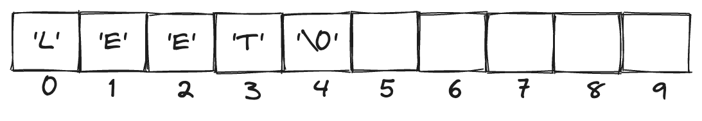
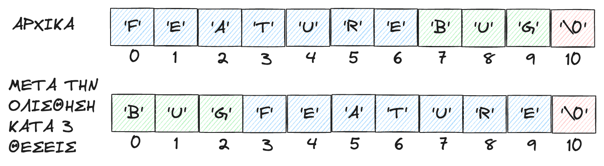
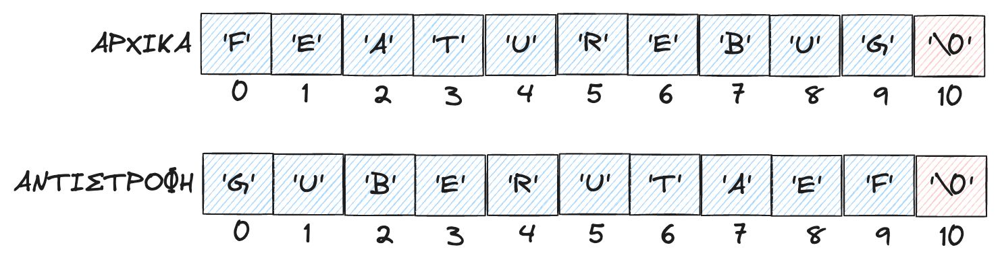

# 8. Αλφαριθμητικά

<i>Σύνοψη</i> Μεμονωμένοι χαρακτήρες, πίνακες χαρακτήρων, είσοδος αλφαριθμητικών με την <span class="p-style">fgets()</span>, συναρτήσεις αλφαριθμητικών, <span class="p-style">strlen(), strcat(), strcmp(), sscanf(), sprintf(), strtok()</span>, εφαρμογές με αλφαριθμητικά.  

<i>Προαπαιτούμενη γνώση</i> Τύποι δεδομένων, είσοδος/έξοδος, δομές επιλογής και επανάληψης, συναρτήσεις, πίνακες, δομές, δείκτες.

## 8.1 Εισαγωγή

Τα αλφαριθμητικά είναι ιδιαίτερη περίπτωση μονοδιάστατων πινάκων καθώς αποτελούνται από χαρακτήρες και ο σκοπός τους είναι να αναπαραστήσουν λέξεις και φράσεις. Για παράδειγμα στην ακόλουθη εντολή η έκφραση Hello world είναι ένα αλφαριθμητικό.

```
printf("Hello world");
```

Τα αλφαριθμητικά βρίσκονται πάντα μέσα σε διπλά εισαγωγικά και αυτό τα διαχωρίζει από τους απλούς χαρακτήρες που τοποθετούνται εντός μονών εισαγωγικών. Στη συνέχεια θα περιγραφούν οι μεταβλητές χαρακτήρα που αποτελούν βασικό συστατικό των αλφαριθμητικών, ενώ αμέσως μετά θα περιγραφούν τα αλφαριθμητικά και συναρτήσεις της τυπικής βιβλιοθήκης της C που δέχονται ως ορίσματα αλφαριθμητικά.

## 8.2 Μεταβλητές χαρακτήρα

Οι μεταβλητές χαρακτήρα χρησιμοποιούνται για να δηλώσουν έναν χαρακτήρα όπως είναι π.χ. το <span class="p-style">'Α'</span>, το <span class="p-style">'1'</span>, το <span class="p-style">'#'</span> και άλλα. Ο τύπος δεδομένων που χρησιμοποιείται για τέτοιες μεταβλητές είναι ο τύπος <span class="p-style">char</span>. Μια μεταβλητή <span class="p-style">char</span> καταλαμβάνει ακριβώς 1 byte στη μνήμη του υπολογιστή. Ένα παράδειγμα εισόδου αλφαριθμητικού από τον χρήστη και εμφάνισης του αποτελέσματος στην οθόνη παρουσιάζεται στον κώδικα 8.1. Για την είσοδο χαρακτήρων αλλά και για την εμφάνισή τους με τις συναρτήσεις <span class="p-style">scanf()</span> και <span class="p-style">printf()</span> αντίστοιχα χρησιμοποιείται ο προσδιοριστής <span class="p-style">%c</span>.


```{.c title="Κώδικας 8.1: ch8_p1.c - εισαγωγή τιμής από τον χρήστη και εμφάνιση τιμής για μεταβλητές τύπου char." linenums="1"}
--8<-- "src/ch8_p1.c"
```

Ένα παράδειγμα πιθανής εκτέλεσης του προγράμματος είναι το ακόλουθο:

```
a=a, b=1
Input a value for a char variable: z
a=a, b=z
```

Μια ακόμα συνάρτηση που μπορεί να χρησιμοποιηθεί προκειμένου να γίνει ανάγνωση χαρακτήρων είναι η <span class="p-style">getchar()</span>. Η συνάρτηση αυτή διαβάζει έναν χαρακτήρα από την καθιερωμένη είσοδο και τον επιστρέφει, όπως παρουσιάζεται στον κώδικα 8.2. Στο παράδειγμα αυτό γίνεται ανάγνωση από την καθιερωμένη είσοδο μέχρι ο χρήστης να εισάγει αλλαγή γραμμής. Σε κάθε επανάληψη ο μετρητής <span class="p-style">count</span> αυξάνεται κατά 1 και στο τέλος εμφανίζεται το πλήθος των χαρακτήρων του κειμένου που εισήγαγε ο χρήστης.

```{.c title="Κώδικας 8.2: ch8_p2.c - η συνάρτηση getchar() για εισαγωγή χαρακτήρων." linenums="1"}
--8<-- "src/ch8_p2.c"
```

Ακολουθεί ένα παράδειγμα εκτέλεσης του προγράμματος:

```
Input a line of text: premature optimization is the root of all evil
Total characters in line: 46
```

Παρόλο που το όνομα του τύπου είναι <span class="p-style">char</span>, τέτοιες μεταβλητές μπορούν να χρησιμοποιηθούν και για αναπαράσταση ακέραιων αριθμών, όπως φαίνεται στον κώδικα 8.3, όπου οι μεταβλητές τύπου <span class="p-style">char</span> χρησιμοποιούνται ως ακέραιοι αριθμοί με προσθέσεις, αναθέσεις κ.λπ. Οι δε κωδικοί 65 και 66 που εμφανίζονται για τους χαρακτήρες <span class="p-style">'Α'</span> και <span class="p-style">'Β'</span> είναι οι αντίστοιχοι κωδικοί αυτών των χαρακτήρων στον πίνακα ASCII.

```{.c title="Κώδικας 8.3: ch8_p3.c - εμφάνιση χαρακτήρων και των ASCII κωδικών τους." linenums="1"}
--8<-- "src/ch8_p3.c"
```

Η εκτέλεση του προγράμματος παράγει την ακόλουθη έξοδο:

```
The first character is A
The ASCII code of the first character is 65
The next character is B
The ASCII code of the first character is 66
```

## 8.3 Συναρτήσεις χαρακτήρα

Στον πίνακα ASCII τα κεφαλαία γράμματα του αγγλικού αλφαβήτου βρίσκονται πριν από τα πεζά στις θέσεις 65 έως και 89. Τα πεζά γράμματα βρίσκονται μετά τη θέση 97. Επιπλέον, τα γράμματα είναι συνεχόμενα, που σημαίνει πως για παράδειγμα ο χαρακτήρας <span class="p-style">'Β'</span> βρίσκεται μετά τον χαρακτήρα <span class="p-style">'Α'</span>. Στον κώδικα 8.4 κάνοντας χρήση αυτής της σειράς, γίνεται μετατροπή κάθε πεζού γράμματος στο αντίστοιχο κεφαλαίο. Η ανάγνωση των γραμμάτων γίνεται επαναληπτικά και σταματά με την είσοδο του χαρακτήρα <span class="p-style">'#'</span>. Ο έλεγχος για το διάστημα όπου βρίσκεται ένα γράμμα γίνεται με χρήση λογικών τελεστών, μιας και οι μεταβλητές χαρακτήρα είναι και ακέραιες τιμές.

```{.c title="Κώδικας 8.4: ch8_p4.c - μετατροπή πεζών γραμμάτων σε κεφαλαία." linenums="1"}
--8<-- "src/ch8_p4.c"
```

Ένα παράδειγμα πιθανής εκτέλεσης του προγράμματος είναι το ακόλουθο:

```
Input a sequence of letters ending with #: abcdefg#
ABCDEFG
```

Επιπλέον, η τυπική βιβλιοθήκη της C παρέχει μια σειρά από χρήσιμες συναρτήσεις για τον χειρισμό τέτοιων καταστάσεων. Ορισμένες από αυτές τις συναρτήσεις παρουσιάζονται στον πίνακα 8.1. Για τη χρήση τους θα πρέπει να συμπεριληφθεί η ακόλουθη εντολή στην αρχή του προγράμματος:

```
#include <ctype.h>
```

<div style="text-align: center;"><b>Πίνακας 8.1:</b><i> Συναρτήσεις χειρισμού χαρακτήρων και ελέγχου των τιμών τους.</i></div>

| Συνάρτηση           | Σημασία |
|:---------------------:|:---------:|
| <span class="p-style">int isalnum(int x);</span> | Επιστρέφει αληθές αν το x είναι γράμμα ή ψηφίο. |
| <span class="p-style">int isalpha(int x);</span> | Επιστρέφει αληθές αν το x είναι γράμμα. |
| <span class="p-style">int iscntrl(int x);</span> | Επιστρέφει αληθές αν το x είναι χαρακτήρας ελέγχου. |
| <span class="p-style">int isdigit(int x);</span> | Επιστρέφει αληθές αν το x είναι αριθμητικό σύμβολο. |
| <span class="p-style">int islower(int x);</span> | Επιστρέφει αληθές αν το x είναι μικρό λατινικό γράμμα. |
| <span class="p-style">int isprint(int x);</span> | Επιστρέφει αληθές αν το x είναι εκτυπώσιμος χαρακτήρας. |
| <span class="p-style">int ispunct(int x);</span> | Επιστρέφει αληθές αν το x είναι σημείο στίξης. |
| <span class="p-style">int isspace(int x);</span> | Επιστρέφει αληθές αν το x είναι κενό. |
| <span class="p-style">int isupper(int x);</span> | Επιστρέφει αληθές αν το x είναι κεφαλαίο λατινικό γράμμα. |
| <span class="p-style">int isxdigit(int x);</span> | Επιστρέφει αληθές αν το x είναι ένας χαρακτήρας που αντιστοιχεί σε δεκαεξαδικό ψηφίο. |
| <span class="p-style">int tolower(int x);</span> | Επιστρέφει το πεζό λατινικό γράμμα που αντιστοιχεί στο κεφαλαίο x. |
| <span class="p-style">int toupper(int x);</span> | Επιστρέφει το κεφαλαίο λατινικό γράμμα που αντιστοιχεί στο πεζό x. |

Ένα παράδειγμα χρήσης τέτοιων συναρτήσεων παρουσιάζεται στον κώδικα 8.5, όπου ο χρήστης εισάγει μια γραμμή κειμένου με χρήση της συνάρτησης <span class="p-style">getchar()</span> και γίνεται καταμέτρηση των ψηφίων καθώς και των πεζών γραμμάτων της αγγλικής γλώσσας της εισόδου. Όταν ο χρήστης εισάγει τον χαρακτήρα αλλαγής γραμμής, εμφανίζεται στην οθόνη το ποσοστό των πεζών γραμμάτων καθώς και το ποσοστό των ψηφίων.

```{.c title="Κώδικας 8.5: ch8_p5.c - χρήση συναρτήσεων του ctype.h." linenums="1"}
--8<-- "src/ch8_p5.c"
```

Ακολουθεί ένα παράδειγμα εκτέλεσης του προγράμματος:

```
Enter a line of text: abcde12345
Total characters in line: 10
Digits: 50.00%
Lower letters: 50.00%
```

## 8.4 Πίνακες χαρακτήρων

Τοποθετώντας στη σειρά πολλούς χαρακτήρες σε έναν πίνακα δημιουργείται ένα αλφαριθμητικό για την αναπαράσταση λέξεων και προτάσεων. Ωστόσο, η γλώσσα πρέπει να γνωρίζει πού βρίσκεται το τέλος ενός αλφαριθμητικού μέσα σε έναν πίνακα. Αυτό γίνεται με τη χρήση του ειδικού χαρακτήρα <span class="p-style">'\0'</span> για τον καθορισμό του τέλους. Προσοχή πρέπει να δοθεί στο γεγονός πως αυτός ο χαρακτήρας (NULL) δεν είναι το <span class="p-style">'0'</span> αλλά ο χαρακτήρας που βρίσκεται στη θέση 0 του πίνακα ASCII, ο οποίος είναι μη εκτυπώσιμος. Το πρόγραμμα στον κώδικα 8.6 γεμίζει τον πίνακα χαρακτήρων x και στη συνέχεια τον εμφανίζει στην οθόνη.

```{.c title="Κώδικας 8.6: ch8_p6.c - εισαγωγή χαρακτήρων σε αλφαριθμητικό με διαδοχικές αναθέσεις." linenums="1"}
--8<-- "src/ch8_p6.c"
```

Για την εμφάνιση του αλφαριθμητικού με τη χρήση της συνάρτησης <span class="p-style">printf()</span> χρησιμοποιείται ο προσδιοριστής μορφοποίησης <span class="p-style">%s</span>. Αν και το αλφαριθμητικό έχει δηλωθεί να έχει 10 στοιχεία, στην πραγματικότητα γίνεται εισαγωγή μόνο 4 χαρακτήρων (<span class="p-style">'L', 'E', 'E', 'T'</span>) και του ειδικού χαρακτήρα τερματισμού στο τέλος των χαρακτήρων. Στις υπόλοιπες 5 θέσεις δεν γίνεται κάποια εισαγωγή. Επομένως ο πίνακας <span class="p-style">x</span> έχει τα περιεχόμενα που φαίνονται στο Σχήμα 8.1.



Φυσικά, αυτός ο τρόπος καθορισμού των περιεχομένων ενός αλφαριθμητικού δεν είναι ιδιαίτερα βολικός, αφού πρέπει ο χρήστης να εισάγει έναν προς έναν τους χαρακτήρες του, καθώς και τον χαρακτήρα τερματισμού. Στο παράδειγμα του κώδικα 8.7 παρουσιάζονται δύο εναλλακτικοί τρόποι που μπορούν να χρησιμοποιηθούν για να καθοριστούν τα περιεχόμενα ενός αλφαριθμητικού. Στην πρώτη περίπτωση ο χρήστης δηλώνει
έναν πίνακα χαρακτήρων με 10 θέσεις (<span class="p-style">word1</span>) και σε αυτόν γίνεται εισαγωγή 6 χαρακτήρων και του χαρακτήρα τερματισμού. Στη δεύτερη περίπτωση αφήνοντας κενή τη διάσταση του πίνακα (<span class="p-style">word2</span>), το μέγεθος προσδιορίζεται δυναμικά από τον μεταγλωττιστή και ο πίνακας έχει χωρητικότητα 7 + 1 = 8 θέσεων.

```{.c title="Κώδικας 8.7: ch8_p7.c - τρόποι αρχικοποίησης αλφαριθμητικών." linenums="1"}
--8<-- "src/ch8_p7.c"
```

## 8.5 Εισαγωγή αλφαριθμητικών από το πληκτρολόγιο

Για να γίνει εισαγωγή ενός αλφαριθμητικού από το πληκτρολόγιο ο χρήστης έχει τις ακόλουθες επιλογές:

1. Να κάνει εισαγωγή τους χαρακτήρες του αλφαριθμητικού έναν προς έναν. Φυσικά αυτός ο τρόπος είναι αρκετά απλός, αλλά δεν μπορεί να χρησιμοποιηθεί παρά μόνο σε μικρά αλφαριθμητικά και θα πρέπει ο προγραμματιστής να μεριμνήσει ώστε να εισαγάγει τον χαρακτήρα τερματισμού στο τέλος του αλφαριθμητικού.
2. Να κάνει χρήση της συνάρτησης <span class="p-style">scanf()</span>.
3. Να κάνει χρήση της συνάρτησης <span class="p-style">fgets()</span>.

Η απλούστερη επιλογή είναι να εισάγει το αλφαριθμητικό με τη χρήση της συνάρτησης <span class="p-style">scanf()</span>, όπως παρουσιάζεται στον κώδικα 8.8. Στο πρόγραμμα αυτό η εισαγωγή αλφαριθμητικών γίνεται με τον προσδιοριστή %s αλλά χωρίς τον χαρακτήρα διεύθυνσης <span class="p-style">&</span>. Δηλαδή η σωστή χρήση είναι <span class="p-style">scanf("%s",x)</span> και όχι <span class="p-style">scanf("%s",&x)</span>.

```{.c title="Κώδικας 8.8: ch8_p8.c - εισαγωγή αλφαριθμητικού με χρήση της scanf()." linenums="1"}
--8<-- "src/ch8_p8.c"
```

Ωστόσο, η <span class="p-style">scanf()</span> έχει το πρόβλημα πως μπορεί να διαβάσει μόνο αλφαριθμητικά μιας λέξης και όχι προτάσεις. Αν για παράδειγμα σε αυτό το πρόγραμμα δοθεί ως είσοδος η πρόταση <span class="p-style">"TODAY IS MONDAY"</span>, παρά το ότι οι 99 διαθέσιμες θέσεις του πίνακα x επαρκούν για την αποθήκευσή της, μόνο η λέξη <span class="p-style">TODAY</span> θα αποθηκευτεί και θα εμφανιστεί στη συνέχεια στην οθόνη. Σε τέτοιες περιπτώσεις, όταν δηλαδή είναι επιθυμητή η είσοδος προτάσεων με κενά, μπορεί να χρησιμοποιηθεί η συνάρτηση <span class="p-style">fgets()</span> που προσφέρει αυτήν τη δυνατότητα. Ένα παράδειγμα χρήσης της <span class="p-style">fgets()</span> παρουσιάζεται στον κώδικα 8.9.  
Εκτός από την <span class="p-style">fgets()</span>, παλαιότερα υπήρχε στο πρότυπο της γλώσσας η συνάρτηση <span class="p-style">gets()</span>. Η <span class="p-style">gets()</span> αφαιρέθηκε από τη γλώσσα με το πρότυπο C11, αλλά ακόμα συμπεριλαμβάνεται στις υλοποιήσεις των μεταγλωττιστών της C. Το πρόβλημα με την <span class="p-style">gets()</span> ήταν ότι η είσοδος του χρήστη μπορεί να προκαλούσε το λεγόμενο “buffer overflow”, δηλαδή εγγραφή δεδομένων εκτός των ορίων του πίνακα χαρακτήρων που χρησιμοποιούνταν για την αποθήκευση του αλφαριθμητικού που έδινε ο χρήστης. Για τον λόγο αυτό η μεταγλώττιση κώδικα που περιέχει την <span class="p-style">gets()</span> επιστρέφει την ακόλουθη προειδοποίηση (warning):

```
warning: 'gets' is deprecated: This function is provided for compatibility reasons
    ↪ only. Due to security concerns inherent in the design of gets(3), it is highly
    ↪ recommended that you use fgets(3) instead. [‐Wdeprecated ‐declarations]
```

Περισσότερες πληροφορίες για τη <span class="p-style">gets()</span> μπορούν να βρεθούν στο [^1].

```{.c title="Κώδικας 8.9: ch8_p9.c - ανάγνωση αλφαριθμητικού με χρήση της fgets()." linenums="1"}
--8<-- "src/ch8_p9.c"
```

## 8.6 Συναρτήσεις αλφαριθμητικών

H C παρέχει μια σειρά από χρήσιμες συναρτήσεις χειρισμού των αλφαριθμητικών που δηλώνονται στο αρχείο επικεφαλίδας <span class="p-style">string.h</span> καθώς και στο <span class="p-style">stdio.h</span>. Στη συνέχεια παρουσιάζεται η χρήση μερικών από αυτές τις συναρτήσεις.

### 8.6.1 Η συνάρτηση strlen()

Σε πολλές περιπτώσεις χρειάζεται ο προγραμματιστής να γνωρίζει πόσοι χαρακτήρες υπάρχουν σε ένα αλφαριθμητικό ή αλλιώς το μήκος του αλφαριθμητικού. Η τιμή αυτή είναι διαφορετική από τη διάσταση του πίνακα. Για παράδειγμα ο πίνακας <span class="p-style">char x[10]</span> με περιεχόμενο <span class="p-style">TODAY</span>, έχει διάσταση 10 θέσεων, αλλά ως αλφαριθμητικό έχει μήκος όσο και η λέξη TODAY, δηλαδή 5.  
Το μήκος 5 συμπίπτει με τη θέση του χαρακτήρα τερματισμού στον πίνακα και επομένως εύκολα μπορεί να γραφεί μια συνάρτηση που θα εντοπίζει τη θέση του όπως παρουσιάζεται στον κώδικα 8.10. Στη συνάρτηση <span class="p-style">mystrlen(char x[])</span> ο μετρητής <span class="p-style">count</span> αυξάνεται κατά ένα για κάθε θέση του πίνακα μέχρι να βρεθεί ο χαρακτήρας τερματισμού, οπότε η συνάρτηση επιστρέφει το πλήθος των χαρακτήρων του αλφαριθμητικού.

```{.c title="Κώδικας 8.10: ch8_p10.c - μια υλοποίηση της συνάρτησης mystrlen()." linenums="1"}
--8<-- "src/ch8_p10.c"
```

Ακολουθεί ένα παράδειγμα εκτέλεσης του προγράμματος:

```
Input a line of text: any fool can use a computer
You have entered: any fool can use a computer
The length of the text that you entered is: 28
```

Στην τυπική βιβλιοθήκη της C υπάρχει η συνάρτηση <span class="p-style">strlen()</span>, στην επικεφαλίδα <span class="p-style">&lt;string.h&gt;</span>, που κάνει ανάλογη εργασία με τη συνάρτηση <span class="p-style">mystrlen()</span>. Μια ενδεικτική χρήση της παρουσιάζεται στον κώδικα 8.11.

```{.c title="Κώδικας 8.11: ch8_p11.c - ενδεικτική χρήση της συνάρτησης strlen() της string.h." linenums="1"}
--8<-- "src/ch8_p11.c"
```

### 8.6.2 Η συνάρτηση strcat()

Μια πολύ συχνή λειτουργία στον προγραμματισμό είναι η συνένωση αλφαριθμητικών. Για παράδειγμα αν <span class="p-style">x="GOOD"</span> και <span class="p-style">y="DAY"</span>, τότε η συνένωσή τους παράγει το αλφαριθμητικό <span class="p-style">GOODDAY</span>. Στη <span class="p-style">string.h</span> η συνάρτηση που χρησιμοποιείται για να επιτευχθεί συνένωση είναι η <span class="p-style">strcat(x,y)</span>. Η συνάρτηση αυτή συνενώνει το <span class="p-style">x</span> με το <span class="p-style">y</span> και το αποτέλεσμα ανατίθεται στο αλφαριθμητικό <span class="p-style">x</span>. Φυσικά, ο προγραμματιστής πρέπει να έχει δώσει αρκετό χώρο στον πίνακα <span class="p-style">x</span>, ώστε να επαρκέσει για την αποθήκευση και των δύο αλφαριθμητικών. Ένα παράδειγμα χρήσης της <span class="p-style">strcat()</span> παρουσιάζεται στον κώδικα 8.12.

```{.c title="Κώδικας 8.12: ch8_p12.c - παράδειγμα χρήσης της strcat() της string.h." linenums="1"}
--8<-- "src/ch8_p12.c"
```

Μπορεί να γραφεί μια νέα συνάρτηση που να επιστρέφει το αποτέλεσμα της συνένωσης σε άλλη μεταβλητή. Για παράδειγμα η συνάρτηση μπορεί να καλείται ως <span class="p-style">concat(z,x,y)</span> και να συνενώνει τα περιεχόμενα των αλφαριθμητικών <span class="p-style">x</span> και <span class="p-style">y</span> στη μεταβλητή <span class="p-style">z</span>. Στο παράδειγμα του κώδικα 8.13 παρουσιάζεται αυτή η εκδοχή.

```{.c title="Κώδικας 8.13: ch8_p13.c - μια συνάρτηση συνένωσης αλφαριθμητικών." linenums="1"}
--8<-- "src/ch8_p13.c"
```

### 8.6.3 Η συνάρτηση strcmp()

Για τη λεξικογραφική σύγκριση αλφαριθμητικών η πρότυπη βιβλιοθήκη ορίζει στο <span class="p-style">string.h</span> τη συνάρτηση <span class="p-style">strcmp(x,y)</span> που έχει τις ακόλουθες τιμές επιστροφής ανάλογα με το αποτέλεσμα της σύγκρισης των ορισμάτων της:

\[
\text{strcmp}(x, y) =
\begin{cases} 
> 0, & x > y \\
0, & x = y \\
< 0, & x < y
\end{cases}
\]

Στο παράδειγμα του κώδικα 8.14 διαβάζονται επαναληπτικά δύο αλφαριθμητικά από το πληκτρολόγιο, μέχρι ο χρήστης να εισαγάγει και τις δύο φορές το ίδιο αλφαριθμητικό.

```{.c title="Κώδικας 8.14: ch8_p14.c - επαναληπτική είσοδος αλφαριθμητικών σε ζεύγη μέχρι να γίνει ταύτιση." linenums="1"}
--8<-- "src/ch8_p14.c"
```

Ακολουθεί ένα παράδειγμα εκτέλεσης του κώδικα.

```
Input a text: aa
Input another text: bb
Input a text: aa
Input another text: aa
```

Η συνάρτηση <span class="p-style">strcmp()</span> μπορεί να χρησιμοποιηθεί και για την ταξινόμηση ονομάτων που βρίσκονται σε έναν πίνακα. Για να δηλώσουμε έναν πίνακα ονομάτων αρκεί να δηλώσουμε έναν πίνακα δύο διαστάσεων. Για παράδειγμα η <span class="p-style">char x[5][20];</span> δηλώνει και ορίζει έναν πίνακα πέντε αλφαριθμητικών, που το καθένα αλφαριθμητικό έχει μέγιστη χωρητικότητα 19 χαρακτήρων. Στο παράδειγμα του κώδικα 8.15 ταξινομούνται σε αύξουσα σειρά 5 ονόματα και εμφανίζονται στην οθόνη.

```{.c title="Κώδικας 8.15: ch8_p15.c, ταξινόμηση πίνακα με ονόματα." linenums="1"}
--8<-- "src/ch8_p15.c"
```

Η έξοδος του προγράμματος θα είναι η ακόλουθη:

```
Bjarne
Brian
Dennis
Ken
Stephen
```

### 8.6.4 Η συνάρτηση sscanf()

Η συνάρτηση <span class="p-style">sscanf()</span> μπορεί να χρησιμοποιηθεί για ανάγνωση δεδομένων από ένα αλφαριθμητικό και όχι από το πληκτρολόγιο όπως συμβαίνει με την <span class="p-style">scanf()</span>. Ένα παράδειγμα χρήσης της <span class="p-style">sscanf()</span> παρουσιάζεται στον κώδικα 8.16. Στο παράδειγμα αυτό γίνεται ανάγνωση μιας ημερομηνίας από ένα αλφαριθμητικό και όχι από την καθιερωμένη είσοδο.

```{.c title="Κώδικας 8.16: ch8_p16.c - ανάγνωση ημερομηνίας από αλφαριθμητικό με χρήση της sscanf()." linenums="1"}
--8<-- "src/ch8_p16.c"
```

Η εκτέλεση του προγράμματος θα εμφανίσει το ακόλουθο μήνυμα:

```
The final draft of C17 standard was published in: 9/10/2017
```

### 8.6.5 Η συνάρτηση sprintf()

Κατ’ αντιστοιχία με τη συνάρτηση <span class="p-style">sscanf()</span> που χρησιμοποιείται για την ανάγνωση δεδομένων από αλφαριθμητικό, υπάρχει και η συνάρτηση <span class="p-style">sprintf()</span> που χρησιμοποιείται για την εκτύπωση δεδομένων σε αλφαριθμητικό και όχι στην καθιερωμένη έξοδο. Στο παράδειγμα του κώδικα 8.17 παρουσιάζεται η εκτύπωση ενός πίνακα σε ένα αλφαριθμητικό. Σε πολλές περιπτώσεις, για μεγαλύτερη ταχύτητα, τα αποτελέσματα καταγράφονται πρώτα σε αλφαριθμητικό (άρα στη μνήμη) και στη συνέχεια γράφονται στην οθόνη ή σε αρχεία.

```{.c title="Κώδικας 8.17: ch8_p17.c - εκτύπωση πίνακα σε αλφαριθμητικό." linenums="1"}
--8<-- "src/ch8_p17.c"
```

Η έξοδος του προγράμματος θα είναι η ακόλουθη:

```
x[0]=10
x[1]=20
x[2]=30
x[3]=40
x[4]=50
```

### 8.6.6 Η συνάρτηση strtok()

Μια ακόμα συνάρτηση που χρησιμοποιείται μάλιστα στην κατασκευή μεταφραστικών προγραμμάτων (π.χ. μεταγλωττιστών) είναι η <span class="p-style">strtok()</span>. Η συνάρτηση αυτή μπορεί να χρησιμοποιηθεί για τον διαχωρισμό ενός αλφαριθμητικού σε τμήματα με βάση κάποιο αλφαριθμητικό διαχωρισμού. Για παράδειγμα στο αλφαριθμητικό “C is quirky, flawed, and an enormous success.”, ο διαχωριστής <span class="p-style">,</span> μπορεί να χρησιμοποιηθεί για να διαχωρίσει το αλφαριθμητικό στα τμήματα: “C is quirky”, “flawed” και “and an enormous success”. Στον κώδικα 8.18 παρουσιάζεται η χρήση της <span class="p-style">strtok()</span> για τον παραπάνω διαχωρισμό. Η συνάρτηση αυτή έχει μια ιδιαιτερότητα. Την πρώτη φορά που θα κληθεί δέχεται ως όρισμα το αλφαριθμητικό που θα χρησιμοποιηθεί για την εξαγωγή της πληροφορίας καθώς και το αλφαριθμητικό διαχωρισμού. Σε κάθε επόμενη κλήση στη θέση του πρώτου ορίσματος τοποθετείται ο δείκτης <span class="p-style">NULL</span>. Η συνάρτηση επιστρέφει <span class="p-style">NULL</span> όταν ολοκληρωθεί η διαδικασία διαχωρισμού.

```{.c title="Κώδικας 8.18: ch8_p18.c - διαχωρισμός αλφαριθμητικού σε τμήματα με χρήση της strtok()." linenums="1"}
--8<-- "src/ch8_p18.c"
```

Η έξοδος του προγράμματος είναι η ακόλουθη:

```
C is quirky
    flawed
    and an enormous success
```

## 8.7 Παραδείγματα προγραμμάτων με αλφαριθμητικά

Τα αλφαριθμητικά χρησιμοποιούνται συχνά στον προγραμματισμό διαφόρων εφαρμογών. Ακολουθούν μερικά παραδείγματα χρήσης αλφαριθμητικών.

### 8.7.1 Ολίσθηση αλφαριθμητικού

Η ολίσθηση ενός αλφαριθμητικού είναι παρόμοια με την ολίσθηση ενός πίνακα αριθμητικών τιμών, με τη διαφορά ότι πρέπει να δοθεί προσοχή έτσι ώστε ο χαρακτήρας τερματισμού <span class="p-style">'\0'</span> του αλφαριθμητικού να μην αντικατασταθεί από κάποιον άλλο χαρακτήρα του αλφαριθμητικού. Για παράδειγμα η δεξιά ολίσθηση κατά τρεις χαρακτήρες του αλφαριθμητικού <span class="p-style">"FEATUREBUG"</span> παρουσιάζεται στο Σχήμα 8.2.



<div style="text-align: center;"><b>Σχήμα 8.2:</b><i> Κυκλική ολίσθηση του αλφαριθμητικού ”FEATUREBUG” κατά 3 χαρακτήρες προς τα δεξιά.</i></div>

Στην παραπάνω ολίσθηση οι χαρακτήρες ’G’, ’U’ και ’B’ που θα χάνονταν με την ολίσθηση προς τα δεξιά τοποθετούνται στην αρχή του πίνακα. Η υλοποίηση της δεξιάς ολίσθησης παρουσιάζεται στον κώδικα 8.19.

```{.c title="Κώδικας 8.19: ch8_p19 - δεξιά ολίσθηση αλφαριθμητικού." linenums="1"}
--8<-- "src/ch8_p19.c"
```

Ακολουθεί ένα παράδειγμα εκτέλεσης του προγράμματος:

```
Input text: FEATUREBUG
How many right shifts do you want to perform? 3
Output text: BUGFEATURE
```

### 8.7.2 Αντιστροφή αλφαριθμητικού

Με την αντιστροφή αλφαριθμητικού οι χαρακτήρες που είναι στην αρχή του μετακινούνται στο τέλος και αντίστροφα. Για παράδειγμα η αντιστροφή του αλφαριθμητικού “FEATUREBUG” θα δώσει ως αποτέλεσμα “GUBERUTEAF”, όπως φαίνεται στο Σχήμα 8.3.



<div style="text-align: center;"><b>Σχήμα 8.3:</b><i> Αντιστροφή του αλφαριθμητικού ”FEATUREBUG”.</i></div>

Ουσιαστικά πρέπει να γίνουν αντιμεταθέσεις τιμών ανάμεσα στα στοιχεία, δηλαδή στο παράδειγμα πρέπει να γίνουν οι ακόλουθες αντιμεταθέσεις:

1. Αντιμετάθεση του χαρακτήρα στη θέση 0 με τον χαρακτήρα στη θέση 9.
2. Αντιμετάθεση του χαρακτήρα στη θέση 1 με τον χαρακτήρα στη θέση 8.
3. Αντιμετάθεση του χαρακτήρα στη θέση 2 με τον χαρακτήρα στη θέση 7.
4. Αντιμετάθεση του χαρακτήρα στη θέση 3 με τον χαρακτήρα στη θέση 6.
5. Αντιμετάθεση του χαρακτήρα στη θέση 4 με τον χαρακτήρα στη θέση 5.

Φθάνοντας στη μέση του αλφαριθμητικού σταματούν οι αντιμεταθέσεις, καθώς αν συνεχιστούν θα επαναφέρουν το αλφαριθμητικό στην αρχική του κατάσταση ακυρώνοντας την αντιστροφή. Η υλοποίηση της παραπάνω διαδικασίας για ένα αλφαριθμητικό που δίνει ο χρήστης παρουσιάζεται στον κώδικα 8.20.

```{.c title="Κώδικας 8.20: ch8_p20.c - αντιστροφή αλφαριθμητικού." linenums="1"}
--8<-- "src/ch8_p20.c"
```

Ακολουθεί ένα παράδειγμα εκτέλεσης του προγράμματος:

```
Input test: The C programming language
Reversed text: egaugnal gnimmargorp C ehT
```

### 8.7.3 Μετατροπή δεκαδικού αριθμού σε δεκαεξαδικό

Η μετατροπή αριθμού από μια αριθμητική βάση σε μια άλλη συναντάται συχνά ως πρόβλημα. Ένα παράδειγμα είναι η μετατροπή ενός αριθμού από το γνωστό δεκαδικό σύστημα στο δεκαεξαδικό σύστημα. Το δεκαεξαδικό σύστημα χρησιμοποιεί ως συμβολισμό ψηφίων από τη θέση 10 μέχρι και τη θέση 15 τα σύμβολα A, B, C, D, E, F. Στον κώδικα 8.21 παρουσιάζεται η συνάρτηση <span class="p-style">dec2hex()</span> που πραγματοποιεί τη ζητούμενη μετατροπή. Σε κάθε επανάληψη ο θετικός ακέραιος αριθμός <span class="p-style">n</span> διαιρείται με το 16 και τα υπόλοιπα των διαιρέσεων είναι τα ψηφία του νέου αριθμού. Ωστόσο, με αυτήν τη διαδικασία τα ψηφία παράγονται από το πιο σημαντικό προς το λιγότερο σημαντικό και επομένως μετά τις διαιρέσεις απαιτείται η αντιστροφή του παραχθέντος αλφαριθμητικού που γίνεται με τη συνάρτηση <span class="p-style">reverse()</span> που παρουσιάστηκε στον κώδικα 8.20.

```{.c title="Κώδικας 8.21: ch8_p21.c - συνάρτηση μετατροπής αριθμού από το δεκαδικό στο δεκαεξαδικό αριθμητικό σύστημα." linenums="1"}
--8<-- "src/ch8_p21.c"
```

Η εκτέλεση του προγράμματος θα δώσει την ακόλουθη έξοδο:

```
Decimal: 64206 Hexadecimal: FACE
Decimal: 48879 Hexadecimal: BEEF
Decimal: 12648430 Hexadecimal: C0FFEE
Decimal: 64222 Hexadecimal: FADE
Decimal: 61453 Hexadecimal: F00D
```

## 8.8 Ασκήσεις

***Άσκηση 1***  
Να γραφεί πρόγραμμα που να διαβάζει από το πληκτρολόγιο ένα αλφαριθμητικό και να αντικαθιστά κάθε σύμβολο με το επόμενό του στον ASCII πίνακα. Για παράδειγμα με είσοδο το <span class="p-style">"ABC123"</span> θα πρέπει να δημιουργεί το αλφαριθμητικό <span class="p-style">"BCD234"</span>.

??? tip "Λύση άσκησης 1"
    ```{.c linenums="1"}
    --8<-- "src/ch8_e1.c"
    ```

***Άσκηση 2***  
Να γραφεί πρόγραμμα που να διαβάζει δύο αλφαριθμητικά και να εμφανίζει το πλήθος των χαρακτήρων που είναι κοινά και στα δύο.

??? tip "Λύση άσκησης 2"
    ```{.c linenums="1"}
    --8<-- "src/ch8_e2.c"
    ```

***Άσκηση 3***  
Nα γραφεί συνάρτηση που να δέχεται ως όρισμα ένα αλφαριθμητικό και έναν χαρακτήρα και να αντικαθιστά στο αλφαριθμητικό κάθε εμφάνιση του χαρακτήρα με το <span class="p-style">'Χ'</span>.

??? tip "Λύση άσκησης 3"
    ```{.c linenums="1"}
    --8<-- "src/ch8_e2.c"
    ```

***Άσκηση 4***  
Να γραφεί συνάρτηση που να δέχεται ως όρισμα ένα αλφαριθμητικό και μια θέση και να διαγράφει τον χαρακτήρα σε εκείνη τη θέση ολισθαίνοντας όλους τους μετέπειτα χαρακτήρες του αλφαριθμητικού προς τα αριστερά.

??? tip "Λύση άσκησης 4"
    ```{.c linenums="1"}
    --8<-- "src/ch8_e2.c"
    ```

[^1]: <i>cppreference.com, η συνάρτηση gets().</i><a href="https://en.cppreference.com/w/c/io/gets" target="_blank">https://en.cppreference.com/w/c/io/gets</a>. Accessed: 2023-06-01.