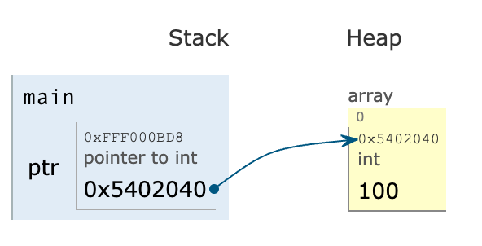
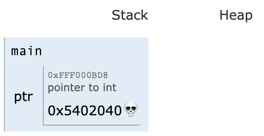

# 9. Διαχείριση μνήμης

<i>Σύνοψη</i> Δυναμική δέσμευση μνήμης, οι συναρτήσεις malloc(), calloc(), realloc(), memset(), δυναμικοί πίνακες, δυναμικοί πίνακες δύο διαστάσεων, αλφαριθμητικά, δυναμικές δομές, επιστροφή δεικτών από συναρτήσεις.  

<i>Προαπαιτούμενη γνώση</i> Τύποι δεδομένων, είσοδος/έξοδος, δομές επιλογής και επανάληψης, συναρτήσεις, πίνακες, δομές, δείκτες, αλφαριθμητικά.

## 9.1 Δυναμική δέσμευση μνήμης

### 9.1.1 Συναρτήσεις της γλώσσας C

Η γλώσσα C μέσω του <span class="p-style">stdlib.h</span> διαθέτει τις βασικές συναρτήσεις <span class="p-style">malloc()</span> και <span class="p-style">free()</span> για τη διαχείριση δυναμικών μεταβλητών. Η πρώτη χρησιμοποιείται για να δεσμευθεί ο χώρος μνήμης όπου θα αποθηκευτούν τα περιεχόμενα μιας νέας μεταβλητής και η δεύτερη για τη διαγραφή/αποδέσμευση της μνήμης. Ένα παράδειγμα χρήσης αυτών των συναρτήσεων παρουσιάζεται στον κώδικα 9.1.

```{.c title="Κώδικας 9.1: ch9_p1.c - ένα απλό παράδειγμα δέσμευσης και αποδέσμευσης μνήμης." linenums="1"}
--8<-- "src/ch9_p1.c"
```

Η συνάρτηση malloc() έχει την ακόλουθη δήλωση:

```{.c}
void *malloc(size_t size);
```

Δέχεται ως όρισμα το πλήθος των bytes που θα δεσμεύσει και επιστρέφει ως αποτέλεσμα έναν δείκτη προς τη δεσμευμένη μνήμη που καταλαμβάνει συνεχόμενες θέσεις μνήμης στο τμήμα της μνήμης που ονομάζεται σωρός (heap). Από τη στιγμή αυτή και μετά έχει δημιουργηθεί μια νέα μεταβλητή και ο προγραμματιστής μπορεί να τη χρησιμοποιήσει όπως και κάθε άλλη μεταβλητή με τη διαφορά ότι για να γίνει ανάθεση σε αυτήν την περιοχή μνήμης απαιτείται αποαναφορά. Όταν η μεταβλητή δεν θα είναι πλέον χρήσιμη για τη συνέχεια του προγράμματος μπορεί να γίνει αποδέσμευση της μνήμης που είχε δεσμευθεί με τη συνάρτηση <span class="p-style">free()</span>. Ένα παράδειγμα εκτέλεσης του κώδικα 9.1 παρουσιάζεται στη συνέχεια.

```
Pointer address: 0x0
Pointer address: 0x5402040 value: 100
```

Στην πρώτη γραμμή της εξόδου παρουσιάζεται η τιμή που έχει ανατεθεί στον δείκτη που είναι 0 (<span class="p-style">NULL</span>). Στη δεύτερη γραμμή της εξόδου ο δείκτης δείχνει σε μια υπαρκτή θέση μνήμης όπου έχει εισαχθεί η τιμή 100. Αν η συνάρτηση <span class="p-style">malloc()</span> επιστρέψει 0, τότε δεν θα έχει βρεθεί διαθέσιμη μνήμη για να γίνει δέσμευσή της. Αυτό μπορεί να συμβεί σε περιπτώσεις όπου τα προγράμματα δεσμεύουν διαρκώς μεγάλες ποσότητες μνήμης. Η συνάρτηση <span class="p-style">free()</span> διαγράφει τον δείκτη και από τη στιγμή που η <span class="p-style">free()</span> κληθεί δεν θα πρέπει πλέον να γίνεται αποαναφορά στον δείκτη, εκτός και αν φυσικά ο δείκτης λάβει τιμή που θα τον κάνει να δείχνει σε κάποια άλλη έγκυρη θέση μνήμης. Σχηματικά, οι λειτουργίες που εκτελέστηκαν με τη <span class="p-style">malloc()</span> και τη <span class="p-style">free()</span> φαίνονται στα Σχήματα 9.1 και 9.2 αντίστοιχα.

<div class="flex">
  <div>
    
    <b> Σχήμα 9.1: </b><i>Δέσμευση μνήμης στον σωρό με τη malloc() και ανάθεση τιμής.</i>
  </div>
  <div>
    
    <b> Σχήμα 9.2: </b><i>Αποδέσμευση μνήμης (που είχε δεσμευθεί στον σωρό) με τη free().</i>
  </div>
  
</div>

### 9.1.2 Δυναμικοί πίνακες

Οι συναρτήσεις δυναμικής δέσμευσης μνήμης συχνότερα χρησιμοποιούνται για τη δημιουργία δυναμικών πινάκων και δομών παρά για τη δημιουργία δυναμικών απλών μεταβλητών. Φυσικά, σε κάποιες περιπτώσεις μπορούν να χρησιμοποιηθούν και για δημιουργία απλών μεταβλητών, αλλά συνήθως στοχεύουν στη δέσμευση και αποδέσμευση μεγάλων συνεχών τμημάτων μνήμης. Στο παράδειγμα του κώδικα 9.2 ο χρήστης εισάγει τον επιθυμητό αριθμό στοιχείων ενός πίνακα και στη συνέχεια δημιουργείται ένας πίνακας ακεραίων με αυτό το πλήθος στοιχείων.

```{.c title="Κώδικας 9.2: ch9_p2.c - δυναμική δέσμευση μνήμης για έναν μονοδιάστατο πίνακα ακεραίων." linenums="1"}
--8<-- "src/ch9_p2.c"
```

Η δημιουργία δυναμικών πινάκων γίνεται με την εντολή <span class="p-style">malloc(n * sizeof(TYPE))</span> όπου <span class="p-style">TYPE</span> είναι ο επιθυμητός τύπος δεδομένων του πίνακα και <span class="p-style">n</span> το πλήθος των στοιχείων του πίνακα. Η διαγραφή του πίνακα, όπως και στην περίπτωση των απλών μεταβλητών, γίνεται με κλήση της συνάρτησης <span class="p-style">free()</span>.  
Οι δυναμικοί πίνακες έχουν τις ίδιες ιδιότητες όπως και οι στατικοί πίνακες. Για παράδειγμα μπορούν να περάσουν ως ορίσματα σε συναρτήσεις. Στο παράδειγμα του κώδικα 9.3 παρουσιάζεται η εύρεση του μέσου όρου σε δυναμικό πίνακα με χρήση βοηθητικής συνάρτησης.

```{.c title="Κώδικας 9.3: ch9_p3.c - υπολογισμός και εμφάνιση μέσου όρου στοιχείων δυναμικού πίνακα." linenums="1"}
--8<-- "src/ch9_p3.c"
```

Ακολουθεί ένα παράδειγμα εκτέλεσης του προγράμματος:

```
Input the number of elements: 5
Input value for element 1/5: 10
Input value for element 2/5: 20
Input value for element 3/5: 30
Input value for element 4/5: 40
Input value for element 5/5: 50
Mean value: 30.000000
```

Ωστόσο, η χρήση δυναμικών πινάκων ενδεχόμενα να οδηγήσει σε προβλήματα μνήμης αν δεν γίνει σωστή χρήση. Στο παράδειγμα του κώδικα 9.4, δημιουργείται αρχικά ένας πίνακας και στη συνέχεια με χρήση αριθμητικής δεικτών πραγματοποιείται γραμμική αναζήτηση για την εύρεση ενός στοιχείου. Όταν ολοκληρωθεί η αναζήτηση ο δείκτης λαμβάνει την τιμή που είχε αρχικά, καθώς η χρήση του τελεστή <span class="p-style">++</span> αλλάζει την τιμή του δείκτη και δεν δείχνει πλέον στην αρχική θέση.


```{.c title="Κώδικας 9.4: ch9_p4.c - εύρεση της θέσης ενός στοιχείου σε μονοδιάστατο πίνακα." linenums="1"}
--8<-- "src/ch9_p4.c"
```

Ένα παράδειγμα εκτέλεσης ακολουθεί στη συνέχεια:

```
Input number of elements: 5
Start: pointer to the start of the array: 0x139704080
Input value of element 0: 10
Input value of element 1: 20
Input value of element 2: 30
Input value of element 3: 40
Input value of element 4: 50
Search for element: 33
Element 33 not found
Finish: pointer to the start of the array: 0x139704080
```

Αν ωστόσο στη γραμμή 19 του κώδικα 9.4 δεν υπήρχε στη συνθήκη το <span class="p-style">i != n</span> τότε η αναζήτηση θα αποτύγχανε. Αυτό θα συνέβαινε διότι αν ο χρήστης αναζητούσε τιμή που δεν υπήρχε στον πίνακα, η αναζήτηση θα συνεχίζονταν και σε στοιχεία μετά το τέλος του πίνακα. Η πιθανότερη κατάληξη θα ήταν να εμφανιστεί ένα σφάλμα χρόνου εκτέλεσης με μήνυμα <span class="p-style">segmentation fault</span>.

### 9.1.3 Δημιουργία πινάκων δύο διαστάσεων

Στην περίπτωση που ο προγραμματιστής θέλει να δημιουργήσει έναν δυναμικό πίνακα δύο διαστάσεων, ακολουθείται μια διαδικασία που είναι πιο περίπλοκη, καθώς ένας πίνακας δύο διαστάσεων μπορεί να θεωρηθεί ως ένας πίνακας πινάκων ή εναλλακτικά ως ένας πίνακας δεικτών. Για παράδειγμα στον κώδικα 9.5, κατασκευάζεται ένας πίνακας που περιέχει 5 δείκτες. Κάθε δείκτης με τη σειρά του αρχικοποιείται ως ένας δυναμικός
πίνακας. Στο συγκεκριμένο παράδειγμα οι πίνακες που αντιστοιχούν σε κάθε γραμμή του δισδιάστατου πίνακα έχουν διαφορετικά πλήθη στοιχείων και κάθε στοιχείο τους είναι μια ακέραια τιμή στο διάστημα [0,100).


```{.c title="Κώδικας 9.5: ch9_p5.c - δημιουργία ενός «πριονωτού» πίνακα." linenums="1"}
--8<-- "src/ch9_p5.c"
```

Ένα παράδειγμα εκτέλεσης του κώδικα είναι το ακόλουθο:

```
29  71  20  42  23
16  80  39  0
67  28  40
33  19
73
```

Καθένας από τους 5 πίνακες του παραδείγματος είναι ανεξάρτητος από τους άλλους και για αυτόν τον λόγο είναι δυνατή η κλήση των συναρτήσεων fill_random() και print_array() σε καθέναν ξεχωριστά. Ωστόσο, ένας πίνακας μπορεί να θεωρηθεί ότι είναι δείκτης και άρα ο πίνακας dynamic του παραδείγματος θα μπορούσε να θεωρηθεί ως δείκτης σε δείκτες. Επομένως αν το παράδειγμα γενικευτεί, μπορεί να κατασκευαστεί ένας πίνακας δύο διαστάσεων με χρήση διπλού δείκτη, όπως παρουσιάζεται στον κώδικα 9.6. Ο χρήστης εισάγει τον επιθυμητό αριθμό γραμμών και στηλών για έναν πίνακα δύο διαστάσεων. Ο πίνακας αυτός έχει δηλωθεί ως διπλός δείκτης ή αλλιώς δείκτης σε δείκτη με τη δήλωση double **table. Σε αυτήν την περίπτωση η δημιουργία του πίνακα δύο διαστάσεων γίνεται σε δύο βήματα. Στο πρώτο βήμα δημιουργείται ένας πίνακας δεικτών με την ανάθεση:

```{.c}
table=malloc(sizeof(double *) * rows);
```

Αυτή η ανάθεση δημιουργεί ουσιαστικά έναν πίνακα από δείκτες. Στο δεύτερο βήμα δημιουργούνται οι επιμέρους πίνακες, δηλαδή οι γραμμές του πίνακα, με τις αναθέσεις:

```{.c}
table[i] = malloc(sizeof(double) * cols);
```

Στη συνέχεια οι πράξεις στον δυναμικό πίνακα δύο διαστάσεων είναι ακριβώς οι ίδιες όπως θα ήταν και και σε έναν στατικό πίνακα δύο διαστάσεων. Όμως, μετά τη χρήση ένας δυναμικός πίνακας θα πρέπει να διαγράφεται. Στην περίπτωση διαγραφής ενός δυναμικού πίνακα δύο διαστάσεων αυτό συμβαίνει πάλι σε δύο φάσεις όπως και η δημιουργία του. Στην πρώτη φάση διαγράφονται οι επιμέρους δυναμικοί πίνακες (οι γραμμές του πίνακα δύο διαστάσεων) και στη δεύτερη φάση διαγράφεται ο διπλός δείκτης. Η διαγραφή γίνεται και πάλι με τη συνάρτηση <span class="p-style">free()</span> όπως και στην περίπτωση του μονοδιάστατου πίνακα.

```{.c title="Κώδικας 9.6: ch9_p6.c - συμπλήρωση τιμών σε έναν δισδιάστατο πίνακα, κάθε στοιχείο λαμβάνει ως τιμή το άθροισμα των δεικτών του." linenums="1"}
--8<-- "src/ch9_p6.c"
```

Ακολουθεί ένα παράδειγμα εκτέλεσης του κώδικα όπου ζητείται η δημιουργία ενός πίνακα 5 γραμμών και 4 στηλών.

```
Input number of rows: 5
Input number of columns: 4
0.0 1.0 2.0 3.0
1.0 2.0 3.0 4.0
2.0 3.0 4.0 5.0
3.0 4.0 5.0 6.0
4.0 5.0 6.0 7.0
```

### 9.1.4 Δυναμική δημιουργία αλφαριθμητικών

Τα αλφαριθμητικά είναι πίνακες από μεταβλητές τύπου <span class="p-style">char</span> και μπορούν να θεωρηθούν ως δείκτες προς χαρακτήρες. Αυτό έχει ως συνέπεια τη δυνατότητα κατασκευής δυναμικών αλφαριθμητικών όπως στην περίπτωση των δυναμικών πινάκων. Στο παράδειγμα του κώδικα 9.7 ο χρήστης εισάγει τον μέγιστο αριθμό χαρακτήρων ενός αλφαριθμητικού και στη συνέχεια με τη συνάρτηση <span class="p-style">malloc()</span> δεσμεύεται στον σωρό ο χώρος όπου θα αποθηκευτεί το αντίστοιχο αλφαριθμητικό. Αξίζει να σημειωθεί πως δεσμεύεται μνήμη για <span class="p-style">n + 1</span> χαρακτήρες, καθώς πρέπει να αποθηκευτεί και ο χαρακτήρας τερματισμού.

```{.c title="Κώδικας 9.7: ch9_p7.c - δυναμική δημιουργία αλφαριθμητικού και αρχικοποίηση των επιμέρους χαρακτήρων του με τον χαρακτήρα ’Α’." linenums="1"}
--8<-- "src/ch9_p7.c"
```

```
Input the number of characters for a string: 10
Result: AAAAAAAAAA
```

Ένα ακόμα παράδειγμα χρήσης δυναμικών αλφαριθμητικών παρουσιάζεται στον κώδικα 9.8. Ο χρήστης εισάγει έναν θετικό ακέραιο αριθμό και στη συνέχεια αποθηκεύεται στον πίνακα <span class="p-style">binary</span> η δυαδική αναπαράσταση του αριθμού. Για να γίνει αυτό πρώτα γίνεται καταμέτρηση των δυαδικών ψηφίων του αριθμού με τη συνάρτηση <span class="p-style">count_binary()</span> και στη συνέχεια δημιουργείται ο αντίστοιχος πίνακας <span class="p-style">binary</span> με τη χρήση της <span class="p-style">malloc()</span>. Η συνάρτηση <span class="p-style">convert()</span> μετατρέπει τον αριθμό σε δυαδική μορφή και στη συνέχεια επειδή τα δυαδικά ψηφία έχουν αποθηκευτεί στον πίνακα <span class="p-style">binary</span> σε αντίστροφη σειρά, γίνεται αντιστροφή του <span class="p-style">binary</span> με τη συνάρτηση <span class="p-style">reverse()</span>.

```{.c title="Κώδικας 9.8: ch9_p8.c - μετατροπή ενός δεκαδικού αριθμού σε δυαδικό." linenums="1"}
--8<-- "src/ch9_p8.c"
```

Ακολουθεί ένα παράδειγμα εκτέλεσης:

```
Input a positive number: 45
Binary representation of 45: 101101
```

### 9.1.5 Οι συναρτήσεις calloc() και realloc()

Η συνάρτηση <span class="p-style">calloc()</span> χρησιμοποιείται κατά κύριο λόγο για τη δημιουργία δυναμικών πινάκων και η σύνταξή της είναι:

```{.c}
void *calloc(size_t n, size_t size);
```

όπου <span class="p-style">n</span> είναι το πλήθος των στοιχείων του νέου πίνακα και <span class="p-style">size</span> είναι το μέγεθος σε bytes για κάθε στοιχείο του. Μια σημαντική διαφορά με τη <span class="p-style">malloc()</span> είναι πως η συνάρτηση <span class="p-style">calloc()</span> αρχικοποιεί στην τιμή μηδέν τα στοιχεία του δυναμικού πίνακα που δημιουργεί, κάτι που δεν κάνει η <span class="p-style">malloc()</span>. Ένας άλλος τρόπος αρχικοποίησης ενός δυναμικού πίνακα είναι με τη συνάρτηση <span class="p-style">memset()</span>(1). Ένα παράδειγμα χρήσης της <span class="p-style">calloc()</span> για τη δημιουργία και χρήση ενός δυναμικού πίνακα δεκαδικών τιμών παρουσιάζεται στον κώδικα 9.9. Στο παράδειγμα αυτό αρχικά εκτυπώνονται τα στοιχεία του πίνακα που έχει αρχικοποιηθεί με την <span class="p-style">calloc()</span> και συνεπώς έχουν όλα την τιμή μηδέν. Στη συνέχεια ανατίθεται σε κάθε στοιχείο του πίνακα ένας τυχαίος αριθμός στο διάστημα [0, 1). 
{ .annotate}

1. Η συνάρτηση <span class="p-style">void *memset(void *str, int c, size_t n)</span> αντιγράφει τον χαρακτήρα <span class="p-style">c</span> στους <span class="p-style">n</span> πρώτους χαρακτήρες του αλφαριθμητικού στο οποίο δείχνει η παράμετρος <span class="p-style">str</span>.

```{.c title="Κώδικας 9.9: ch9_p9.c - αρχικοποίηση δυναμικού πίνακα πραγματικών 10 στοιχείων με μηδενικά, συμπλήρωση των πρώτων 5 στοιχείων με τυχαίες τιμές." linenums="1"}
--8<-- "src/ch9_p9.c"
```

Ακολουθεί ένα παράδειγμα εκτέλεσης:

```
0.0648 0.7522 0.2825 0.2246 0.1117 0.0000 0.0000 0.0000 0.0000 0.0000
```

Η συνάρτηση <span class="p-style">realloc()</span> μπορεί να χρησιμοποιηθεί για να αλλάξει το ποσό της μνήμης που έχει «δοθεί» σε έναν δείκτη, για παράδειγμα να μειώσει ή να αυξήσει το πλήθος στοιχείων ενός δυναμικού πίνακα. Η σύνταξη της συνάρτησης έχει ως εξής:

```{.c}
void *realloc(ptr, size_t newsize);
```

Στη <span class="p-style">realloc()</span>, <span class="p-style">ptr</span> είναι ο δείκτης για τον οποίο είναι επιθυμητό να γίνει αλλαγή μεγέθους στην ποσότητα μνήμης που δείχνει και <span class="p-style">newsize</span> είναι το νέο μέγεθος σε bytes. Ένα παράδειγμα χρήσης παρουσιάζεται στον κώδικα 9.10, όπου ένας πίνακας μεγαλώνει επαναληπτικά μέχρι να φτάσει στο διπλάσιο του αρχικού του μεγέθους. Στο παράδειγμα αυτό ένας τυχαίος αριθμός τοποθετείται σε κάθε νέο στοιχείο που δημιουργείται στην επανάληψη <span class="p-style">do...while</span>.

```{.c title="Κώδικας 9.10: ch9_p10.c - σταδιακή αύξηση μεγέθους πίνακα με τη realloc()." linenums="1"}
--8<-- "src/ch9_p10.c"
```

```
Array of size 8: 0:7 1:9 2:5 3:5 4:2 5:3 6:7 7:6
Array of size 9: 0:7 1:9 2:5 3:5 4:2 5:3 6:7 7:6 8:3
Array of size 10: 0:7 1:9 2:5 3:5 4:2 5:3 6:7 7:6 8:3 9:5
Array of size 11: 0:7 1:9 2:5 3:5 4:2 5:3 6:7 7:6 8:3 9:5 10:2
Array of size 12: 0:7 1:9 2:5 3:5 4:2 5:3 6:7 7:6 8:3 9:5 10:2 11:0
Array of size 13: 0:7 1:9 2:5 3:5 4:2 5:3 6:7 7:6 8:3 9:5 10:2 11:0 12:1
Array of size 14: 0:7 1:9 2:5 3:5 4:2 5:3 6:7 7:6 8:3 9:5 10:2 11:0 12:1 13:8
Array of size 15: 0:7 1:9 2:5 3:5 4:2 5:3 6:7 7:6 8:3 9:5 10:2 11:0 12:1 13:8 14:0
Array of size 16: 0:7 1:9 2:5 3:5 4:2 5:3 6:7 7:6 8:3 9:5 10:2 11:0 12:1 13:8 14:0 15:9
```

### 9.1.6 Δυναμικές δομές

Οι δείκτες μπορούν να χρησιμοποιηθούν και για τη δημιουργία δυναμικών δομών με παρόμοιο τρόπο όπως με τους δυναμικούς πίνακες. Στο παράδειγμα του κώδικα 9.11 παρουσιάζεται η δημιουργία μιας δυναμικής δομής που περιγράφει άτομα με πεδία όνομα, επώνυμο και ηλικία. Η δημιουργία της δυναμικής μεταβλητής γίνεται παρόμοια με την περίπτωση των δυναμικών μεταβλητών και πινάκων όπως και η διαγραφή της μνήμης
με χρήση της συνάρτησης <span class="p-style">free()</span>. Η πρόσβαση στα πεδία της δομής γίνεται με τη χρήση του τελεστή <span class="p-style">‐></span>.

```{.c title="Κώδικας 9.11: ch9_p11.c - δυναμική δημιουργία δομής, εμφάνιση θέσεων μνήμης που καταλαμβάνουν τα επιμέρους πεδία της δομής." linenums="1"}
--8<-- "src/ch9_p11.c"
```

Ακολουθεί η έξοδος του προγράμματος σε μια εκτέλεσή του. Παρατηρήστε ότι η έξοδος του προγράμματος εμφανίζει τη διεύθυνση μνήμης όπου βρίσκεται η δυναμική δομή που δημιουργήθηκε καθώς και τις διευθύνσεις μνήμης των επιμέρους πεδίων της δομής. Για την εμφάνιση των διευθύνσεων μνήμης στο δεκαδικό σύστημα χρησιμοποιείται ο προσδιοριστής μορφοποίησης <span class="p-style">PRIuPTR</span> που ορίζεται στο <span class="p-style">inttypes.h</span>.

```
John Doe 20
(HEX) Address of the struct:0x16b0d6dec [.name:0x16b0d6dec .lastname:0x16b0d6e50
    ↪ .age:0x16b0d6eb4]
(DEC) Address of the struct:6091009516 [.name:6091009516 .lastname:6091009616
    ↪ .age:6091009716]
```

Αν μια δομή περιέχει πεδία που πρέπει να δημιουργηθούν δυναμικά τότε και αυτά πρέπει να αρχικοποιηθούν με ξεχωριστή κλήση της <span class="p-style">malloc()</span>. Για παράδειγμα η υλοποίηση μιας δομής που περιγράφει φοιτητές και αποθηκεύει τη βαθμολογία μαθημάτων για κάθε φοιτητή, απαιτεί δυναμικό πίνακα εφόσον κάθε φοιτητής μπορεί να έχει και διαφορετικό πλήθος μαθημάτων. Ένα τέτοιο παράδειγμα βρίσκεται στον κώδικα 9.12.

```{.c title="Κώδικας 9.12: ch9_p12.c - δομή με πεδίο (grades) που πρέπει δημιουργηθεί δυναμικά." linenums="1"}
--8<-- "src/ch9_p12.c"
```

Η έξοδος του προγράμματος είναι η ακόλουθη:

```
Id:100 name:Jane Doe average grade:6.83
```

## 9.2 Ασκήσεις

***Άσκηση 1***  
Γράψτε ένα πρόγραμμα που να ζητά από τον χρήστη να εισάγει δεδομένα σε έναν δισδιάστατο τετραγωνικό πίνακα ακεραίων και να υπολογίζει και να εμφανίζει το άθροισμα των στοιχείων της διαγωνίου του. Για την αρχικοποίηση του πίνακα να χρησιμοποιείται η συνάρτηση <span class="p-style">calloc()</span>. Ο χρήστης να εισάγει τη διάσταση του πίνακα και στη συνέχεια μόνο τα στοιχεία της διαγωνίου του πίνακα και το πρόγραμμα να εμφανίζει τον πίνακα και το άθροισμα της διαγωνίου.

??? tip "Λύση άσκησης 1"
    ```{.c linenums="1"}
    --8<-- "src/ch9_e1.c"
    ```

***Άσκηση 2***  
Γράψτε ένα πρόγραμμα που να δημιουργεί έναν πίνακα ακεραίων, διαστάσεων <span class="p-style">𝑁 × 𝑀</span>. Ο χρήστης να εισάγει τις διαστάσεις του πίνακα. Χρησιμοποιήστε τη συνάρτηση <span class="p-style">memset()</span> για να αρχικοποιήσετε όλα τα στοιχεία του πίνακα με μηδενικά και εμφανίστε τον πίνακα. Ζητήστε από τον χρήστη να εισάγει έναν ακέραιο αριθμό <span class="p-style">n</span> και έναν χαρακτήρα <span class="p-style">x</span>. Χρησιμοποιήστε ξανά τη συνάρτηση <span class="p-style">memset()</span> για να αντικαταστήσετε τα πρώτα <span class="p-style">n</span> bytes του πίνακα με τον δεκαδικό κωδικό του χαρακτήρα <span class="p-style">x</span>. Εμφανίστε ξανά τον πίνακα στην οθόνη για επίδειξη των αλλαγών. Προσπαθήστε να αιτιολογήσετε τα αποτελέσματα που εμφανίζονται.  
Υπόδειξη: Διασφαλίστε ότι η τιμή που εισάγει ο χρήστης για το <span class="p-style">n</span> είναι μικρότερη ή ίση από τον αριθμό bytes του πίνακα.

??? tip "Λύση άσκησης 2"
    ```{.c linenums="1"}
    --8<-- "src/ch9_e2.c"
    ```

***Άσκηση 3***  
Γράψτε ένα πρόγραμμα το οποίο θα ζητάει από τον χρήστη να καθορίσει το αρχικό μέγεθος ενός πίνακα ακεραίων. Χρησιμοποιήστε τη συνάρτηση <span class="p-style">malloc()</span> για να δεσμεύσετε την αρχική μνήμη για τον πίνακα. Στη συνέχεια, το πρόγραμμα θα πρέπει να εισάγει στοιχεία στον πίνακα από τον χρήστη μέχρι να γεμίσει. Αφού γεμίσει ο πίνακας, ζητήστε από τον χρήστη αν επιθυμεί να προσθέσει περισσότερα στοιχεία. Εάν ο χρήστης επιθυμεί να συνεχίσει, χρησιμοποιήστε τη συνάρτηση <span class="p-style">realloc()</span> για να επεκτείνετε τον πίνακα, αυξάνοντας το μέγεθός του κατά έναν αριθμό που θα καθορίζεται επίσης από τον χρήστη. Επαναλάβετε αυτήν τη διαδικασία μέχρι ο χρήστης να επιλέξει να μην προσθέσει περισσότερα στοιχεία. Τέλος, εμφανίστε τα στοιχεία του πίνακα και ελευθερώστε τη μνήμη.

??? tip "Λύση άσκησης 3"
    ```{.c linenums="1"}
    --8<-- "src/ch9_e3.c"
    ```

***Άσκηση 4***  
Γράψτε ένα πρόγραμμα που να διαχειρίζεται βιβλία μιας υποθετικής βιβλιοθήκης χρησιμοποιώντας δομές και δυναμική δέσμευση μνήμης. Ειδικότερα, ορίστε μια δομή <span class="p-style">book</span> με τα ακόλουθα πεδία: <span class="p-style">id, title, author, year</span>. Γράψτε μια συνάρτηση που να δεσμεύει δυναμικά μνήμη για έναν πίνακα με εγγραφές τύπου <span class="p-style">book</span>. Το μέγεθος του πίνακα να δίνεται από τον χρήστη. Υλοποιήστε επιπλέον τις ακόλουθες λειτουργίες:

1. Προσθήκη ενός βιβλίου: Να επιτρέπει στον χρήστη να εισάγει τις πληροφορίες ενός βιβλίου στον πίνακα. Ο πίνακας βιβλίων να έχει αρχικά μέγεθος 2 και κάθε φορά που γεμίζει, με την <span class="p-style">realloc()</span>, το μέγεθος του πίνακα να διπλασιάζεται.
2. Εμφάνιση όλων των βιβλίων: Να εμφανίζει λίστα με τις πληροφορίες όλων των βιβλίων που βρίσκονται στον πίνακα.
3. Έξοδος: Πριν την έξοδο να αποδεσμεύεται όλη η μνήμη που έχει δεσμευθεί κατά τη λειτουργία του προγράμματος.  

Η αλληλεπίδραση του χρήστη με το πρόγραμμα θα γίνεται μέσω μενού με τις παραπάνω επιλογές.

??? tip "Λύση άσκησης 4"
    ```{.c linenums="1"}
    --8<-- "src/ch9_e4.c"
    ```
