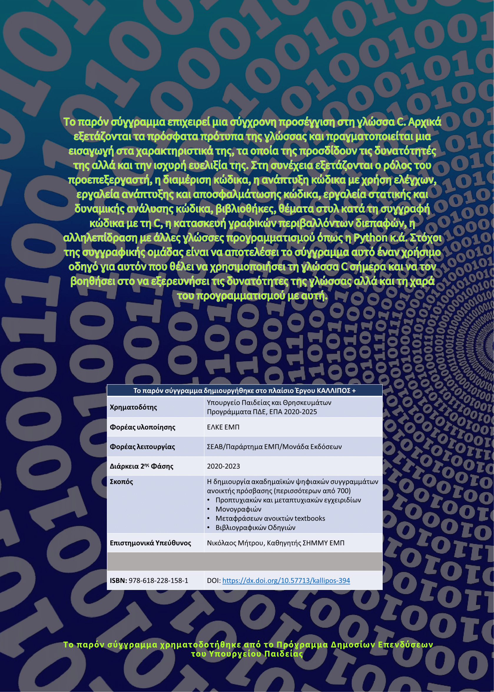

# 

^^Μια σύγχρονη προσέγγιση στη γλώσσα C^^

<a href="https://repository.kallipos.gr/handle/11419/11683" target="_blank">Η σελίδα του βιβλίου στον Kallipos.</a>

__Τζάλλας Αλέξανδρος__  
Αναπληρωτής Καθηγητής  
Τμήμα Πληροφορικής και Τηλεπικοινωνιών, Πανεπιστήμιο Ιωαννίνων  

__Γκόγκος Χρήστος__  
Αναπληρωτής Καθηγητής  
Τμήμα Πληροφορικής και Τηλεπικοινωνιών, Πανεπιστήμιο Ιωαννίνων    
  
  
__Τσούλος Ιωάννης__  
Αναπληρωτής Καθηγητής  
Τμήμα Πληροφορικής και Τηλεπικοινωνιών, Πανεπιστήμιο Ιωαννίνων